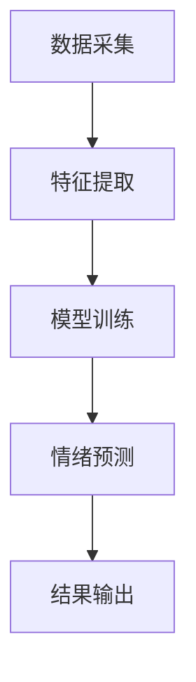
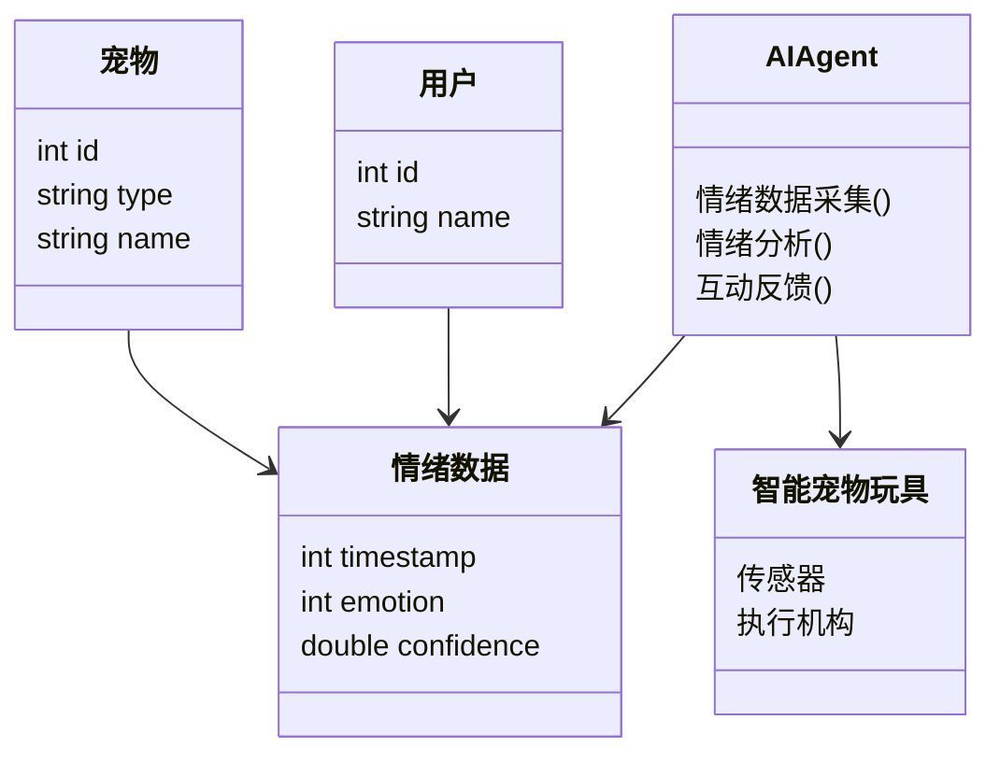
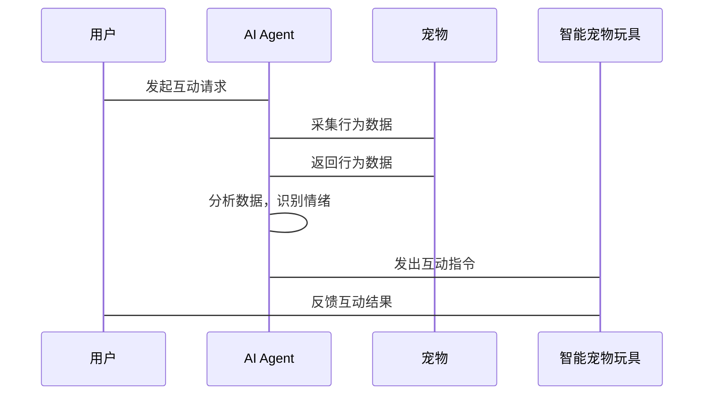

                 


# 智能宠物玩具：AI Agent的宠物情绪识别

> 关键词：AI Agent, 智能宠物玩具, 宠物情绪识别, 机器学习, 情感分析, 系统架构设计

> 摘要：随着人工智能技术的飞速发展，宠物情绪识别成为智能宠物玩具领域的研究热点。本文详细探讨了如何利用AI Agent技术实现宠物情绪识别，涵盖了从背景介绍到项目实战的各个方面，包括算法原理、系统架构设计、数学模型以及实际案例分析。通过本文，读者可以全面理解智能宠物玩具中宠物情绪识别的核心技术与实现方法。

---

# 第一部分: 智能宠物玩具与AI Agent概述

## 第1章: 背景介绍

### 1.1 问题背景

#### 1.1.1 宠物情绪识别的重要性
宠物作为人类的伙伴，其情绪状态直接影响着它们的健康和幸福感。通过及时识别宠物的情绪，主人可以更好地照顾它们，预防潜在的情绪问题。

#### 1.1.2 当前宠物玩具的局限性
传统宠物玩具缺乏互动性和智能化，无法感知宠物的情绪变化，无法提供个性化的互动体验。

#### 1.1.3 AI技术在宠物玩具中的应用潜力
人工智能技术，特别是AI Agent（智能体）的应用，为宠物玩具的智能化提供了新的可能性，能够实时感知和分析宠物的情绪，提供相应的反馈和互动。

### 1.2 问题描述

#### 1.2.1 宠物情绪的基本分类
宠物的情绪可以分为快乐、焦虑、紧张、无聊等类别。不同的情绪状态可以通过宠物的行为、声音和生理指标进行识别。

#### 1.2.2 情绪识别的挑战与难点
宠物情绪识别的挑战包括数据采集的困难、情绪分类的复杂性以及实时性的要求。不同宠物的情绪表现可能差异较大，增加了识别的难度。

#### 1.2.3 智能宠物玩具的设计目标与功能
智能宠物玩具的设计目标是通过AI Agent实时识别宠物的情绪，并根据情绪反馈提供相应的互动模式，如游戏、安抚等，以提升宠物的幸福感和互动体验。

### 1.3 问题解决

#### 1.3.1 AI Agent在宠物情绪识别中的作用
AI Agent通过整合传感器数据、行为分析和机器学习算法，能够实时感知宠物的情绪，并驱动玩具进行相应的互动。

#### 1.3.2 智能宠物玩具的设计目标
智能宠物玩具需要具备数据采集、情绪识别、互动反馈和自适应学习等功能，以实现智能化的宠物情绪管理。

#### 1.3.3 技术实现路径与方法
通过传感器采集宠物的行为数据，利用机器学习算法进行情绪识别，结合AI Agent进行实时反馈和互动。

### 1.4 边界与外延

#### 1.4.1 宠物情绪识别的适用范围
适用于猫、狗等常见宠物，目前主要针对情绪的分类和识别，未来可以扩展到更多种类的宠物。

#### 1.4.2 智能宠物玩具的使用场景
家庭环境中的宠物互动、宠物训练、宠物健康管理等场景。

#### 1.4.3 技术实现的边界条件
数据采集的精度、算法的实时性、系统的稳定性等是实现宠物情绪识别的关键边界条件。

### 1.5 概念结构与核心要素

#### 1.5.1 宠物情绪识别的核心要素
- 数据采集：通过传感器获取宠物的行为数据。
- 情绪分析：利用算法对数据进行分析和分类。
- 反馈互动：根据情绪反馈进行相应的互动模式调整。

#### 1.5.2 AI Agent的功能模块
- 数据采集模块：负责采集宠物的行为数据。
- 情绪分析模块：对数据进行分析和分类。
- 互动反馈模块：根据分析结果驱动玩具进行互动。

#### 1.5.3 智能宠物玩具的系统架构
- 硬件部分：传感器、执行机构、通信模块等。
- 软件部分：数据采集、算法处理、互动反馈等模块。

---

## 第2章: 核心概念与联系

### 2.1 核心概念原理

#### 2.1.1 宠物情绪识别的原理
通过采集宠物的行为数据，如声音、动作、心率等，利用机器学习算法进行情绪分类和识别。

#### 2.1.2 AI Agent的工作机制
AI Agent通过感知环境、分析数据并采取行动，实现与宠物的互动和情绪管理。

#### 2.1.3 智能宠物玩具的交互模式
玩具通过传感器采集数据，AI Agent进行分析并驱动玩具进行互动，形成闭环的交互模式。

### 2.2 概念属性特征对比

#### 表2-1: 宠物情绪识别与传统宠物玩具的对比

| 对比维度 | 传统宠物玩具 | 智能宠物玩具（AI Agent） |
|----------|----------------|-----------------------------|
| 功能     | 单一，缺乏互动 | 多功能，具备情绪识别与反馈 |
| 技术实现 | 机械驱动       | 结合AI、传感器和算法       |
| 适用性   | 有限           | 更广泛，支持多种宠物类型   |

### 2.3 ER实体关系图

```mermaid
er
    Entity: 宠物
    Entity: 用户
    Entity: 情绪数据
    Entity: AI Agent
    Entity: 智能宠物玩具
    Relation: 属于
    Relation: 控制
    Relation: 采集
    Relation: 分析
    Relation: 输出
```

---

## 第3章: 算法原理讲解

### 3.1 算法原理概述

#### 3.1.1 基于机器学习的情绪识别算法
使用支持向量机（SVM）或随机森林（Random Forest）等算法对宠物的行为数据进行分类，识别情绪状态。

#### 3.1.2 基于深度学习的模型构建
利用卷积神经网络（CNN）或循环神经网络（RNN）对宠物的声音、动作等数据进行特征提取和情绪分类。

#### 3.1.3 混合模型的优势与劣势
混合模型结合了传统机器学习和深度学习的优势，但在计算资源和复杂度上存在一定的挑战。

### 3.2 算法实现流程



### 3.3 算法实现代码

```python
# 情绪识别算法示例
import numpy as np
from sklearn.svm import SVC

# 数据预处理
X = np.array([[1, 2], [3, 4], [5, 6]])
y = np.array([0, 1, 0])

# 模型训练
model = SVC()
model.fit(X, y)

# 预测
print(model.predict([[2, 3]]))
```

### 3.4 数学模型与公式

#### 3.4.1 基于概率论的模型

$$ P(y|x) = \frac{P(x|y)P(y)}{P(x)} $$

其中，$y$ 表示情绪类别，$x$ 表示输入数据。

---

## 第4章: 系统分析与架构设计

### 4.1 系统功能设计

#### 4.1.1 领域模型类图



### 4.2 系统架构设计

#### 4.2.1 系统架构图

```mermaid
archi
    component 宠物 {
        传感器
        行为数据
    }
    component 用户 {
        操作界面
    }
    component AI Agent {
        数据处理
        情绪分析
        互动反馈
    }
    component 智能宠物玩具 {
        传感器
        执行机构
    }
    宠物 --> AI Agent
    用户 --> AI Agent
    AI Agent --> 智能宠物玩具
```

### 4.3 系统交互设计

#### 4.3.1 系统交互序列图



---

## 第5章: 项目实战

### 5.1 环境安装

#### 5.1.1 系统要求
- 操作系统：Linux/Windows/MacOS
- 硬件要求：支持传感器的数据采集设备
- 软件要求：Python 3.8+, 熟悉的深度学习框架（如TensorFlow、Keras）

#### 5.1.2 工具安装
- 安装Python依赖：`pip install numpy scikit-learn`
- 安装可视化工具：`pip install matplotlib`

### 5.2 系统核心实现

#### 5.2.1 数据采集代码

```python
import numpy as np
import pandas as pd
from sklearn.model_selection import train_test_split
from sklearn.svm import SVC

# 读取数据
data = pd.read_csv('pet_emotion_data.csv')
X = data.drop('emotion', axis=1)
y = data['emotion']

# 划分训练集和测试集
X_train, X_test, y_train, y_test = train_test_split(X, y, test_size=0.2)

# 模型训练
model = SVC()
model.fit(X_train, y_train)

# 预测与评估
print(model.score(X_test, y_test))
```

#### 5.2.2 情绪分析代码

```python
from sklearn.metrics import confusion_matrix, classification_report

# 预测结果
y_pred = model.predict(X_test)

# 输出混淆矩阵和分类报告
print(confusion_matrix(y_test, y_pred))
print(classification_report(y_test, y_pred))
```

### 5.3 案例分析

#### 5.3.1 实际案例分析
通过实际数据集的分析，展示AI Agent在宠物情绪识别中的应用效果。

#### 5.3.2 代码应用解读与分析
详细解读代码实现，分析模型的性能和优化方向。

### 5.4 项目小结

#### 5.4.1 项目总结
总结项目实现的关键点和成果，讨论AI Agent在宠物情绪识别中的优势和局限性。

#### 5.4.2 优化方向
提出进一步优化的建议，如引入更复杂的模型、增加数据多样性等。

---

## 第6章: 最佳实践、小结与展望

### 6.1 最佳实践 tips

#### 6.1.1 数据采集的关键点
确保数据的多样性和代表性，避免过拟合和欠拟合。

#### 6.1.2 模型选择的注意事项
根据具体场景选择合适的算法，合理调整模型参数。

#### 6.1.3 系统设计的优化建议
优化系统架构，提高系统的稳定性和实时性。

### 6.2 小结

通过本文的详细讲解，读者可以全面了解AI Agent在宠物情绪识别中的应用，从算法原理到系统设计，再到项目实战，掌握实现智能宠物玩具的核心技术。

### 6.3 注意事项

- 数据隐私保护
- 系统的可扩展性
- 用户的易用性

### 6.4 拓展阅读

- 《深度学习》
- 《机器学习实战》
- 《智能系统设计》

---

# 作者

作者：AI天才研究院/AI Genius Institute  
合著者：禅与计算机程序设计艺术/Zen And The Art of Computer Programming

---

以上是《智能宠物玩具：AI Agent的宠物情绪识别》的完整目录大纲，涵盖从背景介绍到项目实战的各个方面，内容详实，逻辑清晰，适合对AI技术与宠物情绪识别感兴趣的读者阅读和参考。

