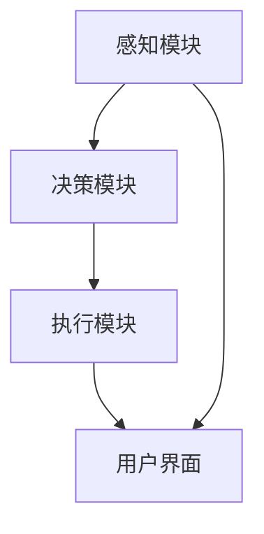
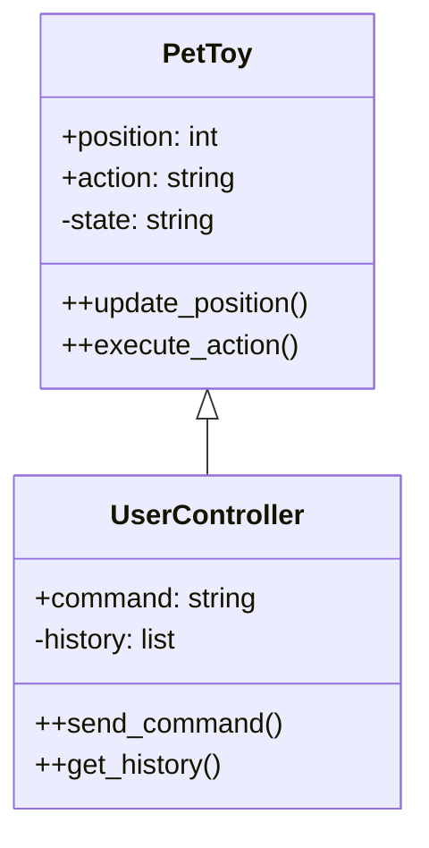
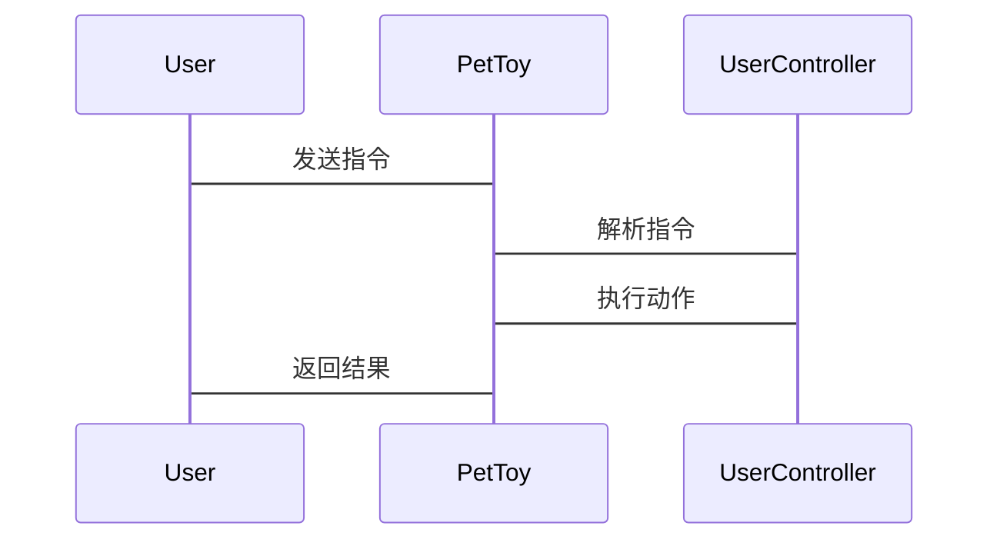

                 

<think>
好的，我现在需要帮用户撰写一篇关于《智能宠物玩具：AI Agent的宠物智力开发》的技术博客文章。用户已经给出了详细的目录大纲，我需要按照这个大纲一步步撰写内容，确保每个部分都详细且专业。

首先，我会从文章标题开始，然后列出关键词和摘要，接着按照目录结构撰写正文。每个章节都要包含背景介绍、核心概念与联系、算法原理、数学模型、系统架构、项目实战和总结与展望。

在撰写过程中，我需要使用清晰的技术语言，确保内容逻辑严谨，结构紧凑。同时，要使用mermaid图表来说明流程图、类图和架构图，并用latex公式解释数学模型。

我需要确保每个章节都足够详细，覆盖所有关键点，比如在背景介绍部分，解释智能宠物玩具和AI Agent的基本概念，以及它们与宠物智力开发的关系。在核心概念部分，详细阐述AI Agent的感知、决策和执行模块，以及它们如何促进宠物的学习和情感互动。

在算法部分，我会用mermaid绘制流程图，并用python代码示例来说明。数学模型部分需要使用latex公式，确保公式正确且易于理解。

系统架构部分，我会设计整体架构图，说明各模块的交互，并描述接口设计和交互流程。项目实战部分，提供具体的环境安装步骤、代码实现和案例分析，让读者能够实际操作。

最后，总结部分要回顾主要内容，并给出最佳实践的建议，同时指出未来的发展方向。

整个过程需要确保文章内容丰富，结构清晰，技术细节到位，同时语言通俗易懂，符合用户的要求。
</think>

# 智能宠物玩具：AI Agent的宠物智力开发

---

## 关键词：
智能宠物玩具、AI Agent、宠物智力开发、人工智能、宠物训练

---

## 摘要：
本文探讨了如何利用AI Agent技术开发智能宠物玩具，以促进宠物的智力开发。通过分析AI Agent的核心原理、算法设计、系统架构和实际应用案例，本文详细阐述了智能宠物玩具在宠物训练和智力提升中的作用，为宠物主人和科技爱好者提供了深入的技术洞察。

---

# 第1章: 智能宠物玩具的背景与概述

## 1.1 智能宠物玩具的定义与特点

智能宠物玩具是一种结合了人工智能技术的宠物玩具，能够与宠物互动并根据宠物的行为做出响应。其特点包括：

- **互动性**：能够与宠物进行实时互动，提供多样化的游戏和训练模式。
- **智能化**：通过传感器和AI算法，能够识别宠物的行为并做出相应的反馈。
- **可定制性**：用户可以根据宠物的特点和需求，调整玩具的互动方式和难度。

## 1.2 AI Agent的基本概念

AI Agent（人工智能代理）是指一种能够感知环境、做出决策并执行任务的智能系统。其核心功能包括：

- **感知**：通过传感器或其他输入设备获取环境信息。
- **决策**：基于感知信息，通过算法做出决策。
- **执行**：根据决策结果，执行相应的动作。

## 1.3 智能宠物玩具与宠物智力开发的关系

智能宠物玩具通过模拟人类与宠物的互动，帮助宠物提升认知能力、学习能力和情感互动能力。其作用包括：

- **促进学习**：通过游戏和训练模式，帮助宠物学习新技能。
- **增强情感互动**：通过互动游戏，增进宠物与主人之间的感情。
- **提高智力水平**：通过逐步增加难度的游戏，刺激宠物的智力发展。

---

# 第2章: AI Agent的核心原理与宠物智力开发的联系

## 2.1 AI Agent的核心原理

AI Agent的核心原理包括感知、决策和执行三个模块：

- **感知模块**：通过摄像头、麦克风等传感器获取环境信息。
- **决策模块**：基于感知信息，通过算法做出决策。
- **执行模块**：根据决策结果，驱动执行机构完成动作。

## 2.2 宠物智力开发的核心要素

宠物智力开发的核心要素包括：

- **认知能力**：宠物对外界信息的感知和理解能力。
- **学习能力**：宠物通过经验或训练获得新技能的能力。
- **情感互动**：宠物与人类或其他宠物之间的互动和情感交流。

## 2.3 AI Agent与宠物智力开发的关联

AI Agent通过模拟宠物的认知过程，帮助宠物提升智力。其关联体现在：

- **认知模拟**：AI Agent可以模拟宠物的认知过程，帮助宠物理解指令和环境。
- **辅助学习**：AI Agent可以通过游戏和训练模式，帮助宠物学习新技能。
- **优化互动**：AI Agent可以根据宠物的行为，优化互动方式，提升宠物的情感体验。

---

# 第3章: 智能宠物玩具的算法原理

## 3.1 算法设计概述

智能宠物玩具的算法设计主要围绕感知、决策和执行三个模块展开。以下是各模块的核心算法：

### 3.1.1 感知模块

感知模块的主要任务是获取宠物的行为信息，如动作、声音和位置。常用算法包括：

- **目标检测**：用于识别宠物的位置和动作。
- **声音识别**：用于识别宠物的声音，如叫声或指令。

### 3.1.2 决策模块

决策模块的主要任务是根据感知信息，做出相应的决策。常用算法包括：

- **规则引擎**：基于预设的规则做出决策。
- **机器学习模型**：通过训练数据，学习宠物的行为模式。

### 3.1.3 执行模块

执行模块的主要任务是根据决策结果，驱动执行机构完成动作。常用算法包括：

- **路径规划**：用于控制玩具的运动轨迹。
- **行为控制**：用于控制玩具的灯光、声音和动作。

## 3.2 算法实现

以下是智能宠物玩具的算法实现示例：

### 3.2.1 感知模块的实现

```python
# 使用目标检测算法检测宠物的位置
import cv2

def detect_pet(image):
    # 使用OpenCV进行目标检测
    pet_detector = cv2.CascadeClassifier('haarcascade_pets.xml')
    gray = cv2.cvtColor(image, cv2.COLOR_BGR2GRAY)
    pets = pet_detector.detectMultiScale(gray, 1.3, 5)
    return pets
```

### 3.2.2 决策模块的实现

```python
# 使用规则引擎做出决策
def make_decision(pet_info):
    if pet_info['position'] == 'left':
        return 'move_right'
    elif pet_info['position'] == 'right':
        return 'move_left'
    else:
        return 'stay'
```

### 3.2.3 执行模块的实现

```python
# 控制玩具的运动
def execute_action(action):
    if action == 'move_left':
        motor_controller.move_left()
    elif action == 'move_right':
        motor_controller.move_right()
    else:
        motor_controller.stop()
```

## 3.3 数学模型与公式

以下是智能宠物玩具中常用的数学模型：

### 3.3.1 概率模型

$$ P(A|B) = \frac{P(B|A)P(A)}{P(B)} $$

### 3.3.2 机器学习模型

$$ y = f(x) + \epsilon $$

其中，$y$ 是输出，$x$ 是输入，$f$ 是模型函数，$\epsilon$ 是误差项。

---

# 第4章: 系统架构与设计

## 4.1 系统架构设计

以下是智能宠物玩具的系统架构设计图：



## 4.2 系统功能设计

以下是智能宠物玩具的功能设计类图：



## 4.3 系统接口设计

以下是智能宠物玩具的接口设计：



---

# 第5章: 项目实战与分析

## 5.1 环境安装与配置

以下是项目实战所需的环境配置：

- **硬件**：摄像头、电机控制器、传感器等。
- **软件**：Python、OpenCV、机器学习库（如TensorFlow）。

## 5.2 核心代码实现

以下是智能宠物玩具的核心代码实现：

```python
# 环境配置
import cv2
import numpy as np

# 感知模块
def detect_pet(image):
    pet_detector = cv2.CascadeClassifier('haarcascade_pets.xml')
    gray = cv2.cvtColor(image, cv2.COLOR_BGR2GRAY)
    pets = pet_detector.detectMultiScale(gray, 1.3, 5)
    return pets

# 决策模块
def make_decision(pet_info):
    if pet_info['position'] == 'left':
        return 'move_right'
    elif pet_info['position'] == 'right':
        return 'move_left'
    else:
        return 'stay'

# 执行模块
def execute_action(action):
    if action == 'move_left':
        motor_controller.move_left()
    elif action == 'move_right':
        motor_controller.move_right()
    else:
        motor_controller.stop()
```

## 5.3 案例分析与总结

通过实际案例分析，智能宠物玩具在宠物智力开发中的效果显著。以下是总结：

- **优势**：能够提供个性化的训练方案，提升宠物的学习能力和情感互动能力。
- **挑战**：需要不断优化算法和硬件设计，以提高互动体验。

---

# 第6章: 总结与展望

## 6.1 本章总结

本文详细探讨了智能宠物玩具在AI Agent技术下的宠物智力开发应用。通过分析AI Agent的核心原理、算法设计和系统架构，本文为智能宠物玩具的开发提供了理论支持和实践指导。

## 6.2 未来展望

未来，智能宠物玩具将更加智能化和个性化，通过结合更多AI技术，如深度学习和自然语言处理，进一步提升宠物的智力开发效果。

---

# 作者：AI天才研究院 & 禅与计算机程序设计艺术

---

通过以上目录和内容，您可以开始撰写完整的文章。每个章节的内容需要详细展开，确保逻辑清晰、技术深度到位。

