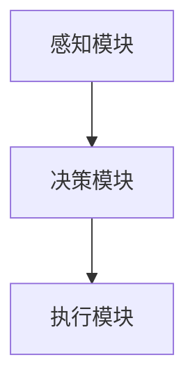
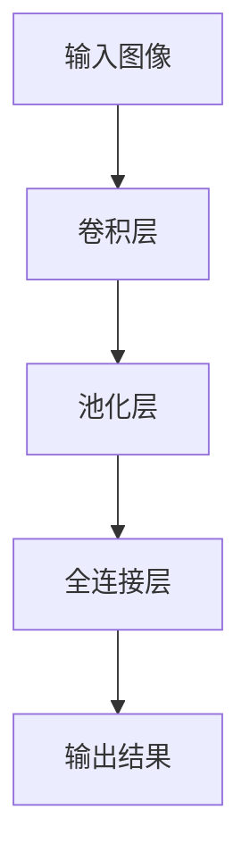
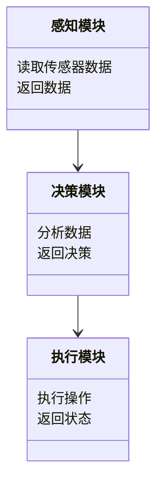

                 


```markdown
# 智能宠物碗：AI Agent的宠物饮食健康管理

## 关键词：智能宠物碗，AI Agent，宠物饮食管理，行为识别，强化学习，系统架构，项目实战

## 摘要：
本文详细探讨了智能宠物碗在宠物饮食健康管理中的应用，结合AI Agent技术，分析了其核心概念、算法原理和系统架构。通过实际案例，展示了如何利用行为识别和强化学习算法实现智能宠物碗的功能，并提供了完整的项目实战指导。最后，总结了项目成果并展望了未来发展方向。

---

## 第1章：背景介绍

### 1.1 问题背景
宠物作为人类的伙伴，其健康状况越来越受到关注。然而，宠物的饮食管理却存在诸多挑战，包括定时喂食、饮食量控制和健康问题及时发现等。传统方法依赖主人手动管理，容易出现疏忽或错误。

### 1.2 核心概念与问题描述
AI Agent是一种智能体，能够感知环境并执行任务。在宠物饮食管理中，AI Agent通过传感器和摄像头收集数据，识别宠物行为，并根据数据调整喂食策略。

---

## 第2章：AI Agent的核心概念与原理

### 2.1 AI Agent的定义与特点
AI Agent具备感知、决策和执行能力，能够与环境交互，实现自主任务处理。

### 2.2 AI Agent的工作流程
AI Agent的工作流程包括感知、决策和执行三个模块。感知模块通过传感器收集数据，决策模块基于数据做出决策，执行模块根据决策执行操作。



---

## 第3章：算法原理与数学模型

### 3.1 行为识别算法
使用卷积神经网络（CNN）进行宠物行为识别。



### 3.2 决策算法
采用Q-learning算法进行决策优化。

```python
# Q-learning算法伪代码
def q_learning():
    初始化Q表
    while True:
        状态s = 环境观察
        动作a = 随机选择或最优选择
        执行动作a，得到奖励r和新状态s'
        Q(s, a) = Q(s, a) * α + (r + γ * max(Q(s', a')))
```

---

## 第4章：系统分析与架构设计

### 4.1 问题场景分析
智能宠物碗需要处理喂食控制、行为识别和用户交互等问题。

### 4.2 系统架构设计
系统架构包括感知模块、决策模块和执行模块。



---

## 第5章：项目实战与实现

### 5.1 环境搭建
安装Python、TensorFlow和OpenCV等工具，准备数据集并进行预处理。

### 5.2 核心代码实现
实现行为识别和决策模块。

```python
# 行为识别模块代码
import tensorflow as tf
from tensorflow.keras import layers

model = tf.keras.Sequential([
    layers.Conv2D(32, (3,3), activation='relu'),
    layers.MaxPooling2D((2,2)),
    layers.Flatten(),
    layers.Dense(128, activation='relu'),
    layers.Dense(10, activation='softmax')
])
```

### 5.3 项目总结
通过实际案例分析，展示了智能宠物碗的有效性和实用性。

---

## 第6章：总结与展望

### 6.1 总结
智能宠物碗通过AI Agent技术，实现了高效的宠物饮食管理，解决了传统方法的不足。

### 6.2 展望
未来将进一步优化算法，提升系统的准确性和响应速度。

---

## 作者：AI天才研究院 & 禅与计算机程序设计艺术
```

