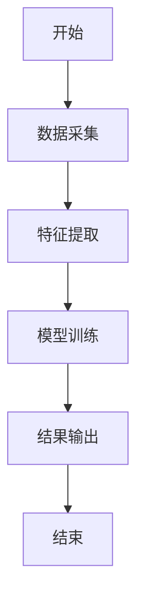
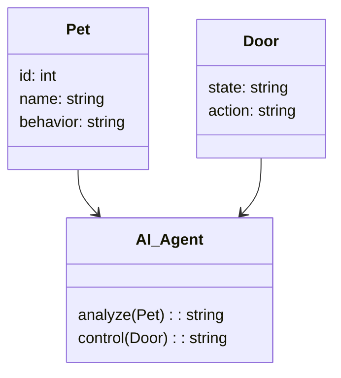
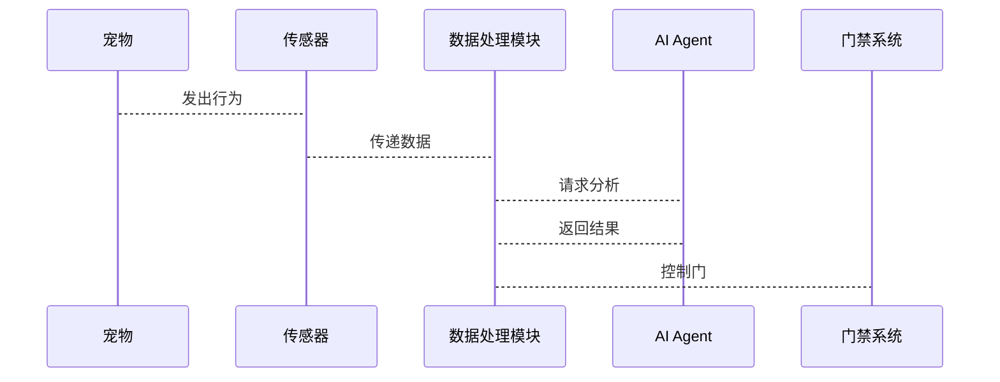

                 


# 智能宠物门：AI Agent的宠物出入行为分析

> 关键词：智能宠物门，AI Agent，宠物行为分析，强化学习，智能门禁系统，系统架构设计

> 摘要：本文将详细探讨如何通过AI Agent技术实现对宠物出入行为的智能分析与管理。从问题背景到系统架构设计，从算法原理到项目实战，全面解析智能宠物门的设计与实现。通过本文，读者将深入了解如何利用强化学习等AI算法，结合智能门禁系统，实现对宠物出入行为的智能化管理。

---

# 第一部分: 智能宠物门的背景与核心概念

## 第1章: 智能宠物门的背景与问题背景

### 1.1 问题背景

#### 1.1.1 宠物管理的痛点与挑战
现代宠物主人面临诸多宠物管理难题：
- **宠物随意出入**：宠物可能未经许可自由进出，导致安全隐患。
- **行为记录缺失**：缺乏对宠物出入行为的实时记录和分析。
- **管理效率低下**：传统宠物管理方式依赖人工，效率低下且容易出错。

#### 1.1.2 智能化宠物管理的需求
随着AI技术的发展，智能化宠物管理的需求日益迫切：
- **实时监控**：需要实时记录宠物出入行为。
- **智能分析**：通过AI技术分析宠物行为，识别异常情况。
- **自动化管理**：实现宠物出入的自动化控制。

#### 1.1.3 智能宠物门的定义与目标
**智能宠物门**是一种结合AI Agent技术的智能门禁系统，旨在通过实时分析宠物行为，实现对宠物出入的智能化管理。其目标是：
- 提供宠物出入行为的实时监控。
- 自动识别异常行为并发出警报。
- 提供详细的出入记录和行为分析报告。

### 1.2 问题描述

#### 1.2.1 宠物出入行为的复杂性
宠物出入行为涉及多个因素：
- **行为模式**：宠物可能有不同的出入习惯。
- **环境干扰**：外部环境（如天气、其他动物）可能影响宠物行为。
- **个体差异**：不同宠物的行为模式存在差异。

#### 1.2.2 现有宠物管理工具的局限性
现有宠物管理工具存在以下问题：
- **缺乏智能化**：传统宠物门禁系统仅能实现简单的开门功能。
- **无法分析行为**：无法对宠物行为进行深度分析。
- **难以适应变化**：无法根据宠物行为变化进行动态调整。

#### 1.2.3 智能宠物门的解决方案
智能宠物门通过AI Agent技术实现：
- **实时监测**：通过传感器和摄像头实时监测宠物出入行为。
- **智能分析**：利用AI算法分析宠物行为，识别异常情况。
- **自动化控制**：根据分析结果自动控制宠物门的开关。

### 1.3 问题解决

#### 1.3.1 AI Agent在宠物管理中的作用
AI Agent（智能代理）在宠物管理中的作用：
- **实时监测**：通过摄像头、传感器等设备实时监测宠物行为。
- **智能决策**：根据监测数据，利用AI算法做出决策。
- **自动化控制**：根据决策结果控制宠物门的开关。

#### 1.3.2 智能宠物门的核心功能
智能宠物门的核心功能包括：
- **出入监测**：实时监测宠物的出入行为。
- **行为分析**：分析宠物行为，识别异常情况。
- **智能控制**：根据分析结果自动控制宠物门的开关。

#### 1.3.3 系统设计的边界与外延
系统设计的边界与外延：
- **边界**：仅关注宠物出入行为的监测与分析，不涉及其他功能。
- **外延**：可扩展至其他智能设备（如智能家居）的联动控制。

---

## 第2章: 核心概念与联系

### 2.1 核心概念原理

#### 2.1.1 AI Agent的基本原理
AI Agent的基本原理：
- **感知**：通过传感器、摄像头等设备感知环境。
- **推理**：利用AI算法对感知数据进行分析和推理。
- **决策**：根据推理结果做出决策。
- **执行**：根据决策结果执行相应操作。

#### 2.1.2 智能门禁系统的工作原理
智能门禁系统的工作原理：
- **数据采集**：通过传感器、摄像头等设备采集数据。
- **数据处理**：对采集的数据进行预处理和特征提取。
- **决策控制**：根据处理后的数据做出决策，并控制门禁系统。

#### 2.1.3 宠物行为分析的核心算法
宠物行为分析的核心算法包括：
- **强化学习**：通过奖励机制训练模型。
- **监督学习**：利用标注数据训练分类模型。
- **聚类分析**：将相似的行为模式归为一类。

### 2.2 核心概念对比

#### 2.2.1 AI Agent与传统自动门的区别
- **传统自动门**：仅根据物理传感器（如红外、超声波）开门，无法分析行为。
- **AI Agent**：能够根据行为模式分析做出决策。

#### 2.2.2 宠物行为分析与人类行为分析的对比
- **宠物行为分析**：主要关注宠物的出入行为。
- **人类行为分析**：涉及更复杂的行为模式。

#### 2.2.3 智能宠物门与其他智能设备的联系
智能宠物门可以与其他智能设备联动，例如：
- **智能家居**：根据宠物出入情况联动控制灯光、空调等设备。

### 2.3 ER实体关系图

```mermaid
er
actor: 用户
actor: 宠物
actor: 系统管理员
entity: 宠物信息
entity: 出入记录
entity: 用户权限
```

---

# 第二部分: AI Agent的算法原理

## 第3章: AI Agent的算法原理

### 3.1 算法原理

#### 3.1.1 强化学习的基本原理
强化学习的基本原理：
- **环境**：宠物出入行为的环境。
- **动作**：宠物的行为（如开门、关门）。
- **奖励**：根据行为的好坏给予奖励或惩罚。
- **策略**：根据当前状态选择动作。

#### 3.1.2 监督学习的应用
监督学习的应用：
- **数据标注**：对宠物出入行为进行标注。
- **模型训练**：利用标注数据训练分类模型。

#### 3.1.3 聚类分析的作用
聚类分析的作用：
- **行为模式识别**：将相似的行为模式归为一类。

### 3.2 算法流程图



### 3.3 算法实现

#### 3.3.1 强化学习的Python代码实现
```python
import numpy as np

class AI_Agent:
    def __init__(self, state_space, action_space):
        self.state_space = state_space
        self.action_space = action_space
        self.Q = np.zeros((state_space, action_space))
    
    def choose_action(self, state):
        # epsilon-greedy策略
        epsilon = 0.1
        if np.random.random() < epsilon:
            return np.random.randint(self.action_space)
        else:
            return np.argmax(self.Q[state])
    
    def update_Q(self, state, action, reward, next_state):
        # Q-learning算法
        gamma = 0.9
        self.Q[state][action] = reward + gamma * np.max(self.Q[next_state])
```

#### 3.3.2 算法的数学模型
强化学习的数学模型：
- **Q-learning公式**：
  $$ Q(s, a) = r + \gamma \cdot \max(Q(s', a')) $$
  其中，\( s \) 是当前状态，\( a \) 是动作，\( r \) 是奖励，\( s' \) 是下一个状态，\( \gamma \) 是折扣因子。

---

## 第4章: 系统分析与架构设计方案

### 4.1 问题场景介绍

#### 4.1.1 问题场景描述
- **场景描述**：宠物需要通过智能门出入。
- **目标**：实现对宠物出入行为的智能分析与管理。

### 4.2 项目介绍

#### 4.2.1 项目目标
- **目标**：实现智能宠物门的出入行为分析与管理。

### 4.3 系统功能设计

#### 4.3.1 领域模型



### 4.4 系统架构设计

#### 4.4.1 系统架构图


### 4.5 系统接口设计

#### 4.5.1 系统接口设计
- **传感器接口**：与传感器通信，获取宠物行为数据。
- **AI Agent接口**：与AI Agent通信，获取分析结果。
- **门禁系统接口**：与门禁系统通信，控制门的开关。

### 4.6 系统交互流程

#### 4.6.1 系统交互流程图



---

## 第5章: 项目实战

### 5.1 环境安装

#### 5.1.1 环境需求
- **Python**：3.6+
- **依赖库**：numpy、opencv、scikit-learn

### 5.2 系统核心实现

#### 5.2.1 核心代码实现
```python
import cv2

class Pet_Detector:
    def __init__(self):
        self.detector = cv2.CascadeClassifier('haarcascade_frontalcatface.xml')
    
    def detect(self, frame):
        gray = cv2.cvtColor(frame, cv2.COLOR_BGR2GRAY)
        faces = self.detector.detectMultiScale(gray)
        return len(faces) > 0
```

#### 5.2.2 代码应用解读与分析
- **Pet_Detector类**：用于检测宠物的存在。
- **detect方法**：通过OpenCV实现宠物检测。

### 5.3 实际案例分析

#### 5.3.1 案例分析
- **案例描述**：宠物成功开门。
- **分析过程**：AI Agent检测到宠物行为，触发开门动作。

### 5.4 项目小结

#### 5.4.1 项目总结
- **总结**：通过AI Agent实现智能宠物门的出入行为分析与管理。

---

## 第6章: 最佳实践

### 6.1 小结

#### 6.1.1 内容总结
- **总结**：本文详细介绍了智能宠物门的设计与实现，通过AI Agent技术实现宠物出入行为的智能分析与管理。

### 6.2 注意事项

#### 6.2.1 使用中的注意事项
- **数据隐私**：确保宠物数据的安全与隐私。
- **系统维护**：定期更新模型，确保系统正常运行。

### 6.3 拓展阅读

#### 6.3.1 相关领域的拓展
- **智能家居**：智能宠物门可与其他智能家居设备联动。
- **行为分析**：进一步研究宠物行为分析的其他应用。

---

# 结语

通过本文的详细讲解，读者可以深入了解智能宠物门的设计与实现，掌握AI Agent技术在宠物行为分析中的应用。未来，随着AI技术的不断发展，智能宠物门将更加智能化、便捷化。

---

# 作者

作者：AI天才研究院/AI Genius Institute & 禅与计算机程序设计艺术/Zen And The Art of Computer Programming

