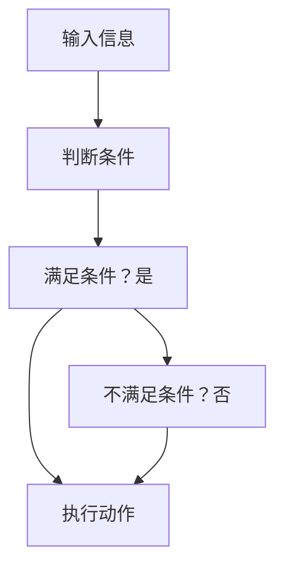
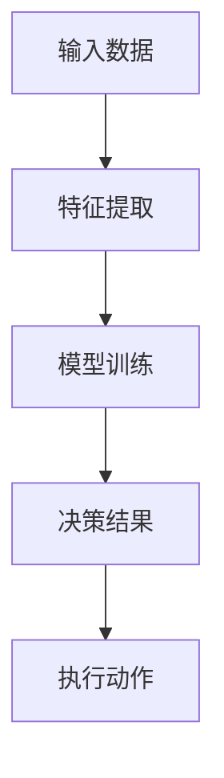
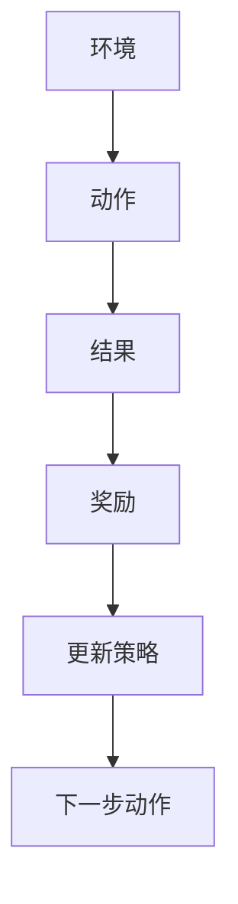

                 


# 智能家居中的AI Agent控制中心

## 关键词：
智能家居、AI Agent、控制中心、算法原理、系统架构、项目实战

## 摘要：
随着智能家居的普及，AI Agent作为智能家居的控制中心，正在发挥越来越重要的作用。本文将从智能家居的发展背景、AI Agent的基本概念、核心算法原理、系统架构设计、项目实战等多个方面，详细阐述AI Agent在智能家居中的应用。通过本文的讲解，读者将能够深入了解AI Agent在智能家居中的工作原理，掌握其核心算法和系统架构设计方法，最终能够应用这些知识进行智能家居系统的开发和优化。

---

## 第一部分: 智能家居中的AI Agent控制中心概述

### 第1章: 智能家居与AI Agent概述

#### 1.1 智能家居的发展背景
智能家居是指通过互联网、物联网、人工智能等技术，将家庭中的设备（如灯光、空调、电视、安防设备等）连接起来，实现智能化管理和控制的系统。随着科技的快速发展，智能家居已经成为现代生活中不可或缺的一部分。

智能家居的发展经历了多个阶段，从最初的简单设备互联，到现在的智能化控制，每个阶段都带来了更多的便利和舒适。智能家居的核心在于其智能化的控制中心，而AI Agent作为这个控制中心的核心技术，正在推动智能家居向更智能化、更个性化的方向发展。

智能家居的发展趋势是高度集成化、智能化和个性化。未来的智能家居系统将能够根据用户的行为习惯、环境变化等因素，自动调整设备的运行状态，提供更加贴心的服务。

#### 1.2 AI Agent的基本概念
AI Agent（人工智能代理）是一种能够感知环境、自主决策并执行任务的智能实体。在智能家居中，AI Agent作为控制中心，负责接收用户的指令、感知环境信息、协调各个设备的工作，并通过算法优化设备的运行状态。

AI Agent的核心特点包括：
1. **自主性**：能够自主决策，无需人工干预。
2. **反应性**：能够实时感知环境变化并做出反应。
3. **学习能力**：能够通过机器学习算法不断优化自身的决策能力。
4. **协作性**：能够与其他设备、系统或用户进行协作。

AI Agent与传统控制系统的核心区别在于其智能化和自主性。传统控制系统通常是基于规则的被动执行系统，而AI Agent则是基于智能算法的主动决策系统。

#### 1.3 智能家居中的AI Agent控制中心
在智能家居中，AI Agent控制中心是整个系统的“大脑”，负责接收用户的指令、协调各个设备的工作，并通过智能算法优化设备的运行状态。AI Agent控制中心的主要功能包括：
1. **用户交互**：通过语音、APP、手势等方式接收用户的指令。
2. **设备管理**：对智能家居中的设备进行监控、控制和管理。
3. **任务调度**：根据用户的需求和环境信息，自动调度设备执行任务。
4. **数据处理**：对设备产生的数据进行分析和处理，优化设备的运行状态。

AI Agent控制中心在智能家居中的作用至关重要。它不仅能够实现设备的智能化控制，还能够通过学习用户的习惯和偏好，提供更加个性化的服务。

#### 1.4 本章小结
本章主要介绍了智能家居的发展背景、AI Agent的基本概念以及其在智能家居中的作用。通过本章的讲解，读者可以了解智能家居的基本概念和发展趋势，理解AI Agent在智能家居中的重要性。

---

### 第2章: AI Agent的核心概念与技术原理

#### 2.1 AI Agent的核心概念
AI Agent的核心概念包括感知、决策和执行三个环节。感知是AI Agent获取环境信息的过程，决策是基于感知信息进行判断并做出决策的过程，执行是将决策结果转化为具体行动的过程。

AI Agent的核心概念可以用以下表格进行对比：

| 概念 | 描述 |
|------|------|
| 感知  | 通过传感器或其他方式获取环境信息 |
| 决策  | 基于感知信息进行判断并做出决策 |
| 执行  | 根据决策结果执行具体的动作 |

#### 2.2 AI Agent的技术原理
AI Agent的技术原理主要基于智能算法。常见的AI Agent算法包括基于规则的推理、基于机器学习的推理和基于强化学习的推理。

##### 2.2.1 基于规则的推理
基于规则的推理是一种简单但有效的AI Agent算法。它通过预设的规则和条件，根据输入的信息进行判断并做出决策。例如，当室内温度超过25摄氏度时，AI Agent会自动开启空调。

基于规则的推理可以用Mermaid流程图表示如下：



##### 2.2.2 基于机器学习的推理
基于机器学习的推理是一种更复杂的AI Agent算法，能够通过学习数据来优化决策能力。例如，AI Agent可以通过学习用户的用电习惯，优化设备的运行状态，从而实现节能。

基于机器学习的推理流程可以用Mermaid流程图表示如下：



##### 2.2.3 基于强化学习的推理
基于强化学习的推理是一种通过不断试错来优化决策能力的算法。AI Agent通过与环境的互动，不断调整自己的行为策略，以实现最优的决策结果。例如，AI Agent可以通过学习用户的习惯，优化设备的运行顺序。

基于强化学习的推理流程可以用Mermaid流程图表示如下：



#### 2.3 AI Agent的核心算法
AI Agent的核心算法包括状态空间表示、动作空间表示和奖励函数设计。

##### 2.3.1 状态空间表示
状态空间表示是指将环境中的状态进行编码，以便AI Agent能够理解和处理。例如，室内温度、湿度、光照强度等都可以作为状态空间的元素。

##### 2.3.2 动作空间表示
动作空间表示是指AI Agent可以执行的所有动作。例如，开启空调、关闭灯光、调整音量等。

##### 2.3.3 奖励函数设计
奖励函数设计是指为AI Agent的决策行为设计奖励机制。例如，当AI Agent成功完成一个任务时，给予正向奖励；当AI Agent做出错误决策时，给予负向奖励。

#### 2.4 本章小结
本章主要介绍了AI Agent的核心概念和技术原理，包括感知、决策和执行三个环节，以及基于规则的推理、基于机器学习的推理和基于强化学习的推理三种算法。通过本章的讲解，读者可以理解AI Agent在智能家居中的技术实现原理。

---

### 第3章: 智能家居中的AI Agent控制中心架构设计

#### 3.1 系统架构概述
AI Agent控制中心的系统架构设计是实现智能家居智能化控制的关键。常见的系统架构包括分层架构、集中式架构和分布式架构。

##### 3.1.1 分层架构
分层架构是一种将系统划分为多个层次的架构，每个层次负责不同的功能。例如，感知层负责获取环境信息，决策层负责做出决策，执行层负责执行决策。

##### 3.1.2 集中式架构
集中式架构是一种将所有功能集中在中央控制节点的架构。优点是管理简单，但缺点是单点故障风险较高。

##### 3.1.3 分布式架构
分布式架构是一种将功能分散到多个节点的架构，每个节点负责不同的功能。优点是高可用性，缺点是管理复杂。

#### 3.2 系统功能设计
AI Agent控制中心的系统功能设计包括用户交互界面、设备管理模块和任务调度模块。

##### 3.2.1 用户交互界面
用户交互界面是用户与AI Agent控制中心的接口，支持多种交互方式，如语音、APP、手势等。

##### 3.2.2 设备管理模块
设备管理模块负责对智能家居中的设备进行监控和管理，包括设备的状态监测、设备的启停控制等。

##### 3.2.3 任务调度模块
任务调度模块负责根据用户的需求和环境信息，自动调度设备执行任务。

#### 3.3 系统接口设计
系统接口设计包括设备控制接口、用户输入接口和数据存储接口。

##### 3.3.1 设备控制接口
设备控制接口用于与智能家居设备进行通信，接收设备的状态信息并发送控制指令。

##### 3.3.2 用户输入接口
用户输入接口用于接收用户的指令，支持多种输入方式，如语音、APP、手势等。

##### 3.3.3 数据存储接口
数据存储接口用于存储系统的运行数据，包括用户的指令、设备的状态信息等。

#### 3.4 系统交互流程设计
系统交互流程设计包括用户输入、系统处理和设备执行三个步骤。

##### 3.4.1 用户输入
用户通过交互界面输入指令，例如“请打开客厅的灯光”。

##### 3.4.2 系统处理
AI Agent接收用户的指令，分析指令内容，并根据当前环境信息做出决策。

##### 3.4.3 设备执行
AI Agent向目标设备发送控制指令，设备执行相应的动作，例如打开客厅的灯光。

#### 3.5 本章小结
本章主要介绍了AI Agent控制中心的系统架构设计，包括分层架构、集中式架构和分布式架构，以及系统功能设计、接口设计和交互流程设计。通过本章的讲解，读者可以理解AI Agent控制中心的系统架构实现方式。

---

### 第4章: 项目实战——智能家居AI Agent控制中心的实现

#### 4.1 环境配置
项目实战部分将通过实现一个简单的智能家居AI Agent控制中心来展示AI Agent的核心功能。首先需要进行环境配置，包括安装必要的软件和硬件。

##### 4.1.1 硬件设备
需要准备的硬件设备包括智能家居设备（如智能灯泡、智能插座等）和一台计算机或服务器。

##### 4.1.2 软件环境
需要安装的操作系统包括Python、AI框架（如TensorFlow、PyTorch）和智能家居设备的SDK。

#### 4.2 核心代码实现
接下来将展示AI Agent控制中心的核心代码实现，包括用户交互界面、设备管理模块和任务调度模块。

##### 4.2.1 用户交互界面
用户交互界面是用户与AI Agent控制中心的接口，支持多种交互方式。以下是基于语音交互的代码实现：

```python
import speech_recognition as sr

def recognize_speech():
    r = sr.Recognizer()
    with sr.Microphone() as source:
        print("请开始说话...")
        audio = r.listen(source)
        try:
            text = r.recognize_google(audio)
            print("识别到的文本：" + text)
            return text
        except sr.UnknownValueError:
            print("无法识别语音...")
            return None

recognize_speech()
```

##### 4.2.2 设备管理模块
设备管理模块负责对智能家居设备进行监控和管理。以下是设备管理模块的代码实现：

```python
class DeviceManager:
    def __init__(self):
        self.devices = {}

    def add_device(self, device_name, device_type):
        self.devices[device_name] = device_type

    def get_device_status(self, device_name):
        return self.devices.get(device_name, "未找到设备")

    def control_device(self, device_name, command):
        if device_name in self.devices:
            print(f"向{device_name}发送命令：{command}")
            return True
        else:
            print(f"未找到设备{device_name}")
            return False

device_manager = DeviceManager()
device_manager.add_device("客厅灯光", "灯光")
device_manager.add_device("空调", "空调")
device_manager.control_device("客厅灯光", "打开")
```

##### 4.2.3 任务调度模块
任务调度模块负责根据用户的需求和环境信息，自动调度设备执行任务。以下是任务调度模块的代码实现：

```python
import time

class TaskScheduler:
    def __init__(self):
        self.tasks = []

    def add_task(self, task_name, task_command):
        self.tasks.append((task_name, task_command))

    def execute_task(self, task_name):
        for task in self.tasks:
            if task[0] == task_name:
                print(f"执行任务：{task[1]}")
                # 调用设备控制模块执行任务
                device_manager.control_device(task[1][0], task[1][1])
                time.sleep(2)
                break

task_scheduler = TaskScheduler()
task_scheduler.add_task("打开客厅灯光", ("客厅灯光", "打开"))
task_scheduler.add_task("关闭空调", ("空调", "关闭"))
task_scheduler.execute_task("打开客厅灯光")
```

#### 4.3 代码应用解读与分析
本节将对上述代码进行解读和分析，展示AI Agent控制中心的核心功能。

##### 4.3.1 用户交互界面
用户交互界面是AI Agent控制中心与用户的接口，支持多种交互方式。上述代码实现了一个基于语音交互的用户界面，用户可以通过语音输入指令，AI Agent将识别用户的指令并进行相应的处理。

##### 4.3.2 设备管理模块
设备管理模块负责对智能家居设备进行监控和管理。上述代码实现了一个简单的设备管理模块，支持添加设备、查询设备状态和控制设备。

##### 4.3.3 任务调度模块
任务调度模块负责根据用户的需求和环境信息，自动调度设备执行任务。上述代码实现了一个简单的任务调度模块，支持添加任务和执行任务。

#### 4.4 实际案例分析
通过上述代码实现的智能家居AI Agent控制中心，可以实现以下功能：
1. 用户通过语音输入指令，例如“请打开客厅的灯光”。
2. AI Agent接收用户的指令，分析指令内容，并根据当前环境信息做出决策。
3. AI Agent向目标设备发送控制指令，设备执行相应的动作，例如打开客厅的灯光。

#### 4.5 项目小结
本章通过实现一个简单的智能家居AI Agent控制中心，展示了AI Agent的核心功能。通过本章的讲解，读者可以掌握AI Agent控制中心的基本实现方法，并能够在此基础上进行进一步的扩展和优化。

---

### 第5章: 最佳实践、小结与展望

#### 5.1 最佳实践
在实现智能家居AI Agent控制中心的过程中，需要注意以下几点：
1. **模块化设计**：将系统划分为多个模块，每个模块负责不同的功能，便于系统的维护和扩展。
2. **安全性设计**：确保系统的安全性，防止未经授权的访问和操作。
3. **可扩展性设计**：系统设计应具有良好的可扩展性，方便未来添加新的设备和功能。

#### 5.2 小结
通过本文的讲解，读者可以深入了解AI Agent在智能家居中的应用，掌握其核心算法和系统架构设计方法。本文从背景介绍、核心概念、算法原理、系统架构到项目实战，全面剖析了智能家居中的AI Agent控制中心。

#### 5.3 展望
未来，随着人工智能技术的不断发展，智能家居中的AI Agent控制中心将变得更加智能化和个性化。未来的AI Agent将能够通过深度学习算法，更加准确地理解用户的需求和习惯，提供更加贴心的服务。同时，随着物联网技术的普及，智能家居中的AI Agent控制中心将实现更加广泛的应用。

---

## 作者：AI天才研究院/AI Genius Institute & 禅与计算机程序设计艺术/Zen And The Art of Computer Programming

