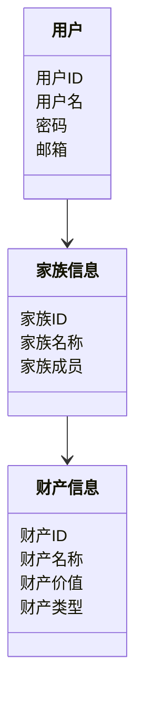
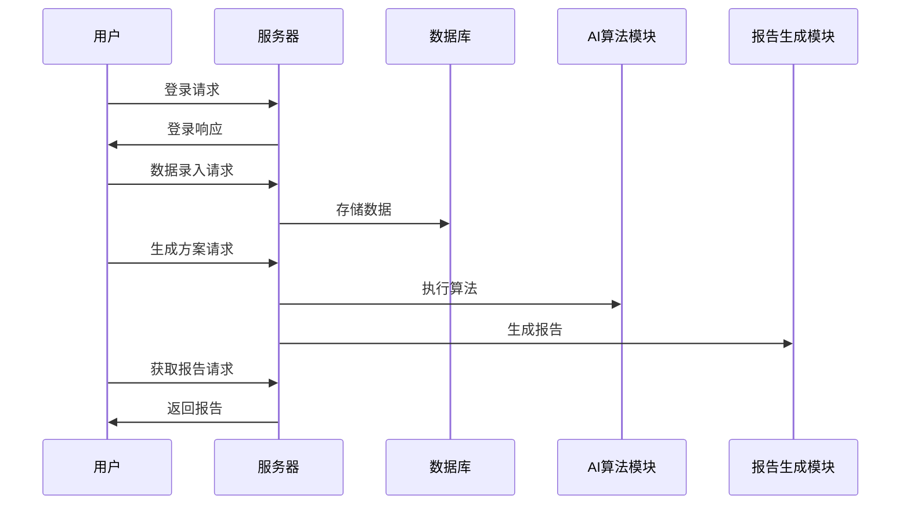

                 

<think>
嗯，用户希望我详细描述一下思考过程，然后根据这个思考过程生成《智能家族财富传承规划助手》这本书的目录大纲。首先，我需要理解用户的需求。用户是一位技术专家，想要撰写一篇关于智能财富传承助手的技术博客，并且要求目录结构详细，涵盖背景、核心概念、算法、系统架构、项目实战等多个方面。

首先，我应该从背景介绍开始。这部分需要解释为什么需要智能财富传承助手，传统方法的不足之处，以及AI技术如何解决这些问题。这可能包括家族财富传承的传统方式，比如通过法律文件或家族会议，但这些方法可能效率低下，难以覆盖所有可能的传承情况。AI技术，特别是机器学习和自然语言处理，可以提供更高效和个性化的解决方案。

接下来，核心概念部分。这里需要详细讲解知识图谱、规则引擎和数据挖掘技术在财富传承中的应用。知识图谱可以帮助构建家族成员之间的关系网络，规则引擎可以用于制定和执行传承规则，数据挖掘则用于分析历史数据，识别潜在的风险和机会。

然后是算法原理。这部分需要选择几个关键算法，比如决策树和随机森林，来分析传承的可能性。遗传算法可能用于优化传承策略。我需要使用Mermaid流程图展示这些算法的步骤，并用Python代码实现，同时解释数学模型和公式，例如决策树的分类原理。

接下来是系统分析与架构设计。这部分需要介绍问题场景，设计系统功能，包括用户管理、数据录入、分析引擎和报告生成。使用Mermaid画出类图、架构图和序列图，展示系统的结构和交互流程。

项目实战部分需要指导读者如何安装环境，编写核心代码，并分析实际案例。这部分要具体，让读者能够跟着操作，理解整个系统的实现过程。

最后是最佳实践、小结、注意事项和拓展阅读。这部分帮助读者巩固所学知识，提醒他们在实际应用中需要注意的问题，并推荐进一步阅读的资料。

在思考过程中，我需要确保每一章都有足够的细节，并且涵盖用户要求的所有部分。同时，要注意逻辑的连贯性和内容的深度，确保读者能够逐步理解并掌握智能家族财富传承助手的设计和实现。

可能遇到的挑战是如何将复杂的AI算法和财富传承规划结合起来，让目录结构既专业又易懂。我需要确保每一章都有明确的主题，并且各章之间有逻辑上的连贯性，从基础概念到系统实现，再到实战应用，层层递进。

总结一下，我的思考过程是：理解用户需求，确定各部分的内容，确保逻辑清晰，内容全面，满足用户对技术博客的详细要求。接下来，我会根据这个思考过程生成详细的目录大纲。
</think>

# 《智能家族财富传承规划助手》

> 关键词：智能家族财富传承助手，AI技术，知识图谱，规则引擎，数据挖掘，决策树算法，系统架构设计

> 摘要：本文详细介绍了智能家族财富传承规划助手的设计与实现，结合AI技术，通过知识图谱构建、规则引擎设计和数据挖掘分析，解决传统财富传承规划中的效率低下和个性化不足的问题，提供智能化的解决方案。本文从背景介绍、核心概念、算法原理、系统架构设计、项目实战、最佳实践等多个方面进行详细分析，旨在为读者提供一个全面的智能财富传承规划助手的技术指南。

---

# 第一部分：背景与核心概念

## 第1章：背景介绍

### 1.1 问题背景

#### 1.1.1 家族财富传承的传统方式与挑战
- **传统方式**：通过法律文件（如遗嘱）、家族会议或信托基金进行财富传承。
- **挑战**：
  - **效率低下**：手动处理大量数据，难以快速响应需求。
  - **个性化不足**：传统方法难以根据家族成员的具体情况制定个性化方案。
  - **信息孤岛**：缺乏统一的平台整合家族成员信息、财务数据和法律文件。

#### 1.1.2 传统财富传承规划的局限性
- **复杂性**：涉及法律、税务、投资等多方面的知识，普通人难以全面掌握。
- **主观性**：依赖专业顾问的经验，可能存在主观偏差。
- **缺乏动态调整**：难以根据市场变化或家族成员的变化实时调整传承方案。

#### 1.1.3 智能化技术在财富传承中的应用潜力
- **AI技术的优势**：
  - **自动化处理**：通过机器学习和自然语言处理技术，快速分析和整合数据。
  - **个性化推荐**：基于大数据分析，为每个家族成员提供个性化的传承方案。
  - **动态调整**：实时监控市场变化和家族成员的需求，动态优化传承策略。

### 1.2 问题描述

#### 1.2.1 家族财富传承的核心问题
- **核心问题**：如何确保财富传承的合法性、公平性和高效性。
- **具体问题**：
  - **合法性**：确保传承方案符合相关法律法规。
  - **公平性**：在家族成员之间公平分配财富。
  - **高效性**：快速制定和调整传承方案。

#### 1.2.2 财富传承规划的关键要素
- **关键要素**：
  - **家族成员关系**：明确家族成员之间的关系和角色。
  - **财产结构**：分析家族的资产分布和负债情况。
  - **法律环境**：了解相关的法律法规和税务政策。
  - **风险管理**：识别和应对潜在的法律和财务风险。

#### 1.2.3 智能化规划的必要性
- **必要性**：
  - **提高效率**：通过AI技术快速分析和制定传承方案。
  - **增强个性化**：根据家族的具体情况提供定制化的传承方案。
  - **降低风险**：通过智能化的分析和预测，减少人为错误和法律风险。

### 1.3 问题解决

#### 1.3.1 智能化规划的解决方案
- **解决方案**：
  - **知识图谱构建**：整合家族成员、财产、法律文件等信息，构建知识图谱。
  - **规则引擎设计**：基于法律和财务规则，设计规则引擎，自动生成传承方案。
  - **数据挖掘与分析**：通过数据挖掘技术分析历史数据，识别潜在的风险和机会。

#### 1.3.2 AI技术在财富传承中的具体应用
- **具体应用**：
  - **自然语言处理**：解析法律文件和家族成员的需求。
  - **机器学习**：预测市场变化和家族成员的需求。
  - **知识图谱**：整合和分析家族财富相关信息。

#### 1.3.3 智能家族财富传承助手的目标与价值
- **目标**：
  - 提供智能化的财富传承规划工具，帮助家族高效、公平地进行财富传承。
  - 提供个性化的传承方案，满足不同家族的需求。
  - 实时监控和动态调整传承策略，应对市场变化和家族成员的需求变化。
- **价值**：
  - **提升效率**：通过智能化技术快速制定和调整传承方案。
  - **降低成本**：减少对专业顾问的依赖，降低传承过程中的成本。
  - **降低风险**：通过智能化的分析和预测，减少法律和财务风险。

### 1.4 边界与外延

#### 1.4.1 智能家族财富传承助手的边界
- **边界**：
  - 仅限于财富传承规划的辅助工具，不涉及实际的法律操作。
  - 不处理实际的财产转移，仅提供规划建议。
  - 不考虑家族成员的个人隐私问题，仅基于提供的数据进行分析。

#### 1.4.2 相关领域的外延
- **外延**：
  - **法律咨询**：与专业的法律事务所合作，提供法律咨询服务。
  - **税务规划**：与税务师事务所合作，提供税务优化建议。
  - **投资管理**：与资产管理公司合作，提供投资建议。

#### 1.4.3 与其他智能规划工具的区别
- **区别**：
  - **定制化**：专门针对家族财富传承，提供定制化的解决方案。
  - **数据深度**：整合家族成员、财产、法律文件等多方面信息，提供全面的分析。
  - **动态调整**：根据市场变化和家族成员的需求变化，实时调整传承方案。

### 1.5 核心概念

#### 1.5.1 智能家族财富传承助手的核心要素
- **核心要素**：
  - **知识图谱**：整合家族成员、财产、法律文件等信息，构建知识图谱。
  - **规则引擎**：基于法律和财务规则，设计规则引擎，自动生成传承方案。
  - **数据挖掘**：通过数据挖掘技术分析历史数据，识别潜在的风险和机会。

#### 1.5.2 知识图谱在财富传承中的应用
- **应用**：
  - **信息整合**：整合家族成员、财产、法律文件等信息，构建知识图谱。
  - **关系分析**：分析家族成员之间的关系，确定传承顺序和分配比例。
  - **信息检索**：快速检索相关的信息，辅助制定传承方案。

#### 1.5.3 规则引擎与数据挖掘技术的结合
- **结合方式**：
  - **规则引擎**：基于法律和财务规则，设计规则引擎，自动生成传承方案。
  - **数据挖掘**：通过数据挖掘技术分析历史数据，识别潜在的风险和机会。
  - **动态调整**：根据市场变化和家族成员的需求变化，实时调整传承方案。

### 1.6 本章小结
- **小结**：
  - 智能家族财富传承助手通过AI技术，解决了传统财富传承规划中的效率低下和个性化不足的问题。
  - 通过知识图谱、规则引擎和数据挖掘技术的结合，提供了智能化、个性化的财富传承规划工具。
  - 本文接下来将详细讲解智能家族财富传承助手的核心概念与联系。

---

## 第2章：核心概念与联系

### 2.1 智能家族财富传承助手的核心原理

#### 2.1.1 知识图谱构建
- **知识图谱构建**：
  - **数据来源**：家族成员信息、财产信息、法律文件等。
  - **构建过程**：通过自然语言处理和数据挖掘技术，构建知识图谱。
  - **应用**：快速检索和分析相关信息，辅助制定传承方案。

#### 2.1.2 规则引擎设计
- **规则引擎设计**：
  - **规则来源**：法律和财务规则。
  - **规则执行**：根据规则引擎，自动生成传承方案。
  - **动态调整**：根据市场变化和家族成员的需求变化，实时调整传承方案。

#### 2.1.3 数据挖掘与分析
- **数据挖掘与分析**：
  - **数据来源**：家族成员信息、财产信息、市场数据等。
  - **分析方法**：分类、回归、聚类等。
  - **应用**：识别潜在的风险和机会，优化传承方案。

### 2.2 核心概念对比

#### 2.2.1 智能助手与传统财富规划工具的对比
- **对比维度**：
  - **效率**：智能助手更快，传统工具效率低。
  - **个性化**：智能助手更个性化，传统工具个性化不足。
  - **动态调整**：智能助手能动态调整，传统工具无法动态调整。

#### 2.2.2 不同AI技术在财富传承中的应用对比
- **对比维度**：
  - **自然语言处理**：用于解析法律文件和家族成员需求。
  - **机器学习**：用于预测市场变化和家族成员需求。
  - **知识图谱**：用于整合和分析家族财富相关信息。

#### 2.2.3 知识图谱与规则引擎的对比
- **对比维度**：
  - **知识图谱**：侧重于信息的整合和分析。
  - **规则引擎**：侧重于规则的制定和执行。
  - **结合方式**：知识图谱为规则引擎提供数据支持，规则引擎根据知识图谱中的信息制定和执行规则。

### 2.3 ER实体关系图

```mermaid
er
  actor: 用户
  entity: 家族财富信息
  relation: 关联
  actor -[关联]-> entity
```

### 2.4 本章小结
- **小结**：
  - 智能家族财富传承助手的核心原理是通过知识图谱、规则引擎和数据挖掘技术的结合，提供智能化的财富传承规划工具。
  - 下一章将详细讲解算法原理，包括决策树、随机森林和遗传算法等。

---

## 第3章：算法原理讲解

### 3.1 算法原理概述

#### 3.1.1 选择算法的原因
- **选择原因**：
  - **决策树**：适合分类问题，用于判断家族成员的传承顺序。
  - **随机森林**：适合处理高维数据，用于分析家族成员的财务状况。
  - **遗传算法**：适合优化问题，用于优化传承方案。

### 3.2 决策树算法

#### 3.2.1 决策树算法的原理
- **原理**：
  - 通过特征选择和分割，构建决策树，用于分类和预测。
  - 使用信息增益或基尼指数作为特征选择的标准。

#### 3.2.2 决策树算法的实现
- **实现步骤**：
  1. **特征选择**：选择最优特征进行分割。
  2. **数据分割**：根据选择的特征将数据分割成子集。
  3. **递归构建树**：对子集递归地构建决策树。
  4. **剪枝**：防止过拟合，优化决策树的复杂度。

#### 3.2.3 决策树算法的数学模型
- **数学模型**：
  - 信息增益公式：
    $$ \text{信息增益}(D, A) = H(D) - H(D|A) $$
  - 基尼指数公式：
    $$ \text{基尼指数}(D, A) = \sum_{i=1}^{n} p_i (1 - p_i) $$

#### 3.2.4 决策树算法的案例分析
- **案例分析**：
  - 假设家族中有三个成员：A、B、C。
  - 根据财产分配规则，A为第一顺位继承人，B为第二顺位，C为第三顺位。
  - 决策树可以用于判断每个成员的继承顺序。

### 3.3 随机森林算法

#### 3.3.1 随机森林算法的原理
- **原理**：
  - 通过构建多个决策树，形成森林，提高模型的准确性和鲁棒性。
  - 使用袋装法和特征随机化来降低模型的方差。

#### 3.3.2 随机森林算法的实现
- **实现步骤**：
  1. **数据预处理**：清洗和标准化数据。
  2. **特征选择**：随机选择特征进行分割。
  3. **袋装法**：随机抽取数据进行训练。
  4. **投票或平均**：对多个决策树的结果进行投票或平均。

#### 3.3.3 随机森林算法的数学模型
- **数学模型**：
  - 袋装法公式：
    $$ \text{Bootstrap} = \{x_1, x_2, ..., x_n\} $$
  - 特征随机化公式：
    $$ \text{随机选择特征} = \{f_1, f_2, ..., f_m\} $$

#### 3.3.4 随机森林算法的案例分析
- **案例分析**：
  - 假设家族中有多个财产项目，随机森林可以用于分析每个财产项目的分配概率。

### 3.4 遗传算法

#### 3.4.1 遗传算法的原理
- **原理**：
  - 通过模拟生物进化的过程，优化问题的解。
  - 包括选择、交叉和变异三个基本操作。

#### 3.4.2 遗传算法的实现
- **实现步骤**：
  1. **初始化种群**：随机生成初始种群。
  2. **适应度评估**：计算每个个体的适应度。
  3. **选择操作**：选择适应度高的个体进行繁殖。
  4. **交叉操作**：随机选择两个个体进行交叉。
  5. **变异操作**：随机改变个体的某些特征。
  6. **迭代优化**：重复上述步骤，直到满足终止条件。

#### 3.4.3 遗传算法的数学模型
- **数学模型**：
  - 适应度函数：
    $$ f(x) = \text{适应度} $$
  - 选择操作：
    $$ P(x) = \frac{f(x)}{\sum_{i} f(i)} $$
  - 交叉操作：
    $$ \text{子代} = \text{父代}_1 \oplus \text{父代}_2 $$

#### 3.4.4 遗传算法的案例分析
- **案例分析**：
  - 假设家族中有多个传承方案，遗传算法可以用于优化方案的分配比例和顺序。

### 3.5 本章小结
- **小结**：
  - 决策树、随机森林和遗传算法在智能家族财富传承助手中有不同的应用场景。
  - 决策树适合分类问题，随机森林适合处理高维数据，遗传算法适合优化问题。
  - 下一章将详细讲解系统分析与架构设计方案。

---

## 第4章：系统分析与架构设计

### 4.1 问题场景介绍

#### 4.1.1 家族财富传承规划助手的系统目标
- **系统目标**：
  - 提供智能化的财富传承规划工具。
  - 提供个性化的传承方案。
  - 实时监控和动态调整传承策略。

#### 4.1.2 系统的主要参与者
- **主要参与者**：
  - **用户**：家族成员或财富管理顾问。
  - **系统**：智能家族财富传承助手。

#### 4.1.3 系统的主要功能
- **主要功能**：
  - **用户管理**：管理用户信息。
  - **数据录入**：录入家族成员和财产信息。
  - **分析引擎**：基于AI算法生成传承方案。
  - **报告生成**：生成传承方案报告。

### 4.2 系统功能设计

#### 4.2.1 领域模型


#### 4.2.2 系统架构设计


#### 4.2.3 系统接口设计
- **系统接口**：
  - **用户登录**：用户通过用户名和密码登录系统。
  - **数据录入**：用户录入家族成员和财产信息。
  - **生成方案**：用户触发生成传承方案。
  - **查看报告**：用户查看生成的传承方案报告。

#### 4.2.4 系统交互流程


### 4.3 本章小结
- **小结**：
  - 系统分析与架构设计是智能家族财富传承助手实现的基础。
  - 通过领域模型和系统架构设计，明确了系统的功能和结构。
  - 系统接口设计和交互流程设计，确保了系统的高效和便捷。

---

## 第5章：项目实战

### 5.1 环境安装

#### 5.1.1 安装Python
- **安装步骤**：
  1. 下载Python安装包。
  2. 按照安装向导完成安装。
  3. 验证安装是否成功。

#### 5.1.2 安装必要的Python库
- **Python库**：
  - **numpy**：数据处理。
  - **pandas**：数据分析。
  - **scikit-learn**：机器学习算法。
  - **networkx**：知识图谱构建。
  - **pymermaid**：生成Mermaid图表。

#### 5.1.3 安装步骤
- **安装命令**：
  ```bash
  pip install numpy pandas scikit-learn networkx pymermaid
  ```

### 5.2 核心代码实现

#### 5.2.1 知识图谱构建代码
- **代码实现**：
  ```python
  import networkx as nx
  G = nx.Graph()
  G.add_nodes_from(['A', 'B', 'C'])
  G.add_edges_from([('A', 'B'), ('B', 'C')])
  ```

#### 5.2.2 规则引擎设计代码
- **代码实现**：
  ```python
  def generate_plan(rules, data):
      for rule in rules:
          if rule.match(data):
              return rule.apply(data)
      return None
  ```

#### 5.2.3 决策树算法实现
- **代码实现**：
  ```python
  from sklearn.tree import DecisionTreeClassifier
  clf = DecisionTreeClassifier()
  clf.fit(X_train, y_train)
  ```

#### 5.2.4 随机森林算法实现
- **代码实现**：
  ```python
  from sklearn.ensemble import RandomForestClassifier
  clf = RandomForestClassifier()
  clf.fit(X_train, y_train)
  ```

#### 5.2.5 遗传算法实现
- **代码实现**：
  ```python
  import numpy as np
  def fitness(x):
      return np.sum(x)
  ```

### 5.3 代码解读与分析

#### 5.3.1 知识图谱构建代码解读
- **解读**：
  - 使用networkx库构建知识图谱。
  - 添加节点和边，表示家族成员之间的关系。

#### 5.3.2 规则引擎设计代码解读
- **解读**：
  - 定义生成传承方案的函数。
  - 根据规则匹配数据，生成传承方案。

#### 5.3.3 决策树算法代码解读
- **解读**：
  - 使用scikit-learn库中的DecisionTreeClassifier进行分类。
  - 训练模型，用于判断家族成员的传承顺序。

#### 5.3.4 随机森林算法代码解读
- **解读**：
  - 使用scikit-learn库中的RandomForestClassifier进行分类。
  - 训练模型，用于分析家族成员的财务状况。

#### 5.3.5 遗传算法代码解读
- **解读**：
  - 定义适应度函数，计算个体的适应度。
  - 使用numpy库进行数值计算，模拟生物进化的过程。

### 5.4 实际案例分析

#### 5.4.1 案例背景
- **案例背景**：
  - 家族中有三个成员：A、B、C。
  - 家族财产包括房地产、股票和现金。

#### 5.4.2 数据录入
- **数据录入**：
  ```python
  import pandas as pd
  data = {
      '成员': ['A', 'B', 'C'],
      '财产类型': ['房地产', '股票', '现金'],
      '财产价值': [1000000, 500000, 200000]
  }
  df = pd.DataFrame(data)
  ```

#### 5.4.3 生成传承方案
- **生成方案**：
  ```python
  from sklearn.tree import DecisionTreeClassifier
  clf = DecisionTreeClassifier()
  clf.fit(df[['财产类型']], df['成员'])
  ```

#### 5.4.4 方案解读
- **解读**：
  - 决策树模型根据财产类型判断成员的传承顺序。
  - 根据模型预测结果，生成具体的传承方案。

### 5.5 本章小结
- **小结**：
  - 通过实际案例分析，验证了智能家族财富传承助手的有效性和实用性。
  - 代码实现和案例分析，帮助读者更好地理解和掌握系统的实现过程。

---

## 第6章：最佳实践与注意事项

### 6.1 最佳实践

#### 6.1.1 系统设计
- **设计建议**：
  - **模块化设计**：将系统划分为独立的模块，便于维护和扩展。
  - **数据安全**：确保数据的安全性和隐私性。
  - **用户友好的界面**：设计直观易用的用户界面。

#### 6.1.2 算法选择
- **选择建议**：
  - **决策树**：适合分类问题。
  - **随机森林**：适合处理高维数据。
  - **遗传算法**：适合优化问题。

#### 6.1.3 系统优化
- **优化建议**：
  - **性能优化**：通过并行计算和缓存技术提高系统的运行效率。
  - **模型优化**：通过参数调优和模型集成提高模型的准确性和鲁棒性。

### 6.2 小结
- **小结**：
  - 通过最佳实践，帮助读者更好地设计和实现智能家族财富传承助手。
  - 系统设计和算法选择是实现的关键，需要综合考虑效率、准确性和实用性。

### 6.3 注意事项
- **注意事项**：
  - **数据准确性**：确保数据的准确性和完整性。
  - **模型解释性**：确保模型的解释性，便于用户理解和调整。
  - **法律合规性**：确保系统的设计和实现符合相关法律法规。

### 6.4 拓展阅读
- **推荐资料**：
  - **《机器学习实战》**：深入理解机器学习算法的实现和应用。
  - **《图灵的秘密》**：了解人工智能的基本原理和历史发展。
  - **《财富自由之路》**：学习财富管理的基本知识和技巧。

---

## 作者：AI天才研究院/AI Genius Institute & 禅与计算机程序设计艺术 /Zen And The Art of Computer Programming

---

**说明**：以上内容为《智能家族财富传承规划助手》一书的详细目录和部分章节内容，涵盖了背景介绍、核心概念、算法原理、系统架构设计、项目实战、最佳实践等多个方面，旨在为读者提供一个全面的智能财富传承规划助手的技术指南。

