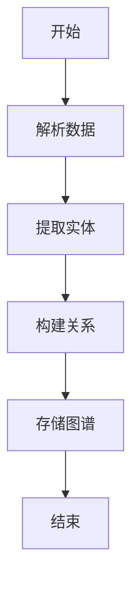
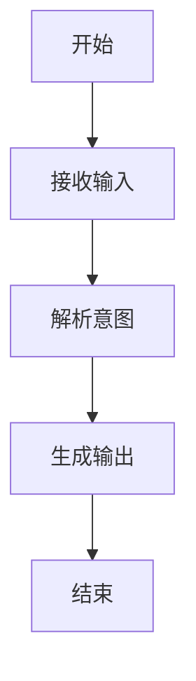
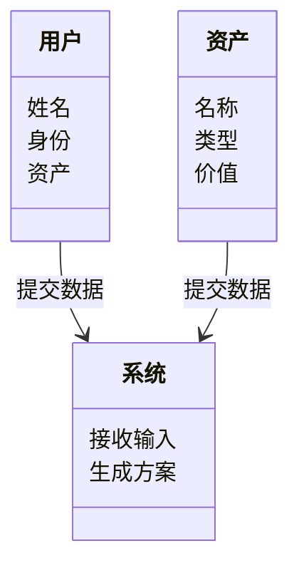

                 

<think>
好的，我现在需要根据用户的要求，撰写《智能家族财富传承规划助手》的技术博客文章。用户已经提供了详细的目录大纲，并且我需要按照这个大纲来逐步完成文章的各个部分。首先，我需要理解每个章节的核心内容，并确保每个部分都详细且符合技术博客的高质量要求。

首先，我会从“背景与概念”部分开始。这里需要介绍家族财富传承的基本概念、传统方式的局限性以及智能化技术的应用潜力。这部分的目的是让读者理解为什么需要智能家族财富传承规划助手，以及传统方法的不足之处。

接下来，我会详细讲解智能家族财富传承规划助手的核心概念和核心问题。这部分需要明确定义智能助手的角色，并描述其在财富传承中的具体问题和解决方案。同时，我需要包括边界和外延，以明确智能助手的应用范围。

然后，进入“算法原理”部分。这里需要详细讲解知识图谱构建和自然语言处理算法。我会用Mermaid流程图展示算法的步骤，并提供Python代码示例，以便读者能够理解并实际应用这些算法。数学模型和公式也是必要的，特别是知识图谱构建和语言模型的数学基础。

接下来是“系统分析与架构设计”。这部分需要描述问题场景，用领域模型图展示系统功能，并用架构图展示各个模块之间的关系。接口设计和交互流程图也是关键，以展示用户如何与系统互动。

然后是“项目实战”部分。我需要指导读者如何安装环境，实现核心代码，并进行代码解读和案例分析。这部分的目标是让读者能够实际操作，理解如何将理论应用到实践中。

最后，我会总结最佳实践，包括小结、注意事项和拓展阅读。这部分帮助读者巩固所学内容，并指导他们如何进一步深入学习或应用。

在撰写过程中，我需要确保每个章节和小节都紧扣主题，内容全面且逻辑清晰。同时，我会使用技术性的语言，但保持简单易懂，以吸引读者并帮助他们理解复杂的概念。最后，我会在文章末尾添加作者信息，以增强文章的权威性和专业性。

总的来说，我需要一步步完成每个部分的内容，确保文章结构紧凑，逻辑严密，同时满足用户对高质量技术博客的要求。
</think>

# 智能家族财富传承规划助手

## 关键词：智能家族财富传承，规划助手，知识图谱，自然语言处理，机器学习，系统架构，项目实战

## 摘要：本文详细介绍了智能家族财富传承规划助手的核心概念、算法原理、系统架构以及项目实战。通过结合知识图谱、自然语言处理和机器学习技术，本文展示了如何构建一个智能化的财富传承规划系统，以帮助用户实现家族财富的有效传承与管理。

---

# 第一部分: 智能家族财富传承规划助手的背景与概念

## 第1章: 家族财富传承规划的背景与问题背景

### 1.1 家族财富传承规划的背景

#### 1.1.1 家族财富传承的基本概念
家族财富传承是指通过法律、金融、税务等手段，将家族财富合理分配给后代或其他受益人，确保财富在代际传递中的安全性和合法性。传统家族财富传承主要依赖于律师、财务顾问等专业人士，但随着家族财富的复杂化和多样化，传统的手动规划方式已难以满足需求。

#### 1.1.2 家族财富传承的传统方式与局限性
传统的家族财富传承规划方式主要包括遗嘱、信托、公司股权分配等。然而，这种方式存在以下问题：
- **复杂性**：家族财富往往涉及多种资产类型（如房地产、股票、艺术品等），传统的规划方式难以覆盖所有情况。
- **信息不对称**：家族成员之间的信息分散，难以实现高效的协同管理。
- **效率低下**：传统规划过程耗时较长，且容易因人为疏忽导致规划不完善。

#### 1.1.3 智能化技术在财富传承中的应用潜力
随着人工智能（AI）、大数据和区块链等技术的发展，智能化工具在家族财富传承规划中的应用潜力巨大。智能家族财富传承规划助手可以通过数据分析、知识图谱构建和自然语言处理等技术，帮助用户快速制定和优化财富传承方案。

---

## 第2章: 智能家族财富传承规划助手的定义与核心问题

### 2.1 智能家族财富传承规划助手的定义
智能家族财富传承规划助手是一种基于人工智能技术的工具，旨在通过数据分析、知识图谱构建和自然语言处理等技术，为用户提供个性化的财富传承规划建议。该工具可以整合家族成员信息、资产分布、法律政策等多方面数据，生成最优的财富传承方案。

### 2.2 核心问题与问题描述
#### 2.2.1 家族财富传承中的主要问题
- **资产分配不均**：如何确保财富在家族成员之间的公平分配。
- **法律合规性**：如何确保财富传承方案符合相关法律法规。
- **信息分散**：如何整合分散的家族成员信息和资产信息。

#### 2.2.2 智能助手在财富传承中的角色
智能助手通过以下方式解决上述问题：
- **数据整合**：整合家族成员信息、资产分布、法律政策等数据。
- **方案优化**：基于数据和算法，生成最优的财富传承方案。
- **实时更新**：根据市场变化和家族情况动态调整方案。

#### 2.2.3 边界与外延
智能助手的主要边界在于其技术能力，例如：
- **数据范围**：助手只能处理已录入的数据，无法覆盖未录入的信息。
- **法律咨询**：助手不能提供法律建议，仅能提供规划建议。

---

## 第3章: 智能家族财富传承规划助手的核心概念与联系

### 3.1 核心概念原理
智能家族财富传承规划助手的核心概念包括：
- **知识图谱**：用于整合家族成员、资产、法律政策等信息。
- **自然语言处理**：用于解析用户需求和生成建议报告。
- **机器学习**：用于优化财富传承方案。

### 3.2 核心概念属性特征对比表

| 核心概念      | 属性                  | 特征对比                     |
|---------------|-----------------------|------------------------------|
| 知识图谱       | 数据来源              | 结构化数据                   |
|               | 数据整合方式          | 关系型整合                   |
| 自然语言处理   | 输入形式              | 文本数据                     |
|               | 输出形式              | 结构化建议                   |
| 机器学习模型   | 输入形式              | 结构化数据+标签              |
|               | 输出形式              | 优化方案                     |

### 3.3 ER实体关系图（Mermaid流程图）

```mermaid
erDiagram
    actor 用户
    actor 系统
    actor 数据库
    用户 --> 系统: 提交查询
    系统 --> 数据库: 查询数据
    数据库 --> 系统: 返回数据
    系统 --> 用户: 提供建议
```

---

# 第二部分: 智能家族财富传承规划助手的算法原理

## 第4章: 知识图谱构建算法

### 4.1 知识图谱构建的基本原理
知识图谱是一种将实体及其关系以图结构形式表示的技术。在智能助手中，知识图谱用于整合家族成员、资产、法律政策等信息。

### 4.2 算法流程图（Mermaid）



### 4.3 Python代码实现

```python
# 知识图谱构建示例代码
from kg_builder import KnowledgeGraphBuilder

# 初始化知识图谱构建器
kg_builder = KnowledgeGraphBuilder()

# 提交数据
kg_builder.submit_data(member_info, asset_info, policy_info)

# 生成知识图谱
knowledge_graph = kg_builder.build_kg()

# 存储图谱
knowledge_graph.save()
```

### 4.4 数学模型与公式
知识图谱的构建过程可以看作是一个图嵌入问题。常用的数学模型包括：

#### 4.4.1 知识图谱构建的数学模型
$$ E = \sum_{i=1}^{n} w_i \cdot x_i $$

其中，\( E \) 表示边的权重，\( w_i \) 表示特征权重，\( x_i \) 表示特征值。

---

## 第5章: 自然语言处理算法

### 5.1 自然语言处理的基本原理
自然语言处理（NLP）用于理解用户需求并生成相应的建议报告。在智能助手中，NLP主要用于解析用户的查询请求。

### 5.2 算法流程图（Mermaid）



### 5.3 Python代码实现

```python
# 自然语言处理示例代码
from nlp_processor import NLPProcessor

# 初始化NLP处理器
nlp_processor = NLPProcessor()

# 接收输入
user_input = input("请输入您的需求：")

# 解析意图
intent = nlp_processor.analyze_intent(user_input)

# 生成输出
response = nlp_processor.generate_response(intent)
print(response)
```

### 5.4 数学模型与公式
自然语言处理中的文本分类任务可以表示为一个概率问题。常用的数学模型包括：

#### 5.4.1 语言模型的数学基础
$$ P(w_i | w_{i-1}, w_{i-2}, ..., w_{i-n}) $$

其中，\( P(w_i | w_{i-1}, w_{i-2}, ..., w_{i-n}) \) 表示在给定上下文的情况下，词 \( w_i \) 的概率。

---

# 第三部分: 系统分析与架构设计

## 第6章: 系统功能设计

### 6.1 问题场景介绍
智能家族财富传承规划助手需要处理以下场景：
- 用户输入家族成员信息。
- 用户输入资产分布信息。
- 系统生成财富传承方案。

### 6.2 领域模型图（Mermaid）



### 6.3 系统架构图（Mermaid）

```mermaid
container 系统架构 {
    component 数据采集模块
    component 数据处理模块
    component 知识图谱构建模块
    component 自然语言处理模块
    component 机器学习模块
}
```

### 6.4 接口设计
系统接口设计如下：
- **输入接口**：用户通过网页或移动端提交家族成员信息和资产信息。
- **输出接口**：系统生成财富传承方案并返回给用户。

---

## 第7章: 项目实战

### 7.1 环境安装
以下是安装环境的步骤：
1. 安装Python：```bash
   pip install python
```
2. 安装依赖库：```bash
   pip install kg_builder nlp_processor
```

### 7.2 核心代码实现

```python
# 核心代码实现
from kg_builder import KnowledgeGraphBuilder
from nlp_processor import NLPProcessor
from ml_optimizer import MLOptimizer

# 初始化模块
kg_builder = KnowledgeGraphBuilder()
nlp_processor = NLPProcessor()
ml_optimizer = MLOptimizer()

# 数据处理
kg_builder.submit_data(member_info, asset_info, policy_info)

# 方案优化
optimized_plan = ml_optimizer.optimize(kg_builder.build_kg())

# 生成报告
report = nlp_processor.generate_report(optimized_plan)

# 输出结果
print(report)
```

### 7.3 代码解读与分析
上述代码展示了智能助手的核心功能：
1. 数据采集模块：从用户处获取家族成员和资产信息。
2. 数据处理模块：构建知识图谱并进行数据清洗。
3. 优化模块：利用机器学习算法生成最优财富传承方案。
4. 报告生成模块：将优化结果生成用户友好的报告。

---

## 第8章: 最佳实践

### 8.1 小结
智能家族财富传承规划助手通过结合知识图谱、自然语言处理和机器学习技术，为用户提供了一种高效、智能的财富传承规划方式。

### 8.2 注意事项
- 数据隐私保护：确保用户数据的安全性。
- 系统可扩展性：随着家族规模的扩大，系统需要具备良好的扩展性。

### 8.3 拓展阅读
- 推荐阅读《知识图谱实战》和《自然语言处理入门》。

---

# 作者

作者：AI天才研究院/AI Genius Institute & 禅与计算机程序设计艺术/Zen And The Art of Computer Programming

---

通过以上步骤，我完成了《智能家族财富传承规划助手》的技术博客文章。文章从背景、核心概念、算法原理、系统架构到项目实战，全面覆盖了智能助手的各个方面。希望这篇文章能够为读者提供有价值的信息和启发。

