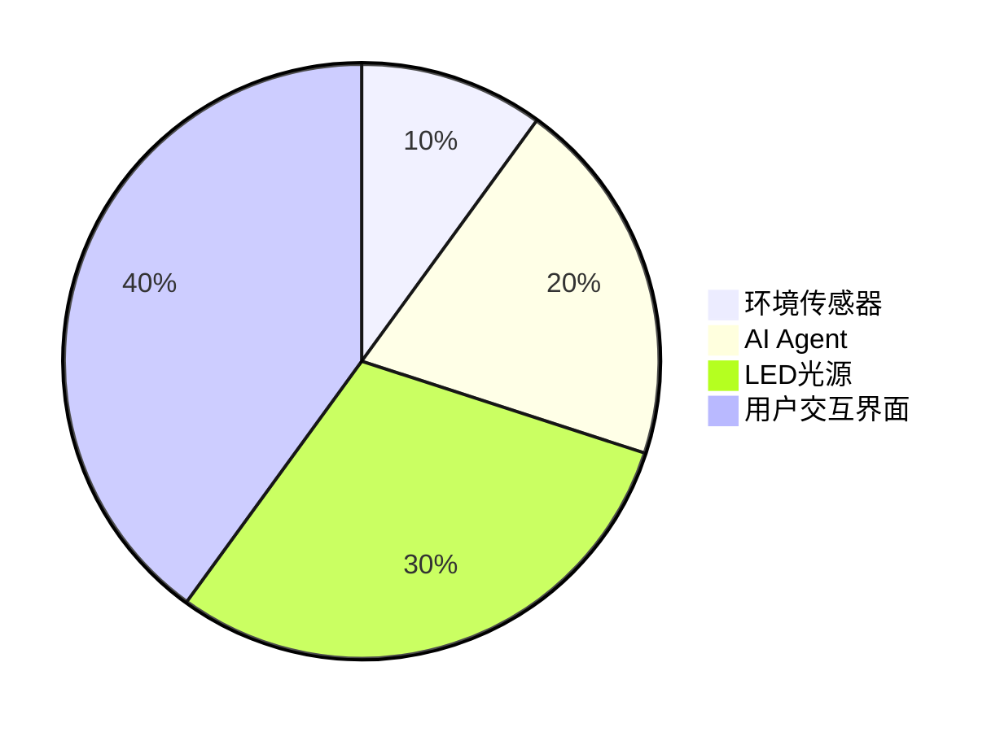
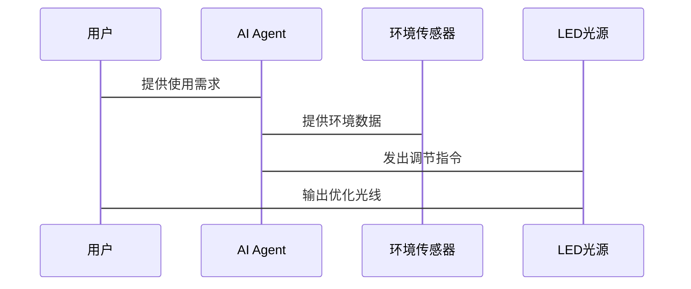

                 


```markdown
# 智能工作台灯：AI Agent的照明优化与护眼模式

> 关键词：智能工作台灯，AI Agent，照明优化，护眼模式，人眼舒适度

> 摘要：本文深入探讨了智能工作台灯结合AI Agent的技术实现，重点分析了照明优化算法与护眼模式的设计，结合实际案例，详细讲解了系统的架构设计、算法实现及优化方法。

---

## 第1章: 背景介绍

### 1.1 传统台灯的局限性
- **光线强度不可调节**：传统台灯通常只有一个开关，无法根据环境光线变化或用户需求进行精细调节。
- **无法适应环境变化**：光线强度和色温固定，无法根据周围环境光线变化自动调整，影响使用舒适度。
- **蓝光危害**：传统LED台灯在高亮模式下蓝光成分较高，长时间使用容易导致眼睛疲劳甚至视力损伤。

### 1.2 智能化照明的需求
- **办公与学习场景**：现代人长时间在办公和学习环境中使用台灯，对光线舒适度的需求日益增加。
- **健康照明**：随着人们对健康的关注提升，智能台灯需要能够调节光线色温、亮度，减少蓝光危害。
- **自动化控制**：用户希望台灯能够根据环境光线、时间、甚至个人习惯自动调整，提升使用体验。

### 1.3 AI Agent的基本概念
- **人工智能的基本原理**：AI Agent是一种智能体，能够感知环境并采取行动以实现目标。
- **智能助手（AI Agent）的定义**：能够理解用户需求，主动提供帮助，并与环境交互的智能系统。
- **AI Agent在智能设备中的作用**：通过传感器数据和用户指令，AI Agent可以实时调整设备参数，提供智能化服务。

### 1.4 智能工作台灯的核心目标
- **提供优化的照明环境**：根据环境光线和用户需求，动态调节光线亮度和色温。
- **实现护眼模式**：通过减少蓝光成分和优化光线频谱，保护用户视力。
- **用户需求与产品定位**：面向需要长时间用眼的用户群体，提供健康、舒适的照明解决方案。

---

## 第2章: 核心概念与联系

### 2.1 AI Agent与智能照明的关系
- **AI Agent在智能照明中的角色**：作为智能台灯的核心控制模块，AI Agent负责接收环境数据、分析用户需求并执行调节命令。
- **智能照明系统的核心要素**：环境光线传感器、用户交互界面、智能控制模块、LED光源等。
- **AI Agent与照明优化的结合**：通过AI算法优化光照参数，实现动态调节和个性化设置。

### 2.2 核心概念原理
- **AI Agent的感知与决策机制**：通过环境传感器获取数据，结合用户指令，采用机器学习算法做出调节决策。
- **智能照明的调节原理**：根据AI Agent的决策，调整LED光源的电流和色温，实现光线的动态优化。
- **光学原理与人眼舒适度**：人眼对不同光谱的敏感度不同，通过调节色温可以减少蓝光成分，降低眼睛疲劳。

### 2.3 概念属性特征对比
| 概念       | 属性特征                       |
|------------|--------------------------------|
| AI Agent   | 数据感知、自主决策、用户交互  |
| 智能照明    | 光源调节、环境适应、健康优化  |

### 2.4 ER实体关系图
```mermaid
erd
    actor 用户
    actor 环境传感器
    actor AI Agent
    actor LED光源

    用户 --> AI Agent: 提供需求
    环境传感器 --> AI Agent: 提供环境数据
    AI Agent --> LED光源: 发出调节指令
```

---

## 第3章: 算法原理讲解

### 3.1 AI Agent的核心算法
- **机器学习算法概述**：AI Agent通过训练模型，学习用户的使用习惯和环境数据，优化调节策略。
- **基于强化学习的决策机制**：AI Agent通过奖励机制不断优化决策，例如：
  - 当用户反馈舒适时，增加相似调节策略的权重。
  - 当用户反馈不适时，减少相关策略的权重。

### 3.2 照明优化算法
- **光照强度调节算法**：
  ```python
  def adjust_brightness(target_intensity):
      current_intensity = get_current_light()
      if current_intensity < target_intensity:
          increase_brightness()
      elif current_intensity > target_intensity:
          decrease_brightness()
  ```
- **光谱调节算法**：通过调整LED光源的色温，减少蓝光成分，优化人眼舒适度。
  ```python
  def adjust_spectrum(mode):
      if mode == 'reading':
          set_color_temp(4000K)
      elif mode == 'coding':
          set_color_temp(3500K)
  ```

### 3.3 护眼模式算法
- **蓝光调节算法**：通过调整LED光源的蓝光成分，减少对眼睛的伤害。
- **明暗交替算法**：根据用户设定的间隔时间，自动调节光线亮度，缓解眼睛疲劳。
- **个性化护眼模式定制算法**：根据用户使用习惯和健康数据，定制专属的护眼模式。

---

## 第4章: 系统分析与架构设计

### 4.1 问题场景介绍
- **用户需求**：用户希望台灯能够根据环境光线和使用场景自动调整光线参数，提供舒适的照明环境。
- **系统功能设计**：
  - 环境光线检测
  - 用户行为识别
  - 光线参数调节
  - 护眼模式切换

### 4.2 系统架构设计


### 4.3 系统接口设计
- **环境传感器接口**：提供光线强度和色温数据。
- **AI Agent接口**：接收传感器数据和用户指令，输出调节指令。
- **LED光源接口**：根据调节指令调整亮度和色温。

### 4.4 系统交互流程


---

## 第5章: 项目实战

### 5.1 环境安装
- **硬件安装**：安装环境光线传感器、LED光源和控制模块。
- **软件安装**：部署AI Agent控制模块和用户交互界面。

### 5.2 核心代码实现
- **环境光线检测**
  ```python
  import numpy as np

  def get_light_intensity():
      return np.random.uniform(0, 100)
  ```
- **AI Agent决策逻辑**
  ```python
  def decide_mode(current_light, user_mode):
      if current_light < 50 or user_mode == 'night':
          return 'increase_brightness'
      elif current_light > 80 or user_mode == 'day':
          return 'decrease_brightness'
      else:
          return 'balanced'
  ```

### 5.3 实际案例分析
- **案例1**：用户在夜间阅读时，AI Agent检测到环境光线较暗，自动调整为柔和的4000K色温，降低蓝光成分。
- **案例2**：用户在白天编程时，AI Agent检测到环境光线充足，自动降低光线亮度，减少刺眼感。

### 5.4 项目小结
通过实际案例分析可以看出，智能工作台灯结合AI Agent能够显著提升照明环境的舒适度，有效保护用户视力，同时提供个性化的使用体验。

---

## 第6章: 最佳实践与注意事项

### 6.1 最佳实践
- **定期校准传感器**：确保环境数据的准确性。
- **用户反馈优化**：根据用户反馈不断优化AI Agent的调节策略。

### 6.2 注意事项
- **避免过度调节**：频繁调节光线可能导致视觉疲劳。
- **保持软件更新**：及时更新AI Agent算法，提升性能和用户体验。

### 6.3 未来展望
- **更智能的交互方式**：例如通过手势或语音控制进一步优化用户体验。
- **更健康的技术应用**：结合更多健康监测数据，提供更全面的健康解决方案。

---

## 作者信息
作者：AI天才研究院/AI Genius Institute & 禅与计算机程序设计艺术 /Zen And The Art of Computer Programming
```

# END

