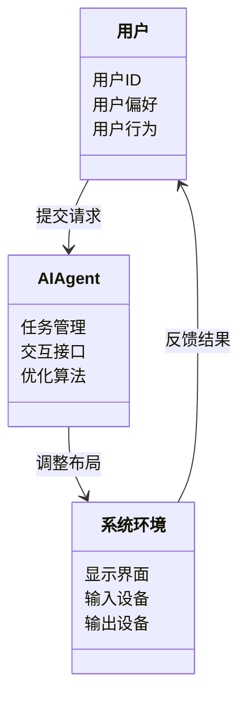
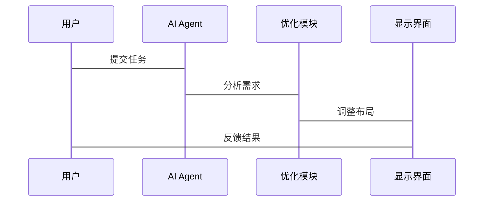

                 


# 智能工作台：AI Agent的人体工程学调整

## 关键词：AI Agent，人体工程学，智能工作台，工作效率，优化算法

## 摘要：  
随着人工智能技术的快速发展，AI Agent（智能代理）在工作场景中的应用日益广泛。然而，单纯依赖技术性能的提升并不能完全满足用户需求，如何在技术与人机交互之间找到平衡点，成为了关键问题。本文从人体工程学的角度出发，分析AI Agent在工作台中的优化调整策略，探讨如何通过技术手段与人体工学的结合，提升工作效率与用户体验。文章结合理论与实践，详细阐述了AI Agent的核心原理、算法优化、系统架构设计以及实际应用场景，为智能工作台的未来发展提供了新的思路。

---

# 第1章 AI Agent与人体工程学的结合

## 1.1 AI Agent的基本概念

### 1.1.1 AI Agent的定义与分类  
AI Agent（智能代理）是指能够感知环境、自主决策并执行任务的智能系统。根据功能和应用场景的不同，AI Agent可以分为任务型、服务型和协作型三种类型。任务型AI Agent主要用于完成特定任务（如语音助手），服务型AI Agent提供持续性的服务（如智能客服），而协作型AI Agent则能够与人类或其他系统协同工作。

### 1.1.2 人体工程学的基本原理  
人体工程学是研究人与工具、环境之间的关系，旨在通过优化设计减少疲劳、提高效率和舒适度。其核心在于平衡人体生理需求与工作环境的交互。

### 1.1.3 AI Agent与人体工程学的结合意义  
AI Agent与人体工程学的结合，不仅能够提高工作效率，还能减少因长时间使用电子设备带来的身体不适。通过技术手段优化人机交互，使用户在使用AI Agent的过程中更加高效和舒适。

## 1.2 智能工作台的定义与特点

### 1.2.1 智能工作台的功能概述  
智能工作台是一种结合了AI Agent和人体工程学设计的高效工作环境。它能够根据用户的习惯和需求，动态调整界面布局、任务优先级和交互方式。

### 1.2.2 人体工程学在工作台设计中的应用  
人体工程学在智能工作台中的应用主要体现在以下几个方面：  
1. **界面布局优化**：根据用户的视线和手部动作设计界面，减少视觉疲劳和操作负担。  
2. **任务优先级调整**：通过AI算法分析用户的工作习惯，优先显示重要任务。  
3. **交互方式多样性**：支持语音、手势等多种交互方式，降低键盘和鼠标的使用频率。

### 1.2.3 智能工作台的核心优势  
智能工作台的核心优势在于：  
1. 提高工作效率，减少时间浪费。  
2. 减少身体疲劳，提升用户体验。  
3. 适应不同用户的需求，提供个性化的服务。

## 1.3 问题背景与目标

### 1.3.1 当前工作效率的痛点分析  
随着数字化工作的普及，用户面临以下痛点：  
1. 信息过载，难以快速找到所需内容。  
2. 多任务处理效率低下，容易分散注意力。  
3. 长时间使用电子设备导致的身体不适。

### 1.3.2 AI Agent在工作中的潜在价值  
AI Agent能够通过自动化处理、智能推荐和实时反馈，帮助用户更高效地完成任务。其潜在价值体现在：  
1. 提供个性化的任务管理。  
2. 优化工作流程，减少重复劳动。  
3. 提供实时的健康反馈，帮助用户调整工作状态。

### 1.3.3 人体工程学调整的目标与边界  
人体工程学调整的目标是：  
1. 优化工作环境，减少身体疲劳。  
2. 提高工作效率，降低任务完成时间。  
3. 提供舒适的操作体验，减少操作负担。  
其边界在于：不改变AI Agent的核心功能，仅在交互方式和界面布局上进行优化。

## 1.4 本章小结  
本章介绍了AI Agent的基本概念和人体工程学的基本原理，并探讨了两者结合的意义。通过分析智能工作台的定义、特点及核心优势，明确了本文的研究目标和边界。

---

# 第2章 AI Agent的核心概念与原理

## 2.1 AI Agent的核心原理

### 2.1.1 AI Agent的基本工作流程  
AI Agent的工作流程包括感知环境、分析需求、制定计划和执行任务四个步骤。通过持续的学习和优化，AI Agent能够更好地适应用户的需求。

### 2.1.2 多模态交互的实现方式  
多模态交互是指通过多种方式（如语音、文本、手势等）与用户进行互动。AI Agent需要结合自然语言处理和计算机视觉技术，实现更智能的交互方式。

### 2.1.3 任务驱动的优化算法  
任务驱动的优化算法是AI Agent的核心，通过强化学习和遗传算法等技术，AI Agent能够不断优化自身的决策和执行能力。

## 2.2 人体工程学的分析框架

### 2.2.1 人体工程学的核心要素  
人体工程学的核心要素包括：  
1. 视觉舒适度：屏幕亮度、字体大小等。  
2. 操作舒适度：键盘布局、鼠标位置等。  
3. 环境舒适度：光线、温度等。  

### 2.2.2 AI Agent与人体工程学的结合点  
AI Agent与人体工程学的结合点在于：  
1. 根据用户的生理特征优化界面布局。  
2. 通过实时反馈调整任务优先级。  
3. 提供多样化的交互方式，减少单一操作的疲劳感。

## 2.3 本章小结  
本章详细阐述了AI Agent的核心原理和人体工程学的分析框架，为后续的优化设计奠定了理论基础。

---

# 第3章 AI Agent的算法优化与人体工程学调整

## 3.1 算法优化的核心思想  
算法优化的核心思想是通过强化学习和遗传算法，动态调整AI Agent的行为策略，使其更符合人体工程学的要求。

### 3.1.1 强化学习的应用  
强化学习通过奖励机制，优化AI Agent的决策过程，使其能够在动态环境中做出最优选择。

### 3.1.2 遗传算法的实现  
遗传算法通过模拟自然选择的过程，优化AI Agent的参数设置，提高其适应性。

## 3.2 人体工程学调整的实现步骤

### 3.2.1 用户行为数据的采集  
通过传感器和日志记录，采集用户的操作习惯和生理数据。

### 3.2.2 数据分析与优化  
基于用户数据，分析其操作习惯和生理特征，制定个性化的优化方案。

### 3.2.3 界面与交互的调整  
根据优化方案，动态调整界面布局和交互方式，提升用户体验。

## 3.3 本章小结  
本章探讨了AI Agent的算法优化方法，并结合人体工程学的要求，提出了具体的调整策略。

---

# 第4章 智能工作台的系统架构设计

## 4.1 系统功能设计

### 4.1.1 领域模型设计  
通过mermaid类图，展示智能工作台的功能模块及其交互关系。



### 4.1.2 系统架构设计  
通过mermaid架构图，展示智能工作台的整体架构。


## 4.2 系统接口与交互设计

### 4.2.1 系统接口设计  
系统接口主要分为用户接口、AI Agent接口和优化模块接口。

### 4.2.2 交互流程设计  
通过mermaid序列图，展示用户与系统之间的交互流程。



## 4.3 本章小结  
本章详细设计了智能工作台的系统架构，并通过类图和序列图展示了各模块的交互关系。

---

# 第5章 项目实战与案例分析

## 5.1 项目环境与工具安装

### 5.1.1 开发环境配置  
安装Python、Jupyter Notebook、Mermaid工具等。

### 5.1.2 数据集准备  
收集用户行为数据和生理数据，建立测试环境。

## 5.2 核心代码实现

### 5.2.1 AI Agent的核心算法  
以下是AI Agent的核心算法实现：

```python
import numpy as np
import random

def强化学习算法(状态):
    # 状态转换为动作
    动作 = random.choice(可能的动作)
    return 动作

def遗传算法优化(参数):
    # 生成子代参数
    子代 = 参数交叉重组()
    # 选择最优参数
    最优参数 = 选择最优子代()
    return 最优参数

# 示例算法调用
状态 = "任务优先级调整"
动作 = 强化学习算法(状态)
优化参数 = 遗传算法优化(动作参数)
```

### 5.2.2 人体工程学优化模块  
以下是优化模块的核心代码：

```python
import numpy as np

def优化布局(用户数据):
    # 分析用户数据
    分析结果 = 数据分析()
    # 调整布局
    新布局 = 生成布局()
    return 新布局

# 示例调用
用户数据 = {"视力": "正常", "操作习惯": "左撇子"}
新布局 = 优化布局(用户数据)
```

## 5.3 实际案例分析

### 5.3.1 案例背景  
以一位程序员为例，分析其工作中的效率问题。

### 5.3.2 系统优化过程  
通过AI Agent分析用户的编程习惯，动态调整代码编辑器的布局和功能推荐。

### 5.3.3 优化效果评估  
评估优化后的效率提升和疲劳减少情况。

## 5.4 本章小结  
本章通过实际案例展示了AI Agent在智能工作台中的应用，并验证了优化算法的有效性。

---

# 第6章 优化策略与未来发展

## 6.1 人体工程学优化策略

### 6.1.1 界面优化策略  
1. 动态调整字体大小和颜色。  
2. 根据用户的视力情况优化显示亮度。  

### 6.1.2 交互优化策略  
1. 提供多种交互方式（如语音、手势）。  
2. 减少重复操作，提高效率。  

### 6.1.3 环境优化策略  
1. 调整光线和温度，提供舒适的办公环境。  
2. 提供定时提醒，帮助用户休息。  

## 6.2 未来发展趋势

### 6.2.1 AI Agent的智能化提升  
通过深度学习和强化学习，进一步提升AI Agent的智能水平。  

### 6.2.2 人体工程学的进一步融合  
未来，AI Agent将与更多人体工程学技术结合，提供更加个性化的服务。  

## 6.3 本章小结  
本章总结了人体工程学优化策略，并展望了未来的发展趋势。

---

# 第7章 总结与展望

## 7.1 本章总结  
本文从AI Agent和人体工程学的角度出发，分析了智能工作台的优化策略。通过理论分析和实际案例，验证了优化算法的有效性。

## 7.2 未来展望  
未来，随着技术的进步，AI Agent和人体工程学的结合将更加紧密，为用户提供更加高效和舒适的工作体验。

---

# 附录：参考文献与工具列表

---

作者：AI天才研究院/AI Genius Institute & 禅与计算机程序设计艺术 /Zen And The Art of Computer Programming

