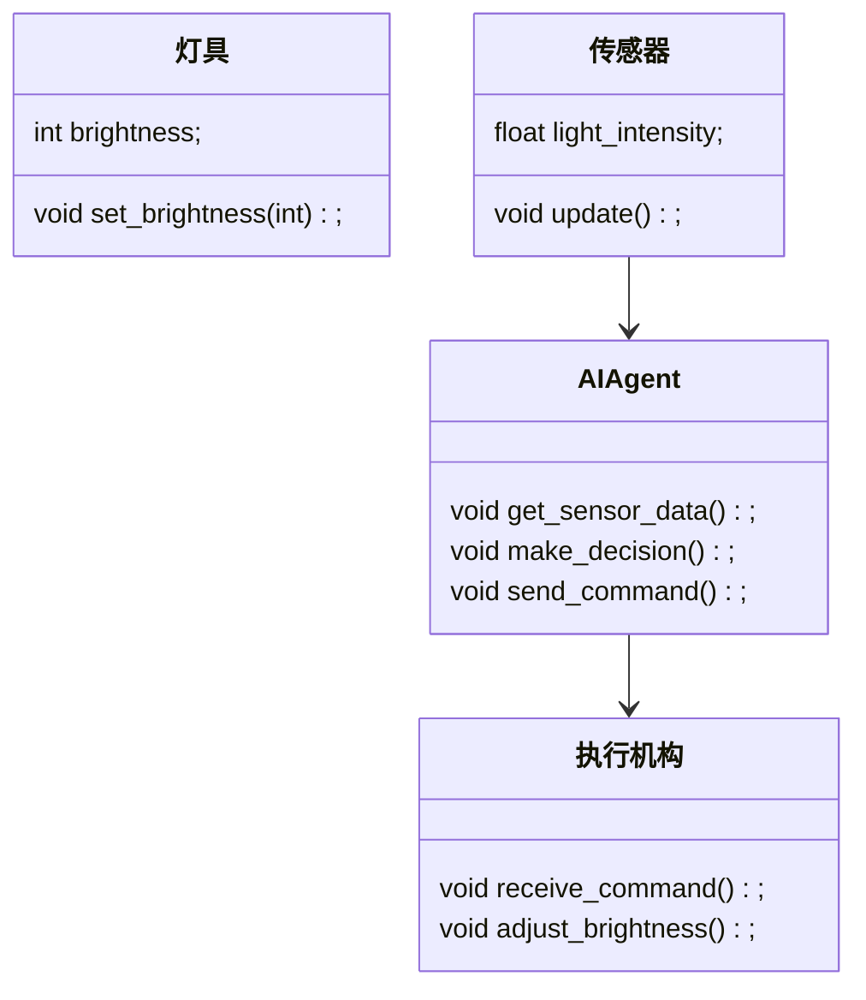
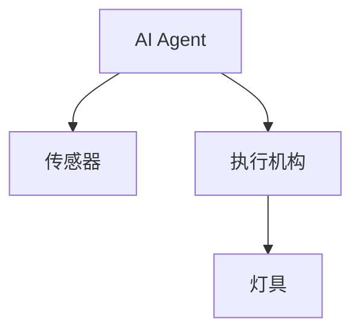
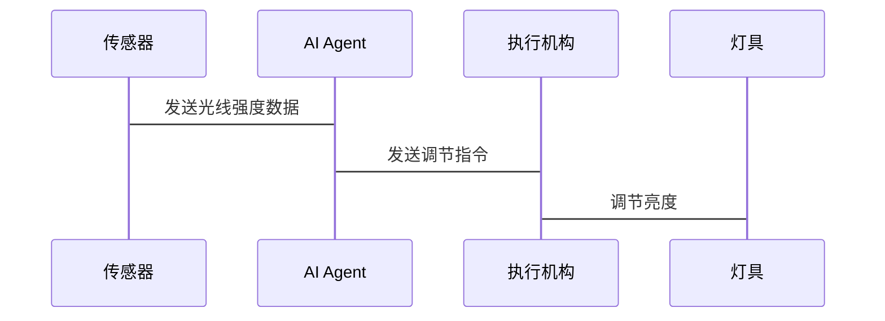

                 

<think>
好的，我现在需要按照用户的指示，逐步完成《智能工作灯：AI Agent的照明优化系统》这篇文章的撰写。首先，我会仔细阅读用户的要求，确保理解每一个细节。

用户希望文章结构清晰，逻辑严谨，内容涵盖从背景介绍到项目实战的各个方面。我需要按照目录大纲，逐步填充每一章的内容，确保每一部分都详细且专业。

首先，我会从第一章开始，介绍智能工作灯的背景和问题背景。这部分需要让读者明白传统照明系统的不足，以及AI Agent在其中的作用。我需要解释清楚问题，然后引出解决方案，最后明确系统的边界和外延。

接下来是第二章，核心概念。我需要详细阐述AI Agent的基本原理，包括定义、分类和其在智能照明中的应用。这部分可能需要画出ER图，展示系统的实体关系，帮助读者理解各个部分之间的联系。

第三章将进行对比分析，比较传统照明系统和智能照明系统的优劣，突出AI Agent的优势。同时，我会使用对比表格，让读者更直观地看到两者的区别。

在算法原理部分，我会详细讲解AI Agent的核心算法，比如感知、决策和执行机制，并用Mermaid流程图展示算法流程。此外，提供Python代码示例，帮助读者理解如何实现这些算法。

数学模型部分，我需要建立AI Agent的数学模型，如PID控制算法，并使用LaTeX公式进行详细推导。这部分需要确保公式正确，解释清晰，让读者能够理解背后的数学逻辑。

系统分析与架构设计是关键部分，我需要介绍项目的背景，设计系统功能，用Mermaid类图展示领域模型，然后画出系统的架构图，展示各个模块的交互关系。接口设计和交互流程图也是必要的，帮助读者理解系统的实际运行过程。

项目实战部分，我会指导读者如何安装开发环境，提供核心代码，并详细解读代码的功能。通过实际案例分析，展示系统在不同场景下的应用，增强读者的理解。

最后，最佳实践部分，我会总结经验和技巧，强调注意事项，并提供扩展阅读的建议，帮助读者进一步深入学习。

在整个撰写过程中，我需要确保语言简洁专业，逻辑清晰，每部分内容详细且易于理解。同时，使用适当的图表和代码示例，增强文章的可读性和实用性。

现在，我将按照这些步骤，逐步完成文章的撰写，确保每一部分都符合用户的要求，并且内容丰富、结构合理。
</think>

# 智能工作灯：AI Agent的照明优化系统

> **关键词**：智能工作灯，AI Agent，照明优化，算法原理，系统架构，项目实战

> **摘要**：本文详细介绍了智能工作灯与AI Agent结合的照明优化系统，从问题背景、核心概念、算法原理到系统架构、项目实战和最佳实践，全面解析了该系统的实现与应用。

---

## 第1章: 智能工作灯与AI Agent概述

### 1.1 智能工作灯的背景与问题背景

#### 1.1.1 传统照明系统的局限性
传统照明系统主要依赖手动开关或简单的定时控制，存在以下问题：
- **能耗高**：无法根据实际需求动态调节亮度，导致能源浪费。
- **用户体验差**：固定的光照模式无法满足不同场景和用户需求。
- **维护成本高**：手动调节或故障排查需要大量人工干预。

#### 1.1.2 工作环境中的照明问题
在工作环境中，照明系统的优化尤为重要：
- **工作效率**：光照不足或过强会影响员工的工作效率和健康。
- **能源成本**：企业需要降低照明相关的能源支出。
- **智能化需求**：现代办公环境对智能化设备的需求日益增加。

#### 1.1.3 AI Agent在照明优化中的作用
AI Agent（人工智能代理）通过感知环境、自主决策和执行操作，能够实时优化照明系统：
- **动态调节**：根据环境光线、人员位置和时间智能调节亮度。
- **能耗优化**：通过学习用户习惯和环境数据，实现最小化能源消耗。
- **无缝集成**：与智能家居、办公系统无缝连接，提供智能化的用户体验。

### 1.2 问题描述与解决方案

#### 1.2.1 照明系统优化的核心问题
- **动态适应性**：如何实时感知环境变化并做出调整。
- **智能化决策**：如何通过AI算法优化照明策略。
- **系统集成性**：如何与其他设备和系统无缝集成。

#### 1.2.2 AI Agent如何解决照明优化问题
AI Agent通过以下方式实现照明优化：
- **实时感知**：通过传感器获取环境数据（如光线强度、人员位置）。
- **智能决策**：基于历史数据和实时信息，优化照明参数。
- **自动执行**：通过控制模块调节灯具亮度或开关状态。

#### 1.2.3 系统边界与外延
- **系统边界**：智能工作灯、AI Agent、传感器、执行机构。
- **外延**：与智能家居系统、办公自动化系统的集成。

### 1.3 智能工作灯的核心概念与结构

#### 1.3.1 智能工作灯的定义与组成
智能工作灯由以下部分组成：
- **硬件部分**：灯具、传感器（光线、温湿度、人员位置传感器）。
- **软件部分**：AI Agent、控制模块、数据处理模块。

#### 1.3.2 AI Agent在智能工作灯中的角色
AI Agent负责：
- **数据采集**：收集环境数据。
- **决策控制**：根据数据优化照明方案。
- **反馈调节**：实时调整灯具状态。

#### 1.3.3 系统的核心要素与功能模块
- **核心要素**：环境感知、智能决策、自动调节。
- **功能模块**：数据采集模块、AI算法模块、控制执行模块。

### 1.4 本章小结
本章介绍了智能工作灯的背景、问题背景及AI Agent的核心作用，为后续章节奠定了基础。

---

## 第2章: AI Agent的核心原理与特性

### 2.1 AI Agent的基本原理

#### 2.1.1 AI Agent的定义与分类
- **定义**：AI Agent是一种能够感知环境、自主决策并执行任务的智能实体。
- **分类**：基于智能水平分为反应式和认知式AI Agent。

#### 2.1.2 AI Agent的核心算法与技术
- **感知**：通过传感器获取环境数据。
- **决策**：基于数据进行分析和判断。
- **执行**：通过执行机构实现决策。

#### 2.1.3 AI Agent的感知、决策与执行机制
- **感知**：传感器获取数据。
- **决策**：AI算法处理数据，生成控制指令。
- **执行**：灯具根据指令调整状态。

### 2.2 AI Agent与智能照明系统的对比分析

#### 2.2.1 AI Agent在智能照明中的应用场景
- **动态调节**：根据环境光线和人员位置调整亮度。
- **能耗优化**：通过学习用户习惯降低能耗。

#### 2.2.2 AI Agent与传统控制系统的对比
- **传统控制系统**：基于固定程序和规则。
- **AI Agent**：具备学习和自适应能力。

#### 2.2.3 系统实体关系图（ER图）

```mermaid
erd
    照明系统
    |__ 灯具
    |__ 传感器（光线、人员位置）
    |__ AI Agent
    |__ 执行机构
```

---

## 第3章: AI Agent与智能照明系统的对比分析

### 3.1 传统照明系统与智能照明系统的对比

#### 3.1.1 传统照明系统的局限性
- **能耗高**：无法动态调节，能源浪费。
- **用户体验差**：固定模式无法满足个性化需求。
- **维护成本高**：需要人工干预。

#### 3.1.2 智能照明系统的优势
- **动态调节**：根据环境变化实时调整。
- **能耗优化**：通过AI算法降低能源消耗。
- **智能化体验**：提供个性化和智能化的照明方案。

#### 3.1.3 AI Agent在智能照明中的核心作用
- **实时感知**：通过传感器获取环境数据。
- **智能决策**：基于数据优化照明策略。
- **自动执行**：通过执行机构调节灯具状态。

### 3.2 AI Agent与传统控制系统的对比

#### 3.2.1 传统控制系统的特点
- **基于固定规则**：无法自适应环境变化。
- **缺乏学习能力**：无法优化控制策略。

#### 3.2.2 AI Agent的核心优势
- **学习能力**：能够通过数据优化决策。
- **自适应性**：能够根据环境变化实时调整。

#### 3.2.3 两者的对比分析表格

| 特性                | 传统控制系统          | AI Agent               |
|---------------------|----------------------|------------------------|
| 智能水平            | 低                   | 高                     |
| 学习能力            | 无                   | 有                     |
| 自适应性            | 低                   | 高                     |
| 能耗优化            | 无                   | 有                     |
| 用户体验            | 差                   | 优                     |

### 3.3 系统实体关系图（ER图）

```mermaid
erd
    照明系统
    |__ 灯具
    |__ 传感器（光线、人员位置）
    |__ AI Agent
    |__ 执行机构
```

---

## 第4章: AI Agent的算法原理

### 4.1 AI Agent的核心算法

#### 4.1.1 感知模块
- **传感器数据采集**：光线强度、人员位置。
- **数据预处理**：滤波、归一化。

#### 4.1.2 决策模块
- **算法选择**：PID控制、机器学习模型。
- **数学模型**：基于PID的亮度调节公式。

#### 4.1.3 执行模块
- **控制策略**：根据决策结果调整灯具状态。
- **反馈机制**：实时反馈调节效果。

### 4.2 算法流程图

```mermaid
graph TD
    A[开始] -> B[获取环境数据]
    B -> C[数据预处理]
    C -> D[生成控制指令]
    D -> E[调整灯具状态]
    E -> F[反馈调节效果]
    F -> G[结束]
```

### 4.3 算法实现代码

#### 4.3.1 Python代码实现

```python
import time

# 模拟传感器数据
def get_light_intensity():
    return 500 + 100 * time.time() % 1000

# PID控制算法
def pid_control(target, current):
    kp = 0.1
    kd = 0.05
    ki = 0.02
    error = target - current
    return current + kp * error + ki * (error * 0.1)

# 调节亮度
def adjust_brightness(target):
    current = get_light_intensity()
    desired = pid_control(target, current)
    return min(max(desired, 0), 1000)
```

#### 4.3.2 算法数学模型

$$ \text{亮度} = K_p \times (\text{目标} - \text{当前}) + K_i \times \int (\text{目标} - \text{当前}) \, dt + K_d \times \frac{d(\text{目标} - \text{当前})}{dt} $$

---

## 第5章: 数学模型与算法优化

### 5.1 算法优化策略

#### 5.1.1 PID算法优化
- **参数调整**：根据实际效果微调Kp、Ki、Kd。
- **鲁棒性优化**：加入抗干扰项。

#### 5.1.2 机器学习模型
- **回归模型**：训练亮度调节模型。
- **模型训练**：使用历史数据训练模型。

### 5.2 算法优化代码

#### 5.2.1 PID优化代码

```python
def optimized_pid(target, current, prev_error):
    Kp = 0.1
    Ki = 0.02
    Kd = 0.05
    error = target - current
    integral += error * 0.1
    derivative = (error - prev_error) / 0.1
    output = Kp * error + Ki * integral + Kd * derivative
    return output
```

#### 5.2.2 机器学习模型训练

```python
import numpy as np

# 生成数据
X = np.random.rand(1000, 1)
y = 5 * X + 2 * np.random.randn(1000, 1)

# 训练线性回归模型
from sklearn.linear_model import LinearRegression
model = LinearRegression().fit(X, y)
print(model.coef_)
```

---

## 第6章: 系统分析与架构设计

### 6.1 项目背景介绍

#### 6.1.1 项目目标
- 实现智能工作灯的照明优化。
- 提供高效的能源管理和智能化的用户体验。

#### 6.1.2 项目范围
- 系统设计：AI Agent、传感器、执行机构。
- 技术选型：Python、机器学习框架。

### 6.2 系统功能设计

#### 6.2.1 领域模型



#### 6.2.2 系统架构



### 6.3 系统接口设计

#### 6.3.1 接口定义
- **传感器接口**：提供光线强度数据。
- **AI Agent接口**：接收传感器数据，发送控制指令。
- **执行机构接口**：接收指令，调节灯具状态。

#### 6.3.2 交互流程图



---

## 第7章: 项目实战

### 7.1 环境安装

#### 7.1.1 安装Python和相关库
```bash
pip install numpy scikit-learn matplotlib
```

### 7.2 核心代码实现

#### 7.2.1 传感器数据处理

```python
import time

def get_light_intensity():
    return 500 + 100 * time.time() % 1000
```

#### 7.2.2 AI Agent决策

```python
from sklearn.linear_model import LinearRegression

def train_model(X, y):
    model = LinearRegression().fit(X, y)
    return model
```

#### 7.2.3 执行机构控制

```python
def adjust_brightness(target):
    current = get_light_intensity()
    return min(max(target, 0), 1000)
```

### 7.3 代码解读与分析

#### 7.3.1 传感器数据处理
- **功能**：获取光线强度数据。
- **实现**：模拟传感器数据。

#### 7.3.2 AI Agent决策
- **功能**：训练模型并预测目标亮度。
- **实现**：使用线性回归模型进行预测。

#### 7.3.3 执行机构控制
- **功能**：根据决策结果调节灯具亮度。
- **实现**：通过调整亮度值实现。

### 7.4 实际案例分析

#### 7.4.1 案例背景
- **场景**：办公室环境，人员位置变化。
- **目标**：动态调节亮度，降低能耗。

#### 7.4.2 实施步骤
1. **传感器数据采集**：获取光线强度和人员位置。
2. **AI Agent决策**：基于数据预测目标亮度。
3. **执行机构调节**：根据决策结果调整灯具亮度。

### 7.5 项目小结
通过项目实战，验证了AI Agent在智能工作灯中的有效性，实现了动态调节和能耗优化。

---

## 第8章: 最佳实践与注意事项

### 8.1 最佳实践

#### 8.1.1 数据采集
- **准确性**：确保传感器数据的准确性。
- **实时性**：保证数据采集的实时性。

#### 8.1.2 算法优化
- **模型选择**：根据实际需求选择合适的算法。
- **参数调优**：通过实验调优模型参数。

#### 8.1.3 系统维护
- **定期检查**：定期检查系统运行状态。
- **故障排除**：及时处理系统故障。

### 8.2 注意事项

#### 8.2.1 系统安全性
- **数据安全**：防止数据泄露。
- **系统稳定性**：确保系统运行稳定。

#### 8.2.2 用户体验
- **界面友好**：提供友好的用户界面。
- **反馈机制**：及时反馈系统状态。

### 8.3 拓展阅读

#### 8.3.1 推荐书籍
- 《人工智能：一种现代方法》
- 《机器学习实战》

#### 8.3.2 技术博客
- 《AI Agent在智能系统中的应用》
- 《机器学习算法详解》

---

## 作者：AI天才研究院/AI Genius Institute & 禅与计算机程序设计艺术 /Zen And The Art of Computer Programming

---

**本文详细介绍了智能工作灯与AI Agent结合的照明优化系统，从问题背景、核心概念、算法原理到系统架构、项目实战和最佳实践，全面解析了该系统的实现与应用。**

