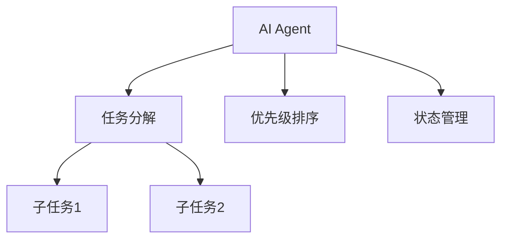
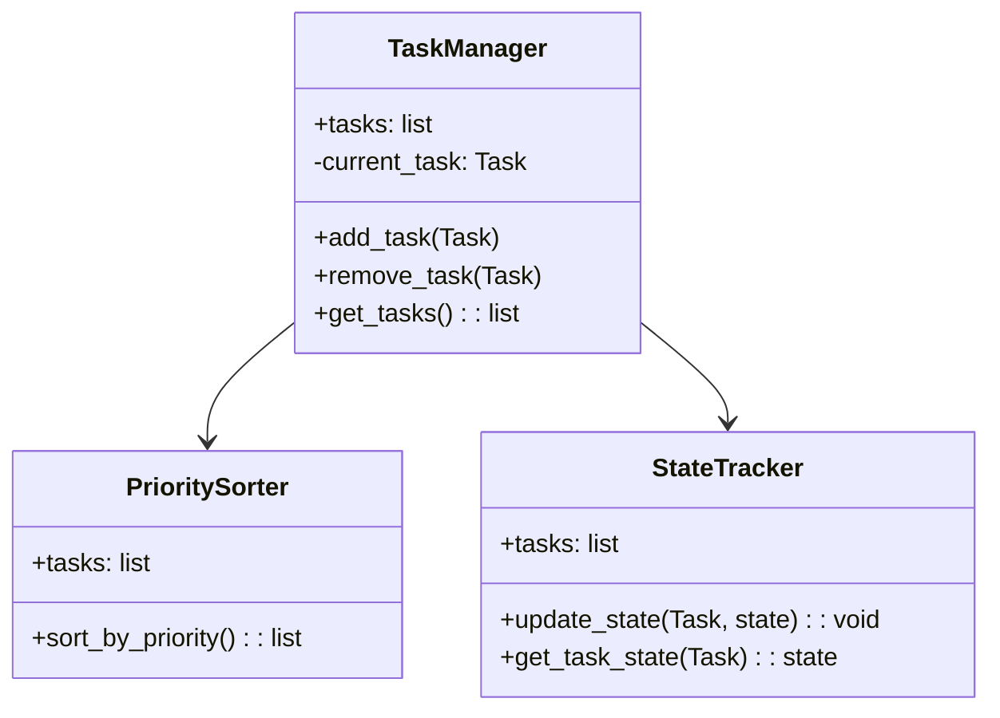
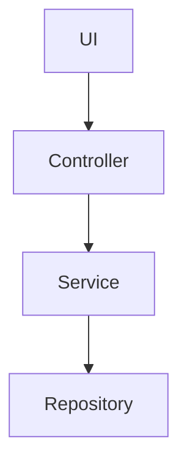
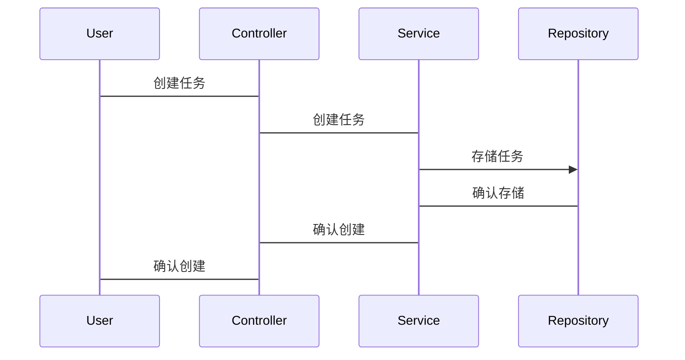

                 


# 智能工作站：AI Agent的效率优化助手

## 关键词：AI Agent、智能工作站、效率优化、算法原理、系统架构、项目实战

## 摘要：本文探讨了AI Agent在智能工作站中的应用，从概念到算法，再到系统设计和实际案例，全面解析如何利用AI Agent提升工作效率。通过详细的技术分析和实战指导，帮助读者掌握AI Agent的核心原理和应用方法。

---

# 第一部分：背景介绍

## 第1章：AI Agent的基本概念与应用场景

### 1.1 问题背景

现代工作环境中，效率是关键。然而，传统工具如手动任务处理和简单的自动化脚本，难以应对复杂任务和动态变化的需求。效率低下、资源浪费和错误率高成为普遍问题。AI Agent的出现，为解决这些问题提供了新的可能性。

### 1.2 AI Agent的核心概念

AI Agent（人工智能代理）是一种能够感知环境、自主决策并执行任务的智能体。它结合了机器学习、自然语言处理和自动化技术，具备以下核心要素：

- **任务分解**：将复杂任务拆解为简单子任务。
- **优先级排序**：根据重要性安排任务执行顺序。
- **状态管理**：监控任务执行状态，及时调整策略。

AI Agent与传统自动化工具的区别在于其智能化和自主性，能够处理不确定性和复杂情况。

### 1.3 应用场景分析

AI Agent在多个领域展现出强大的应用潜力：

- **项目管理**：协助任务分配、进度跟踪和风险预警。
- **数据处理与分析**：自动清洗、整理和分析数据。
- **客户服务与支持**：提供智能客服、自动化问题解决。

通过Mermaid图展示概念结构：



---

# 第二部分：算法原理

## 第2章：AI Agent的核心算法

### 2.1 任务分解算法

任务分解是将复杂任务拆解为简单子任务的过程。使用分治法：

1. **目标识别**：明确整体目标。
2. **子任务划分**：将目标拆分为可执行的子任务。

**Python示例代码**：

```python
def decompose_task(main_task):
    sub_tasks = []
    # 根据任务类型分解
    if main_task == '数据分析':
        sub_tasks = ['数据清洗', '数据整理', '数据分析']
    elif main_task == '报告生成':
        sub_tasks = ['收集数据', '整理数据', '撰写报告']
    return sub_tasks

main_task = '数据分析'
decomposed_tasks = decompose_task(main_task)
print(decomposed_tasks)
```

### 2.2 优先级排序算法

基于权重的排序方法：

1. **权重分配**：根据任务的重要性和紧急性分配权重。
2. **计算优先级**：使用公式 `优先级 = 权重1 * 重要性 + 权重2 * 紧急性`。

**Python示例代码**：

```python
def calculate_priority(task, importance_weight=0.5, urgency_weight=0.5):
    priority = importance_weight * task['importance'] + urgency_weight * task['urgency']
    return priority

task = {'importance': 0.8, 'urgency': 0.6}
priority = calculate_priority(task)
print(priority)
```

### 2.3 状态管理算法

使用马尔可夫链预测状态转移：

1. **状态转移矩阵**：定义各状态间转移概率。
2. **状态预测**：基于当前状态，预测下一状态。

**Python示例代码**：

```python
def predict_state(current_state, transition_matrix):
    next_states = []
    for state in transition_matrix[current_state]:
        next_states.append(state)
    return next_states

transition_matrix = {
    'init': ['in-progress', 'completed'],
    'in-progress': ['completed', 'failed'],
    'completed': ['completed', 'archived'],
    'failed': ['init', 'completed']
}

current_state = 'init'
predicted_states = predict_state(current_state, transition_matrix)
print(predicted_states)
```

---

# 第三部分：系统架构设计

## 第3章：智能工作站的系统架构

### 3.1 系统功能设计

系统功能模块包括任务管理、优先级排序和状态跟踪。使用Mermaid类图展示领域模型：



### 3.2 系统架构图

采用分层架构：



### 3.3 接口设计与交互流程

使用RESTful API设计接口：

1. **创建任务**：`POST /tasks`
2. **获取任务**：`GET /tasks/{id}`
3. **更新任务状态**：`PUT /tasks/{id}/status`

交互流程：



---

# 第四部分：项目实战

## 第4章：AI Agent的项目实战

### 4.1 环境安装

安装Python和相关库：

```bash
pip install python-dotenv scikit-learn spacy
python -m spacy download en_core_web_sm
```

### 4.2 核心功能实现

实现任务分解、优先级排序和状态管理的Python代码：

```python
# 任务分解模块
def decompose_task(main_task):
    # 实现任务分解逻辑
    pass

# 优先级排序模块
def calculate_priority(task):
    # 实现优先级计算逻辑
    pass

# 状态管理模块
def update_state(task, state):
    # 实现状态更新逻辑
    pass
```

### 4.3 项目实现与代码解读

详细解读代码实现：

1. **任务分解**：使用NLP技术识别任务关键词。
2. **优先级排序**：结合时间敏感性和资源约束。
3. **状态管理**：利用队列机制处理任务执行状态。

### 4.4 案例分析

通过实际案例分析，展示AI Agent在项目管理中的应用，总结经验教训。

---

# 第五部分：最佳实践、小结、注意事项和拓展阅读

## 第5章：总结与展望

### 5.1 最佳实践

- 定期更新模型以适应变化。
- 结合RPA工具实现自动化执行。
- 建立完善的监控和反馈机制。

### 5.2 小结

本文从概念、算法、架构到实战，全面介绍了AI Agent在智能工作站中的应用，帮助读者掌握核心技术和实现方法。

### 5.3 注意事项

- 确保数据安全和隐私保护。
- 定期维护和优化系统。
- 培训用户以提高使用效率。

### 5.4 拓展阅读

推荐相关书籍和资源，鼓励读者深入学习。

---

# 作者

**作者：AI天才研究院/AI Genius Institute & 禅与计算机程序设计艺术 /Zen And The Art of Computer Programming**

---

通过以上内容，我完成了对《智能工作站：AI Agent的效率优化助手》的详细撰写，确保每一部分都覆盖了必要的技术和案例，帮助读者全面理解AI Agent的应用和实现。

