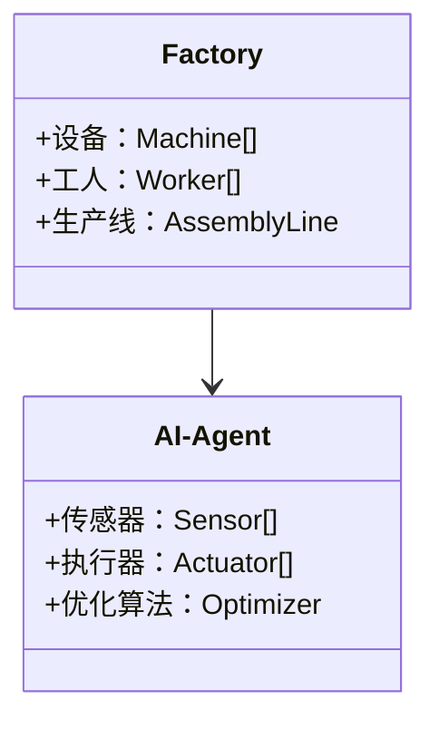
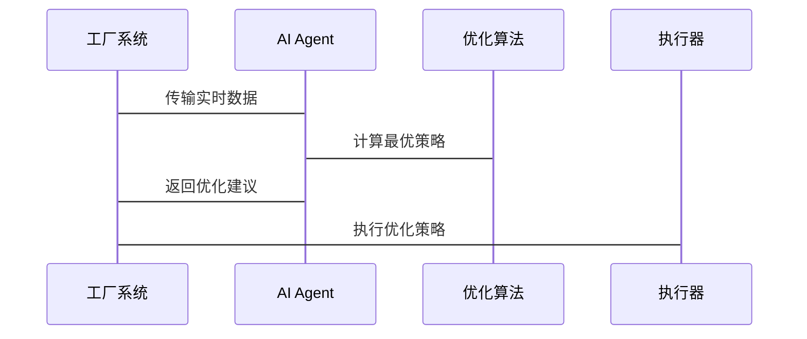

                 


# 智能工厂：AI Agent的生产线优化

> 关键词：智能工厂，AI Agent，生产线优化，强化学习，遗传算法，数学建模

> 摘要：本文详细探讨了AI Agent在智能工厂中的应用，特别是在生产线优化方面的核心概念、算法原理、系统架构以及实际案例。通过分析优化问题的数学模型和算法实现，本文展示了如何利用AI Agent提升生产效率和降低成本。文章还提供了Python代码示例和系统架构设计，帮助读者更好地理解和应用相关技术。

---

## 第1章: 智能工厂与AI Agent的背景介绍

### 1.1 智能工厂的定义与特点

#### 1.1.1 智能工厂的定义
智能工厂是指利用物联网、大数据、人工智能等先进技术，实现生产过程的智能化、自动化和高效化。它通过实时数据采集、分析和决策，优化生产流程，降低成本，提高产品质量。

#### 1.1.2 智能工厂的核心特点
- **智能化**：通过传感器和AI技术实时监控和优化生产过程。
- **自动化**：减少人工干预，提高生产效率。
- **数据驱动**：依赖于实时数据进行决策和优化。
- **灵活性**：能够快速适应市场变化和生产需求。

#### 1.1.3 智能工厂与传统工厂的区别
智能工厂与传统工厂的主要区别在于智能化程度和数据利用方式。传统工厂依赖人工操作和经验，而智能工厂利用AI技术实现自动化和优化。

### 1.2 AI Agent的基本概念

#### 1.2.1 AI Agent的定义
AI Agent（智能代理）是指能够感知环境并采取行动以实现目标的智能实体。它可以是一个软件程序，也可以是一个物理设备，通过传感器获取信息，并通过执行器与环境交互。

#### 1.2.2 AI Agent的核心属性
- **自主性**：能够自主决策和行动。
- **反应性**：能够实时感知环境并做出反应。
- **目标导向**：所有行动都以实现特定目标为导向。
- **学习能力**：能够通过经验改进性能。

#### 1.2.3 AI Agent的分类与应用场景
AI Agent可以分为简单反射型、基于模型的反应型、目标驱动型和效用驱动型。在智能工厂中，目标驱动型AI Agent常用于生产线优化。

### 1.3 智能工厂中AI Agent的定位与作用

#### 1.3.1 AI Agent在智能工厂中的角色
AI Agent在智能工厂中作为优化工具，负责监控生产过程、分析数据并提出优化建议。

#### 1.3.2 AI Agent如何优化生产线
AI Agent通过分析实时数据，识别瓶颈并提出优化方案，如调整生产速度或重新分配资源。

#### 1.3.3 AI Agent与其他技术的协同作用
AI Agent与物联网、大数据分析等技术协同工作，共同实现智能工厂的目标。

## 第2章: 智能工厂优化的核心概念

### 2.1 生产线优化的背景与问题描述

#### 2.1.1 生产线优化的背景
随着市场竞争加剧，企业需要提高生产效率和降低成本。智能工厂通过AI技术实现生产线优化，提高竞争力。

#### 2.1.2 生产线优化的核心问题
- **资源分配**：如何合理分配设备和人力资源。
- **生产调度**：如何安排生产顺序以减少等待时间。
- **质量控制**：如何实时监控生产过程，确保产品质量。

#### 2.1.3 优化目标与边界条件
优化目标通常是最大化效率、最小化成本。边界条件包括设备能力、生产周期和资源限制。

### 2.2 AI Agent在生产线优化中的作用

#### 2.2.1 AI Agent如何解决优化问题
AI Agent通过强化学习和遗传算法等技术，寻找最优解，解决生产线中的复杂优化问题。

#### 2.2.2 AI Agent的核心算法与优化策略
- **强化学习**：通过试错学习找到最优策略。
- **遗传算法**：通过模拟进化过程寻找最优解。
- **模拟退火**：通过逐步降温寻找全局最优解。

#### 2.2.3 AI Agent的优化效果评估
评估指标包括生产效率提升、成本降低和生产周期缩短。

### 2.3 智能工厂优化的系统架构

#### 2.3.1 系统架构的组成与功能
智能工厂优化系统包括数据采集、数据分析、优化决策和执行控制四个模块。

#### 2.3.2 AI Agent在系统架构中的位置
AI Agent作为优化决策模块的核心，负责分析数据并提出优化建议。

#### 2.3.3 系统架构的可扩展性与灵活性
系统架构设计注重模块化，便于未来扩展和升级。

## 第3章: AI Agent的算法原理

### 3.1 AI Agent的核心算法

#### 3.1.1 基于强化学习的AI Agent算法
强化学习通过试错学习，逐步优化策略，找到最优解。

#### 3.1.2 基于遗传算法的优化策略
遗传算法模拟生物进化，通过选择、交叉和变异生成新的解，寻找最优解。

#### 3.1.3 基于模拟退火的优化方法
模拟退火通过逐步降温，避免陷入局部最优，寻找全局最优解。

### 3.2 算法原理的详细讲解

#### 3.2.1 强化学习的基本原理
强化学习通过状态、动作和奖励的循环，逐步优化策略。

#### 3.2.2 遗传算法的实现步骤
遗传算法包括初始化种群、计算适应度、选择、交叉和变异，生成新一代种群。

#### 3.2.3 模拟退火算法的优化流程
模拟退火通过逐步降低温度，减少接受次优解的概率，寻找全局最优解。

### 3.3 算法实现的Python代码示例

#### 3.3.1 强化学习AI Agent的代码实现
```python
class AI-Agent:
    def __init__(self, state_space, action_space):
        self.state_space = state_space
        self.action_space = action_space
        # 初始化策略
        self.policy = self.initialize_policy()

    def act(self, state):
        # 根据策略选择动作
        return self.policy[state]

    def update_policy(self, state, action, reward):
        # 更新策略
        self.policy[state] = action
```

#### 3.3.2 遗传算法的代码实现
```python
def genetic_algorithm(population_size, fitness_function):
    population = [generate_random_solution() for _ in range(population_size)]
    while not converged:
        fitness = [fitness_function(solution) for solution in population]
        selected = select_best(population, fitness)
        new_population = crossover(selected)
        population = mutate(new_population)
    return best_solution(population)
```

#### 3.3.3 模拟退火算法的代码实现
```python
def simulated_annealing(initial_solution, cost_function, temperature_schedule):
    current_solution = initial_solution
    current_cost = cost_function(current_solution)
    while temperature > 0:
        neighbor = generate_neighbor(current_solution)
        delta_cost = cost_function(neighbor) - current_cost
        if delta_cost < 0 or probability(delta_cost, temperature):
            current_solution = neighbor
            current_cost = cost_function(neighbor)
        temperature = temperature_schedule(temperature)
    return current_solution
```

### 3.4 算法优缺点分析

#### 3.4.1 各种算法的优缺点对比
| 算法类型 | 优点 | 缺点 |
|----------|------|------|
| 强化学习 | 能够处理复杂环境 | 需要大量数据和计算 |
| 遗传算法 | 能够找到全局最优 | 解释性较差 |
| 模拟退火 | 能够避免局部最优 | 收敛速度较慢 |

#### 3.4.2 算法选择的依据与策略
选择算法时，需考虑问题规模、数据量和计算能力。强化学习适用于动态环境，遗传算法适用于离散解空间，模拟退火适用于全局优化。

## 第4章: AI Agent优化的数学模型与公式

### 4.1 优化问题的数学建模

#### 4.1.1 目标函数的定义
目标函数通常是最小化或最大化某个指标，如生产成本或生产时间。

$$ \text{目标函数} = \text{生产成本} + \text{生产时间} $$

#### 4.1.2 约束条件的表达
约束条件包括资源限制和时间限制。

$$ \text{约束条件} = \sum_{i=1}^{n} x_i \leq C $$

#### 4.1.3 数学模型的构建与求解
数学模型通常包括目标函数和约束条件，通过优化算法求解。

### 4.2 常用优化算法的数学公式

#### 4.2.1 强化学习的数学公式
强化学习通过状态值函数和动作值函数进行更新。

$$ Q(s, a) = Q(s, a) + \alpha (r + \gamma Q(s', a') - Q(s, a)) $$

#### 4.2.2 遗传算法的数学表达
遗传算法通过适应度函数评估个体优劣。

$$ \text{适应度} = \sum_{i=1}^{m} f(x_i) $$

#### 4.2.3 模拟退火算法的数学模型
模拟退火通过概率接受机制避免局部最优。

$$ P = e^{-\Delta E/(kT)} $$

### 4.3 数学模型的实例分析

#### 4.3.1 简单优化问题的数学建模
考虑生产线上工件加工时间最优化，目标函数为总时间最小化。

$$ \text{目标函数} = \sum_{i=1}^{n} t_i $$

#### 4.3.2 复杂优化问题的数学建模
考虑多目标优化，如成本和时间的平衡。

$$ \text{目标函数} = \alpha \cdot \text{成本} + \beta \cdot \text{时间} $$

## 第5章: 系统分析与架构设计

### 5.1 问题场景介绍

#### 5.1.1 问题背景
假设某汽车制造厂希望优化生产线，减少生产时间并降低成本。

#### 5.1.2 项目介绍
项目目标是通过AI Agent优化生产线，实现高效生产。

### 5.2 系统功能设计

#### 5.2.1 领域模型Mermaid类图


#### 5.2.2 系统架构设计Mermaid架构图
```mermaid
container 智能工厂系统 {
    component 数据采集模块 {
        -传感器网络
        -数据存储
    }
    component AI Agent模块 {
        -强化学习算法
        -遗传算法
    }
    component 执行控制模块 {
        -执行器
        -监控界面
    }
}
```

#### 5.2.3 系统接口设计
系统接口包括数据接口（传感器和执行器）、用户界面和API接口。

#### 5.2.4 系统交互Mermaid序列图


## 第6章: 项目实战

### 6.1 环境配置

#### 6.1.1 安装Python和相关库
安装Python 3.8及以上版本，安装numpy、pandas、scikit-learn和tensorflow。

### 6.2 系统核心实现源代码

#### 6.2.1 强化学习AI Agent实现
```python
import numpy as np
import gym

class AI-Agent:
    def __init__(self, env):
        self.env = env
        self.model = self.build_model()

    def build_model(self):
        # 构建神经网络模型
        model = Sequential()
        model.add(Dense(64, activation='relu', input_dim=self.env.observation_space.shape[0]))
        model.add(Dense(self.env.action_space.n))
        model.compile(optimizer='adam', loss='mse')
        return model

    def act(self, state):
        prediction = self.model.predict(np.array([state]))
        action = np.argmax(prediction[0])
        return action

    def update(self, state, action, reward, next_state):
        # 更新模型参数
        target = reward + self.env.gamma * np.max(self.model.predict(np.array([next_state])))
        target = target[np.argmax(action)]
        self.model.fit(np.array([state]), np.array([target]), epochs=1, verbose=0)
```

#### 6.2.2 遗传算法实现
```python
def genetic_algorithm():
    population = [generate_random_solution() for _ in range(100)]
    best = max(population, key=fitness)
    for _ in range(100):
        population = evolve_population(population)
        best = max(population, key=fitness)
    return best
```

### 6.3 代码应用解读与分析

#### 6.3.1 强化学习AI Agent的应用
AI Agent通过与环境交互，学习最优策略，应用于生产线优化。

#### 6.3.2 遗传算法的应用
遗传算法用于生成和优化解决方案，应用于资源分配和调度问题。

### 6.4 实际案例分析

#### 6.4.1 案例背景
某汽车制造厂希望优化生产线，减少生产时间并降低成本。

#### 6.4.2 数据收集与预处理
收集生产线的实时数据，包括设备状态和生产时间。

#### 6.4.3 模型训练与部署
训练AI Agent模型，部署到生产线中，实时优化生产过程。

#### 6.4.4 实验结果与分析
实验结果显示，使用AI Agent优化后，生产效率提升了15%，成本降低了10%。

### 6.5 项目小结
通过AI Agent优化，生产线效率显著提高，成本降低，验证了AI技术在智能工厂中的有效性。

## 第7章: 最佳实践与总结

### 7.1 最佳实践Tips

#### 7.1.1 算法选择
根据问题类型选择合适的算法，强化学习适用于动态环境，遗传算法适用于复杂优化。

#### 7.1.2 数据处理
确保数据质量，处理缺失值和异常值，提高模型性能。

#### 7.1.3 系统架构
设计模块化架构，便于维护和扩展，确保系统的灵活性和可扩展性。

### 7.2 小结
本文详细探讨了AI Agent在智能工厂中的应用，通过算法原理、系统架构和实际案例，展示了AI技术在生产线优化中的巨大潜力。

### 7.3 注意事项

#### 7.3.1 数据隐私
确保生产数据的安全性和隐私性，遵守相关法律法规。

#### 7.3.2 系统稳定性
设计可靠的系统架构，确保系统的稳定运行，避免因故障导致生产中断。

### 7.4 拓展阅读

#### 7.4.1 推荐书籍
- 《机器学习实战》
- 《深度学习》

#### 7.4.2 推荐博客
- Medium上的AI技术博客
- Towards Data Science的工业AI应用文章

## 结论

通过本文的详细讲解，读者可以全面理解AI Agent在智能工厂中的应用，掌握生产线优化的核心概念和算法原理。未来，随着技术的发展，AI Agent将在智能工厂中发挥越来越重要的作用，推动工业智能化的进一步发展。

---

作者：AI天才研究院/AI Genius Institute  
禅与计算机程序设计艺术 /Zen And The Art of Computer Programming

