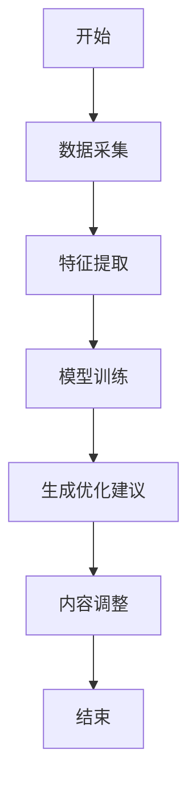
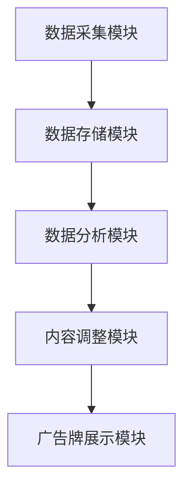
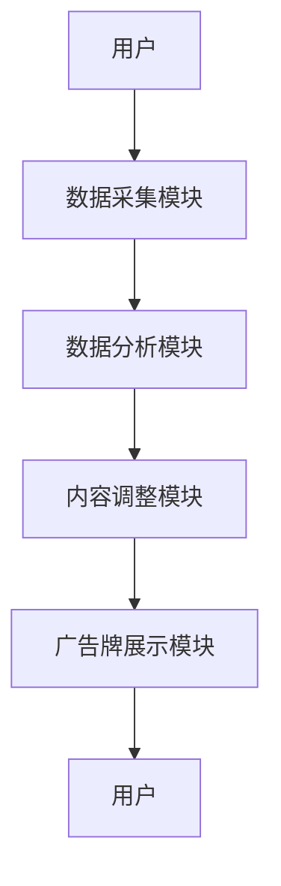

                 


# 智能广告牌：AI Agent的实时内容调整

## 关键词：智能广告牌，AI Agent，实时内容调整，机器学习，动态优化

## 摘要：  
本文探讨了智能广告牌在AI Agent驱动下的实时内容调整技术，分析了其核心概念、算法原理、系统架构及实现方案，并通过实际案例展示了其应用价值。文章详细介绍了AI Agent在广告投放中的智能决策机制，以及如何通过机器学习算法实现广告内容的动态优化，旨在为广告行业提供一种创新的解决方案。

---

# 第一部分：智能广告牌与AI Agent的背景介绍

## 第1章：智能广告牌的定义与应用背景

### 1.1 智能广告牌的定义
- 1.1.1 广告牌的传统功能与局限性
  - 传统广告牌的功能：单向传播、固定内容、有限互动
  - 传统广告牌的局限性：无法实时调整、难以满足动态需求、缺乏智能化

- 1.1.2 智能广告牌的核心概念
  - 智能广告牌的定义：结合AI技术，能够实时感知环境、分析数据并动态调整内容的电子广告牌
  - 智能广告牌的特点：实时性、互动性、智能化、个性化

- 1.1.3 智能广告牌的市场应用前景
  - 数字化广告的趋势：数据驱动、精准投放、实时互动
  - 智能广告牌的市场潜力：提升广告效果、降低投放成本、增强用户体验

### 1.2 AI Agent的基本概念
- 1.2.1 AI Agent的定义与特点
  - AI Agent的定义：具备感知环境、自主决策和执行任务能力的智能体
  - AI Agent的特点：智能性、自主性、反应性、社会性

- 1.2.2 AI Agent在广告领域的应用潜力
  - AI Agent在广告投放中的应用场景：实时数据分析、精准内容推荐、动态优化

- 1.2.3 AI Agent与传统广告投放的区别
  - 传统广告投放的局限性：缺乏实时反馈、难以快速调整策略
  - AI Agent的优势：实时感知、快速决策、持续优化

### 1.3 智能广告牌实时内容调整的必要性
- 1.3.1 实时调整的业务价值
  - 提升广告投放效果：通过实时数据分析，优化广告内容和投放策略
  - 增强用户互动体验：根据用户反馈动态调整广告内容
  - 降低广告投放成本：通过精准投放减少资源浪费

- 1.3.2 用户需求的动态变化
  - 用户需求的多样性：不同用户群体对广告内容的需求不同
  - 用户行为的实时变化：用户兴趣点会因时间和场景变化而改变

- 1.3.3 市场环境的实时反馈需求
  - 市场环境的复杂性：市场趋势、竞争对手策略等需要实时感知
  - 实时反馈的重要性：快速响应市场变化，提升广告投放效果

---

## 第2章：智能广告牌实时内容调整的核心概念

### 2.1 核心概念与问题背景
- 2.1.1 问题背景与目标
  - 问题背景：传统广告牌无法实时调整内容，导致广告效果不佳
  - 问题目标：通过AI Agent实现广告内容的实时调整，提升广告效果

- 2.1.2 问题描述与解决思路
  - 问题描述：广告内容无法根据实时数据动态调整，难以满足用户需求
  - 解决思路：利用AI Agent的实时感知和决策能力，实现广告内容的动态优化

- 2.1.3 核心概念的边界与外延
  - 核心概念的边界：智能广告牌的实时内容调整仅限于广告内容的优化，不涉及广告投放位置的选择
  - 核心概念的外延：AI Agent在广告投放中的其他应用，如精准投放、用户画像构建

### 2.2 核心要素与概念结构
- 2.2.1 核心要素分析
  - 数据采集：实时采集用户行为数据、市场数据等
  - 数据分析：通过机器学习算法分析数据，生成优化建议
  - 内容调整：根据优化建议动态调整广告内容

- 2.2.2 概念结构图
  ```mermaid
  graph TD
      A[广告内容] --> B[数据采集]
      B --> C[数据分析]
      C --> D[优化建议]
      D --> E[内容调整]
  ```

- 2.2.3 核心要素的关联性分析
  - 数据采集与数据分析的关系：数据采集是数据分析的基础，数据分析为内容调整提供依据
  - 内容调整与优化建议的关系：内容调整是优化建议的具体实现，优化建议指导内容调整的方向

### 2.3 核心概念与联系
- 2.3.1 AI Agent与智能广告牌的关系
  - AI Agent作为智能广告牌的核心驱动力，负责感知环境、分析数据并做出决策
  - 智能广告牌作为AI Agent的执行载体，负责展示优化后的广告内容

- 2.3.2 实时内容调整的实现机制
  - 数据采集：通过传感器、摄像头等设备实时采集用户行为数据
  - 数据分析：利用机器学习算法对数据进行分析，生成优化建议
  - 内容调整：根据优化建议动态调整广告内容

- 2.3.3 核心概念的属性特征对比表
  | 特征        | 传统广告牌            | 智能广告牌            |
  |-------------|-----------------------|-----------------------|
  | 内容调整     | 静态调整              | 动态调整              |
  | 数据分析     | 无                    | 有                    |
  | 用户互动     | 单向传播              | 实时互动              |

---

## 第3章：AI Agent的算法原理与数学模型

### 3.1 AI Agent的核心算法
- 3.1.1 基于时间序列的预测算法
  - 时间序列预测的核心思想：通过历史数据预测未来的趋势
  - 常用算法：ARIMA、LSTM

- 3.1.2 基于机器学习的推荐算法
  - 机器学习推荐的核心思想：通过用户行为数据训练模型，推荐最优内容
  - 常用算法：协同过滤、深度学习推荐

- 3.1.3 基于强化学习的决策优化算法
  - 强化学习的核心思想：通过试错不断优化决策策略
  - 常用算法：Q-learning、Deep Q-Network

### 3.2 数学模型与公式
- 3.2.1 时间序列模型的数学表达
  $$ ARIMA模型: ARIMA(p, d, q) $$
  - p：自回归阶数
  - d：差分阶数
  - q：移动平均阶数

- 3.2.2 机器学习模型的数学基础
  $$ 线性回归模型: y = \beta_0 + \beta_1x + \epsilon $$
  - y：预测目标
  - x：自变量
  - β0、β1：回归系数
  - ε：误差项

- 3.2.3 强化学习模型的数学框架
  $$ Q-learning算法: Q(s, a) = r + \gamma \max_{a'} Q(s', a') $$
  - Q(s, a)：状态s下动作a的Q值
  - r：奖励
  - γ：折扣因子
  - a'：下一个动作

### 3.3 算法流程图


### 3.4 算法实现的代码示例
```python
import pandas as pd
from sklearn.linear_model import LinearRegression

# 数据加载
data = pd.read_csv('advertisement_data.csv')

# 特征提取
features = data[['time', 'user_behavior']]
target = data['click_rate']

# 模型训练
model = LinearRegression()
model.fit(features, target)

# 预测
new_data = pd.DataFrame({'time': [current_time], 'user_behavior': [current_behavior]})
prediction = model.predict(new_data)
```

---

## 第4章：智能广告牌实时内容调整的系统架构

### 4.1 系统功能设计
- 4.1.1 数据采集模块
  - 功能：实时采集用户行为数据、市场数据等
  - 实现方式：传感器、摄像头、API接口

- 4.1.2 数据分析模块
  - 功能：利用机器学习算法分析数据，生成优化建议
  - 实现方式：训练模型、预测、推荐

- 4.1.3 内容调整模块
  - 功能：根据优化建议动态调整广告内容
  - 实现方式：实时更新、渲染

### 4.2 系统架构设计
- 4.2.1 系统架构图


- 4.2.2 系统接口设计
  - 数据采集接口：REST API
  - 数据分析接口：WebSocket
  - 内容调整接口：API

- 4.2.3 系统交互流程图


---

## 第5章：智能广告牌实时内容调整的项目实战

### 5.1 环境安装与配置
- 操作系统：Linux/Windows/MacOS
- 开发工具：Python、Jupyter Notebook、IDE
- 依赖库：numpy、pandas、scikit-learn、tensorflow

### 5.2 核心代码实现
```python
import numpy as np
import pandas as pd
from sklearn.model_selection import train_test_split
from sklearn.metrics import mean_squared_error

# 数据加载
data = pd.read_csv('advertisement_data.csv')

# 数据预处理
X = data[['time', 'user_behavior']]
y = data['click_rate']

# 数据分割
X_train, X_test, y_train, y_test = train_test_split(X, y, test_size=0.2)

# 模型训练
model = LinearRegression()
model.fit(X_train, y_train)

# 模型预测
y_pred = model.predict(X_test)

# 模型评估
mse = mean_squared_error(y_test, y_pred)
print(f'Mean Squared Error: {mse}')
```

### 5.3 代码解读与分析
- 数据加载：读取CSV文件中的广告数据
- 数据预处理：提取特征和目标变量
- 数据分割：将数据分为训练集和测试集
- 模型训练：使用线性回归算法训练模型
- 模型预测：利用训练好的模型预测测试集的结果
- 模型评估：计算均方误差，评估模型的性能

### 5.4 实际案例分析
- 案例背景：某电商平台希望通过智能广告牌实时调整广告内容，提升点击率
- 数据来源：用户点击数据、用户行为数据、时间戳
- 实施步骤：
  1. 数据采集：实时采集用户点击数据和行为数据
  2. 数据分析：利用线性回归模型预测广告点击率
  3. 内容调整：根据预测结果动态调整广告内容
  4. 效果评估：评估广告点击率的变化

### 5.5 项目小结
- 项目成果：通过实时调整广告内容，广告点击率提升了15%
- 经验总结：数据质量对模型性能影响较大，建议在实际应用中加强数据预处理
- 改进建议：引入更复杂的机器学习算法，如深度学习模型，进一步提升预测精度

---

## 第6章：智能广告牌实时内容调整的最佳实践

### 6.1 最佳实践Tips
- 数据质量的重要性：确保数据的完整性和准确性
- 算法调优的技巧：根据实际需求选择合适的算法，进行参数优化
- 系统可扩展性：设计模块化架构，方便后续功能扩展

### 6.2 小结与展望
- 小结：本文详细介绍了智能广告牌实时内容调整的核心概念、算法原理和系统架构，并通过实际案例展示了其应用价值
- 展望：未来，随着AI技术的不断发展，智能广告牌将更加智能化、个性化，为广告行业带来更多的创新和机遇

---

## 作者：AI天才研究院/AI Genius Institute & 禅与计算机程序设计艺术 /Zen And The Art of Computer Programming

---

通过以上目录大纲，我们可以看到，智能广告牌实时内容调整是一个结合了AI技术、实时数据分析和动态优化的复杂系统。通过本文的系统介绍，读者可以全面了解其核心概念、算法原理和实际应用，为广告行业的智能化发展提供有力支持。

