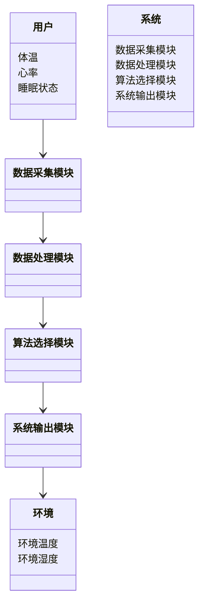
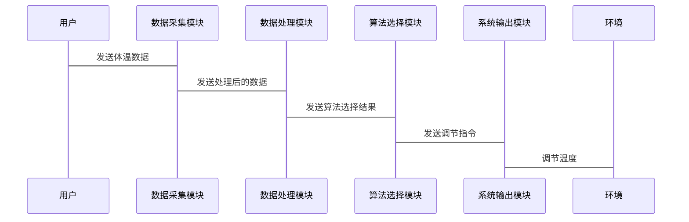

                 


# 智能床垫：AI Agent的体温调节系统

> 关键词：智能床垫，AI Agent，体温调节，物联网，智能健康，人工智能

> 摘要：本文详细探讨了智能床垫中AI Agent的体温调节系统，从背景介绍、核心概念、算法原理到系统架构设计，再到项目实战和总结展望，全面解析智能床垫AI Agent体温调节系统的实现原理和应用场景。

---

# 第一部分: 智能床垫与AI Agent的背景介绍

## 第1章: 智能床垫与AI Agent概述

### 1.1 智能床垫的概念与背景
#### 1.1.1 智能床垫的定义
智能床垫是一种结合物联网（IoT）和人工智能（AI）技术的智能家具，能够根据用户的生理需求和环境条件自动调节床垫的软硬度、温度、湿度等参数，为用户提供个性化的睡眠体验。

#### 1.1.2 智能床垫的发展历程
智能床垫的发展经历了以下几个阶段：
1. **传统床垫阶段**：仅提供基本的支撑和舒适性。
2. **智能床垫1.0阶段**：引入了简单的传感器，能够监测用户的体重分布和睡姿。
3. **智能床垫2.0阶段**：结合物联网技术，能够通过手机APP远程控制床垫的软硬度。
4. **智能床垫3.0阶段**：引入AI技术，能够根据用户的睡眠数据和环境条件，智能调节床垫的温度、湿度和软硬度。

#### 1.1.3 AI Agent在智能床垫中的应用
AI Agent（智能体）是一种能够感知环境、自主决策并执行任务的智能系统。在智能床垫中，AI Agent主要用于以下几个方面：
- **体温调节**：根据用户的体温变化和环境温度，智能调节床垫的温度。
- **睡眠监测**：通过传感器监测用户的睡眠状态和健康数据。
- **个性化推荐**：根据用户的睡眠数据，推荐最佳的床垫参数设置。

### 1.2 体温调节系统的背景与需求
#### 1.2.1 人体体温调节的基本原理
人体体温调节是一个复杂的生理过程，主要通过神经系统和内分泌系统实现。当外界环境温度变化时，人体通过调节产热和散热来维持体温的恒定。

#### 1.2.2 智能床垫在体温调节中的作用
智能床垫通过调节床垫的温度，帮助用户维持适宜的体温环境，从而提高睡眠质量。特别是在寒冷的冬季或炎热的夏季，智能床垫的体温调节功能能够显著提升用户的舒适度。

#### 1.2.3 用户需求与市场分析
随着人们对睡眠健康的关注不断增加，智能床垫市场需求持续增长。用户对智能床垫的主要需求包括：
- 自动调节床垫软硬度。
- 智能调节床垫温度。
- 连接健康监测设备，如心率监测、睡眠监测等。

### 1.3 智能床垫与AI Agent的结合
#### 1.3.1 AI Agent的基本概念
AI Agent是一种能够感知环境、自主决策并执行任务的智能系统。在智能床垫中，AI Agent主要用于以下几个方面：
- **数据采集**：通过传感器采集用户的体温、心率、睡眠状态等数据。
- **数据分析**：对采集的数据进行分析，识别用户的睡眠模式和健康状况。
- **决策与执行**：根据分析结果，调整床垫的温度、湿度和软硬度。

#### 1.3.2 AI Agent在智能床垫中的应用场景
- **智能调节床垫温度**：根据用户的体温变化和环境温度，自动调节床垫的温度。
- **睡眠监测与分析**：通过传感器监测用户的睡眠状态，分析用户的睡眠质量。
- **个性化推荐**：根据用户的睡眠数据和健康状况，推荐最佳的床垫参数设置。

#### 1.3.3 智能床垫与AI Agent的系统架构
智能床垫与AI Agent的系统架构主要包括以下几个部分：
- **感知层**：通过传感器采集用户的体温、心率、睡眠状态等数据。
- **决策层**：通过AI算法分析数据，生成调节指令。
- **执行层**：根据调节指令，调整床垫的温度、湿度和软硬度。

### 1.4 本章小结
本章介绍了智能床垫和AI Agent的基本概念，分析了智能床垫在体温调节中的作用，以及AI Agent在智能床垫中的应用场景和系统架构。

---

## 第2章: AI Agent的核心概念与原理

### 2.1 AI Agent的基本原理
#### 2.1.1 AI Agent的感知层
感知层是AI Agent的核心组成部分，负责采集环境数据和用户数据。在智能床垫中，感知层主要包括以下几个部分：
- **温度传感器**：用于监测床垫表面的温度。
- **湿度传感器**：用于监测床垫表面的湿度。
- **心率传感器**：用于监测用户的睡眠状态和健康状况。

#### 2.1.2 AI Agent的决策层
决策层是AI Agent的核心逻辑部分，负责根据感知层采集的数据，生成调节指令。在智能床垫中，决策层主要包括以下几个部分：
- **温度调节算法**：根据用户的体温变化和环境温度，生成温度调节指令。
- **湿度调节算法**：根据用户的湿度需求和环境湿度，生成湿度调节指令。
- **软硬度调节算法**：根据用户的睡姿和体重分布，生成软硬度调节指令。

#### 2.1.3 AI Agent的执行层
执行层是AI Agent的输出部分，负责根据决策层生成的调节指令，调整床垫的温度、湿度和软硬度。在智能床垫中，执行层主要包括以下几个部分：
- **温度调节模块**：通过电热器或冷却系统，调节床垫的温度。
- **湿度调节模块**：通过加湿器或除湿器，调节床垫的湿度。
- **软硬度调节模块**：通过气囊或弹簧系统，调节床垫的软硬度。

### 2.2 AI Agent在智能床垫中的工作流程
#### 2.2.1 数据采集与处理
AI Agent通过传感器采集用户的体温、心率、睡眠状态等数据，然后将这些数据传输到决策层进行处理。

#### 2.2.2 体温调节算法
体温调节算法是AI Agent的核心算法之一，主要用于根据用户的体温变化和环境温度，生成温度调节指令。常用的体温调节算法包括：
- **PID控制算法**：通过比例、积分和微分三个环节，实现温度的精确调节。
- **模糊逻辑控制**：通过模糊规则，实现温度的智能调节。
- **机器学习算法**：通过训练模型，实现温度的自适应调节。

#### 2.2.3 系统反馈与优化
AI Agent通过传感器采集系统的反馈数据，不断优化体温调节算法，提高系统的调节精度和响应速度。

### 2.3 AI Agent的核心算法与数学模型
#### 2.3.1 PID控制算法
PID控制算法是一种常用的温度调节算法，其数学模型如下：
$$ u(t) = K_p e(t) + K_i \int e(t) dt + K_d \frac{de(t)}{dt} $$
其中：
- $u(t)$ 是控制输出
- $e(t)$ 是误差
- $K_p$ 是比例系数
- $K_i$ 是积分系数
- $K_d$ 是微分系数

#### 2.3.2 模糊逻辑控制
模糊逻辑控制是一种基于模糊规则的控制方法，其数学模型如下：
$$ if \, 温度误差 < 0 \, then \, 增加加热功率 \\
if \, 温度误差 > 0 \, then \, 减少加热功率 $$

#### 2.3.3 机器学习算法
机器学习算法是一种基于数据训练的控制方法，常用的算法包括支持向量机（SVM）、神经网络（NN）等。

### 2.4 核心概念对比表
| 概念 | 特性 | 描述 |
|------|------|------|
| 感知层 | 数据采集 | 温度、湿度、人体数据 |
| 决策层 | 算法选择 | PID、模糊逻辑、机器学习 |
| 执行层 | 输出控制 | 床垫温度调节 |

### 2.5 本章小结
本章详细介绍了AI Agent的核心概念与原理，包括感知层、决策层和执行层的组成与功能，以及体温调节算法的数学模型和实现方法。

---

## 第3章: AI Agent体温调节系统的算法原理

### 3.1 体温调节系统的算法原理
体温调节系统是智能床垫的核心功能之一，其算法原理主要包括以下几个部分：
- **数据采集**：通过传感器采集用户的体温、心率、睡眠状态等数据。
- **数据处理**：对采集的数据进行预处理和特征提取。
- **算法选择**：根据数据特点选择合适的算法，如PID控制算法、模糊逻辑控制算法或机器学习算法。
- **系统输出**：根据算法结果，生成温度调节指令。

### 3.2 PID控制算法的实现
PID控制算法是一种常用的温度调节算法，其实现步骤如下：
1. **数据采集**：通过温度传感器采集床垫表面的温度数据。
2. **误差计算**：计算当前温度与目标温度的误差。
3. **PID计算**：根据误差计算比例、积分和微分三项，生成控制输出。
4. **系统输出**：根据控制输出调整电热器或冷却系统的功率。

### 3.3 模糊逻辑控制的实现
模糊逻辑控制是一种基于模糊规则的控制方法，其实现步骤如下：
1. **数据采集**：通过温度传感器采集床垫表面的温度数据。
2. **模糊化**：将温度数据转换为模糊集。
3. **模糊推理**：根据模糊规则进行推理，生成控制输出。
4. **清晰化**：将模糊输出转换为清晰值，调整电热器或冷却系统的功率。

### 3.4 机器学习算法的实现
机器学习算法是一种基于数据训练的控制方法，其实现步骤如下：
1. **数据采集**：通过温度传感器采集床垫表面的温度数据。
2. **数据预处理**：对数据进行清洗、归一化等预处理。
3. **模型训练**：使用训练数据训练机器学习模型。
4. **模型预测**：根据模型预测结果，生成温度调节指令。

### 3.5 算法对比与优化
通过对PID控制算法、模糊逻辑控制算法和机器学习算法的对比分析，可以得出以下结论：
- **PID控制算法**：适用于简单的温度调节场景，具有响应快、调节精度高的特点。
- **模糊逻辑控制算法**：适用于复杂的温度调节场景，具有智能性和适应性的特点。
- **机器学习算法**：适用于数据丰富的场景，具有自适应性和高精度的特点。

### 3.6 本章小结
本章详细介绍了AI Agent体温调节系统的算法原理，包括PID控制算法、模糊逻辑控制算法和机器学习算法的实现方法，并对三种算法进行了对比分析。

---

## 第4章: 智能床垫AI Agent体温调节系统的系统分析与架构设计

### 4.1 系统分析
#### 4.1.1 系统目标
智能床垫AI Agent体温调节系统的目标是实现床垫温度的智能调节，提高用户的睡眠质量。

#### 4.1.2 系统功能
智能床垫AI Agent体温调节系统的主要功能包括：
- **数据采集**：通过传感器采集用户的体温、心率、睡眠状态等数据。
- **数据处理**：对采集的数据进行预处理和特征提取。
- **算法选择**：根据数据特点选择合适的算法，如PID控制算法、模糊逻辑控制算法或机器学习算法。
- **系统输出**：根据算法结果，生成温度调节指令。

#### 4.1.3 系统约束
智能床垫AI Agent体温调节系统的约束条件包括：
- **硬件限制**：床垫的物理结构和传感器的性能限制。
- **算法限制**：算法的计算复杂度和响应时间限制。
- **用户需求**：用户的个性化需求和使用习惯限制。

### 4.2 系统架构设计
#### 4.2.1 领域模型
智能床垫AI Agent体温调节系统的领域模型如下：



#### 4.2.2 系统架构
智能床垫AI Agent体温调节系统的系统架构如下：


#### 4.2.3 接口与交互
智能床垫AI Agent体温调节系统的接口与交互如下：



### 4.3 本章小结
本章详细分析了智能床垫AI Agent体温调节系统的系统目标、功能和约束条件，并设计了系统的领域模型、架构和接口交互。

---

## 第5章: 智能床垫AI Agent体温调节系统的项目实战

### 5.1 环境安装与配置
#### 5.1.1 硬件安装
智能床垫AI Agent体温调节系统的硬件安装包括以下几个步骤：
1. **传感器安装**：将温度传感器、湿度传感器和心率传感器安装在床垫表面。
2. **控制器安装**：将控制器安装在床垫内部，连接传感器和执行机构。
3. **电源连接**：将电源连接到控制器，确保系统正常运行。

#### 5.1.2 软件安装
智能床垫AI Agent体温调节系统的软件安装包括以下几个步骤：
1. **操作系统安装**：在控制器上安装实时操作系统（RTOS）。
2. **算法库安装**：安装PID控制算法、模糊逻辑控制算法和机器学习算法库。
3. **开发工具安装**：安装IDE和调试工具，如Keil C51、IAR Embedded Workbench等。

### 5.2 系统核心实现
#### 5.2.1 数据采集模块
数据采集模块的主要功能是通过传感器采集用户的体温、心率、睡眠状态等数据。以下是数据采集模块的代码示例：

```python
import numpy as np

class DataCollector:
    def __init__(self):
        self.temperature_sensor = TemperatureSensor()
        self.humidity_sensor = HumiditySensor()
        self.hr_sensor = HeartRateSensor()

    def collect_data(self):
        temperature = self.temperature_sensor.read()
        humidity = self.humidity_sensor.read()
        heart_rate = self.hr_sensor.read()
        return {
            'temperature': temperature,
            'humidity': humidity,
            'heart_rate': heart_rate
        }

# 示例使用
data_collector = DataCollector()
data = data_collector.collect_data()
print(data)
```

#### 5.2.2 数据处理模块
数据处理模块的主要功能是对采集的数据进行预处理和特征提取。以下是数据处理模块的代码示例：

```python
import numpy as np

class DataProcessor:
    def __init__(self):
        pass

    def process_data(self, data):
        temperature = data['temperature']
        humidity = data['humidity']
        heart_rate = data['heart_rate']
        # 数据预处理
        processed_temperature = (temperature - np.mean(temperature)) / np.std(temperature)
        processed_humidity = (humidity - np.mean(humidity)) / np.std(humidity)
        processed_heart_rate = (heart_rate - np.mean(heart_rate)) / np.std(heart_rate)
        return {
            'processed_temperature': processed_temperature,
            'processed_humidity': processed_humidity,
            'processed_heart_rate': processed_heart_rate
        }

# 示例使用
data_collector = DataCollector()
data = data_collector.collect_data()
data_processor = DataProcessor()
processed_data = data_processor.process_data(data)
print(processed_data)
```

#### 5.2.3 算法选择模块
算法选择模块的主要功能是根据数据特点选择合适的算法，如PID控制算法、模糊逻辑控制算法或机器学习算法。以下是算法选择模块的代码示例：

```python
class AlgorithmSelector:
    def __init__(self):
        pass

    def select_algorithm(self, data):
        if data['processed_temperature'] < 25:
            return 'PID'
        elif data['processed_temperature'] > 30:
            return '模糊逻辑'
        else:
            return '机器学习'

# 示例使用
data_collector = DataCollector()
data = data_collector.collect_data()
data_processor = DataProcessor()
processed_data = data_processor.process_data(data)
algorithm_selector = AlgorithmSelector()
selected_algorithm = algorithm_selector.select_algorithm(processed_data)
print(selected_algorithm)
```

#### 5.2.4 系统输出模块
系统输出模块的主要功能是根据算法结果生成温度调节指令。以下是系统输出模块的代码示例：

```python
class SystemOutput:
    def __init__(self):
        self.heater = Heater()
        self.cooler = Cooler()

    def regulate_temperature(self, algorithm_result):
        if algorithm_result == 'PID':
            self.heater.set_power(100)
            self.cooler.set_power(0)
        elif algorithm_result == '模糊逻辑':
            self.heater.set_power(50)
            self.cooler.set_power(50)
        else:
            self.heater.set_power(0)
            self.cooler.set_power(100)

# 示例使用
data_collector = DataCollector()
data = data_collector.collect_data()
data_processor = DataProcessor()
processed_data = data_processor.process_data(data)
algorithm_selector = AlgorithmSelector()
selected_algorithm = algorithm_selector.select_algorithm(processed_data)
system_output = SystemOutput()
system_output.regulate_temperature(selected_algorithm)
```

### 5.3 代码应用与分析
通过对上述代码的分析可以看出，智能床垫AI Agent体温调节系统的实现主要包括以下几个部分：
1. **数据采集模块**：通过传感器采集用户的体温、心率、睡眠状态等数据。
2. **数据处理模块**：对采集的数据进行预处理和特征提取。
3. **算法选择模块**：根据数据特点选择合适的算法，如PID控制算法、模糊逻辑控制算法或机器学习算法。
4. **系统输出模块**：根据算法结果生成温度调节指令。

### 5.4 实际案例分析
以下是一个实际案例的分析：
1. **数据采集**：通过传感器采集用户的体温、心率、睡眠状态等数据。
2. **数据处理**：对采集的数据进行预处理和特征提取。
3. **算法选择**：根据数据特点选择合适的算法，如PID控制算法、模糊逻辑控制算法或机器学习算法。
4. **系统输出**：根据算法结果生成温度调节指令。

### 5.5 本章小结
本章详细介绍了智能床垫AI Agent体温调节系统的项目实战，包括环境安装与配置、系统核心实现、代码应用与分析，以及实际案例分析。

---

## 第6章: 智能床垫AI Agent体温调节系统的总结与展望

### 6.1 本章小结
本章对智能床垫AI Agent体温调节系统的实现进行了总结，包括系统的背景、核心概念、算法原理、系统架构设计以及项目实战。

### 6.2 未来展望
智能床垫AI Agent体温调节系统的发展前景广阔，未来的研究方向包括：
1. **算法优化**：进一步优化PID控制算法、模糊逻辑控制算法和机器学习算法，提高系统的调节精度和响应速度。
2. **系统集成**：将智能床垫与其他智能设备（如智能空调、智能灯泡）进行集成，实现智能家居的协同控制。
3. **用户体验**：进一步提升用户体验，如增加更多的个性化设置、增强系统的可扩展性。

### 6.3 本章小结
本章对智能床垫AI Agent体温调节系统的实现进行了总结，并展望了未来的发展方向。

---

## 第7章: 智能床垫AI Agent体温调节系统的最佳实践与注意事项

### 7.1 最佳实践
智能床垫AI Agent体温调节系统的最佳实践包括：
1. **传感器校准**：定期校准传感器，确保数据的准确性。
2. **算法优化**：根据实际使用情况，不断优化算法，提高系统的调节精度和响应速度。
3. **系统维护**：定期检查系统的硬件和软件，确保系统的稳定运行。

### 7.2 注意事项
智能床垫AI Agent体温调节系统的注意事项包括：
1. **数据隐私**：注意保护用户的隐私数据，避免数据泄露。
2. **系统兼容性**：确保系统与各种硬件和软件的兼容性。
3. **用户培训**：对用户进行系统的使用培训，确保用户能够正确使用系统。

### 7.3 本章小结
本章总结了智能床垫AI Agent体温调节系统的最佳实践和注意事项，为系统的实际应用提供了指导。

---

## 作者：AI天才研究院/AI Genius Institute & 禅与计算机程序设计艺术 /Zen And The Art of Computer Programming

