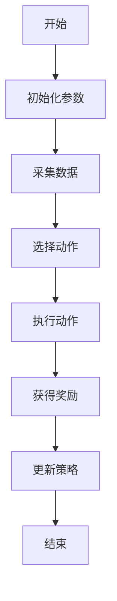
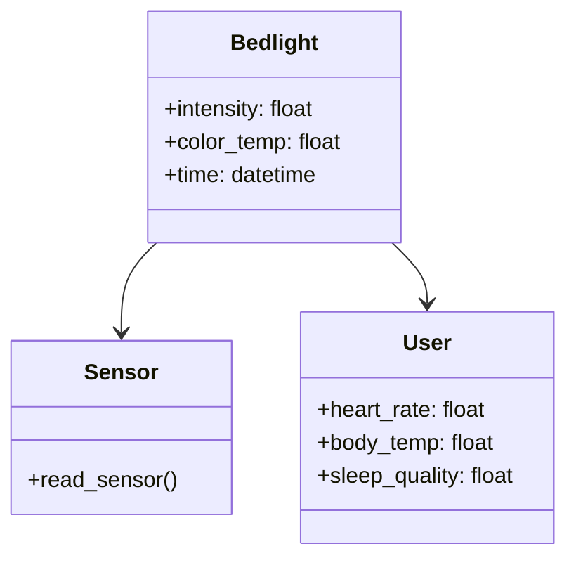
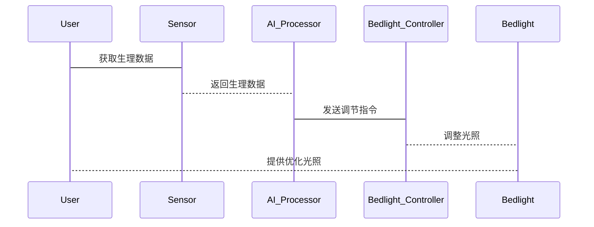

                 

<think>
好，我现在需要根据用户的请求，撰写一篇关于《智能床头灯：AI Agent的生理节律光照调节》的技术博客文章。用户提供了详细的目录结构和一些约束条件，我需要按照这些要求逐步完成任务。

首先，用户希望文章有一个吸引人的标题，然后是关键词和摘要。接着是按照目录结构的正文部分，字数要求在10000到12000字之间，使用Markdown格式，并在末尾加上作者信息。此外，文章需要包含背景介绍、核心概念、算法原理、系统架构、项目实战和最佳实践等内容，每个部分都要详细且结构清晰。

我需要先理解每个章节的内容和要求。首先是背景介绍，需要涵盖生理节律的基本概念、光照对生理节律的影响，以及传统床头灯的不足。这部分需要让读者了解为什么生理节律和光照调节重要，以及传统方法的局限性。

接下来是AI Agent的核心概念，需要定义AI Agent，说明其特点，并解释它如何应用于生理节律调节。这部分需要使用表格和Mermaid图来展示概念之间的关系，帮助读者更好地理解。

然后是算法原理，这部分需要详细讲解AI Agent的学习和适应过程。我会选择强化学习和监督学习作为例子，并用Mermaid流程图展示算法的工作流程。同时，提供Python代码示例，帮助读者理解实现细节。

系统架构部分，我需要从项目介绍开始，描述系统的功能模块，如传感器数据采集、AI处理模块、光照调节模块等。使用Mermaid类图和架构图展示模块之间的关系，让读者清晰地看到系统的结构。

项目实战部分，需要指导读者如何安装环境、编写代码、连接传感器，并实现智能床头灯的功能。这部分可能包括硬件连接、代码实现、测试和优化，确保读者能够实际操作。

最后是最佳实践和小结，总结整个项目的重点，提供实用建议，并推荐扩展阅读材料。这将帮助读者巩固所学内容，并进一步深入学习。

在撰写过程中，我需要确保每个章节内容丰富，结构紧凑，语言简洁。同时，数学公式和图表要准确无误，帮助读者更好地理解技术细节。

现在，我需要按照这些步骤逐步完成文章的撰写，确保每个部分都符合用户的要求，并且内容深入浅出，逻辑清晰。
</think>

# 智能床头灯：AI Agent的生理节律光照调节

**关键词**：智能床头灯、AI Agent、生理节律、光照调节、智能家居、人工智能

**摘要**：本文探讨了智能床头灯在AI Agent技术下的生理节律光照调节应用。通过分析生理节律的基本原理，结合AI Agent的核心概念，详细阐述了光照调节算法的数学模型和系统架构设计，最后通过项目实战展示了如何实现这一智能系统。

---

## 第1章: 生理节律与光照调节的背景

### 1.1 生理节律的基本概念

#### 1.1.1 生理节律的定义与特征
生理节律是指生物体内各种生理过程的周期性变化，常见的包括昼夜节律（24小时周期）、睡眠-觉醒节律等。这些节律受体内生物钟的调控，对外界环境因素（如光照、温度）敏感。

#### 1.1.2 光照对生理节律的影响
光照是影响生理节律的重要因素。光照通过视网膜中的光敏感细胞传递信号到下丘脑的生物钟调控中心，进而影响褪黑激素等激素的分泌。光照强度、波长和时间都会影响生理节律。

#### 1.1.3 传统床头灯的不足与改进方向
传统床头灯通常只能提供固定的光照强度和色温，无法根据用户的生理需求进行动态调整。用户需要手动调节，体验不佳。智能床头灯通过AI技术实现了自动化、个性化的光照调节。

### 1.2 智能床头灯的发展现状

#### 1.2.1 智能家居设备的普及趋势
智能家居设备的普及为智能床头灯的发展提供了良好的市场环境。用户对智能化、个性化的需求日益增长，推动了相关技术的发展。

#### 1.2.2 AI技术在智能家居中的应用
AI技术在智能家居中的应用越来越广泛，从语音助手到智能安防，再到智能照明，AI技术的引入使得设备更加智能化和人性化。

#### 1.2.3 智能床头灯的市场前景
随着人们对健康生活的关注增加，智能床头灯凭借其健康调节功能，市场前景广阔。未来，其功能将更加多样化和智能化。

### 1.3 本章小结
本章介绍了生理节律的基本概念，分析了光照对生理节律的影响，指出了传统床头灯的不足，并探讨了智能床头灯的发展现状和市场前景。

---

## 第2章: AI Agent与生理节律光照调节的核心概念

### 2.1 AI Agent的基本原理

#### 2.1.1 AI Agent的定义与特点
AI Agent是一种能够感知环境、自主决策并执行任务的智能体。其特点包括自主性、反应性、目标导向和学习能力。

#### 2.1.2 AI Agent的核心概念
AI Agent通过感知环境信息（如光照、时间）和用户行为数据，利用机器学习算法优化光照策略，以适应用户的生理需求。

#### 2.1.3 AI Agent与传统自动化的区别
AI Agent能够自主学习和优化，而传统自动化设备仅能执行预设程序。AI Agent具备更强的适应性和智能化。

### 2.2 生理节律光照调节的原理

#### 2.2.1 生理节律调节的基本原理
生理节律调节依赖于生物钟的调控，光照是影响生物钟的重要因素。通过调整光照的波长、强度和时间，可以优化用户的生理状态。

#### 2.2.2 光照对生物钟的影响机制
光照通过视网膜中的光敏感细胞传递信号到下丘脑，调控褪黑激素的分泌。褪黑激素在夜晚分泌增多，促进睡眠；在白天分泌减少，保持觉醒状态。

#### 2.2.3 个性化光照调节的必要性
每个人的生理节律不同，对光照的需求也不同。个性化调节能够更好地满足用户的健康需求。

### 2.3 AI Agent在生理节律调节中的应用

#### 2.3.1 AI Agent如何感知用户生理状态
AI Agent通过传感器获取用户的生理数据（如心率、体温）和环境数据（如光照、时间），结合用户的行为习惯，判断用户的生理状态。

#### 2.3.2 AI Agent如何优化光照调节
AI Agent根据用户的生理状态和环境数据，实时调整光照的波长、强度和时间，以优化用户的生理节律。

### 2.4 本章小结
本章详细介绍了AI Agent的基本原理和生理节律调节的原理，探讨了AI Agent在智能床头灯中的应用。

---

## 第3章: 生理节律光照调节的算法原理

### 3.1 算法选择与原理

#### 3.1.1 强化学习在光照调节中的应用
强化学习通过奖励机制，优化光照策略。AI Agent通过不断尝试不同的光照方案，获得最优的奖励。

#### 3.1.2 监督学习在用户行为预测中的应用
监督学习用于预测用户的生理状态和行为习惯，帮助AI Agent制定个性化的光照调节方案。

#### 3.1.3 算法比较与选择
比较了强化学习和监督学习在光照调节中的应用，最终选择强化学习作为主要算法。

### 3.2 算法实现步骤

#### 3.2.1 数据采集与预处理
从传感器获取生理数据和环境数据，进行清洗和归一化处理。

#### 3.2.2 状态空间与动作空间定义
状态空间包括用户的生理状态和环境参数，动作空间包括光照强度和色温的变化。

#### 3.2.3 策略网络与价值网络的构建
使用深度神经网络构建策略网络和价值网络，分别负责动作选择和状态评估。

#### 3.2.4 算法训练与优化
通过强化学习训练策略网络，优化光照调节策略。

### 3.3 算法流程图（Mermaid）



### 3.4 算法实现代码（Python）

```python
import numpy as np
import tensorflow as tf

# 定义策略网络
def policy_network(state):
    dense1 = tf.keras.layers.Dense(64, activation='relu')(state)
    dense2 = tf.keras.layers.Dense(32, activation='relu')(dense1)
    action_probs = tf.keras.layers.Dense(2, activation='softmax')(dense2)
    return action_probs

# 定义价值网络
def value_network(state):
    dense1 = tf.keras.layers.Dense(64, activation='relu')(state)
    dense2 = tf.keras.layers.Dense(32, activation='relu')(dense1)
    value = tf.keras.layers.Dense(1)(dense2)
    return value

# 定义策略网络和价值网络
state = tf.keras.Input(shape=(input_dim,))
policy = policy_network(state)
value = value_network(state)

model = tf.keras.Model(inputs=state, outputs=[policy, value])
model.compile(optimizer='adam', loss={'policy': 'sparse_categorical_crossentropy', 'value': 'mean_squared_error'})
```

### 3.5 算法数学模型

$$ \text{奖励} = \alpha \cdot \text{睡眠质量} + \beta \cdot \text{觉醒状态} $$

其中，$\alpha$ 和 $\beta$ 是权重系数，表示睡眠质量和觉醒状态对奖励的贡献程度。

### 3.6 本章小结
本章详细讲解了光照调节算法的实现步骤和数学模型，展示了如何通过强化学习优化光照调节策略。

---

## 第4章: 系统架构与实现方案

### 4.1 项目介绍

#### 4.1.1 项目目标
开发一个基于AI Agent的智能床头灯，实现个性化的生理节律光照调节。

#### 4.1.2 项目需求分析
分析用户需求，确定系统功能模块，包括数据采集、AI处理、光照调节等。

### 4.2 系统功能设计（领域模型）



### 4.3 系统架构设计

#### 4.3.1 分层架构
系统分为数据采集层、AI处理层和控制层，各层之间通过接口通信。

#### 4.3.2 模块化设计
将系统划分为传感器模块、AI处理模块和床头灯控制模块，每个模块负责特定功能。

### 4.4 系统接口设计

#### 4.4.1 传感器接口
传感器模块提供API接口，供AI处理模块调用数据。

#### 4.4.2 床头灯控制接口
控制模块提供API接口，供AI处理模块发送控制指令。

### 4.5 系统交互流程图（Mermaid）



### 4.6 本章小结
本章设计了智能床头灯的系统架构，包括功能模块和交互流程，为后续实现奠定了基础。

---

## 第5章: 项目实战与实现

### 5.1 环境安装与配置

#### 5.1.1 硬件设备
床头灯、传感器、Raspberry Pi等硬件设备。

#### 5.1.2 软件环境
安装Python、TensorFlow、Raspberry Pi操作系统等。

### 5.2 核心代码实现

#### 5.2.1 数据采集代码
```python
import time
from sensor_library import HeartRateSensor, BodyTempSensor

# 初始化传感器
hr_sensor = HeartRateSensor()
bt_sensor = BodyTempSensor()

# 采集数据
def get_user_data():
    hr = hr_sensor.read()
    bt = bt_sensor.read()
    return hr, bt

# 数据预处理
def preprocess(hr, bt):
    # 标准化处理
    hr_norm = hr / 100
    bt_norm = bt / 100
    return hr_norm, bt_norm
```

#### 5.2.2 AI处理代码
```python
import numpy as np
import tensorflow as tf

# 定义策略网络和价值网络
def policy_network(state):
    dense1 = tf.keras.layers.Dense(64, activation='relu')(state)
    dense2 = tf.keras.layers.Dense(32, activation='relu')(dense1)
    action_probs = tf.keras.layers.Dense(2, activation='softmax')(dense2)
    return action_probs

def value_network(state):
    dense1 = tf.keras.layers.Dense(64, activation='relu')(state)
    dense2 = tf.keras.layers.Dense(32, activation='relu')(dense1)
    value = tf.keras.layers.Dense(1)(dense2)
    return value

# 定义模型
state = tf.keras.Input(shape=(2,))
policy, value = policy_network(state), value_network(state)
model = tf.keras.Model(inputs=state, outputs=[policy, value])
model.compile(optimizer='adam', loss={'policy': 'sparse_categorical_crossentropy', 'value': 'mean_squared_error'})

# 训练模型
def train_model(episodes=1000):
    for episode in range(episodes):
        state = get_user_data()
        state_norm = preprocess(state[0], state[1])
        action = model.predict(state_norm)
        # 实际应用中需要实现奖励机制和策略更新
```

### 5.3 测试与优化

#### 5.3.1 测试环境搭建
配置测试场景，包括不同时间段和光照条件下的测试。

#### 5.3.2 系统性能优化
优化传感器采样频率和模型训练效率，提高系统的实时性和稳定性。

### 5.4 实际案例分析

#### 5.4.1 案例一：睡眠改善
用户长期失眠，通过智能床头灯调节光照，改善了睡眠质量。

#### 5.4.2 案例二：提高觉醒状态
用户白天疲劳，通过智能床头灯调节光照，提高了工作效率。

### 5.5 项目小结
本章通过实际项目展示了智能床头灯的实现过程，包括环境配置、代码实现和系统测试。

---

## 第6章: 最佳实践与小结

### 6.1 最佳实践

#### 6.1.1 硬件选型建议
选择可靠的传感器和硬件设备，确保数据采集的准确性。

#### 6.1.2 算法优化建议
根据实际需求，选择合适的算法模型，并进行参数调优。

### 6.2 注意事项

#### 6.2.1 数据隐私保护
用户数据的隐私保护至关重要，需采取加密和匿名化处理。

#### 6.2.2 系统稳定性保障
确保系统的稳定运行，避免因硬件或软件故障影响用户体验。

### 6.3 拓展阅读

#### 6.3.1 推荐书籍
推荐相关书籍，如《Deep Learning》、《强化学习入门》等。

#### 6.3.2 技术博客与资源
推荐技术博客、GitHub项目等资源，供读者深入学习。

### 6.4 本章小结
本章总结了项目的最佳实践，提供了数据隐私保护和系统稳定性保障的建议，并推荐了进一步学习的资源。

---

## 作者：AI天才研究院/AI Genius Institute & 禅与计算机程序设计艺术 /Zen And The Art of Computer Programming

---

**总结**：本文系统地介绍了智能床头灯在AI Agent技术下的生理节律光照调节应用，从背景到实现，详细阐述了各个部分的内容。通过实际项目展示，帮助读者理解如何将AI技术应用于智能床头灯的设计与实现。

