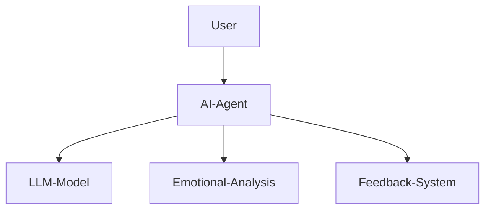

                 


# 智能情感陪伴 AI Agent：LLM 在心理健康领域的深度应用

**关键词**：人工智能、大语言模型、心理健康、智能陪伴、人机交互

**摘要**：  
随着人工智能技术的快速发展，大语言模型（LLM）在心理健康领域的应用逐渐成为研究热点。本文详细探讨了如何利用LLM构建智能情感陪伴AI代理，分析其技术原理、系统架构以及实际应用场景。通过理论分析与案例实践相结合的方式，本文揭示了LLM在心理健康支持中的巨大潜力，并提出了未来的发展方向。

---

## 第一部分: 背景与概述

### 第1章: 智能情感陪伴 AI Agent 的背景与问题背景

#### 1.1 问题背景

- **心理健康问题的现状与挑战**  
  当今社会，心理健康问题日益突出，尤其是在青少年和职场人群中。传统的心理咨询方式存在资源有限、覆盖范围小、成本高等问题，难以满足广泛需求。

- **智能陪伴的需求与发展趋势**  
  随着人工智能技术的进步，智能陪伴AI Agent逐渐成为人们生活中的一部分。通过自然语言处理技术，AI代理可以提供情感支持、压力缓解和心理疏导等服务。

- **LLM 在心理健康领域的潜力**  
  大语言模型（如GPT系列）具备强大的理解和生成能力，能够模拟人类情感交流，为心理健康支持提供新的可能性。

#### 1.2 问题描述

- **心理健康支持的缺口**  
  专业心理咨询师数量有限，无法满足庞大的需求。许多人无法及时获得心理支持，导致问题加剧。

- **智能情感陪伴的定义与目标**  
  智能情感陪伴AI Agent的目标是通过自然语言交互，为用户提供情感支持、情绪分析和心理疏导服务，缓解压力、改善心理健康状况。

- **LLM 在情感陪伴中的角色定位**  
  LLM作为技术基础，帮助AI代理实现情感理解和生成，提供个性化的陪伴体验。

#### 1.3 问题解决

- **LLM 的优势与局限性**  
  优势：强大的语言理解和生成能力，能够模拟人类对话。  
  局限性：缺乏深度情感理解，可能无法处理复杂的情感问题。

- **智能情感陪伴 AI Agent 的实现路径**  
  结合LLM和情感计算技术，通过训练数据优化模型，使其具备情感识别和生成能力。

- **技术与伦理的平衡**  
  在提供智能陪伴的同时，需注意隐私保护和伦理问题，确保技术的合理使用。

#### 1.4 边界与外延

- **情感陪伴的边界**  
  AI代理能够处理常见的情感支持，但无法替代专业心理咨询师处理复杂或严重的情感问题。

- **LLM 应用的边界**  
  LLM主要用于情感交流和信息提供，需与专业工具结合，才能实现更全面的支持。

- **技术与情感的结合**  
  技术的进步使得情感陪伴更加个性化，但情感交流的本质仍需人类的理解和共情。

#### 1.5 核心概念结构

- **核心要素组成**  
  包括自然语言处理技术、情感计算、用户需求分析和个性化交互设计。

- **交互流程**  
  用户输入 → 情感分析 → 生成响应 → 反馈调整。

- **系统架构**  
  包括前端交互界面、后端LLM引擎和数据管理模块。

---

## 第2章: LLM 在心理健康领域的核心概念与联系

### 2.1 核心概念原理

- **大语言模型的工作原理**  
  LLM通过预训练掌握大量语言数据，能够生成与上下文相关的文本。在心理健康领域，模型通过对话理解用户情感状态并生成回应。

- **情感计算的核心技术**  
  情感计算包括情感识别、情感分析和情感生成。通过自然语言处理技术，AI代理能够识别用户情感并生成相应的情感回应。

- **人机交互的基础理论**  
  基于用户需求和情感状态的交互设计，确保用户体验的流畅性和有效性。

### 2.2 核心概念对比

- **LLM 与传统 NLP 技术的对比**  
  | 特性 | LLM | 传统NLP |
  |------|------|----------|
  | 数据需求 | 大规模数据 | 小规模数据 |
  | 模型复杂度 | 高 | 较低 |
  | 应用场景 | 多领域通用 | 专用任务 |

- **情感计算与传统情感分析的对比**  
  | 特性 | 情感计算 | 传统情感分析 |
  |------|----------|--------------|
  | 目标 | 生成情感回应 | 分析情感倾向 |
  | 复杂度 | 高 | 较低 |

- **智能陪伴与传统心理咨询的对比**  
  | 特性 | 智能陪伴 | 传统心理咨询 |
  |------|----------|----------------|
  | 及时性 | 实时响应 | 需预约 |
  | 个性化 | 基于数据定制 | 一对一咨询 |
  | 成本 | 低 | 高 |

### 2.3 ER 实体关系图



---

## 第3章: 算法原理

### 3.1 算法原理概述

- **大语言模型的训练目标**  
  $$\text{训练目标函数} = \min_L \text{交叉熵损失}$$
  其中，交叉熵损失函数用于衡量模型预测与真实值的差异。

- **预训练与微调**  
  预训练：在大规模通用数据上训练模型，使其掌握语言规律。  
  微调：在特定领域数据（如心理健康对话）上进行优化，提升模型在目标任务上的性能。

### 3.2 对话生成算法

- **基于生成对抗网络的优化**  
  $$\text{生成器损失} = -\mathbb{E}_{y}[ \log D(y)]$$
  $$\text{判别器损失} = -\mathbb{E}_{x,y}[\log D(x)]$$

- **对话生成流程图**  
  ```mermaid
  graph TD
      Input --> Tokenizer
      Tokenizer --> Embedding-Layer
      Embedding-Layer --> LLM-Model
      LLM-Model --> Output-Token
      Output-Token --> Decoding
  ```

### 3.3 实例分析

- **训练过程**  
  使用心理健康领域的对话数据，通过微调优化模型，使其更擅长处理情感支持任务。

- **数学模型**  
  交叉熵损失函数用于衡量模型预测与真实值的差异，通过反向传播优化模型参数。

---

## 第4章: 系统分析与架构设计

### 4.1 问题场景介绍

- **用户需求**  
  用户需要一个能够提供情感支持和心理疏导的智能代理。

- **系统功能**  
  包括情感分析、对话生成、反馈调整等功能。

### 4.2 系统功能设计

- **领域模型类图**  
  ```mermaid
  classDiagram
      class User {
          string input;
      }
      class AI-Agent {
          - Emotional-Analysis
          - LLM-Model
          - Feedback-System
          + processInput(input)
      }
      class LLM-Model {
          - Parameters
          - Weights
          + generateResponse(input)
      }
      User --> AI-Agent
      AI-Agent --> LLM-Model
  ```

- **系统架构图**  
  ```mermaid
  graph TD
      AI-Agent --> User-Interface
      AI-Agent --> LLM-Engine
      AI-Agent --> Emotional-Analyzer
      User-Interface --> Feedback-Collector
  ```

### 4.3 系统接口设计

- **API 接口**  
  ```python
  class AI-Agent:
      def __init__(self):
          self.llm = LLM-Engine()
          self.feedback = Feedback-System()
      
      def processInput(self, input):
          response = self.llm.generateResponse(input)
          self.feedback.collectFeedback(input, response)
          return response
  ```

- **交互流程**  
  用户输入 → AI-Agent处理 → 生成回应 → 用户反馈 → 模型优化。

---

## 第5章: 项目实战

### 5.1 环境安装

- **安装依赖**  
  使用Python 3.8以上版本，安装必要的库：`transformers`, `torch`, `numpy`。

### 5.2 核心代码实现

- **对话生成模块**  
  ```python
  from transformers import AutoTokenizer, AutoModelForCausalLM

  class ChatAgent:
      def __init__(self, model_name):
          self.tokenizer = AutoTokenizer.from_pretrained(model_name)
          self.model = AutoModelForCausalLM.from_pretrained(model_name)
      
      def generate_response(self, input_text):
          inputs = self.tokenizer.encode(input_text, return_tensors="pt")
          outputs = self.model.generate(inputs, max_length=50, num_beams=5, temperature=0.7)
          response = self.tokenizer.decode(outputs[0], skip_special_tokens=True)
          return response
  ```

- **情感分析模块**  
  ```python
  from transformers import pipeline

  sentiment_analyzer = pipeline("sentiment-analysis")
  def analyze_emotion(text):
      result = sentiment_analyzer(text)
      return result[0]['label']
  ```

### 5.3 代码应用解读与分析

- **对话生成模块**  
  使用预训练的LLM模型生成回应，参数设置如`temperature`和`num_beams`影响生成结果的多样性和质量。

- **情感分析模块**  
  利用预训练的情感分析模型，快速判断用户情感倾向，为生成回应提供依据。

### 5.4 实际案例分析

- **案例1**  
  用户输入：“我最近很焦虑。”  
  情感分析：焦虑 → 生成回应：“我能理解你的感受，我们可以一起探讨一下原因。”

- **案例2**  
  用户输入：“工作压力太大了。”  
  情感分析：压力 → 生成回应：“压力是常见的问题，我们可以尝试一些放松技巧。”

### 5.5 项目小结

- **经验总结**  
  情感陪伴AI Agent的成功依赖于模型的优化和数据的丰富性。

- **问题与改进**  
  当前模型缺乏深度情感理解，未来需要结合更多心理学知识进行优化。

---

## 第6章: 总结与展望

### 6.1 总结

- **核心内容回顾**  
  本文详细探讨了LLM在心理健康领域的应用，分析了技术原理和系统架构，并通过实例展示了项目的实现过程。

- **技术总结**  
  情感陪伴AI Agent结合了自然语言处理和情感计算技术，为用户提供个性化的情感支持。

### 6.2 展望

- **未来发展方向**  
  - 结合心理学知识优化模型，使其具备更深层次的情感理解能力。  
  - 引入多模态交互，如语音和表情识别，提升用户体验。  
  - 探索更高效的人机协作模式，提高心理健康支持的覆盖率。

- **挑战与思考**  
  技术进步的同时，需注意隐私保护和伦理问题，确保技术的合理应用。

---

**作者：AI天才研究院 & 禅与计算机程序设计艺术**

