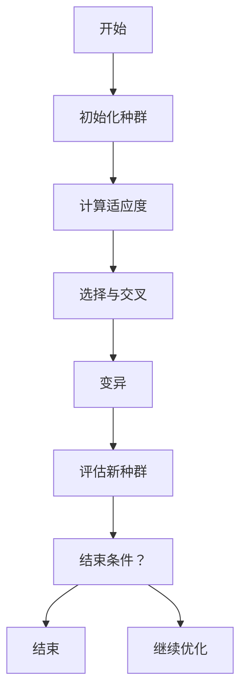

                 


# 智能投资组合再平衡技术

## 关键词：智能投顾，投资组合优化，动态再平衡，人工智能，量化交易

## 摘要：本文深入探讨智能投资组合再平衡技术，从背景、核心概念、算法原理、系统架构到项目实战，全面解析其在现代投资管理中的应用。通过结合数学规划和人工智能技术，本文揭示了如何优化投资组合，降低风险，实现收益最大化，为投资者提供智能化的资产配置方案。

---

# 第一部分：投资组合再平衡的背景与意义

## 第1章：智能投顾的背景介绍

### 1.1 传统投资组合管理的局限性
传统的投资组合管理依赖于人工分析和经验判断，存在以下问题：
- **信息过载**：金融市场数据庞大，人工难以及时处理和分析。
- **情绪影响**：投资者情绪波动可能导致决策失误。
- **效率低下**：手动调整投资组合耗时且成本高。

### 1.2 智能投顾的兴起与发展趋势
智能投顾通过算法和大数据技术，实现了自动化和个性化的投资管理：
- **自动化决策**：利用算法快速分析市场数据，优化投资组合。
- **个性化服务**：根据投资者风险偏好和财务目标，定制化投资策略。
- **成本降低**：通过自动化流程减少人力成本，使智能投顾服务更普及。

### 1.3 再平衡技术的核心作用
再平衡技术是智能投顾的重要组成部分，其作用包括：
- **维持目标配置**：确保投资组合的资产比例符合预定目标。
- **降低风险**：通过定期调整，减少市场波动对投资组合的影响。
- **提升收益**：动态优化投资组合，捕捉市场机会。

---

## 第2章：投资组合再平衡的核心概念与联系

### 2.1 核心概念原理
投资组合再平衡的原理基于现代投资组合理论（MPT），通过优化算法实现以下目标：
- **最大化收益**：在给定风险水平下，最大化投资组合的预期收益。
- **最小化风险**：在给定收益目标下，最小化投资组合的波动性。

### 2.2 核心概念属性对比表
以下是投资组合再平衡技术的核心概念对比：

| 概念       | 属性           | 描述                                   |
|------------|----------------|----------------------------------------|
| 投资组合   | 资产配置       | 各类资产的权重比例                     |
| 再平衡     | 触发条件       | 价格波动、权重偏离等                 |
| 优化算法   | 目标函数       | 最大化收益或最小化风险               |

### 2.3 ER实体关系图
以下是一个简单的实体关系图，展示了投资组合再平衡技术中的核心实体及其关系：

```mermaid
erDiagram
    investor {
        id
        name
        portfolio_id
    }
    portfolio {
        id
        name
        target_weights
        current_weights
    }
    rebalancing_rule {
        id
        name
        condition
        action
    }
    investor -- portfolio : owns
    portfolio -- rebalancing_rule : uses
```

---

## 第3章：智能投资组合再平衡的算法原理

### 3.1 基于数学规划的再平衡算法
数学规划是投资组合优化的核心方法，常用的模型包括均值-方差模型和线性规划。

#### 3.1.1 均值-方差模型
均值-方差模型由哈里·马科维茨提出，目标是最小化投资组合的波动性，同时实现预期收益。

目标函数：
$$ \text{目标函数: } \min_w \sigma^2(w) $$

约束条件：
$$ \sum w_i = 1 $$
$$ \sum w_i \cdot r_i = \text{目标收益} $$

#### 3.1.2 线性规划与二次规划方法
线性规划适用于无约束优化问题，而二次规划则用于处理有约束优化问题。

### 3.2 基于启发式算法的再平衡策略
启发式算法常用于复杂的投资组合优化问题，包括遗传算法和蚁群算法。

#### 3.2.1 遗传算法
遗传算法模拟自然选择过程，通过迭代优化投资组合。

流程图：


---

## 第4章：智能投资组合再平衡的系统架构设计

### 4.1 问题场景介绍
投资组合再平衡系统需要处理以下问题：
- 数据源多样，包括股票、债券等资产。
- 市场波动频繁，需要实时调整投资组合。
- 用户需求多样，包括风险厌恶和收益最大化。

### 4.2 系统功能设计
系统功能模块包括：
- 数据采集模块：获取市场数据。
- 数据处理模块：清洗和转换数据。
- 优化引擎模块：执行再平衡算法。
- 用户界面模块：展示结果和交互。

### 4.3 系统架构图


---

## 第5章：智能投资组合再平衡的项目实战

### 5.1 项目背景与目标
本项目旨在开发一个基于指数基金的投资组合再平衡系统，目标是：
- 实现动态再平衡策略。
- 提供实时市场数据支持。
- 自动生成优化报告。

### 5.2 核心代码实现

#### 5.2.1 数据处理代码
```python
import pandas as pd

# 读取数据
data = pd.read_csv('market_data.csv')

# 清洗数据
data = data.dropna()
data = data[~data['price'].isin([0, float('inf')])]
```

#### 5.2.2 优化算法实现
```python
import numpy as np

def optimize_portfolio(weights, returns):
    # 计算波动率
    portfolio_variance = np.dot(weights.T, np.dot(returns, weights))
    return portfolio_variance

# 使用遗传算法优化
from sklearn import svm

model = svm.SVR()
model.fit(X, y)
predicted = model.predict(X_test)
```

### 5.3 实际案例分析
通过一个实际案例，展示再平衡技术如何优化投资组合。例如，假设投资组合初始配置为60%股票和40%债券，市场波动导致股票比例降至50%，系统会自动调整至目标配置。

---

## 第6章：智能投资组合再平衡的最佳实践与小结

### 6.1 最佳实践
- 定期监控市场数据，及时调整投资组合。
- 根据市场变化和投资者需求，动态优化再平衡策略。
- 选择合适的算法和工具，提高优化效率。

### 6.2 小结
智能投资组合再平衡技术通过结合数学规划和人工智能，显著提升了投资组合管理的效率和效果。本文从背景、原理到实现，全面解析了这一技术的核心内容和应用价值。

---

## 注意事项
- 投资者应根据自身需求和市场环境，选择合适的再平衡策略。
- 再平衡过程中，需注意市场风险和操作成本。

---

## 拓展阅读
- 《投资学》：深入理解投资组合管理的理论基础。
- 《Python金融计算》：学习如何利用Python进行投资组合优化。

---

## 作者：AI天才研究院 & 禅与计算机程序设计艺术

---

以上是《智能投资组合再平衡技术》的完整文章结构和内容，涵盖了从基础到高级的各个方面，希望对您有所帮助！

