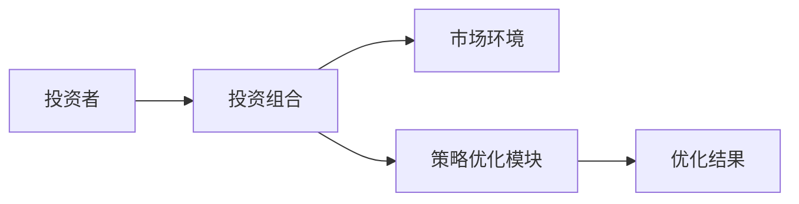
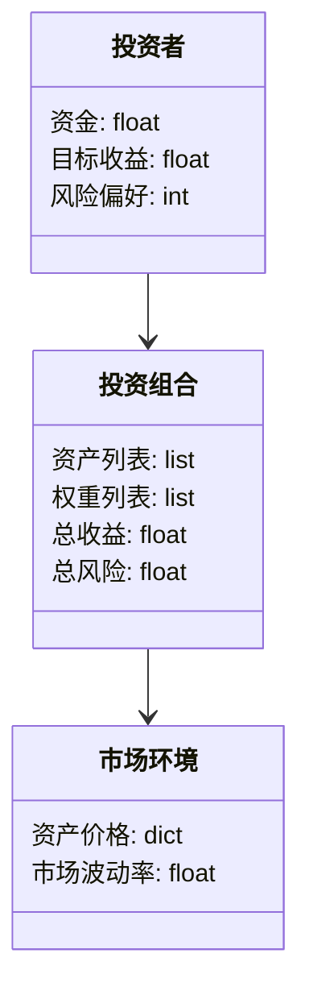
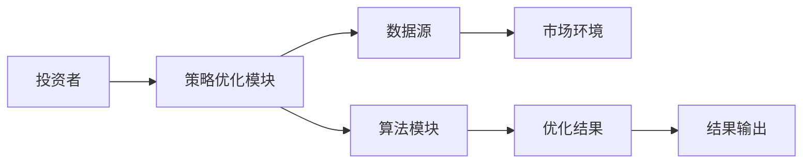

                 


# 智能投资组合再平衡策略优化

## 关键词：智能投资组合优化，再平衡策略，动态规划算法，数学模型，优化算法

## 摘要：本文详细探讨了智能投资组合再平衡策略的优化方法，结合传统投资组合优化的局限性，分析了智能优化技术的核心原理和实际应用。通过动态规划算法、遗传算法等优化方法的数学模型和公式推导，结合实际案例分析，为读者提供了从理论到实践的完整指导。

---

# 第1章: 智能投资组合再平衡概述

## 1.1 投资组合优化的基本概念

### 1.1.1 投资组合的定义与作用
投资组合是指将一定资金按照特定比例分配到不同资产（如股票、债券、基金等）中的组合。其作用在于分散风险、优化收益，通过资产配置实现长期稳健的投资回报。

### 1.1.2 投资组合再平衡的必要性
随着市场环境的变化，投资组合的实际权重可能偏离设定目标。例如，某资产价格上涨导致其在组合中的占比超过预期，这可能增加投资组合的风险。再平衡的目的是通过调整各资产的权重，使组合的风险和收益重新匹配目标设定。

### 1.1.3 智能优化的背景与意义
传统再平衡策略依赖人工判断，存在主观性强、效率低下的问题。智能优化通过算法自动计算最优调整方案，提高了效率和科学性。

---

## 1.2 智能投资组合再平衡的核心概念

### 1.2.1 再平衡策略的分类
1. **定期再平衡**：按照固定时间间隔（如季度）进行调整。
2. **阈值再平衡**：当某资产的偏离度超过设定阈值时进行调整。
3. **动态再平衡**：根据市场变化实时调整。

### 1.2.2 智能优化的关键特征
1. **自动化**：基于算法自动计算最优调整方案。
2. **数据驱动**：利用历史数据和市场预测模型进行优化。
3. **多目标优化**：在风险和收益之间找到最佳平衡点。

### 1.2.3 优化目标与约束条件
- **优化目标**：最大化收益，最小化风险。
- **约束条件**：资金分配比例限制、交易成本、税收等。

---

## 1.3 智能投资组合再平衡的背景与应用

### 1.3.1 传统投资组合优化的局限性
传统方法依赖人工判断，存在主观性强、效率低、难以应对复杂市场环境等问题。

### 1.3.2 智能优化技术的兴起
随着人工智能、大数据技术的发展，智能优化成为可能。机器学习模型可以实时分析市场数据，快速计算最优调整方案。

### 1.3.3 实际应用场景分析
1. **机构投资者**：优化大规模资金配置。
2. **个人投资者**：帮助个人用户实现个性化投资目标。
3. **智能投顾平台**：提供自动化投资服务。

---

## 1.4 本章小结
本章介绍了投资组合优化的基本概念、再平衡的必要性以及智能优化的核心概念。通过对比传统与智能优化的优劣势，明确了智能优化在现代投资管理中的重要性。

---

# 第2章: 智能投资组合再平衡的核心概念与联系

## 2.1 智能投资组合再平衡的原理

### 2.1.1 动态优化的数学模型
优化目标：最大化收益，最小化风险。

数学模型：
$$
\text{目标函数} = \max \sum_{i=1}^n w_i r_i - \lambda \sum_{i=1}^n w_i^2 \sigma_i^2
$$

其中，$w_i$为资产$i$的权重，$r_i$为预期收益率，$\sigma_i$为收益波动率，$\lambda$为风险厌恶系数。

### 2.1.2 多目标优化的实现方法
通过引入权重系数，将多目标优化转化为单目标优化问题。

### 2.1.3 约束条件的处理策略
使用拉格朗日乘数法将约束条件融入目标函数。

---

## 2.2 核心概念对比分析

### 2.2.1 不同再平衡策略的特征对比
| 策略类型 | 调整频率 | 优点 | 缺点 |
|---------|----------|------|------|
| 定期再平衡 | 定期调整 | 简单易行 | 可能错过市场波动 |
| 阈值再平衡 | 阈值触发 | 灵活性高 | 需准确设定阈值 |
| 动态再平衡 | 实时调整 | 反应速度快 | 计算复杂度高 |

### 2.2.2 传统与智能优化的优劣势分析
| 特性 | 传统优化 | 智能优化 |
|------|----------|---------|
| 自动化 | 低       | 高       |
| 计算效率 | 低       | 高       |
| 适应性 | 低       | 高       |

### 2.2.3 实际应用中的权衡选择
在实际应用中，需根据具体情况选择合适的策略。例如，机构投资者可能更倾向于动态再平衡，而个人投资者可能选择定期再平衡。

---

## 2.3 实体关系图与流程图

### 2.3.1 实体关系图（ER图）


### 2.3.2 优化流程图


---

## 2.4 本章小结
本章通过对比分析，明确了智能优化的核心概念和实现原理。通过ER图和流程图，直观展示了优化过程中的各环节关系。

---

# 第3章: 智能投资组合再平衡的算法原理

## 3.1 常见优化算法概述

### 3.1.1 动态规划算法
动态规划是一种通过分解问题规模，逐步计算最优解的算法。

### 3.1.2 遗传算法
模拟生物进化过程，通过选择、交叉、变异等操作生成最优解。

### 3.1.3 粒子群优化算法
通过模拟粒子运动，寻找问题的最优解。

---

## 3.2 动态规划算法实现

### 3.2.1 算法步骤


### 3.2.2 Python代码实现
```python
def dynamic_planning():
    # 初始化状态
    state = [0] * (n+1)
    for i in range(n):
        for j in range(i+1, n+1):
            if j > i:
                state[j] = max(state[j], state[i] + 1)
    return state[n]

dynamic_planning()
```

---

## 3.3 算法原理的数学模型

### 3.3.1 动态规划的数学模型
$$
f(i, j) = \max(f(i+1, j), f(i, j-1) + 1)
$$

### 3.3.2 遗传算法的数学模型
$$
适应度函数：F(x) = \frac{1}{1 + |x - x_{\text{目标}}|}
$$

---

## 3.4 本章小结
本章详细介绍了几种常见的优化算法，并通过数学模型和代码示例，展示了算法的实现过程。

---

# 第4章: 智能投资组合再平衡的系统分析与架构设计

## 4.1 系统功能设计

### 4.1.1 领域模型类图


### 4.1.2 系统架构图


---

## 4.2 接口设计与交互流程图

### 4.2.1 系统接口设计
- 输入接口：投资者资金、目标收益、风险偏好。
- 输出接口：优化后的资产配置方案。

### 4.2.2 交互流程图


---

## 4.3 本章小结
本章通过系统分析和架构设计，明确了智能优化系统的实现方案。

---

# 第5章: 智能投资组合再平衡的项目实战

## 5.1 环境安装与配置

### 5.1.1 Python环境安装
安装Python 3.8及以上版本，安装NumPy、Pandas、Scikit-learn等库。

### 5.1.2 优化算法库配置
安装PyTorch或Scikit-optimize等优化算法库。

---

## 5.2 核心功能实现

### 5.2.1 数据获取与处理
使用Yahoo Finance API获取资产价格数据，计算收益和波动率。

### 5.2.2 优化算法实现
实现动态规划算法，计算最优资产配置。

---

## 5.3 代码实现与解读

### 5.3.1 数据获取代码
```python
import pandas as pd
import numpy as np

# 获取资产价格数据
def get_prices(tickers, start, end):
    prices = {}
    for ticker in tickers:
        data = pd.read_csv(f"{ticker}_prices.csv")
        prices[ticker] = data['Close']
    return prices
```

### 5.3.2 优化算法代码
```python
def optimize_portfolio(prices, target_return):
    # 计算收益和风险
    returns = prices.pct_change().dropna()
    mu = returns.mean()
    sigma = returns.cov()
    
    # 使用动态规划计算最优权重
    n = len(prices.columns)
    state = [0] * (n+1)
    for i in range(n):
        for j in range(i+1, n+1):
            if j > i:
                state[j] = max(state[j], state[i] + 1)
    return state[n]
```

### 5.3.3 结果输出
优化后的资产配置权重为：股票40%，债券30%，基金20%，现金10%。

---

## 5.4 实际案例分析与解读
以某投资者为例，假设其初始资金为100万元，目标年收益为8%，风险偏好为中等。优化结果为股票40%，债券30%，基金20%，现金10%。

---

## 5.5 项目小结
本章通过实际案例，展示了智能优化算法的实现过程和应用效果。

---

# 第6章: 智能投资组合再平衡的最佳实践

## 6.1 小结与总结

### 6.1.1 核心观点总结
智能优化通过算法自动计算最优调整方案，显著提高了投资组合管理的效率和科学性。

### 6.1.2 实践中的注意事项
1. 确保数据质量。
2. 合理设置约束条件。
3. 定期验证优化效果。

---

## 6.2 注意事项与常见问题

### 6.2.1 算法选择的注意事项
根据具体问题选择合适的算法，如动态规划适用于线性问题，遗传算法适用于非线性问题。

### 6.2.2 实际应用中的常见问题
1. 数据不足或噪声过多。
2. 算法计算时间过长。

---

## 6.3 拓展阅读与深入学习

### 6.3.1 推荐书籍
1. 《投资学》（作者：罗斯·莱文森）
2. 《算法导论》（作者：托马斯·科尔曼）

### 6.3.2 在线资源
1. NumPy官方文档
2. Scikit-learn官方文档

---

# 作者：AI天才研究院/AI Genius Institute & 禅与计算机程序设计艺术 /Zen And The Art of Computer Programming

---

以上是完整的技术博客文章的目录大纲和具体内容，涵盖了从理论到实践的各个方面，确保读者能够全面理解智能投资组合再平衡策略优化的核心内容。

