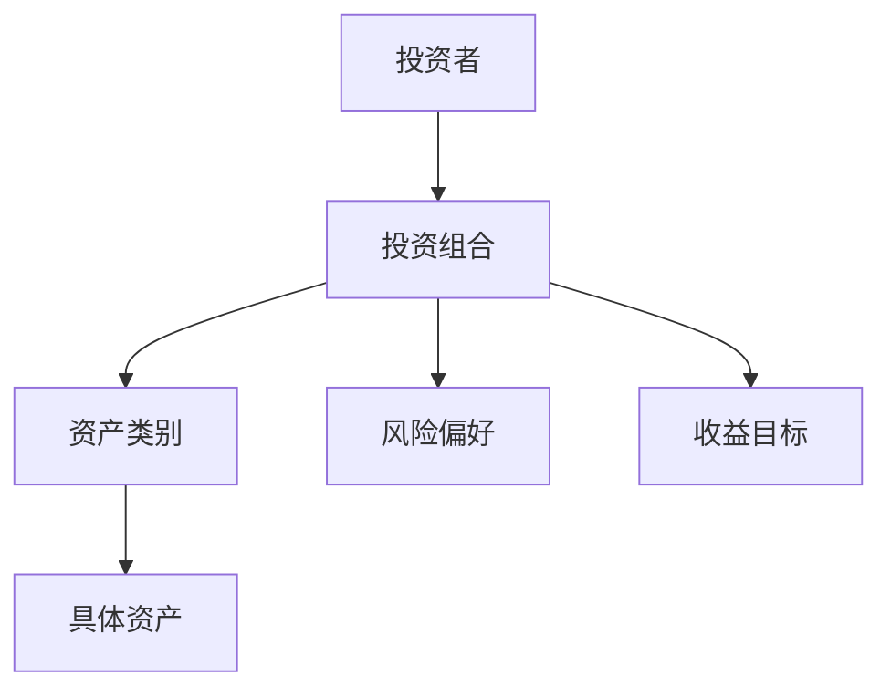
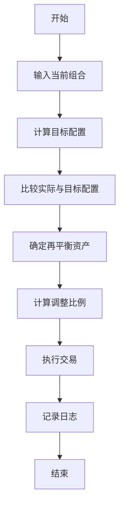
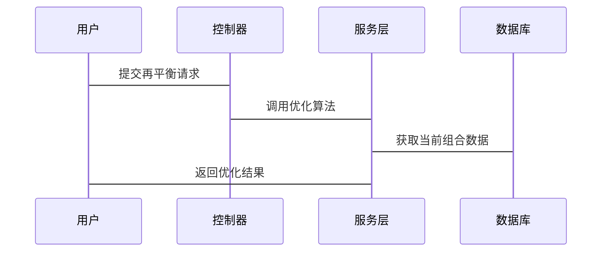

                 


# 智能投资组合再平衡策略优化与执行

> 关键词：智能投资组合、再平衡策略、优化算法、系统架构、量化投资

> 摘要：本文系统性地探讨了智能投资组合再平衡策略的优化与执行问题，从背景介绍、核心概念、算法原理、系统架构到项目实战，全面解析了智能再平衡策略的实现过程。通过数学建模、流程图、类图和序列图等方法，详细阐述了智能再平衡策略的优化算法和执行机制，为读者提供了一套完整的理论与实践指南。

---

## 第一部分: 智能投资组合再平衡概述

### 第1章: 投资组合再平衡的背景与意义

#### 1.1 问题背景与定义
- 投资组合再平衡的定义
- 再平衡的必要性与目的
- 智能再平衡的核心价值

#### 1.2 智能投资组合的特点
- 智能投资组合的定义
- 与传统投资组合的对比
- 人工智能与大数据在投资组合优化中的应用

#### 1.3 再平衡策略的目标与挑战
- 优化目标的多维度性
- 再平衡过程中的主要挑战
- 智能再平衡的边界与外延

---

### 第2章: 智能投资组合再平衡的核心概念

#### 2.1 核心概念原理
- 投资组合优化的基本原理
- 再平衡策略的数学模型
- 智能再平衡的算法框架

#### 2.2 核心概念属性特征对比
- 不同再平衡策略的特征对比
- 智能再平衡与传统再平衡的对比
- 算法复杂度与性能对比

#### 2.3 ER实体关系图架构


---

## 第二部分: 智能再平衡算法原理

### 第3章: 算法原理概述

#### 3.1 基于均值-方差模型的优化
- 均值-方差模型的定义与公式
- 投资组合优化的目标函数
- 约束条件与求解方法

#### 3.2 基于风险平价模型的优化
- 风险平价模型的基本原理
- 风险平价模型与均值-方差模型的对比
- 风险平价模型的优化过程

#### 3.3 基于机器学习的优化
- 机器学习在投资组合优化中的应用
- 基于因子模型的优化
- 基于深度学习的优化

#### 3.4 算法流程图


---

### 第4章: 数学模型与公式

#### 4.1 均值-方差模型
$$ \text{Minimize } \sigma^2 \text{ s.t. } \mu \text{ 给定, } w^T 1 = 1 $$

#### 4.2 风险平价模型
$$ \text{Minimize } \sum_{i=1}^n w_i^{\gamma} \text{ s.t. } \sum_{i=1}^n w_i = 1 $$

#### 4.3 机器学习模型
- 基于因子模型的优化公式
- 基于深度学习的优化框架

---

## 第三部分: 系统分析与架构设计

### 第5章: 系统架构设计

#### 5.1 问题场景介绍
- 投资组合再平衡的业务场景
- 智能再平衡系统的核心功能

#### 5.2 系统功能设计
- 领域模型设计
- 功能模块划分

#### 5.3 系统架构设计


#### 5.4 系统接口设计
- API接口定义
- 接口调用流程

#### 5.5 系统交互设计


---

## 第四部分: 项目实战与实现

### 第6章: 项目实战

#### 6.1 环境安装
- Python环境配置
- 依赖库安装（如numpy, pandas, matplotlib）

#### 6.2 核心实现
- 投资组合优化算法实现
- 再平衡策略实现

#### 6.3 代码示例
```python
import numpy as np
import pandas as pd

# 示例代码：基于均值-方差模型的优化
def optimize_portfolio(returns, weights):
    n = len(weights)
    # 定义目标函数
    def objective(weights):
        return (weights.T @ returns @ weights).item()
    # 约束条件
    constraints = [
        {'type': 'eq', 'fun': lambda w: np.sum(w) - 1},
        {'type': 'eq', 'fun': lambda w: np.sum(w * returns.mean()) - target_return}
    ]
    # 使用SLSQP求解
    from scipy.optimize import minimize
    result = minimize(objective, weights, constraints)
    return result.x
```

#### 6.4 实际案例分析
- 数据来源与处理
- 优化结果分析
- 案例总结与反思

#### 6.5 项目小结
- 项目实现的关键点
- 经验与教训
- 改进方向

---

## 第五部分: 最佳实践与总结

### 第7章: 最佳实践

#### 7.1 小结与回顾
- 本文的核心内容总结
- 关键点回顾与思考

#### 7.2 注意事项
- 算法实现中的常见问题
- 系统设计中的注意事项
- 实际应用中的风险提示

#### 7.3 拓展阅读
- 相关领域的书籍推荐
- 学术论文推荐
- 在线资源与工具推荐

---

## 作者信息

作者：AI天才研究院/AI Genius Institute  
联系方式：[联系方式]  
文章标题：智能投资组合再平衡策略优化与执行  
文章关键词：智能投资组合、再平衡策略、优化算法、系统架构、量化投资  
文章摘要：本文系统性地探讨了智能投资组合再平衡策略的优化与执行问题，从背景介绍、核心概念、算法原理、系统架构到项目实战，全面解析了智能再平衡策略的实现过程。

--- 

> 以上是文章的完整目录大纲和部分内容示例，确保文章结构清晰、内容详实、逻辑严谨，满足读者的学习需求。

