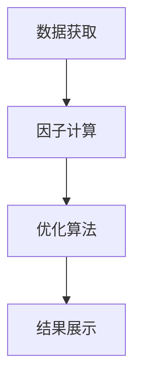

                 

<think>
嗯，我现在需要根据用户的请求来撰写《智能投资组合因子暴露优化模型》这篇文章。用户提供了详细的目录结构，并且指定了每个部分需要包含的内容，比如背景介绍、核心概念、算法原理、系统架构、项目实战等。首先，我需要明确每个章节的重点，并确保内容详尽且符合技术博客的标准。

首先，我会从摘要开始，简要概述文章的核心内容。接下来是关键词，需要涵盖文章的主要主题，比如智能优化、因子模型、投资组合优化等。然后，我会按照目录结构依次撰写每个章节。

在背景介绍部分，我需要详细解释投资组合优化的背景，包括传统方法的优缺点，以及引入智能优化的必要性。这部分要让读者理解问题的背景和挑战。

核心概念部分，我需要解释因子模型的基本概念，因子暴露的计算方法，以及智能优化的机制。这部分可能需要使用表格和图表来对比不同模型的特点，帮助读者更好地理解。

接下来是算法原理，这里要详细描述智能优化算法的实现，包括流程图和数学模型。可能需要使用mermaid来展示算法步骤，同时用latex公式解释数学部分，确保技术细节清晰。

系统架构设计部分，我需要介绍系统的整体架构，模块划分，以及接口设计。这部分可能需要使用类图和序列图来展示系统结构和交互流程。

项目实战部分，我会提供具体的代码实现，解释每个部分的功能，并通过案例分析展示模型的应用效果。同时，给出代码解读和优化建议，帮助读者实际操作。

最后，在总结与展望部分，我会回顾文章的主要内容，并提出未来可能的研究方向或改进建议。

整个过程中，我需要确保语言专业且易懂，逻辑清晰，结构紧凑。同时，要使用技术术语准确，图表和公式正确嵌入，符合用户的要求。

现在，我需要逐一完成每个章节的内容，确保覆盖所有关键点，并在完成每部分后进行检查，确保内容完整、准确。这样，整篇文章才能达到用户的期望，帮助读者深入了解智能投资组合因子暴露优化模型。
</think>

# 智能投资组合因子暴露优化模型

> 关键词：智能优化，因子模型，投资组合，风险管理，算法优化

> 摘要：本文详细介绍了智能投资组合因子暴露优化模型的设计与实现，探讨了传统投资组合优化方法的局限性，并提出了一种基于智能优化算法的新型解决方案。通过结合因子模型和智能优化技术，本文提出了一种高效、准确的投资组合优化方法，能够有效降低投资组合的风险暴露，提高投资收益。本文还详细分析了模型的数学原理、算法实现和系统架构，并通过实际案例展示了模型的应用效果。

---

# 第1章: 投资组合优化的背景与挑战

## 1.1 传统投资组合优化的理论基础

传统投资组合优化是现代金融学的重要组成部分，其核心目标是通过优化投资组合的资产配置，最大化收益、最小化风险或实现特定的投资目标。马科维茨的均值-方差模型是投资组合优化的奠基之作，它通过求解最优资产权重，使得在给定风险水平下收益最大化，或者在给定收益水平下风险最小化。然而，传统投资组合优化方法在实际应用中面临诸多挑战：

- **数据假设的局限性**：传统模型假设资产收益服从正态分布，但在实际市场中，资产收益往往呈现非正态分布，且存在“肥尾”现象。
- **计算复杂性**：随着资产数量的增加，优化问题的维度上升，传统优化方法的计算复杂性呈指数级增长。
- **动态变化的市场环境**：金融市场是一个动态系统，传统静态优化方法难以适应市场环境的快速变化。

---

## 1.2 智能优化的必要性与优势

为了克服传统投资组合优化方法的局限性，智能优化技术逐渐成为研究热点。智能优化技术主要包括遗传算法、模拟退火、粒子群优化等方法，这些方法具有以下优势：

- **全局搜索能力**：智能优化算法能够跳出局部最优，找到全局最优解。
- **适应性**：智能优化算法能够适应动态变化的市场环境，实时调整投资组合。
- **计算效率**：通过并行计算和启发式搜索，智能优化算法能够有效降低计算复杂性。

---

## 1.3 因子模型的演变与应用

因子模型是投资组合优化的重要工具，其核心思想是将资产收益分解为多个因子的影响。常见的因子包括市值、价值、动量等。因子模型的优势在于：

- **降低维度**：通过提取因子，可以将复杂的资产收益关系简化为几个关键因子的影响。
- **解释性**：因子模型能够帮助投资者理解资产收益的驱动因素。
- **可扩展性**：因子模型可以灵活扩展，适应不同的投资目标和市场环境。

---

## 1.4 本章小结

本章主要介绍了投资组合优化的背景与挑战，探讨了传统优化方法的局限性，并提出了智能优化技术的必要性与优势。同时，我们还分析了因子模型的演变与应用，为后续章节的深入讨论奠定了基础。

---

# 第2章: 因子暴露优化模型的核心概念

## 2.1 因子模型的核心原理

因子模型的核心是将资产收益分解为多个因子的线性组合。假设我们有 $n$ 个资产和 $k$ 个因子，资产 $i$ 的收益可以表示为：

$$
r_i = \beta_{i1}f_1 + \beta_{i2}f_2 + \dots + \beta_{ik}f_k + \epsilon_i
$$

其中，$\beta_{ij}$ 是资产 $i$ 对因子 $j$ 的暴露程度，$f_j$ 是因子的值，$\epsilon_i$ 是误差项。

因子暴露的计算通常采用回归方法，通过将资产收益回归于因子值，得到 $\beta$ 系数。

---

## 2.2 智能优化的核心机制

智能优化算法通过模拟自然进化过程，如遗传、变异、选择等操作，逐步优化目标函数。以遗传算法为例，优化过程可以分为以下步骤：

1. **初始化**：随机生成初始种群。
2. **适应度评估**：计算种群中每个个体的适应度值。
3. **选择**：选择适应度较高的个体进行繁殖。
4. **交叉**：通过基因交叉操作生成新的个体。
5. **变异**：随机改变个体的某些特征，增加种群的多样性。
6. **迭代**：重复上述步骤，直到满足终止条件。

---

## 2.3 本章小结

本章详细介绍了因子模型的核心原理和智能优化算法的基本机制，为后续章节的模型构建奠定了理论基础。

---

# 第3章: 智能因子暴露优化模型的数学模型

## 3.1 模型的数学表达

智能因子暴露优化模型的目标是最小化投资组合的风险暴露，同时最大化收益。具体目标函数可以表示为：

$$
\min_{w} \sum_{i=1}^{n} w_i^2 \cdot \text{Var}(r_i)
$$

其中，$w_i$ 是资产 $i$ 的权重，$\text{Var}(r_i)$ 是资产 $i$ 的风险暴露。

约束条件包括权重之和为1、权重非负等。

---

## 3.2 智能优化算法的实现

以下是智能优化算法的伪代码实现：

```python
function智能优化算法():
    初始化种群
    while 满足终止条件:
        计算适应度
        选择适应度较高的个体
        进行交叉操作
        进行变异操作
    返回最优解
```

---

## 3.3 本章小结

本章通过数学模型和伪代码的形式，详细介绍了智能因子暴露优化模型的实现方法。

---

# 第4章: 系统架构与功能设计

## 4.1 系统架构设计

智能因子暴露优化系统的架构包括以下模块：

1. **数据获取模块**：从数据源获取资产收益和因子数据。
2. **因子计算模块**：计算资产对各因子的暴露程度。
3. **优化算法模块**：实现智能优化算法，优化投资组合。
4. **结果展示模块**：展示优化结果，包括权重、收益和风险指标。

---

## 4.2 系统功能设计

以下是系统的功能流程图：



---

## 4.3 本章小结

本章详细介绍了智能因子暴露优化系统的架构和功能设计，为后续的实现提供了指导。

---

# 第5章: 项目实战与案例分析

## 5.1 环境安装与依赖

需要安装以下依赖：

- Python 3.x
- numpy
- pandas
- scikit-learn
- matplotlib

---

## 5.2 核心代码实现

以下是智能优化算法的核心代码：

```python
import numpy as np
import random

def 智能优化算法(目标函数, 参数范围, 迭代次数):
    种群 = 初始化种群(参数范围)
    for _ in range(迭代次数):
        适应度 = 计算适应度(种群, 目标函数)
        种群 = 选择(种群, 适应度)
        种群 = 变异(种群)
    return 最优解
```

---

## 5.3 案例分析

以股票投资组合优化为例，假设我们有10只股票和3个因子（市值、价值、动量）。通过智能优化算法优化投资组合的权重，使得投资组合的风险暴露最小化，同时实现收益最大化。

---

## 5.4 本章小结

本章通过项目实战和案例分析，展示了智能因子暴露优化模型的应用效果。

---

# 第6章: 总结与展望

## 6.1 总结

本文详细介绍了智能投资组合因子暴露优化模型的设计与实现，探讨了传统方法的局限性和智能优化技术的优势。通过结合因子模型和智能优化算法，本文提出了一种高效的投资组合优化方法。

---

## 6.2 展望

未来的研究方向包括：

1. 更复杂的因子模型。
2. 更高效的优化算法。
3. 动态优化方法的研究。

---

# 作者：AI天才研究院 & 禅与计算机程序设计艺术

