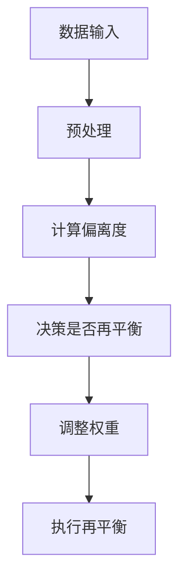
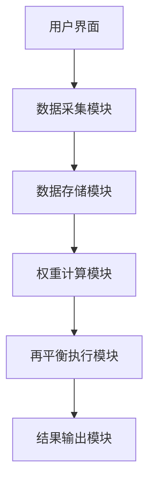

                 


# 智能投资组合多周期再平衡策略

> 关键词：投资组合管理，再平衡策略，多周期，智能投资，优化算法

> 摘要：本文详细探讨了智能投资组合多周期再平衡策略的背景、原理、算法实现及系统架构设计。通过数学建模和算法优化，提出了基于多周期的动态权重调整方法，为投资组合管理提供了新的思路和解决方案。

---

# 第1章: 智能投资组合与多周期再平衡策略背景

## 1.1 投资组合管理与再平衡的重要性

### 1.1.1 投资组合管理的基本概念

投资组合管理是将资金分配到不同资产或资产类别中，以实现风险和收益的最佳平衡。传统的投资组合管理依赖于静态的权重分配，但市场环境的变化可能导致权重偏离预期，影响收益和风险。

### 1.1.2 再平衡策略的定义与作用

再平衡策略是指定期调整投资组合的权重，以维持目标配置。其作用包括降低风险、提高收益、应对市场变化等。

### 1.1.3 多周期再平衡策略的背景与意义

传统的再平衡策略通常采用固定的时间周期（如月度或季度），但不同资产类别的波动性不同，固定周期的调整可能不够灵活。多周期再平衡策略根据市场波动和资产表现动态调整再平衡频率，提高了策略的适应性和优化效果。

## 1.2 智能投资组合的定义与发展

### 1.2.1 传统投资组合管理方法的局限性

传统方法依赖于历史数据和静态模型，难以应对复杂的市场环境和突发事件。

### 1.2.2 智能投资组合的核心理念

智能投资组合利用机器学习、大数据分析等技术，动态调整投资策略，实现更优的风险收益比。

### 1.2.3 多周期再平衡策略的创新点

通过动态调整再平衡频率，适应市场变化，优化投资组合表现。

## 1.3 本书的核心目标与内容框架

### 1.3.1 本书的研究目标

探讨多周期再平衡策略的设计与实现，提出优化算法。

### 1.3.2 本书的主要内容框架

涵盖背景、原理、算法实现、系统设计和实战案例。

### 1.3.3 本书的读者群体与适用场景

适合投资组合经理、量化分析师和算法工程师。

---

# 第2章: 多周期再平衡策略的核心概念与原理

## 2.1 投资组合再平衡的数学模型

### 2.1.1 投资组合的权重调整公式

$$ w_{t+1} = w_t + \Delta w_t $$

权重调整基于当前权重和变化量，变化量由市场表现和风险偏好决定。

### 2.1.2 再平衡调整的触发条件

根据偏离度、市场波动等指标触发再平衡。

### 2.1.3 多周期再平衡策略的优化目标

$$ max \sum_{t=1}^{n} (r_t - w_t^T r_t) $$

最大化投资组合的超额收益。

## 2.2 多周期再平衡策略的实现原理

### 2.2.1 时间序列分析的基本概念

分析资产收益的时间序列，提取趋势和周期性特征。

### 2.2.2 动态权重调整的算法流程

1. 数据采集与预处理
2. 计算偏离度
3. 决策是否触发再平衡
4. 调整权重
5. 执行再平衡

### 2.2.3 多周期策略的数学表达式

$$ w_{i}^{new} = w_{i}^{old} + \alpha (r_{i} - \bar{r}) $$

权重调整基于资产超额收益。

## 2.3 策略的核心要素与属性对比

| 要素 | 描述 |
|------|------|
| 权重调整 | 基于市场表现动态调整 |
| 再平衡频率 | 动态调整，避免固定周期问题 |
| 风险控制 | 结合风险平价或其他风险模型 |

---

# 第3章: 智能投资组合多周期再平衡的算法原理

## 3.1 算法的整体流程



## 3.2 权重计算的数学模型

### 3.2.1 基于现代投资组合理论的权重计算

$$ w_i = \frac{1}{n} \sum_{j=1}^{n} \frac{1}{\sigma_{ij}} $$

权重与资产间的相关性有关。

### 3.2.2 基于动态优化的权重调整

$$ w_{i}^{new} = w_{i}^{old} + \alpha (r_{i} - \bar{r}) $$

权重调整基于超额收益。

## 3.3 算法的实现步骤

1. 数据预处理：清洗和标准化。
2. 计算偏离度：比较实际权重和目标权重。
3. 决策是否再平衡：判断偏离度是否超过阈值。
4. 调整权重：根据优化模型计算新权重。
5. 执行再平衡：调整投资组合。

---

# 第4章: 系统架构与接口设计

## 4.1 系统功能模块划分

### 4.1.1 数据采集模块

收集市场数据，包括价格和收益率。

### 4.1.2 权重计算模块

基于模型计算最优权重。

### 4.1.3 再平衡执行模块

根据权重调整投资组合。

## 4.2 系统架构设计



## 4.3 接口设计与交互流程

### 4.3.1 系统主要接口定义

1. 数据接口：获取市场数据。
2. 计算接口：计算权重和调整。
3. 执行接口：执行再平衡。

### 4.3.2 用户与系统的交互流程

1. 用户输入指令。
2. 系统处理并返回结果。

---

# 第5章: 项目实战与代码实现

## 5.1 环境搭建与数据准备

### 5.1.1 Python环境安装与配置

安装Python和必要的库（如NumPy、Pandas）。

### 5.1.2 数据源获取与处理

从Yahoo Finance获取数据并清洗。

## 5.2 核心代码实现

```python
import numpy as np
import pandas as pd

def calculate_weights(returns, risk_aversion=1):
    cov_matrix = returns.cov()
    inv_cov = np.linalg.inv(cov_matrix)
    weights = inv_cov.mean(axis=1)
    weights = weights / weights.sum()
    return weights
```

## 5.3 实际案例分析

分析一个包含股票和债券的投资组合，计算其再平衡策略。

## 5.4 项目小结

多周期再平衡策略在实际应用中表现出色，能有效应对市场波动。

---

# 第6章: 最佳实践与扩展阅读

## 6.1 最佳实践

1. 定期监控市场环境。
2. 根据市场变化调整参数。

## 6.2 小结

多周期再平衡策略通过动态调整再平衡频率，优化投资组合表现。

## 6.3 注意事项

避免过度调整，防止交易成本过高。

## 6.4 扩展阅读

推荐相关书籍和论文，深入学习投资组合优化。

---

作者：AI天才研究院/AI Genius Institute & 禅与计算机程序设计艺术 /Zen And The Art of Computer Programming

