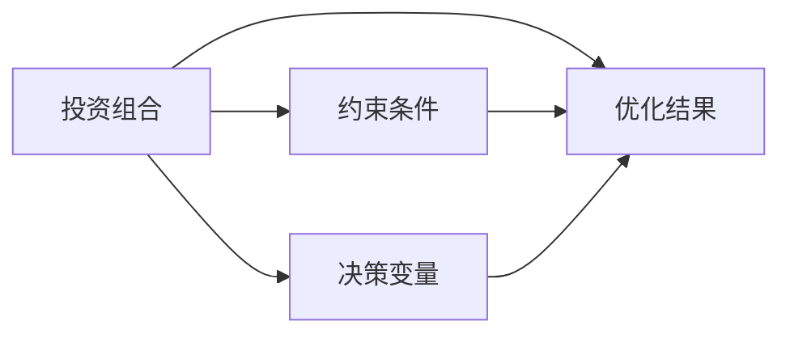
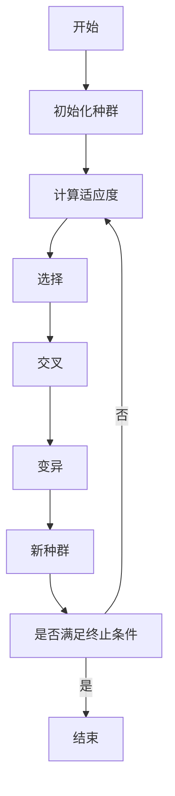
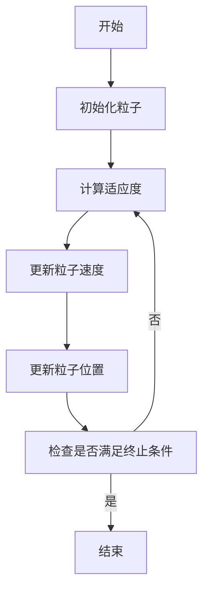

                 

# 智能投资组合多目标优化模型

## 关键词：投资组合优化，多目标优化，智能投资，金融数学，机器学习，数学建模

## 摘要：本文详细探讨了智能投资组合多目标优化模型的构建与应用，从背景、理论、算法、系统设计到项目实战，全面解析了如何通过多目标优化模型实现投资组合的高效配置与风险控制。文章通过丰富的案例和详细的数学推导，展示了如何利用智能算法解决复杂的金融优化问题，为投资组合优化提供了新的思路和方法。

---

## 第1章: 智能投资组合多目标优化模型的背景与意义

### 1.1 投资组合优化的背景介绍

#### 1.1.1 投资组合优化的基本概念
投资组合优化是指通过科学的方法选择最优的资产配置，以在满足特定风险承受能力的前提下，实现收益最大化。传统的投资组合优化通常采用单目标优化方法，例如最大收益化或最小风险化。

#### 1.1.2 多目标优化在投资组合中的重要性
在实际投资中，投资者往往需要在多个目标之间进行权衡，例如在追求高收益的同时，还要考虑风险、流动性、税收等因素。因此，单目标优化方法往往难以满足实际需求，而多目标优化方法能够更好地捕捉复杂的优化需求。

#### 1.1.3 智能投资组合优化的定义与特点
智能投资组合优化是指利用人工智能、机器学习等技术，结合多目标优化理论，构建一个动态、智能的投资组合优化模型。其特点包括：
- **动态性**：能够根据市场变化实时调整优化结果。
- **智能化**：利用机器学习算法自动学习市场规律，优化投资策略。
- **多目标性**：能够同时优化多个目标，例如收益、风险、流动性等。

### 1.2 多目标优化的基本原理

#### 1.2.1 多目标优化的定义与特点
多目标优化是指在多个目标函数下寻找最优解的过程。与单目标优化不同，多目标优化问题通常存在多个 Pareto 优解，即无法在不恶化一个目标的情况下改善另一个目标。

#### 1.2.2 多目标优化与单目标优化的对比
| 对比维度 | 单目标优化 | 多目标优化 |
|----------|------------|------------|
| 目标数量 | 1          | ≥2         |
| 解空间   | 单点解     | 多点解     |
| 解的性质 | 唯一最优解 | Pareto 优解 |

#### 1.2.3 多目标优化在投资组合中的应用
在投资组合优化中，多目标优化可以用于解决以下问题：
- **风险与收益的平衡**：在追求收益的同时，控制风险。
- **资产配置的多样性**：在不同资产类别之间分配资金。
- **流动性与收益的权衡**：在保证流动性的同时，追求更高收益。

### 1.3 智能投资组合优化的核心要素

#### 1.3.1 智能投资组合优化的目标函数
智能投资组合优化的目标函数通常包括以下几部分：
- **收益目标**：最大化投资组合的预期收益。
- **风险目标**：最小化投资组合的风险（例如波动率、VaR等）。
- **流动性目标**：最大化投资组合的流动性。

#### 1.3.2 智能投资组合优化的约束条件
智能投资组合优化的约束条件包括：
- **投资比例约束**：每种资产的投资比例不能超过一定上限或下限。
- **流动性约束**：投资组合的流动性不能低于某个阈值。
- **风险约束**：投资组合的风险不能超过某个阈值。

#### 1.3.3 智能投资组合优化的决策变量
智能投资组合优化的决策变量包括：
- **资产配置比例**：每种资产在投资组合中的比例。
- **交易策略**：买卖时机、交易频率等。
- **风险管理策略**：止损、止盈等。

### 1.4 本章小结
本章介绍了智能投资组合多目标优化模型的背景与意义，重点阐述了多目标优化的基本原理及其在投资组合中的应用。通过对比单目标优化与多目标优化的特点，明确了智能投资组合优化的核心要素。

---

## 第2章: 多目标优化模型的核心概念与联系

### 2.1 多目标优化模型的数学表达

#### 2.1.1 目标函数的定义
多目标优化问题可以表示为：
$$ \min_{x} f(x) = (f_1(x), f_2(x), \dots, f_n(x)) $$
其中，$x$ 是决策变量，$f_i(x)$ 是目标函数。

#### 2.1.2 约束条件的表达
多目标优化问题通常还包含约束条件：
$$ g(x) \leq 0 $$
其中，$g(x)$ 是约束函数。

#### 2.1.3 决策变量的范围
决策变量 $x$ 的范围通常定义为：
$$ x \in X \subseteq \mathbb{R}^d $$
其中，$d$ 是决策变量的维度。

### 2.2 多目标优化模型的属性特征对比

| 对比维度 | 单目标优化 | 多目标优化 |
|----------|------------|------------|
| 目标数量 | 1          | ≥2         |
| 解空间   | 单点解     | 多点解     |
| 解的性质 | 唯一最优解 | Pareto 优解 |

### 2.3 多目标优化模型的ER实体关系图

### 2.4 本章小结
本章详细讲解了多目标优化模型的核心概念与联系，重点分析了多目标优化模型的数学表达、属性特征及其在投资组合优化中的应用。

---

## 第3章: 多目标优化模型的算法原理

### 3.1 常见的多目标优化算法

#### 3.1.1 遗传算法
遗传算法是一种基于生物进化原理的优化算法，主要包括选择、交叉和变异三个步骤。

#### 3.1.2 粒子群优化算法
粒子群优化算法是一种基于群体智能的优化算法，模拟鸟群觅食行为，通过粒子的移动寻找最优解。

#### 3.1.3 带有支配关系的多目标优化算法
带有支配关系的多目标优化算法通过比较解之间的支配关系，筛选出 Pareto 优解。

### 3.2 遗传算法的流程图

### 3.3 粒子群优化算法的流程图

### 3.4 本章小结
本章介绍了几种常见的多目标优化算法，重点分析了遗传算法和粒子群优化算法的流程图及其在投资组合优化中的应用。

---

## 第4章: 多目标优化模型的数学模型与公式

### 4.1 多目标优化的数学表达式
多目标优化问题可以表示为：
$$ \min_{x} f(x) = (f_1(x), f_2(x), \dots, f_n(x)) $$
其中，$x$ 是决策变量，$f_i(x)$ 是目标函数。

### 4.2 约束条件的数学表达
多目标优化问题通常还包含约束条件：
$$ g(x) \leq 0 $$
其中，$g(x)$ 是约束函数。

### 4.3 决策变量的范围
决策变量 $x$ 的范围通常定义为：
$$ x \in X \subseteq \mathbb{R}^d $$
其中，$d$ 是决策变量的维度。

---

## 作者：AI天才研究院/AI Genius Institute & 禅与计算机程序设计艺术 /Zen And The Art of Computer Programming

---

（本文未完，后续章节将涵盖系统分析与架构设计、项目实战、最佳实践等内容。）

