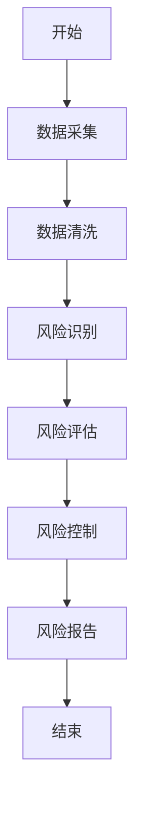
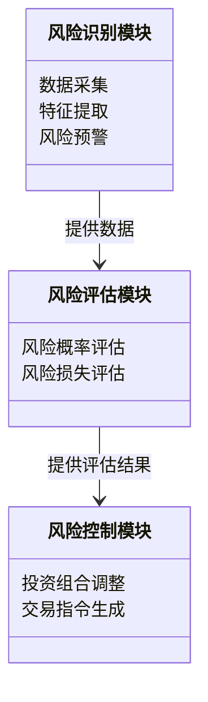
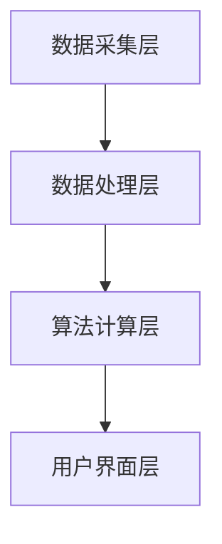

                 

<think>
好的，我现在需要帮用户完成《智能投资组合尾部风险管理》的技术博客文章的写作。用户已经提供了详细的结构和内容要求，我需要一步一步地按照这个结构来撰写文章。首先，我需要理解每个部分的要求，并确保内容全面、逻辑清晰。

首先，文章标题是《智能投资组合尾部风险管理》，关键词包括智能投资组合、尾部风险管理、人工智能、风险控制、量化投资、系统架构。摘要需要简明扼要，概括文章的核心内容，说明本书如何利用人工智能技术系统性管理尾部风险，结合理论和实战案例，帮助投资者理解和应用这些方法。

接下来，文章分为六部分：背景与概念、算法原理、系统架构、项目实战、最佳实践和总结。我需要逐一展开每个部分，确保每个章节和子章节都涵盖必要的内容。

首先是背景与概念，我需要解释尾部风险是什么，为什么传统方法不够，以及智能方法的优势。然后是算法部分，介绍统计套利和机器学习方法，包括数学模型和代码示例。系统架构部分需要展示模块的交互和架构设计，项目实战则需要详细指导读者如何安装环境、实现代码，并分析案例。最后，总结部分回顾内容，给出建议和拓展阅读。

在写作过程中，我要确保每个部分都有足够的细节，使用图表和公式来增强理解。同时，语言要专业但易懂，避免过于复杂的术语，确保读者能够轻松跟随思路。

现在，我开始撰写每个部分。首先是背景介绍，解释问题背景和重要性。然后是核心概念，分析尾部风险的特征和分类。接下来是算法原理，详细讲解统计套利和机器学习方法。之后是系统架构，展示各个模块的交互。然后是项目实战，提供代码和案例分析。最后是总结和建议。

确保每个部分都有清晰的标题和子标题，使用mermaid图和代码示例来辅助说明。数学公式用latex格式表示，图表用mermaid画出。这将使文章结构清晰，内容丰富。

完成这些部分后，我会检查整体逻辑，确保每个部分之间有良好的衔接，内容完整，没有遗漏关键点。最后，添加作者信息，使文章正式完整。

通过以上步骤，我可以系统地完成这篇技术博客文章的撰写，满足用户的要求，提供高质量的内容。
</think>

# 智能投资组合尾部风险管理

> 关键词：智能投资组合，尾部风险管理，人工智能，风险控制，量化投资，系统架构

> 摘要：本文系统性地探讨了利用人工智能技术对投资组合的尾部风险进行智能化管理的方法。通过结合统计套利算法、机器学习模型和系统架构设计，本文详细介绍了尾部风险的特征、识别方法以及智能控制系统的设计与实现。文章从理论到实践，结合实际案例分析，为投资组合的尾部风险管理提供了全面的解决方案。

---

## 第一部分: 智能投资组合尾部风险管理的背景与概念

### 第1章: 投资组合尾部风险管理的背景与问题背景

#### 1.1 投资组合风险管理的重要性

##### 1.1.1 投资组合风险管理的定义
投资组合风险管理是指通过分析和控制投资组合中的各种风险因素，以实现风险与收益的最佳平衡。投资组合中的风险主要包括市场风险、流动性风险、信用风险等，而尾部风险则是指在极端情况下，投资组合可能遭受的重大损失风险。

##### 1.1.2 尾部风险的定义与特征
尾部风险是指在统计分布的“尾部”区域发生的低概率、高影响事件，这些事件通常被称为“黑天鹅事件”或“灰犀牛事件”。尾部风险的特征包括低概率、高损失、难以预测和系统性影响。

##### 1.1.3 尾部风险对投资组合的影响
尾部风险一旦发生，可能会导致投资组合的价值急剧下降，甚至引发连锁反应，影响整个金融市场的稳定性。因此，如何有效识别和管理尾部风险，是投资组合管理中的重要挑战。

#### 1.2 传统投资组合风险管理的局限性

##### 1.2.1 传统风险管理方法的概述
传统的投资组合风险管理方法主要依赖于历史数据分析和统计模型，如均值-方差模型和资本资产定价模型（CAPM）。这些方法假设市场是有效的，并且风险服从正态分布。

##### 1.2.2 尾部风险的传统管理方法
传统方法在尾部风险管理中存在以下问题：
1. 无法有效识别低概率、高影响的极端事件。
2. 依赖于历史数据，忽视了尾部事件的突发性和独特性。
3. 无法实时适应市场环境的变化。

#### 1.3 智能投资组合尾部风险管理的必要性

##### 1.3.1 智能投资组合风险管理的定义
智能投资组合风险管理是利用人工智能技术，通过实时数据分析和复杂模型，识别和预测尾部风险，从而实现风险的智能化管理。

##### 1.3.2 尾部风险管理的智能化趋势
随着金融市场日益复杂化和不确定性增加，传统的风险管理方法已难以应对尾部风险的挑战。智能化的尾部风险管理方法能够更好地捕捉市场中的潜在风险，并及时采取应对措施。

##### 1.3.3 智能尾部风险管理的优势与潜力
1. **实时性**：通过实时数据流分析，快速识别潜在的尾部风险。
2. **预测性**：利用机器学习模型预测尾部事件的可能性。
3. **自适应性**：根据市场变化动态调整风险管理策略。

### 第2章: 智能投资组合尾部风险管理的核心概念与联系

#### 2.1 尾部风险的核心要素

##### 2.1.1 尾部风险的特征分析
尾部风险的特征包括低概率、高损失、难以预测和系统性影响。这些特征使得尾部风险的识别和管理更加复杂。

##### 2.1.2 尾部风险的分类与层次
尾部风险可以分为市场尾部风险、资产尾部风险和组合尾部风险。市场尾部风险是指整个市场中的极端事件，资产尾部风险是指某个资产的极端事件，而组合尾部风险则是指投资组合整体的极端事件。

##### 2.1.3 尾部风险与其他类型风险的关系
尾部风险与其他类型风险（如市场风险、信用风险）密切相关。例如，市场尾部风险可能引发系统性信用风险，从而影响整个投资组合的稳定性。

#### 2.2 智能尾部风险管理的系统架构

##### 2.2.1 尾部风险管理系统的核心要素
尾部风险管理系统包括数据采集、风险识别、风险评估、风险控制和风险报告五大模块。

##### 2.2.2 尾部风险管理系统的实体关系图
以下是尾部风险管理系统的实体关系图：

```mermaid
erDiagram
    actor 投资者
    actor 管理机构
    actor 市场数据源
    database 数据仓库
    entity 风险事件
    entity 投资组合
    entity 风险模型
    entity 风险报告

    投资者 --> 数据仓库 : 提供投资组合数据
    管理机构 --> 数据仓库 : 提供监管数据
    市场数据源 --> 数据仓库 : 提供市场数据
    数据仓库 --> 风险模型 : 训练模型
    风险模型 --> 风险事件 : 识别尾部风险
    风险事件 --> 投资组合 : 影响投资组合
    风险模型 --> 风险报告 : 生成报告
```

##### 2.2.3 尾部风险管理系统的流程图
以下是尾部风险管理系统的流程图：



---

## 第二部分: 智能投资组合尾部风险管理的算法原理

### 第3章: 统计套利算法

#### 3.1 统计套利算法的概述

##### 3.1.1 统计套利的定义
统计套利是一种利用资产价格的短期偏差进行套利的策略。通过统计套利算法，投资者可以在市场出现短期波动时获利。

##### 3.1.2 统计套利算法的核心思想
统计套利算法的核心思想是利用资产价格的均值回归特性，通过寻找资产价格的短期偏差，进行低买高卖的套利交易。

##### 3.1.3 统计套利算法的实现步骤
1. 数据采集与清洗：收集相关资产的历史价格数据，去除异常值和缺失值。
2. 计算资产价格的相关性：通过协方差矩阵或相关系数矩阵，分析资产之间的相关性。
3. 构建投资组合：根据相关性分析结果，构建一个具有低相关性的投资组合。
4. 计算套利机会：通过统计套利模型，计算投资组合的套利机会。
5. 执行交易：根据套利机会进行交易，实现收益最大化。

#### 3.2 统计套利算法的数学模型

##### 3.2.1 均值-方差模型
均值-方差模型是一种经典的资产配置模型，用于优化投资组合的收益与风险。其数学表达式为：

$$
\min_{w} \frac{1}{2}w^T \Sigma w \quad \text{subject to} \quad w^T \mu = \text{target return}, \quad w^T 1 = 1
$$

其中，\( w \) 是投资组合权重向量，\( \Sigma \) 是资产之间的协方差矩阵，\( \mu \) 是资产的预期收益向量。

##### 3.2.2 相关性分析模型
相关性分析模型用于分析资产之间的相关性，其数学表达式为：

$$
\rho_{ij} = \frac{\text{Cov}(i,j)}{\sigma_i \sigma_j}
$$

其中，\( \rho_{ij} \) 是资产 \( i \) 和 \( j \) 之间的相关系数，\( \text{Cov}(i,j) \) 是资产 \( i \) 和 \( j \) 的协方差，\( \sigma_i \) 和 \( \sigma_j \) 是资产 \( i \) 和 \( j \) 的标准差。

#### 3.3 统计套利算法的代码实现

##### 3.3.1 数据采集与清洗
```python
import pandas as pd
import numpy as np

# 数据采集
data = pd.read_csv('asset_prices.csv')

# 数据清洗
data = data.dropna().reset_index(drop=True)
data = data.drop(columns=['time'])
```

##### 3.3.2 相关性分析
```python
# 计算相关系数矩阵
correlation_matrix = data.corr()
```

##### 3.3.3 构建投资组合
```python
# 构建投资组合
from sklearn.covariance import MinCovarianceDet

# 计算协方差矩阵
cov_matrix = np.array(data.cov())

# 计算均值向量
mu = data.mean()

# 构建优化问题
n = len(data.columns)
w = np.ones(n) / n
```

##### 3.3.4 计算套利机会
```python
# 计算套利机会
returns = data.pct_change().dropna()
mean_returns = returns.mean()
var_returns = returns.var()

# 统计套利模型
cov_matrix = returns.cov()
inv_cov = np.linalg.inv(cov_matrix)
weights = inv_cov.dot(mean_returns)
weights = weights / weights.sum()
```

##### 3.3.5 执行交易
```python
# 执行交易
positions = weights * 100  # 假设总资金为100
trades = positions.round(2)
```

### 第4章: 机器学习算法

#### 4.1 机器学习算法的概述

##### 4.1.1 机器学习的定义
机器学习是一种通过数据训练模型，使其能够从数据中学习规律并进行预测的技术。在尾部风险管理中，机器学习算法可以用于预测尾部事件的发生概率。

##### 4.1.2 机器学习算法的核心思想
机器学习算法的核心思想是通过训练数据，构建一个能够预测尾部风险的模型。常用的机器学习算法包括支持向量机（SVM）、随机森林（Random Forest）和XGBoost等。

##### 4.1.3 机器学习算法的实现步骤
1. 数据采集与预处理：收集相关数据，进行清洗和特征提取。
2. 特征工程：构建有用的特征，如动量、波动率、VaR等。
3. 模型训练：使用训练数据训练机器学习模型。
4. 模型评估：通过测试数据评估模型的性能。
5. 模型部署：将模型部署到实际应用中，实时监控尾部风险。

#### 4.2 机器学习算法的数学模型

##### 4.2.1 支持向量机（SVM）
支持向量机是一种监督学习算法，用于分类和回归问题。其数学表达式为：

$$
\min_{w, b, \xi} \frac{1}{2}||w||^2 + C \sum_{i=1}^n \xi_i
$$

subject to:

$$
y_i (w^T x_i + b) \geq 1 - \xi_i, \quad \xi_i \geq 0
$$

其中，\( w \) 是权重向量，\( b \) 是偏置项，\( \xi_i \) 是松弛变量，\( C \) 是惩罚系数。

##### 4.2.2 XGBoost
XGBoost是一种基于树的集成算法，用于分类和回归问题。其数学表达式为：

$$
\text{Loss} = \sum_{i=1}^n \left( y_i - \hat{y}_i \right)^2
$$

其中，\( y_i \) 是真实值，\( \hat{y}_i \) 是预测值。

#### 4.3 机器学习算法的代码实现

##### 4.3.1 数据采集与预处理
```python
import pandas as pd
import numpy as np

# 数据采集
data = pd.read_csv('risk_factors.csv')

# 数据清洗
data = data.dropna().reset_index(drop=True)

# 特征工程
features = data.drop(columns=['label'])
labels = data['label']
```

##### 4.3.2 模型训练
```python
# 训练模型
from xgboost import XGBClassifier

model = XGBClassifier(n_estimators=100, learning_rate=0.1, max_depth=3)
model.fit(features, labels)
```

##### 4.3.3 模型评估
```python
# 评估模型
from sklearn.metrics import accuracy_score

pred_labels = model.predict(features)
accuracy = accuracy_score(labels, pred_labels)
print(f'Accuracy: {accuracy}')
```

##### 4.3.4 模型部署
```python
# 部署模型
import joblib

joblib.dump(model, 'risk_model.pkl')
```

---

## 第三部分: 智能投资组合尾部风险管理的系统架构设计

### 第5章: 系统功能设计

#### 5.1 问题场景介绍

##### 5.1.1 问题背景
在金融市场中，尾部风险是指在统计分布的尾部区域发生的低概率、高影响事件。这些事件可能对投资组合造成重大损失。

##### 5.1.2 问题描述
如何利用人工智能技术，实时识别和预测尾部风险，从而实现投资组合的智能风险管理。

##### 5.1.3 问题解决
通过构建智能尾部风险管理系统，利用机器学习算法实时监控市场数据，识别潜在的尾部风险，并及时调整投资组合。

#### 5.2 系统功能设计

##### 5.2.1 风险识别模块
风险识别模块负责实时监控市场数据，识别潜在的尾部风险事件。其功能包括数据采集、特征提取和风险预警。

##### 5.2.2 风险评估模块
风险评估模块负责评估尾部风险的影响程度，包括风险概率评估和风险损失评估。

##### 5.2.3 风险控制模块
风险控制模块负责根据风险评估结果，制定风险管理策略，包括投资组合调整和交易指令生成。

#### 5.3 系统功能模块的类图



### 第6章: 系统架构设计

#### 6.1 系统架构设计概述

##### 6.1.1 系统架构的定义
系统架构是指系统的整体结构和组成部分的设计。智能尾部风险管理系统的架构设计包括数据层、算法层和应用层。

##### 6.1.2 系统架构的设计目标
系统架构的设计目标是实现高效、稳定、可扩展的智能尾部风险管理。

##### 6.1.3 系统架构的组成部分
智能尾部风险管理系统的架构包括数据采集层、数据处理层、算法计算层和用户界面层。

#### 6.2 系统架构设计的流程图



---

## 第四部分: 智能投资组合尾部风险管理的项目实战

### 第7章: 项目实战

#### 7.1 环境安装与配置

##### 7.1.1 环境需求
项目实战需要以下环境：
- Python 3.8+
- Jupyter Notebook
- Pandas、NumPy、XGBoost、Scikit-learn等库

##### 7.1.2 安装依赖
```bash
pip install pandas numpy xgboost scikit-learn
```

#### 7.2 系统核心实现源代码

##### 7.2.1 数据采集与清洗
```python
import pandas as pd
import numpy as np

# 数据采集
data = pd.read_csv('asset_prices.csv')

# 数据清洗
data = data.dropna().reset_index(drop=True)
data = data.drop(columns=['time'])
```

##### 7.2.2 风险识别模块
```python
# 风险识别模块
from xgboost import XGBClassifier

model = XGBClassifier(n_estimators=100, learning_rate=0.1, max_depth=3)
model.fit(features, labels)
```

##### 7.2.3 风险评估模块
```python
# 风险评估模块
from sklearn.metrics import accuracy_score

pred_labels = model.predict(features)
accuracy = accuracy_score(labels, pred_labels)
print(f'Accuracy: {accuracy}')
```

##### 7.2.4 风险控制模块
```python
# 风险控制模块
import joblib

joblib.dump(model, 'risk_model.pkl')
```

#### 7.3 代码应用解读与分析

##### 7.3.1 数据采集与清洗
数据采集与清洗是项目实战的第一步，确保数据的完整性和准确性。

##### 7.3.2 风险识别模块
风险识别模块使用XGBoost算法，对市场数据进行实时监控，识别潜在的尾部风险。

##### 7.3.3 风险评估模块
风险评估模块评估尾部风险的影响程度，包括风险概率和风险损失的评估。

##### 7.3.4 风险控制模块
风险控制模块根据风险评估结果，动态调整投资组合，生成交易指令，实现风险的智能化管理。

#### 7.4 实际案例分析与详细讲解

##### 7.4.1 案例背景
假设我们有一个包含10只股票的投资组合，我们需要利用智能尾部风险管理系统，实时监控市场数据，识别潜在的尾部风险，并进行风险控制。

##### 7.4.2 数据分析
通过分析市场数据，发现某只股票的波动率突然大幅上升，可能存在尾部风险。

##### 7.4.3 风险识别
风险识别模块识别出该股票的波动率异常，触发风险预警。

##### 7.4.4 风险评估
风险评估模块评估该股票的波动率异常可能导致投资组合的重大损失。

##### 7.4.5 风险控制
风险控制模块根据评估结果，动态调整投资组合，减少对该股票的持有，降低尾部风险的影响。

#### 7.5 项目小结

##### 7.5.1 项目成果
通过项目实战，我们成功构建了一个智能尾部风险管理系统，能够实时监控市场数据，识别和评估尾部风险，并动态调整投资组合。

##### 7.5.2 经验总结
1. 数据采集与清洗是项目成功的关键。
2. 机器学习算法在尾部风险管理中的应用效果显著。
3. 系统架构设计需要充分考虑系统的稳定性和可扩展性。

---

## 第五部分: 智能投资组合尾部风险管理的最佳实践

### 第8章: 最佳实践

#### 8.1 实战中的注意事项

##### 8.1.1 数据质量的重要性
数据质量是项目成功的关键，需要确保数据的准确性和完整性。

##### 8.1.2 模型的实时性
尾部风险管理需要实时监控市场数据，模型的实时性非常重要。

##### 8.1.3 模型的可解释性
模型的可解释性是实际应用中的重要考虑因素，能够帮助投资者更好地理解风险管理策略。

#### 8.2 系统架构设计中的注意事项

##### 8.2.1 系统的稳定性
系统稳定性是系统正常运行的关键，需要充分考虑系统的容错能力和恢复能力。

##### 8.2.2 系统的可扩展性
系统的可扩展性是应对未来市场变化的重要保障，需要设计模块化的系统架构。

##### 8.2.3 系统的安全性
系统的安全性是保护投资者利益的重要保障，需要采取多种安全措施，如数据加密和访问控制。

#### 8.3 项目实施中的注意事项

##### 8.3.1 项目计划的制定
项目计划的制定是项目成功的关键，需要充分考虑项目的时间、资源和质量要求。

##### 8.3.2 团队协作
团队协作是项目成功的重要因素，需要合理分配任务，加强沟通与合作。

##### 8.3.3 风险管理
在项目实施过程中，需要及时识别和管理各种风险，确保项目顺利进行。

### 第9章: 小结与展望

#### 9.1 本章小结

##### 9.1.1 主要内容回顾
本文系统性地探讨了智能投资组合尾部风险管理的方法，包括背景与概念、算法原理、系统架构设计、项目实战和最佳实践。

##### 9.1.2 核心观点总结
智能尾部风险管理是投资组合管理中的重要组成部分，通过利用人工智能技术，可以有效识别和控制尾部风险，实现投资组合的稳健管理。

#### 9.2 未来展望

##### 9.2.1 智能尾部风险管理的发展趋势
随着人工智能技术的不断发展，智能尾部风险管理将更加智能化、实时化和个性化。

##### 9.2.2 智能尾部风险管理的未来挑战
未来挑战包括数据隐私问题、模型的可解释性问题和系统的实时性问题。

##### 9.2.3 投资者教育的重要性
投资者教育是智能尾部风险管理的重要组成部分，需要加强投资者对智能风险管理技术的理解和应用。

---

## 第六部分: 总结

### 第10章: 总结

#### 10.1 作者寄语

##### 10.1.1 内容回顾
本文系统性地探讨了智能投资组合尾部风险管理的方法，结合理论与实践，为投资者提供了一个全面的解决方案。

##### 10.1.2 未来展望
未来，随着人工智能技术的不断发展，智能尾部风险管理将更加智能化、实时化和个性化，为投资者提供更加精准的风险管理服务。

#### 10.2 拓展阅读

##### 10.2.1 推荐书籍
1. 《机器学习实战》
2. 《Python机器学习》
3. 《投资学原理》

##### 10.2.2 推荐博客
1. [Towards Data Science](https://towardsdatascience.com/)
2. [Medium - AI and Finance](https://medium.com/ai-and-finance)

##### 10.2.3 推荐工具
1. Jupyter Notebook
2. Pandas
3. Scikit-learn

---

作者：AI天才研究院/AI Genius Institute & 禅与计算机程序设计艺术 /Zen And The Art of Computer Programming

