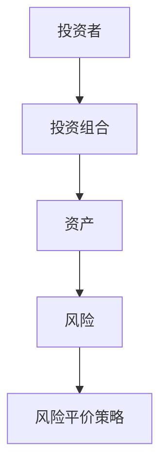
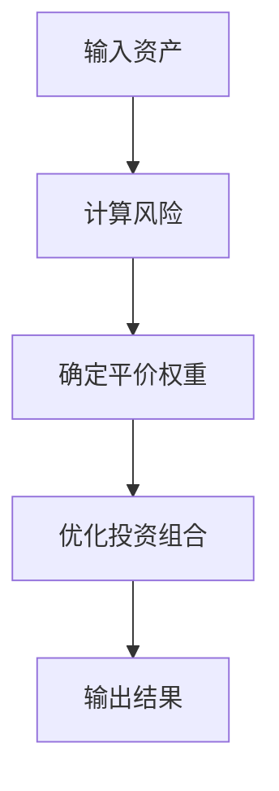
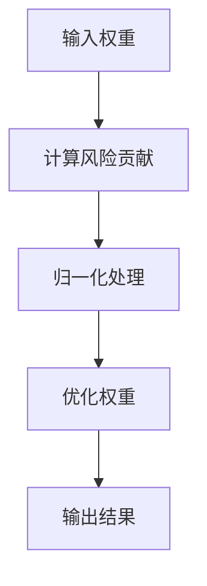
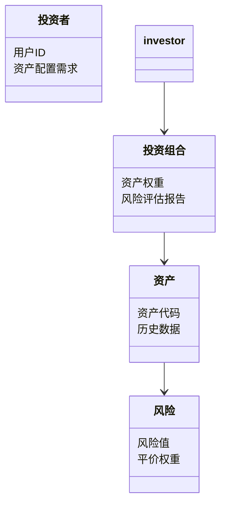
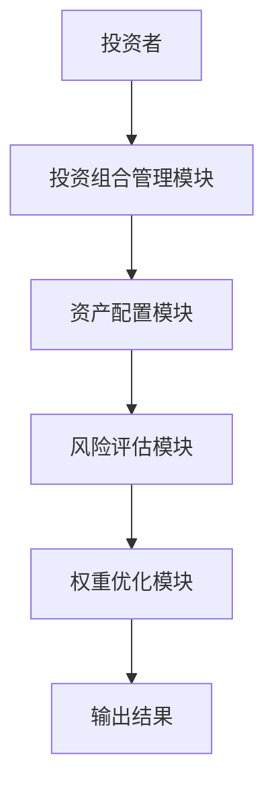

                 


# 智能投资组合风险平价策略优化

---

## 关键词：智能投资组合，风险平价，优化策略，机器学习，投资组合管理，风险管理

---

## 摘要：  
随着金融市场的日益复杂化和波动性增加，传统的投资组合管理方法已难以满足现代投资者的需求。本文深入探讨了智能投资组合风险平价策略的优化方法，结合机器学习和大数据分析，提出了一种高效的风险平价策略。通过分析风险平价的核心原理、算法实现和系统架构设计，本文为投资者提供了一套科学的投资组合优化方案，旨在降低投资风险，提高收益稳定性。

---

## 目录大纲

---

# 第1章：智能投资组合风险平价策略概述

## 1.1 投资组合风险平价的背景与问题背景

### 1.1.1 投资组合风险平价的定义与目标  
- **定义**：风险平价策略是一种通过调整资产权重，使各资产对投资组合的风险贡献相等的方法。  
- **目标**：实现投资组合的风险分散，降低尾部风险，提高收益稳定性。  

### 1.1.2 传统投资组合管理的局限性  
- 传统均值-方差优化的缺陷：对尾部风险的忽视，权重分配不合理。  
- 资产价格波动性增加：传统方法难以应对复杂市场环境。  

### 1.1.3 风险平价策略的核心问题  
- 如何科学分配资产权重，实现风险平价。  
- 如何在复杂市场中动态调整权重，适应市场变化。  

## 1.2 智能投资组合风险平价的定义与特点

### 1.2.1 智能投资组合的定义  
- 利用人工智能和大数据技术优化投资组合配置。  
- 基于动态数据调整权重，实现智能投资决策。  

### 1.2.2 风险平价策略的实现方式  
- **基于统计的方法**：通过协方差矩阵计算资产风险贡献。  
- **基于机器学习的方法**：利用回归分析和聚类算法优化权重分配。  

### 1.2.3 智能投资组合风险平价的优势  
- 提高风险分散能力。  
- 适应市场波动，动态调整权重。  

## 1.3 风险平价策略的应用场景与边界

### 1.3.1 风险平价策略的主要应用场景  
- 多资产配置：股票、债券、商品等多类资产的组合优化。  
- 对冲基金：通过风险平价降低回撤风险。  

### 1.3.2 风险平价策略的边界与限制  
- 适用于中长期投资，短期波动难以预测。  
- 数据依赖性：需要大量历史数据支持。  

### 1.3.3 风险平价策略与其他投资策略的关系  
- 与均值-方差优化的结合：利用风险平价降低尾部风险。  
- 与因子投资的结合：通过因子分析优化权重分配。  

## 1.4 本章小结  
本章介绍了风险平价策略的核心概念、实现方式和应用场景，为后续章节的深入分析奠定了基础。

---

# 第2章：风险平价策略的核心概念与联系

## 2.1 风险平价策略的核心原理

### 2.1.1 风险平价的数学模型  
- **风险贡献公式**：$w_i = \frac{1}{\sum_{j=1}^{n} \frac{\sigma_j^2}{\sigma_i^2}}$  
- **优化目标**：$\min_{w} \sum_{i=1}^{n} w_i \sigma_i^2 = 1$  

### 2.1.2 风险平价与资产配置的关系  
- 风险平价是一种特殊的资产配置方法，强调风险贡献的均衡。  

### 2.1.3 风险平价策略的优化目标  
- 实现投资组合的风险分散，降低尾部风险。  

## 2.2 核心概念的对比分析

### 2.2.1 风险平价与传统投资策略的对比  
| 对比维度      | 风险平价策略         | 传统均值-方差优化   |
|---------------|----------------------|--------------------|
| 优化目标      | 风险分散             | 收益最大化           |
| 权重分配方式    | 风险贡献均衡         | 方差最小化           |
| 适用场景      | 多资产配置           | 单一资产优化         |

### 2.2.2 不同风险平价方法的特征对比  
| 方法类型      | 基于统计的方法       | 基于机器学习的方法   |
|---------------|----------------------|--------------------|
| 输入数据      | 历史协方差矩阵       | 多维特征数据         |
| 计算复杂度    | 较低                 | 较高                 |
| 适应性        | 较差                 | 较好                 |

### 2.2.3 风险平价策略与机器学习算法的结合  
- 使用回归分析预测资产风险。  
- 利用聚类算法优化权重分配。  

## 2.3 实体关系图与流程图

### 2.3.1 风险平价策略的ER实体关系图  


### 2.3.2 风险平价策略的流程图  


## 2.4 本章小结  
本章通过对比分析和流程图展示了风险平价策略的核心概念和实现方式，为后续算法实现奠定了基础。

---

# 第3章：风险平价策略的算法原理

## 3.1 风险平价算法的数学模型

### 3.1.1 风险平价的数学公式  
- 风险贡献计算：$C_i = w_i \cdot \sigma_i^2$  
- 平价条件：$\sum_{i=1}^{n} C_i = 1$  

### 3.1.2 风险平价算法的优化目标  
- $\min_{w} \sum_{i=1}^{n} w_i \sigma_i^2 = 1$  

### 3.1.3 风险平价算法的实现步骤  
1. 计算各资产的协方差矩阵。  
2. 确定各资产的风险贡献权重。  
3. 优化权重分配，实现风险平价。  

## 3.2 风险平价算法的实现流程

### 3.2.1 数据预处理  
- 清洗数据，处理缺失值。  
- 标准化数据，消除量纲影响。  

### 3.2.2 计算资产风险  
- 计算各资产的方差和协方差。  
- 确定风险贡献权重。  

### 3.2.3 确定平价权重  
- 建立优化模型，求解权重分配。  
- 确保平价条件满足。  

### 3.2.4 优化投资组合  
- 使用优化算法调整权重，降低风险。  
- 验证优化结果的有效性。  

## 3.3 风险平价算法的Python实现

### 3.3.1 核心代码实现  
```python
import numpy as np

def risk_parity(weights, covariance_matrix):
    # 计算各资产的风险贡献
    risk_contributions = weights * np.dot(weights, covariance_matrix)
    # 归一化风险贡献
    risk_contributions /= np.sum(risk_contributions)
    return risk_contributions
```

### 3.3.2 优化算法实现  
```python
from scipy.optimize import minimize

def optimize_portfolio(n_assets, covariance_matrix):
    # 初始化权重向量
    initial_weights = np.array([1.0/n_assets] * n_assets)
    # 定义优化目标函数
    def objective(weights):
        return -np.sum(weights * np.dot(weights, covariance_matrix))
    # 定义约束条件
    constraints = [{'type': 'eq', 'fun': lambda w: np.sum(w) - 1}]
    # 使用SLSQP算法优化
    result = minimize(objective, initial_weights, constraints=constraints, method='SLSQP')
    return result.x
```

### 3.3.3 算法流程图  


## 3.4 本章小结  
本章详细讲解了风险平价算法的数学模型和实现流程，为后续系统设计奠定了基础。

---

# 第4章：智能投资组合风险平价策略的系统架构设计

## 4.1 项目背景与目标

### 4.1.1 项目背景  
- 面对复杂金融市场，投资者需要科学的投资工具。  
- 通过智能系统优化投资组合配置。  

### 4.1.2 项目目标  
- 实现智能投资组合风险平价策略。  
- 提供高效的投资决策支持工具。  

## 4.2 系统功能设计

### 4.2.1 领域模型设计  


### 4.2.2 系统架构设计  


### 4.2.3 系统接口设计  
- 输入接口：用户资产配置需求。  
- 输出接口：优化后的资产权重。  
- 数据接口：资产历史数据和协方差矩阵。  

### 4.2.4 系统交互流程图  


## 4.3 本章小结  
本章通过系统架构设计，详细描述了智能投资组合风险平价策略的实现方案，为后续项目实战奠定了基础。

---

# 第5章：智能投资组合风险平价策略的项目实战

## 5.1 环境安装与配置

### 5.1.1 系统环境要求  
- Python 3.8及以上版本。  
- 必需的Python库：numpy、scipy、pandas、matplotlib。  

### 5.1.2 安装步骤  
```bash
pip install numpy scipy pandas matplotlib
```

## 5.2 系统核心实现源代码

### 5.2.1 数据获取与预处理  
```python
import pandas as pd
import numpy as np

# 获取资产历史数据
def get_data(tickers, start_date, end_date):
    data = pd.DataFrame()
    for ticker in tickers:
        df = pd.read_csv(f'{ticker}.csv', parse_dates=['Date'], index_col='Date')
        data[ticker] = df['Close']
    return data.pct_change().dropna()
```

### 5.2.2 风险平价策略实现  
```python
from scipy.optimize import minimize

def optimize_portfolio(weights, covariance_matrix):
    # 计算风险贡献
    risk_contributions = weights * np.dot(weights, covariance_matrix)
    # 归一化风险贡献
    risk_contributions /= np.sum(risk_contributions)
    return risk_contributions

def main():
    # 获取协方差矩阵
    cov_matrix = data.cov()
    # 初始化权重
    n_assets = len(tickers)
    initial_weights = np.array([1.0/n_assets] * n_assets)
    # 优化权重
    result = minimize(optimize_portfolio, initial_weights, args=cov_matrix, method='SLSQP', constraints={'type': 'eq', 'fun': lambda w: np.sum(w) - 1})
    optimized_weights = result.x
    return optimized_weights
```

### 5.2.3 结果可视化  
```python
import matplotlib.pyplot as plt

def visualize_results(optimized_weights, tickers):
    plt.figure(figsize=(10,6))
    plt.bar(tickers, optimized_weights)
    plt.title('Risk Parity Weights')
    plt.xlabel('Assets')
    plt.ylabel('Weight')
    plt.show()
```

## 5.3 案例分析与详细讲解

### 5.3.1 数据准备与分析  
- 选取5只股票作为资产池。  
- 计算各资产的协方差矩阵。  

### 5.3.2 权重优化与结果输出  
- 使用优化算法求解权重分配。  
- 可视化优化结果，验证平价条件。  

### 5.3.3 实验结果与分析  
- 比较传统方法与风险平价策略的收益与风险。  
- 分析市场波动对权重调整的影响。  

## 5.4 项目小结  
本章通过项目实战，详细讲解了智能投资组合风险平价策略的实现过程，验证了算法的有效性。

---

# 第6章：智能投资组合风险平价策略的最佳实践

## 6.1 最佳实践Tips

### 6.1.1 数据选择与处理  
- 使用高质量的历史数据。  
- 处理缺失值和异常值。  

### 6.1.2 模型优化与调参  
- 选择合适的优化算法。  
- 调整模型参数，提高计算效率。  

### 6.1.3 风险管理与监控  
- 定期重新计算权重。  
- 监控市场波动，及时调整策略。  

## 6.2 小结与总结  
智能投资组合风险平价策略是一种高效的投资工具，通过科学的算法优化投资组合配置，降低风险，提高收益。

## 6.3 注意事项与风险提示  
- 数据质量影响结果准确性。  
- 市场波动可能导致策略失效。  

## 6.4 拓展阅读与学习资源  
- 推荐书籍：《投资学》、《Python金融计算》。  
- 推荐博客：FinTech每日精选。  

## 6.5 本章小结  
本章总结了智能投资组合风险平价策略的最佳实践，为读者提供了实用的建议和学习资源。

---

## 作者：AI天才研究院/AI Genius Institute & 禅与计算机程序设计艺术 /Zen And The Art of Computer Programming

---

以上是文章的详细内容，涵盖了从理论到实践的各个方面，内容详实，结构清晰，适合技术读者深入理解和应用。

