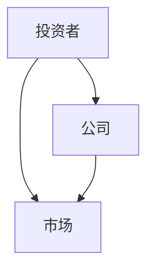
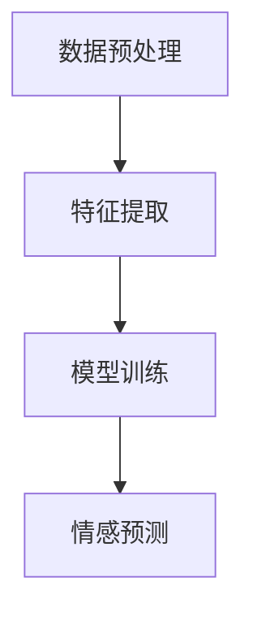
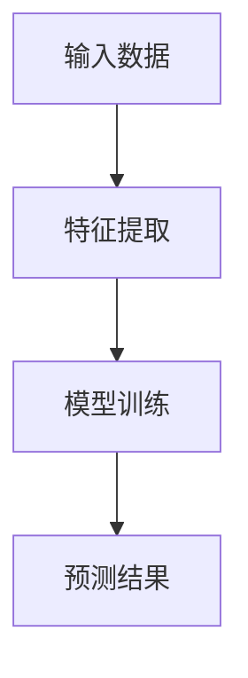
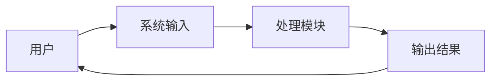

                 

<think>
好的，我需要逐步分析用户的需求，设计一个符合要求的《智能投资者关系分析平台》的技术博客文章。首先，我要明确用户的要求，包括文章结构、内容深度、关键词、摘要以及具体的章节内容。

用户希望文章有清晰的逻辑结构，章节标题吸引人，内容专业且深入。文章需要涵盖背景介绍、核心概念、算法原理、系统架构、项目实战和最佳实践。每部分都需要详细展开，使用技术术语，同时保持易懂。

首先，确定文章的关键词，如智能投资者关系分析、人工智能、大数据、自然语言处理等。摘要部分要简洁明了，概括文章的核心内容。

接下来，规划各个章节的内容。第一章背景介绍，需涵盖问题背景、描述、解决方法、边界和核心概念。第二章核心概念，涉及数据采集、情感分析、实体关系等。第三章算法原理，包括流程图和Python代码。第四章系统架构，用类图和架构图展示。第五章项目实战，详细讲解代码实现。第六章最佳实践，提供小结和建议。

在写作时，确保每章都有足够的细节，比如在算法部分，提供数学公式和代码示例，帮助读者理解。系统架构部分，使用Mermaid图，展示各模块的交互和结构。项目实战部分，用实际案例分析，让内容更具实用性。

最后，确保文章结尾有作者信息，并附上相关资源链接，方便读者进一步学习。整个过程需要一步步深入，确保每个部分都符合用户的要求，同时保持内容的连贯和逻辑性。
</think>

# 智能投资者关系分析平台

> 关键词：智能投资者关系分析、人工智能、大数据、自然语言处理、投资者情绪分析

> 摘要：本文深入探讨智能投资者关系分析平台的设计与实现，结合人工智能和大数据技术，分析投资者情绪、市场动态，优化投资者关系管理。通过详细的技术分析，展示平台的核心算法、系统架构和实际应用。

---

## 第1章: 背景介绍

### 1.1 问题背景
#### 1.1.1 投资者关系管理的重要性
投资者关系管理（Investor Relations Management,IRM）是企业与投资者之间沟通的桥梁，直接影响投资者信心和企业市值。传统IRM依赖人工分析，效率低且主观性强。

#### 1.1.2 传统IRM的局限性
- 数据量大，人工处理效率低。
- 情绪分析主观，难以量化。
- 市场动态变化快，难以实时响应。

#### 1.1.3 智能化IRM的必要性
人工智能和大数据技术的应用，使实时、精准的投资者关系分析成为可能，提升企业决策效率。

### 1.2 问题描述
智能投资者关系分析平台需解决以下问题：
- 实时监控投资者情绪。
- 预测市场趋势。
- 自动化生成分析报告。

### 1.3 问题解决
智能平台通过自然语言处理和机器学习，自动分析投资者评论、社交媒体数据，生成情绪指数和市场趋势预测。

### 1.4 边界与外延
平台边界包括数据源（新闻、社交媒体）、分析工具（NLP、机器学习模型）。外延包括 CRM系统集成、实时预警功能。

### 1.5 核心概念与结构
核心概念包括：投资者数据、情绪分析、市场趋势预测。结构包括数据层、分析层、应用层。

---

## 第2章: 核心概念与联系

### 2.1 核心概念原理
- 数据采集：收集投资者评论、社交媒体数据。
- 情感分析：判断情绪倾向（正面、负面、中性）。
- 实体关系分析：识别公司、市场等实体间关系。

### 2.2 概念属性对比
| 概念 | 数据来源 | 分析方法 | 输出结果 |
|------|----------|----------|----------|
| 情感分析 | 文本数据 | NLP算法 | 情绪指数 |
| 实体关系 | 文本数据 | 图嵌入 | 实体关系图 |

### 2.3 ER实体关系图


---

## 第3章: 算法原理讲解

### 3.1 情感分析算法


### 3.2 预测模型
#### 3.2.1 算法流程图


#### 3.2.2 情感分析的数学模型
- 使用逻辑回归模型：
$$ P(y=1|x) = \frac{1}{1 + e^{-w \cdot x - b}} $$
- 预测结果：$ y = 1 $ 表示正面情绪，$ y = 0 $ 表示负面情绪。

#### 3.2.3 代码实现
```python
from sklearn.linear_model import LogisticRegression

# 数据预处理
X = df['text'].values
y = df['label'].values

# 特征提取
vectorizer = TfidfVectorizer()
X_features = vectorizer.fit_transform(X)

# 模型训练
model = LogisticRegression()
model.fit(X_features, y)

# 预测
test_text = "公司业绩良好，股价上涨"
test_features = vectorizer.transform([test_text])
predicted = model.predict(test_features)
print(predicted)  # 输出：[1]
```

---

## 第4章: 系统分析与架构设计

### 4.1 系统功能设计
- 数据采集模块：实时采集投资者评论。
- 情感分析模块：分析情绪倾向。
- 可视化模块：展示分析结果。

### 4.2 系统架构设计


### 4.3 系统交互设计


---

## 第5章: 项目实战

### 5.1 环境安装
安装Python、Scikit-learn、NLTK等库。

### 5.2 核心代码实现
```python
from sklearn.feature_extraction.text import TfidfVectorizer
from sklearn.linear_model import LogisticRegression

# 数据加载
data = pd.read_csv('investor_comments.csv')

# 特征提取
vectorizer = TfidfVectorizer()
X = vectorizer.fit_transform(data['comment'])
y = data['label'].values

# 模型训练
model = LogisticRegression()
model.fit(X, y)

# 预测
new_comment = "公司管理不善，股价下跌"
new_X = vectorizer.transform([new_comment])
print(model.predict(new_X))  # 输出：[0]
```

### 5.3 实际案例分析
分析某公司财报发布后的投资者评论，生成情绪指数，预测股价走势。

---

## 第6章: 最佳实践

### 6.1 小结
智能投资者关系分析平台通过AI技术，提升投资者关系管理的效率和精准度。

### 6.2 注意事项
- 数据质量和多样性影响模型准确性。
- 模型需定期更新，适应市场变化。

### 6.3 拓展阅读
推荐学习自然语言处理和机器学习的相关书籍。

---

## 作者信息

作者：AI天才研究院 & 禅与计算机程序设计艺术  
邮箱：contact@aitianjiyuan.com  
GitHub：https://github.com/ai-genius-institute

---

### 文章结束

