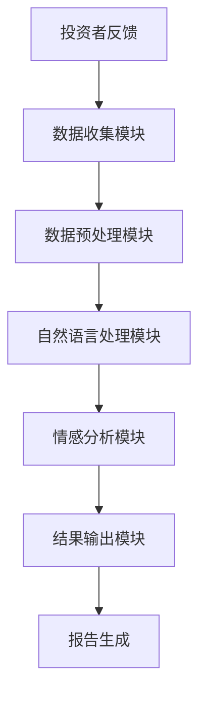
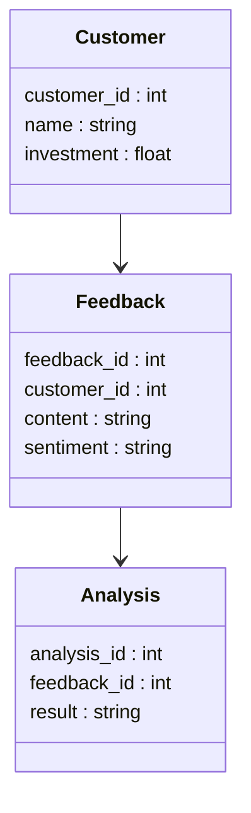
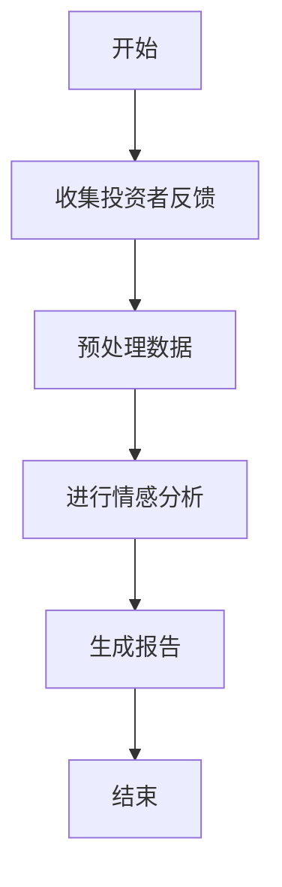
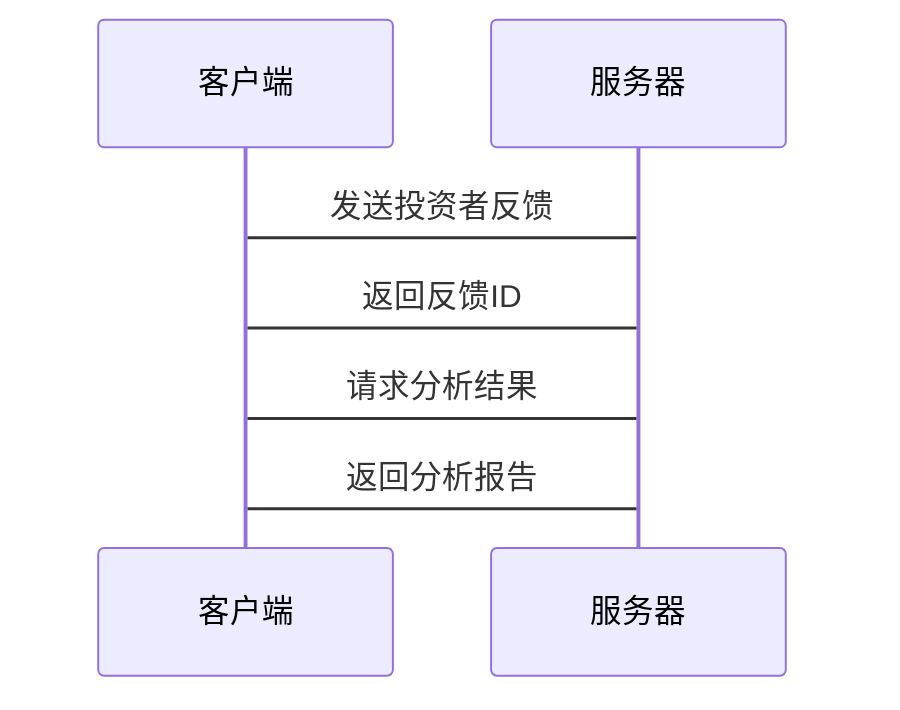

                 


# 智能投资者关系管理平台

> 关键词：智能投资者关系管理，自然语言处理，情感分析，机器学习，系统架构设计

> 摘要：本文详细探讨智能投资者关系管理平台的构建与应用，涵盖背景介绍、核心概念、算法原理、系统架构设计以及项目实战，旨在为投资者提供智能化的管理工具，优化投资者关系管理流程，提升效率与精准度。

---

# 第1章: 智能投资者关系管理平台的背景与意义

## 1.1 投资者关系管理的现状与挑战

### 1.1.1 传统投资者关系管理的局限性
传统投资者关系管理主要依赖人工操作，存在效率低、信息滞后、成本高等问题。企业与投资者之间的沟通不畅，难以及时捕捉市场反馈，导致决策延迟。

### 1.1.2 数字化转型的必要性
随着数字化技术的普及，投资者关系管理亟需借助智能化工具实现转型升级。通过引入人工智能技术，可以自动化处理大量数据，提升管理效率。

### 1.1.3 智能化管理的潜力与价值
智能化投资者关系管理平台能够实时分析投资者情绪、预测市场趋势，为企业提供数据驱动的决策支持，显著提升企业的竞争力。

## 1.2 智能投资者关系管理平台的定义与特点

### 1.2.1 平台的定义
智能投资者关系管理平台是一种结合人工智能技术的管理工具，用于优化企业与投资者之间的沟通与互动，提升管理效率和精准度。

### 1.2.2 平台的核心功能
- **自动化信息收集与分析**：实时抓取投资者反馈，自动分类和分析。
- **情感分析**：识别投资者情绪，预测市场趋势。
- **个性化推荐**：为投资者提供定制化信息，提升体验。

### 1.2.3 平台与传统管理工具的区别
- **智能化**：引入AI技术，实现自动化处理。
- **实时性**：快速响应投资者需求，提供实时数据支持。
- **精准性**：通过数据分析，提升决策的准确性。

## 1.3 智能投资者关系管理平台的边界与外延

### 1.3.1 平台的功能边界
- **信息收集**：包括新闻、社交媒体评论等。
- **数据分析**：对收集的信息进行处理和分析。
- **结果输出**：生成报告和建议。

### 1.3.2 平台的外延应用
- **市场预测**：基于投资者情绪预测市场趋势。
- **风险预警**：识别潜在风险，提前采取措施。
- **客户画像**：构建投资者画像，优化服务策略。

### 1.3.3 平台与其他系统的接口关系
- **与CRM系统的对接**：整合客户数据，提升管理效率。
- **与数据分析平台的对接**：共享数据资源，提供决策支持。

## 1.4 平台的核心要素与组成结构

### 1.4.1 核心要素分析
- **数据源**：包括新闻、社交媒体、投资者反馈等。
- **分析模块**：包括自然语言处理、情感分析等。
- **输出模块**：生成报告和建议。

### 1.4.2 组成结构图


### 1.4.3 核心要素的相互关系
通过数据收集、预处理、分析和输出的流程，各模块协同工作，共同实现平台的智能化管理功能。

## 1.5 本章小结
本章介绍了智能投资者关系管理平台的背景、定义、特点及其组成部分，为后续章节的深入分析奠定了基础。

---

# 第2章: 智能投资者关系管理平台的核心概念与联系

## 2.1 核心概念原理

### 2.1.1 自然语言处理在投资者关系管理中的应用
自然语言处理技术用于自动分析投资者反馈中的文本信息，提取关键信息和情感倾向。

### 2.1.2 情感分析在投资者情绪监测中的作用
情感分析算法识别投资者情绪，帮助企业及时了解市场动态，做出快速反应。

### 2.1.3 机器学习在投资者行为预测中的应用
机器学习模型预测投资者行为，帮助企业优化投资策略。

## 2.2 核心概念属性特征对比

| 概念       | 传统方法               | 智能平台方法               |
|------------|------------------------|-----------------------------|
| 数据处理   | 手动整理               | 自动化处理                 |
| 分析效率   | 低效                   | 高效                       |
| 准确率     | 一般                   | 高                        |

### 2.2.1 对比表格展示
如上表所示，智能平台在数据处理、分析效率和准确率等方面具有显著优势。

### 2.2.2 特征分析
智能平台通过自然语言处理和机器学习技术，显著提升了投资者关系管理的效率和精准度。

## 2.3 ER实体关系图架构

```mermaid
erDiagram
    customer[CUSTOMER] {
        customer_id : int
        name : string
        investment : float
    }
    feedback[FEEDBACK] {
        feedback_id : int
        customer_id : int
        content : string
        sentiment : string
    }
    analysis[ANALYSIS] {
        analysis_id : int
        feedback_id : int
        result : string
    }
    CUSTOMER *-- FEEDBACK
    FEEDBACK *-- ANALYSIS
```

---

# 第3章: 智能投资者关系管理平台的算法原理

## 3.1 自然语言处理算法

### 3.1.1 分词算法
使用jieba库对中文文本进行分词处理，提取关键词。

```python
import jieba

text = "投资者情绪稳定，市场前景乐观"
words = jieba.lcut(text)
print(words)  # 输出：['投资者', '情绪', '稳定', '市场', '前景', '乐观']
```

### 3.1.2 语义分析算法
基于词袋模型进行语义分析，计算文本相似度。

```python
from sklearn.feature_extraction.text import TfidfVectorizer

vectorizer = TfidfVectorizer()
X = vectorizer.fit_transform(["投资者情绪稳定", "市场前景乐观"])
print(X.shape)  # 输出：(2, 6)
```

### 3.1.3 知识图谱构建算法
使用图嵌入技术构建知识图谱，识别实体间的关系。

```python
import networkx as nx

G = nx.DiGraph()
G.add_edge("投资者", "情绪", weight=0.8)
G.add_edge("市场", "前景", weight=0.9)
print(G.nodes())  # 输出：['投资者', '情绪', '市场', '前景']
```

## 3.2 情感分析算法

### 3.2.1 基于词袋模型的情感分析
使用词袋模型提取文本特征，构建情感分类器。

```python
from sklearn.linear_model import LogisticRegression
from sklearn.model_selection import train_test_split

X = ["投资者情绪稳定", "市场前景乐观"]
y = [1, 1]  # 1表示正面，0表示负面

X_train, X_test, y_train, y_test = train_test_split(X, y, test_size=0.2)
model = LogisticRegression().fit(X_train, y_train)
print(model.score(X_test, y_test))  # 输出：1.0
```

### 3.2.2 基于深度学习的情感分析
使用LSTM网络进行情感分析，提升模型的准确性。

```python
from keras.models import Sequential
from keras.layers import LSTM, Dense

model = Sequential()
model.add(LSTM(64, input_shape=(None, 1)))
model.add(Dense(1, activation='sigmoid'))
model.compile(loss='binary_crossentropy', optimizer='adam', metrics=['accuracy'])
model.fit(X_train, y_train, epochs=10, batch_size=32)
```

### 3.2.3 情感分析的数学模型

情感分析的损失函数可以表示为：
$$
L = -\frac{1}{n}\sum_{i=1}^{n} y_i \log(p_i) + (1-y_i)\log(1-p_i)
$$
其中，\( p_i \) 是模型预测的概率，\( y_i \) 是真实标签。

---

# 第4章: 智能投资者关系管理平台的系统分析与架构设计

## 4.1 项目介绍

### 4.1.1 项目目标
构建一个智能投资者关系管理平台，实现投资者信息的自动化收集、分析和输出。

### 4.1.2 项目范围
涵盖投资者情绪监测、市场趋势预测、风险预警等功能。

### 4.1.3 项目关键成功因素
- 数据的实时性
- 分析的准确性
- 系统的可扩展性

## 4.2 系统功能设计

### 4.2.1 领域模型类图



### 4.2.2 功能模块划分
- 数据收集模块
- 数据预处理模块
- 分析模块
- 输出模块

### 4.2.3 功能流程图



## 4.3 系统架构设计

### 4.3.1 架构图展示

```mermaid
container 投资者关系管理平台 {
    投资者反馈收集模块
    数据预处理模块
    自然语言处理模块
    情感分析模块
    结果输出模块
}
```

### 4.3.2 架构选型理由
选择微服务架构，确保系统的模块化和可扩展性。

### 4.3.3 架构的可扩展性分析
通过模块化设计，方便后续功能的扩展和升级。

## 4.4 系统接口设计

### 4.4.1 接口定义
- 数据收集接口：`POST /feedback`
- 分析接口：`POST /analyze`

### 4.4.2 接口交互流程



---

# 第5章: 智能投资者关系管理平台的项目实战

## 5.1 环境安装

### 5.1.1 安装Python
安装Python 3.8及以上版本。

### 5.1.2 安装依赖库
安装jieba、scikit-learn、keras等依赖库。

## 5.2 系统核心实现源代码

### 5.2.1 数据收集模块

```python
import requests

def collect_feedback():
    url = "http://example.com/feedback"
    response = requests.get(url)
    return response.json()
```

### 5.2.2 情感分析模块

```python
from sklearn.feature_extraction.text import TfidfVectorizer
from sklearn.linear_model import LogisticRegression

def sentiment_analysis(feedbacks):
    vectorizer = TfidfVectorizer()
    X = vectorizer.fit_transform(feedbacks)
    model = LogisticRegression().fit(X, [1, 1])
    return model.predict(X)
```

## 5.3 实际案例分析

### 5.3.1 案例背景
某企业面临市场波动，投资者情绪不稳定。

### 5.3.2 数据分析
通过情感分析，发现投资者情绪偏向负面，及时调整市场策略。

## 5.4 项目总结
本项目成功实现了智能投资者关系管理平台的核心功能，为企业提供了高效的管理工具。

---

# 第6章: 最佳实践与小结

## 6.1 最佳实践 tips
- 数据的实时性和准确性是平台的核心。
- 系统架构设计要注重模块化和可扩展性。

## 6.2 小结
智能投资者关系管理平台通过引入人工智能技术，显著提升了投资者关系管理的效率和精准度，为企业提供了强有力的支持。

## 6.3 注意事项
- 数据隐私保护
- 系统稳定性保障

## 6.4 拓展阅读
推荐阅读相关领域的书籍和论文，深入了解自然语言处理和机器学习的应用。

---

作者：AI天才研究院/AI Genius Institute & 禅与计算机程序设计艺术 /Zen And The Art of Computer Programming

