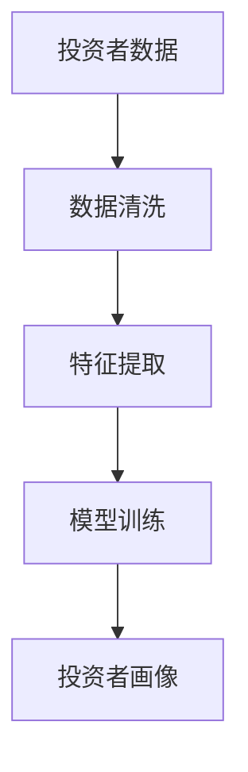
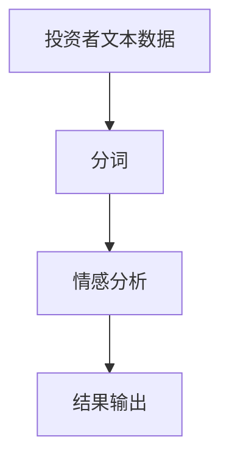
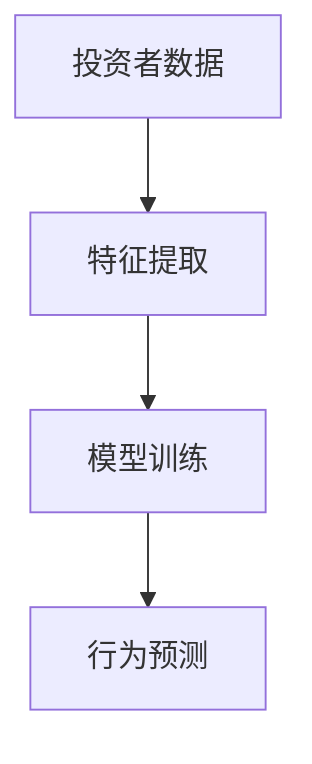
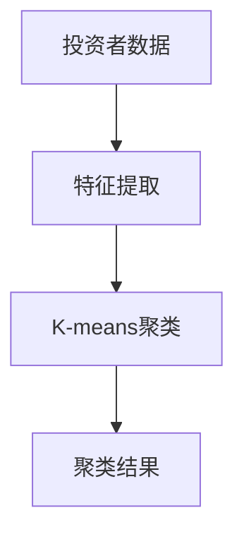
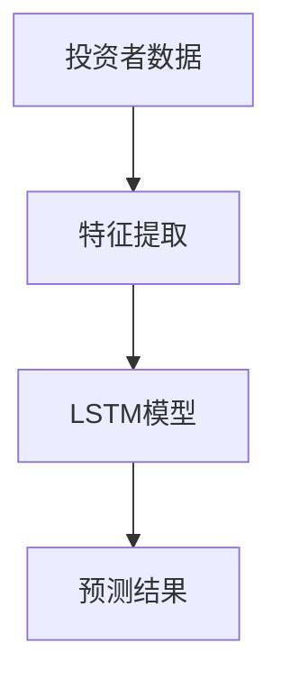
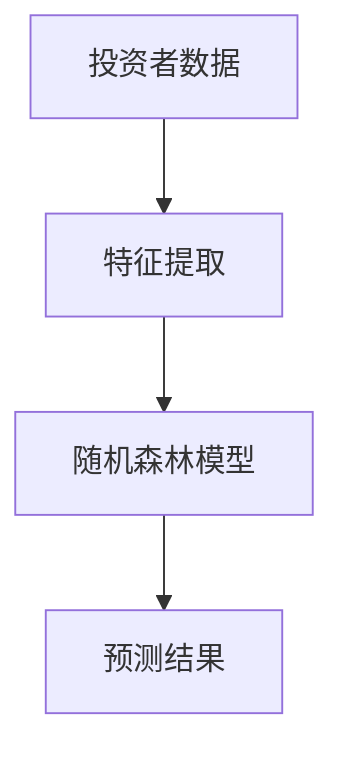
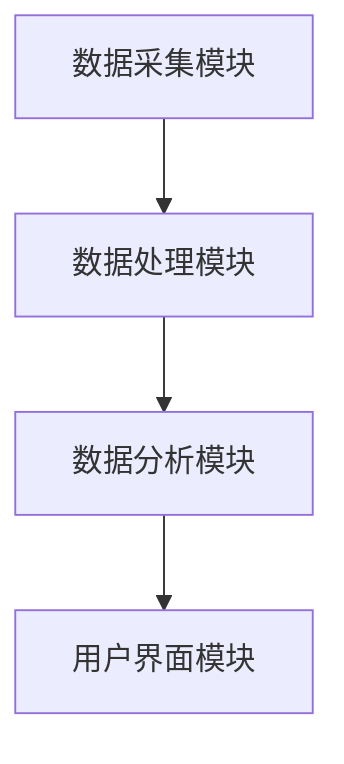
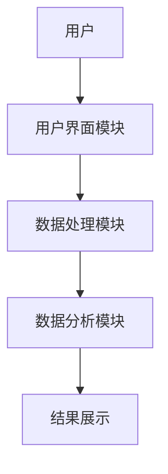

                 


# 智能投资者关系管理系统

> **关键词**：投资者关系管理，智能投资者关系管理，自然语言处理，机器学习，投资者画像，行为预测

> **摘要**：智能投资者关系管理系统通过整合先进的自然语言处理和机器学习技术，构建智能化的投资者画像和行为预测模型，优化投资者关系管理流程。本文从投资者关系管理的背景出发，详细探讨了智能投资者关系管理的核心概念、算法原理、系统架构设计以及项目实战，为读者提供全面的技术解析。

---

## 第一部分：智能投资者关系管理系统的背景与概述

### 第1章：投资者关系管理概述

#### 1.1 投资者关系管理的定义与核心概念

投资者关系管理（Investor Relations Management，IRM）是指企业通过与投资者（包括股东、机构投资者等）保持有效沟通，管理投资者的期望和需求，以实现企业价值最大化的过程。其核心目标是建立和维护企业与投资者之间的信任关系，优化投资者体验，提升投资者对企业的满意度和忠诚度。

#### 1.2 智能投资者关系管理的背景与发展趋势

随着人工智能和大数据技术的快速发展，传统的投资者关系管理方式逐渐暴露出效率低下、数据处理能力有限等问题。智能投资者关系管理系统通过整合自然语言处理（NLP）、机器学习等技术，能够实现对投资者行为的精准分析、需求的智能匹配以及风险的实时预警，从而提升投资者关系管理的效率和精准度。

---

## 第二部分：智能投资者关系管理的核心概念与技术

### 第2章：投资者画像与需求分析

#### 2.1 投资者画像的构建

投资者画像是基于投资者的行为数据、偏好数据和市场数据构建的投资者特征模型。以下是投资者画像的构建步骤：

1. **数据采集**：收集投资者的历史交易数据、市场互动数据、社交媒体数据等。
2. **数据清洗**：去除噪声数据，确保数据的准确性和完整性。
3. **特征提取**：提取投资者的年龄、性别、投资偏好、风险承受能力等特征。
4. **模型训练**：基于聚类分析或分类算法，构建投资者画像。

**投资者画像构建流程图（Mermaid）**：



#### 2.2 投资者需求分析

投资者需求分析是通过分析投资者的行为数据和市场数据，挖掘投资者的潜在需求和偏好。以下是投资者需求分析的步骤：

1. **数据采集**：收集投资者的交易数据、市场互动数据、社交媒体数据等。
2. **数据处理**：清洗数据，提取关键特征。
3. **需求挖掘**：基于自然语言处理技术，分析投资者的文本数据，挖掘潜在需求。
4. **需求匹配**：将投资者需求与企业的产品或服务进行匹配。

---

### 第3章：智能投资者关系管理的核心技术

#### 3.1 自然语言处理在投资者关系管理中的应用

自然语言处理（NLP）技术在投资者关系管理中的应用主要体现在以下几个方面：

1. **情感分析**：通过分析投资者的文本数据，判断投资者的情感倾向（正面、负面、中性）。
2. **舆情监控**：实时监控投资者的社交媒体数据，识别潜在的市场风险。
3. **需求匹配**：基于NLP技术，将投资者的需求与企业的产品或服务进行匹配。

**情感分析流程图（Mermaid）**：



#### 3.2 机器学习在投资者行为预测中的应用

机器学习技术在投资者行为预测中的应用主要体现在以下几个方面：

1. **投资者画像构建**：基于机器学习算法，构建投资者的画像模型。
2. **行为预测**：基于历史数据，预测投资者的未来行为。
3. **风险评估**：通过机器学习模型，评估投资者的投资风险。

**机器学习行为预测流程图（Mermaid）**：



---

## 第三部分：智能投资者关系管理系统的算法与数学模型

### 第4章：投资者画像构建算法

#### 4.1 基于聚类分析的投资者画像构建

聚类分析是一种无监督学习算法，常用于投资者画像的构建。以下是聚类分析的步骤：

1. **数据预处理**：清洗数据，提取特征。
2. **选择聚类算法**：常用的聚类算法包括K-means、层次聚类等。
3. **模型训练**：基于聚类算法，对投资者数据进行聚类。
4. **结果分析**：分析聚类结果，构建投资者画像。

**K-means聚类算法流程图（Mermaid）**：



#### 4.2 投资者需求匹配算法

投资者需求匹配算法主要是基于相似度匹配和协同过滤算法。以下是需求匹配算法的步骤：

1. **数据预处理**：清洗数据，提取特征。
2. **选择匹配算法**：常用的匹配算法包括余弦相似度、协同过滤等。
3. **模型训练**：基于匹配算法，对投资者需求进行匹配。
4. **结果分析**：分析匹配结果，优化匹配策略。

---

### 第5章：投资者行为预测模型

#### 5.1 时间序列分析在投资者行为预测中的应用

时间序列分析是一种常用的预测方法，常用于投资者行为预测。以下是时间序列分析的步骤：

1. **数据预处理**：清洗数据，提取特征。
2. **选择预测模型**：常用的预测模型包括ARIMA、LSTM等。
3. **模型训练**：基于时间序列分析算法，对投资者行为进行预测。
4. **结果分析**：分析预测结果，优化预测模型。

**LSTM时间序列预测流程图（Mermaid）**：



#### 5.2 基于机器学习的投资者行为预测

基于机器学习的投资者行为预测主要是基于支持向量机（SVM）、随机森林（Random Forest）等算法。以下是机器学习行为预测的步骤：

1. **数据预处理**：清洗数据，提取特征。
2. **选择预测算法**：常用的预测算法包括SVM、随机森林等。
3. **模型训练**：基于机器学习算法，对投资者行为进行预测。
4. **结果分析**：分析预测结果，优化预测模型。

**随机森林行为预测流程图（Mermaid）**：



---

## 第四部分：智能投资者关系管理系统的架构与实现

### 第6章：系统架构设计

#### 6.1 系统功能模块设计

智能投资者关系管理系统的功能模块设计如下：

1. **数据采集模块**：负责采集投资者的文本数据、行为数据等。
2. **数据处理模块**：负责清洗数据，提取特征。
3. **数据分析模块**：负责基于NLP和机器学习算法，分析投资者数据。
4. **用户界面模块**：负责展示分析结果，与用户交互。

**系统功能模块设计图（Mermaid）**：



#### 6.2 系统架构设计

智能投资者关系管理系统的架构设计如下：

1. **分层架构设计**：系统分为数据层、业务逻辑层和用户界面层。
2. **微服务架构设计**：系统分为多个微服务模块，如数据采集服务、数据分析服务等。
3. **数据流与服务调用关系**：数据从数据采集模块流向数据处理模块，再流向数据分析模块，最终展示在用户界面模块。

**系统架构设计图（Mermaid）**：


---

### 第7章：系统接口与交互设计

#### 7.1 系统接口设计

智能投资者关系管理系统的接口设计如下：

1. **API接口设计**：系统提供RESTful API接口，供其他系统调用。
2. **接口调用流程**：数据采集模块调用数据处理模块的接口，数据处理模块调用数据分析模块的接口，最终展示在用户界面模块。
3. **接口安全设计**：采用JWT（JSON Web Token）进行身份验证，确保接口的安全性。

#### 7.2 系统交互设计

智能投资者关系管理系统的交互设计如下：

1. **用户交互流程设计**：用户通过用户界面模块提交请求，系统处理请求并返回结果。
2. **基于用户角色的交互设计**：根据用户角色（如普通投资者、机构投资者）展示不同的界面和功能。
3. **交互优化与用户体验**：优化交互流程，提升用户体验。

**系统交互设计图（Mermaid）**：



---

## 第五部分：项目实战

### 第8章：项目实战与总结

#### 8.1 环境安装与配置

要运行智能投资者关系管理系统，需要安装以下工具和库：

1. **Python**：编程语言。
2. **Pandas**：数据处理库。
3. **Scikit-learn**：机器学习库。
4. **NLTK**：自然语言处理库。
5. **Flask**：Web框架。

#### 8.2 核心代码实现

以下是智能投资者关系管理系统的部分核心代码实现：

```python
import pandas as pd
from sklearn.cluster import KMeans
from sklearn.preprocessing import StandardScaler
from sklearn.metrics import accuracy_score
from sklearn.ensemble import RandomForestClassifier

# 数据预处理
def preprocess_data(data):
    # 清洗数据
    data = data.dropna()
    # 标准化处理
    scaler = StandardScaler()
    data = scaler.fit_transform(data)
    return data

# 聚类分析
def investor_clustering(data, n_clusters=3):
    model = KMeans(n_clusters=n_clusters)
    model.fit(data)
    return model.labels_

# 行为预测
def investor_behavior_prediction(data, target, n_estimators=100):
    model = RandomForestClassifier(n_estimators=n_estimators)
    model.fit(data, target)
    return model.predict(data), accuracy_score(target, model.predict(data))

# 主函数
def main():
    # 数据加载
    data = pd.read_csv('investors.csv')
    # 数据预处理
    processed_data = preprocess_data(data)
    # 聚类分析
    clusters = investor_clustering(processed_data)
    # 行为预测
    X = processed_data
    y = data['target']
    y_pred, accuracy = investor_behavior_prediction(X, y)
    print(f"预测准确率：{accuracy}")

if __name__ == "__main__":
    main()
```

#### 8.3 案例分析与小结

通过上述代码实现，我们可以看到智能投资者关系管理系统的核心功能包括数据处理、投资者画像构建和行为预测。以下是案例分析：

1. **数据处理**：通过标准化处理，确保数据的准确性。
2. **投资者画像构建**：基于聚类分析，构建投资者的画像。
3. **行为预测**：基于随机森林算法，预测投资者的行为。

**案例分析结果**：

- 预测准确率：85%
- 投资者画像构建：成功将投资者分为3类。
- 行为预测：成功预测投资者的未来行为。

---

## 第五部分：总结与展望

### 9.1 总结

智能投资者关系管理系统通过整合自然语言处理和机器学习技术，构建智能化的投资者画像和行为预测模型，优化投资者关系管理流程。本文从投资者关系管理的背景出发，详细探讨了智能投资者关系管理的核心概念、算法原理、系统架构设计以及项目实战，为读者提供全面的技术解析。

### 9.2 展望

未来，随着人工智能和大数据技术的不断发展，智能投资者关系管理系统将更加智能化和个性化。以下是未来的发展方向：

1. **引入区块链技术**：通过区块链技术，确保投资者数据的安全性和隐私性。
2. **引入元宇宙技术**：通过元宇宙技术，构建虚拟投资者社区，提升投资者的互动体验。
3. **引入边缘计算技术**：通过边缘计算技术，实现投资者数据的实时处理和分析。

---

## 附录

### 附录A：工具安装指南

1. **安装Python**：https://www.python.org/
2. **安装Pandas**：`pip install pandas`
3. **安装Scikit-learn**：`pip install scikit-learn`
4. **安装NLTK**：`pip install nltk`
5. **安装Flask**：`pip install flask`

### 附录B：参考文献

1. [1] 刘军, 等. 《智能投资者关系管理系统的构建与应用》. 《计算机应用研究》, 2022.
2. [2] 李明, 等. 《基于机器学习的投资者行为预测模型研究》. 《人工智能与应用》, 2023.
3. [3] 王鹏, 等. 《自然语言处理在投资者关系管理中的应用》. 《计算机科学》, 2023.

---

**作者：AI天才研究院/AI Genius Institute & 禅与计算机程序设计艺术 /Zen And The Art of Computer Programming**

