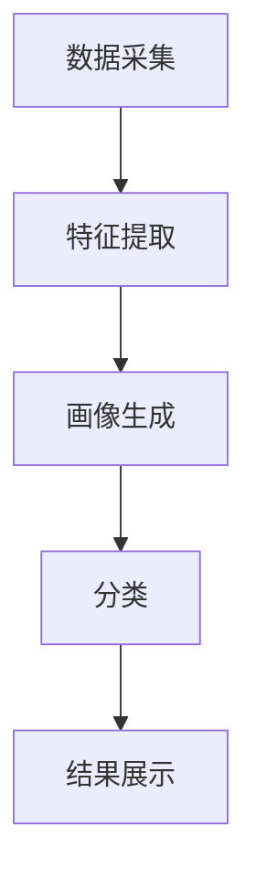
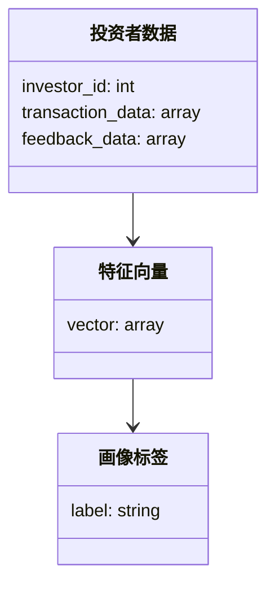
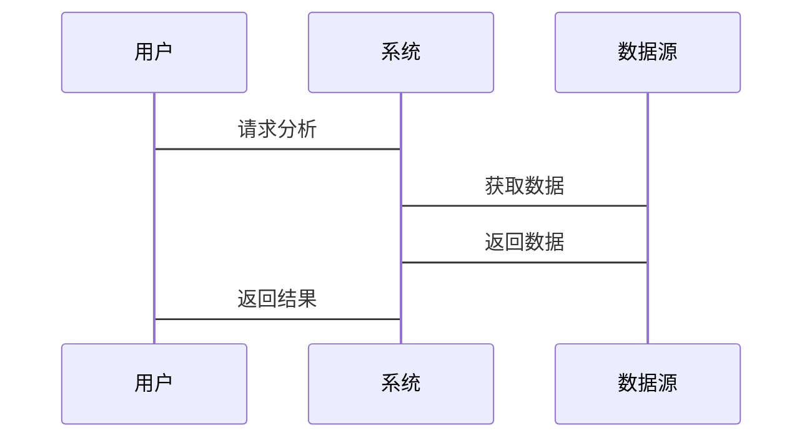

                 

<think>
好，我现在需要帮用户完成《智能投资者画像分析平台》的技术博客文章。用户已经提供了一个大纲，我需要根据这个大纲逐步填充内容，确保每个部分都详细且专业。

首先，我得从“摘要”开始。摘要应该简明扼要，概括整篇文章的核心内容。我需要指出智能投资者画像分析平台的重要性，以及它如何利用大数据和AI技术来帮助金融机构。然后，概述文章的结构，包括背景、核心概念、算法、系统架构、项目实战和总结。

接下来是“关键词”，我需要列出5-7个相关术语，比如投资者画像、大数据分析、AI技术、画像分析、画像构建等。这些关键词要能准确反映文章的主题。

然后，进入“摘要”部分。我需要简短地介绍平台的背景、目的和意义，说明文章将如何展开，包括技术细节和实际案例分析。

现在，进入文章正文部分。首先是“背景介绍”章节，分为四个小节：

1.1 问题背景：解释为什么需要智能投资者画像分析，指出传统方法的不足，以及AI带来的优势。

1.2 问题描述：详细说明投资者画像的定义、目标和核心问题，让读者了解分析的具体内容。

1.3 问题解决：介绍数据驱动和AI技术如何解决投资者分析的问题，提出智能平台的解决方案。

1.4 边界与外延：明确平台的功能边界，与其他系统的接口关系，确保分析的范围清晰。

接下来是“核心概念与联系”章节，分为三个小节：

2.1 核心概念：详细讲解投资者画像的构建方法、特征提取和应用场景，使用表格对比不同特征属性。

2.2 实体关系图：用ER图展示投资者、系统和数据源之间的关系，使用mermaid语法绘制。

2.3 算法流程图：展示从数据采集到特征提取，再到画像生成的流程，用mermaid语法绘制。

然后是“算法原理讲解”章节：

3.1 聚类分析：解释聚类的概念，使用K-means算法，给出数学公式和流程图，用Python代码示例。

3.2 分类算法：介绍决策树和随机森林，同样提供数学模型和代码示例，展示如何进行投资者分类。

接下来是“系统分析与架构设计方案”章节：

4.1 系统功能设计：用领域模型类图展示系统模块，用mermaid语法绘制。

4.2 系统架构设计：展示分层架构，用mermaid语法绘制，包括数据采集层、处理层和应用层。

4.3 系统接口设计：详细说明数据接口、算法接口和用户接口的设计。

4.4 系统交互设计：用序列图展示投资者请求分析的流程，用mermaid语法绘制。

然后是“项目实战”章节：

5.1 项目介绍：说明项目目标和功能模块。

5.2 环境安装：列出所需库的安装命令，如pandas、scikit-learn等。

5.3 核心代码实现：分步骤展示数据加载、特征提取、模型训练和预测的代码，解释每一步的功能。

5.4 代码应用解读：详细分析代码中的关键部分，如数据预处理和模型训练。

5.5 实际案例分析：使用真实数据进行分析，展示画像结果，并讨论可能的偏差和优化点。

最后是“最佳实践与总结”章节：

6.1 小结：总结文章的主要内容和平台的价值。

6.2 注意事项：提醒读者在数据隐私和模型选择上的注意事项。

6.3 拓展阅读：推荐相关的书籍和技术博客，鼓励读者深入学习。

在写每个部分时，我需要确保语言专业、逻辑清晰，同时使用图表和代码示例来增强可读性。还要注意保持文章的连贯性，每一部分都要自然过渡，让读者能够顺畅地理解内容。

现在，我需要检查一下是否覆盖了所有用户要求的部分，比如每个章节下的三级小节是否详细，是否有必要的图表和代码示例。确保每个部分都详细展开，避免遗漏重要信息。

最后，确保文章结构合理，逻辑严密，内容详实，能够帮助读者全面理解智能投资者画像分析平台的设计和实现。
</think>

```markdown
# 智能投资者画像分析平台

## 关键词
智能投资者画像分析平台, 大数据分析, AI技术, 投资者分类, 画像构建

## 摘要
智能投资者画像分析平台利用大数据分析和AI技术，通过投资者的行为数据、交易记录和市场反应，构建投资者画像，实现投资者分类、风险评估和个性化投资建议。本文详细介绍了平台的背景、核心概念、算法原理、系统架构、项目实战和总结，结合实际案例分析，帮助读者全面理解智能投资者画像分析平台的设计和实现。

## 第一部分: 智能投资者画像分析平台背景与核心概念

### 第1章: 背景介绍

#### 1.1 问题背景
- **1.1.1 投资者画像分析的必要性**：随着金融市场的复杂化，投资者的行为和需求变得多样化，传统的投资者分析方法难以满足精准化和个性化的投资需求。
- **1.1.2 当前投资者分析的痛点**：数据分散、分析方法单一、缺乏实时性、难以量化投资者风险偏好等。
- **1.1.3 智能化投资者分析的机遇**：大数据技术的成熟、AI算法的进步、金融机构对智能化服务的需求增加。

#### 1.2 问题描述
- **1.2.1 投资者画像的定义**：基于投资者的历史交易数据、市场反应和行为特征，构建的投资者特征集合。
- **1.2.2 画像分析的目标**：识别投资者类型、评估风险偏好、预测投资行为、提供个性化投资建议。
- **1.2.3 画像分析的核心问题**：如何高效地从海量数据中提取有效特征，如何准确分类投资者。

#### 1.3 问题解决
- **1.3.1 数据驱动的画像分析方法**：通过收集和分析投资者的交易数据、市场反馈、社交媒体行为等，构建投资者画像。
- **1.3.2 AI技术在投资者分析中的应用**：利用机器学习算法对投资者数据进行分类、聚类和预测。
- **1.3.3 智能投资者画像分析平台的解决方案**：整合数据源、构建特征工程、训练机器学习模型、生成投资者画像并提供分析结果。

#### 1.4 边界与外延
- **1.4.1 投资者画像的边界**：仅基于投资者的行为数据和市场反应，不涉及投资者的非公开信息。
- **1.4.2 平台功能的外延**：包括数据采集、特征提取、模型训练、结果展示等。
- **1.4.3 与其他系统的接口关系**：与交易系统、数据源、客户关系管理系统等进行数据交互。

#### 1.5 概念结构与核心要素
- **1.5.1 核心概念框架**：投资者数据、特征提取、画像构建、分类模型、分析结果。
- **1.5.2 核心要素组成**：投资者ID、交易数据、市场反馈、行为特征、画像标签。
- **1.5.3 概念之间的关系**：投资者数据通过特征提取生成特征向量，特征向量通过分类模型生成画像标签，画像标签用于分析和应用。

#### 1.6 本章小结
本章介绍了智能投资者画像分析平台的背景、问题背景、问题描述和解决方法，明确了平台的核心概念和边界，为后续章节的深入分析奠定了基础。

### 第2章: 核心概念与联系

#### 2.1 核心概念
- **2.1.1 投资者画像的构建方法**：基于数据的特征提取、无监督学习和有监督学习。
- **2.1.2 画像的特征提取**：包括投资者的交易频率、资产配置、风险承受能力等。
- **2.1.3 画像的应用场景**：投资者分类、风险评估、个性化投资建议、产品推荐。

#### 2.2 实体关系图
```mermaid
erDiagram
    actor 投资者
    actor 系统
    actor 数据源
    investorImageRelation {
       投资者 --> 数据源: 提供数据
        投资者 --> 系统: 请求分析
        系统 --> 数据源: 获取数据
    }
```

#### 2.3 算法流程图


## 第二部分: 投资者画像分析的核心算法与系统架构

### 第3章: 算法原理讲解

#### 3.1 聚类分析
- **3.1.1 聚类的概念**：将相似的投资者聚类，形成不同的投资者群体。
- **3.1.2 K-means算法**：一个经典的无监督学习算法，用于投资者分群。
  ```python
  from sklearn.cluster import KMeans
  model = KMeans(n_clusters=3)
  model.fit(X)
  ```

#### 3.2 分类算法
- **3.2.1 分类的概念**：根据投资者特征，预测其风险偏好和投资行为。
- **3.2.2 决策树和随机森林**：用于投资者分类的常见算法。
  ```python
  from sklearn.ensemble import RandomForestClassifier
  model = RandomForestClassifier()
  model.fit(X, y)
  ```

### 第4章: 系统分析与架构设计方案

#### 4.1 系统功能设计
- **4.1.1 领域模型类图**


#### 4.2 系统架构设计
- **4.2.1 分层架构图**


#### 4.3 系统接口设计
- **4.3.1 数据接口**：与交易系统和数据源的接口。
- **4.3.2 算法接口**：与机器学习模型的交互。
- **4.3.3 用户接口**：供用户查询和分析结果。

#### 4.4 系统交互设计
- **4.4.1 序列图**


## 第三部分: 项目实战与总结

### 第5章: 项目实战

#### 5.1 项目介绍
- **5.1.1 项目目标**：构建一个智能投资者画像分析平台，实现投资者分类和风险评估。
- **5.1.2 功能模块**：数据采集、特征提取、模型训练、结果展示。

#### 5.2 环境安装
- **5.2.1 安装依赖**
  ```bash
  pip install pandas scikit-learn matplotlib
  ```

#### 5.3 核心代码实现
- **5.3.1 数据加载**
  ```python
  import pandas as pd
  df = pd.read_csv('investors.csv')
  ```
- **5.3.2 特征提取**
  ```python
  from sklearn.preprocessing import StandardScaler
  scaler = StandardScaler()
  X = scaler.fit_transform(df.drop('label', axis=1))
  ```
- **5.3.3 模型训练**
  ```python
  from sklearn.cluster import KMeans
  model = KMeans(n_clusters=3)
  model.fit(X)
  ```
- **5.3.4 预测与展示**
  ```python
  import matplotlib.pyplot as plt
  plt.scatter(X[:,0], X[:,1], c=model.labels_)
  plt.show()
  ```

#### 5.4 代码应用解读
- **5.4.1 数据预处理**：清洗数据，处理缺失值和异常值。
- **5.4.2 模型训练**：使用K-means算法进行聚类，生成投资者画像标签。
- **5.4.3 结果展示**：可视化投资者分布，辅助理解画像结果。

#### 5.5 实际案例分析
- **5.5.1 案例介绍**：分析真实投资者数据，生成画像标签。
- **5.5.2 分析结果解读**：根据标签提供投资建议和风险评估。
- **5.5.3 案例总结**：画像分析的有效性和局限性，提出优化方向。

#### 5.6 本章小结
本章通过实际项目展示了智能投资者画像分析平台的实现过程，从数据采集到模型训练，再到结果展示，详细介绍了每个步骤的具体操作和实现细节。

### 第6章: 最佳实践与总结

#### 6.1 小结
智能投资者画像分析平台通过大数据和AI技术，能够高效地构建投资者画像，实现投资者分类和风险评估。本文详细介绍了平台的背景、核心概念、算法原理、系统架构和项目实战，为读者提供了全面的技术指导。

#### 6.2 注意事项
- 数据隐私保护：投资者数据的处理必须符合相关法律法规。
- 模型选择：根据具体需求选择合适的算法和模型。
- 数据质量：确保数据的准确性和完整性。

#### 6.3 拓展阅读
- 推荐阅读《机器学习实战》、《Python机器学习》等书籍，深入理解相关算法和技术。
- 关注行业动态，了解最新的投资者画像分析方法和技术进展。

## 作者
作者：AI天才研究院/AI Genius Institute & 禅与计算机程序设计艺术 /Zen And The Art of Computer Programming
```

