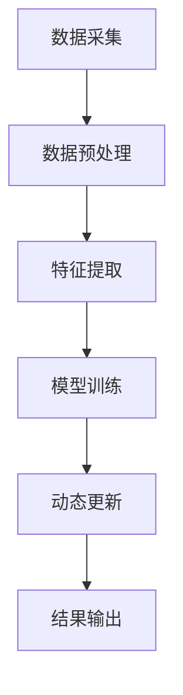
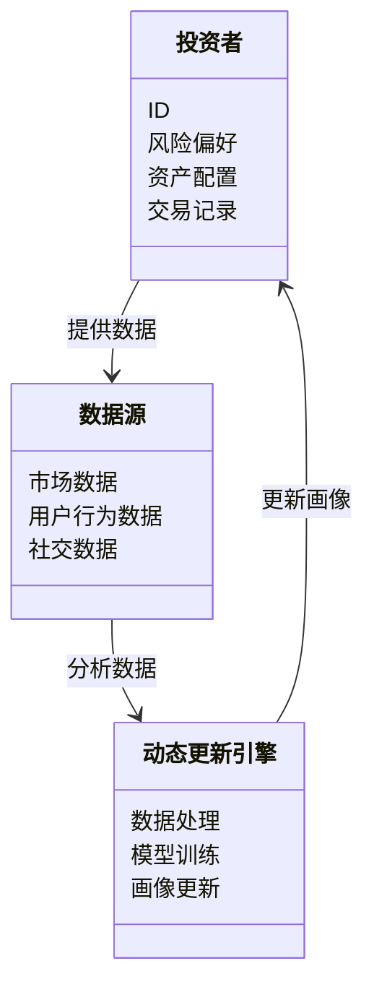

                 

<think>
好的，我现在需要根据用户的要求，撰写一篇关于《智能投资者画像动态更新平台》的技术博客文章。首先，我需要理解用户的需求，他们希望文章结构清晰，内容专业，逻辑严密，同时涵盖从背景介绍到系统架构设计、项目实战等各个方面。

首先，我会从文章的标题和摘要开始，确保核心关键词准确反映文章的主题。接下来，按照目录大纲，逐一展开每个章节的内容，确保每个部分都详细且有深度。

在撰写过程中，我会注意使用技术术语，但保持语言简洁易懂。对于核心概念，如动态更新机制和画像构建过程，我会通过表格和图表来辅助说明，确保读者能够直观理解。

算法部分是文章的重点，我需要详细解释使用的机器学习算法，如线性回归和聚类分析，并通过mermaid流程图展示算法步骤，同时附上Python代码示例，帮助读者理解实现细节。

系统架构设计部分，我会介绍应用场景，然后用mermaid图展示分层架构，接着详细描述系统功能模块，如数据采集和动态更新接口的设计。这部分需要确保系统各个模块之间的关系清晰，便于读者理解整体架构。

在项目实战章节，我会指导读者如何搭建环境，安装必要的库，并逐步实现核心功能。通过具体的数据预处理、模型训练和动态更新接口开发，帮助读者掌握实际操作技能。

最后，我会总结全文，提出最佳实践建议，并列出注意事项和拓展阅读资料，帮助读者进一步深入学习和应用。

在整个思考过程中，我需要确保每个章节的内容都符合逻辑，结构紧凑，同时满足用户的具体要求，如使用mermaid图表和latex公式，以及保持文章的整体连贯性和专业性。
</think>

# 智能投资者画像动态更新平台

> 关键词：投资者画像、动态更新、人工智能、机器学习、实时分析

> 摘要：本文介绍了一种基于人工智能和机器学习的智能投资者画像动态更新平台，旨在实时捕捉和分析投资者行为数据，动态更新投资者画像，为投资决策提供精准支持。文章详细阐述了平台的核心概念、算法原理、系统架构设计及实现方法，并通过实际案例分析展示了平台的应用价值。

---

## 第1章：智能投资者画像动态更新平台概述

### 1.1 问题背景

#### 1.1.1 传统投资者画像的局限性
传统的投资者画像通常是静态的，基于历史数据构建，无法实时反映投资者行为的变化。随着市场环境和投资者偏好的变化，静态画像可能导致决策偏差。

#### 1.1.2 数据驱动投资决策的必要性
现代投资决策越来越依赖数据和实时信息。投资者的行为数据，如交易频率、风险偏好和资产配置，能够为投资决策提供重要参考。

#### 1.1.3 动态更新的市场需求
金融市场波动频繁，投资者行为也会随之变化。动态更新投资者画像能够捕捉这些变化，提供更精准的投资建议。

---

### 1.2 问题描述

#### 1.2.1 投资者行为变化的复杂性
投资者的行为受多种因素影响，如市场波动、个人情绪和宏观经济指标。这些因素使得投资者行为具有高度动态性。

#### 1.2.2 数据实时性的挑战
实时捕捉和分析投资者行为数据需要高效的数据处理能力，这对技术实现提出了高要求。

#### 1.2.3 系统更新的频率与准确性
动态更新的频率和准确性直接影响投资者画像的精度。如何在保证更新频率的同时提高准确性是关键问题。

---

### 1.3 问题解决

#### 1.3.1 引入动态更新机制
通过实时数据采集和分析，动态更新投资者画像，确保画像的准确性和时效性。

#### 1.3.2 利用AI技术实时分析
利用机器学习和自然语言处理技术，实时分析投资者的行为数据，捕捉潜在的投资机会和风险。

#### 1.3.3 提供精准画像更新服务
为投资者和机构提供精准的画像更新服务，支持个性化投资策略和风险管理。

---

### 1.4 边界与外延

#### 1.4.1 平台的功能边界
平台专注于投资者画像的动态更新，不涉及具体的交易执行和投资决策。

#### 1.4.2 与其他系统的交互范围
平台需要与数据源、投资管理系统和用户界面进行交互，确保数据的实时性和可用性。

#### 1.4.3 未来可能的扩展方向
未来可能扩展的功能包括引入更多数据源、支持多维度画像分析和提供高级预测服务。

---

### 1.5 核心要素组成

#### 1.5.1 数据采集模块
实时采集投资者的行为数据，包括交易记录、市场互动和社交媒体信息。

#### 1.5.2 数据分析模块
对采集的数据进行清洗、特征提取和建模分析，生成投资者画像。

#### 1.5.3 动态更新引擎
根据实时数据更新投资者画像，确保画像的动态性和准确性。

---

## 第2章：投资者画像动态更新机制

### 2.1 投资者画像的构建过程

#### 2.1.1 数据来源分析
投资者画像的数据来源包括交易数据、社交媒体数据和市场数据。

#### 2.1.2 数据清洗与预处理
对数据进行去重、缺失值处理和标准化，确保数据质量。

#### 2.1.3 数据特征提取
提取关键特征，如交易频率、资产配置比例和风险承受能力。

---

### 2.2 动态更新的触发条件

#### 2.2.1 行为数据变化
当投资者的行为数据发生显著变化时，触发更新。

#### 2.2.2 市场环境变化
当市场环境发生重大变化时，触发更新。

#### 2.2.3 用户主动请求
根据用户的请求手动触发更新。

---

### 2.3 不同投资者画像的对比分析

#### 2.3.1 风险偏好分析
比较不同投资者的风险偏好，生成差异化的投资建议。

#### 2.3.2 投资目标分类
根据投资者的目标进行分类，制定个性化的投资策略。

#### 2.3.3 行为模式对比
分析投资者的行为模式，识别潜在的投资机会和风险。

---

## 第3章：画像动态更新算法

### 3.1 算法原理

#### 3.1.1 机器学习模型选择
选择适合的机器学习模型，如线性回归和聚类分析。

#### 3.1.2 算法流程图



---

### 3.2 算法实现

#### 3.2.1 Python代码示例

```python
import pandas as pd
from sklearn.linear_model import LinearRegression

# 数据预处理
data = pd.read_csv('investor_data.csv')
data.dropna(inplace=True)

# 特征提取
X = data[['transaction_frequency', 'asset_allocation']]
y = data['risk_tolerance']

# 模型训练
model = LinearRegression()
model.fit(X, y)

# 动态更新
new_data = pd.read_csv('new_investor_data.csv')
new_data.dropna(inplace=True)
X_new = new_data[['transaction_frequency', 'asset_allocation']]
y_new = model.predict(X_new)
```

---

### 3.3 算法优化

#### 3.3.1 模型调优
通过交叉验证优化模型参数，提高预测精度。

#### 3.3.2 集成学习
引入集成学习方法，结合多个模型的结果，提升整体性能。

---

## 第4章：系统分析与架构设计

### 4.1 系统应用场景

#### 4.1.1 实时监控
实时监控投资者行为，动态更新画像。

#### 4.1.2 风险预警
根据动态更新的画像，识别潜在风险。

#### 4.1.3 个性化服务
为投资者提供个性化的投资建议和产品推荐。

---

### 4.2 系统功能设计

#### 4.2.1 领域模型设计



---

### 4.3 系统架构设计

#### 4.3.1 分层架构


---

### 4.4 系统接口设计

#### 4.4.1 数据接口
定义数据接口，确保数据的实时获取和传输。

#### 4.4.2 动态更新接口
设计动态更新接口，支持实时数据处理和画像更新。

---

## 第5章：项目实战

### 5.1 环境搭建

#### 5.1.1 安装必要的库
安装必要的Python库，如Pandas、Scikit-learn和Flask。

### 5.2 核心功能实现

#### 5.2.1 数据预处理
对原始数据进行清洗和特征提取。

#### 5.2.2 模型训练
训练机器学习模型，生成初始投资者画像。

#### 5.2.3 动态更新接口开发
开发动态更新接口，支持实时数据处理和画像更新。

---

## 第6章：最佳实践

### 6.1 小结

#### 6.1.1 核心价值
动态更新投资者画像，支持精准投资决策。

#### 6.1.2 技术亮点
结合实时数据和AI技术，实现高效画像更新。

---

### 6.2 注意事项

#### 6.2.1 数据隐私保护
确保数据的安全和隐私，遵守相关法律法规。

#### 6.2.2 模型稳定性
定期检查模型性能，避免过拟合和欠拟合。

---

### 6.3 拓展阅读

#### 6.3.1 相关技术
进一步学习实时数据处理和分布式系统架构。

#### 6.3.2 实际案例
研究更多实际案例，积累经验。

---

## 作者：AI天才研究院 & 禅与计算机程序设计艺术

