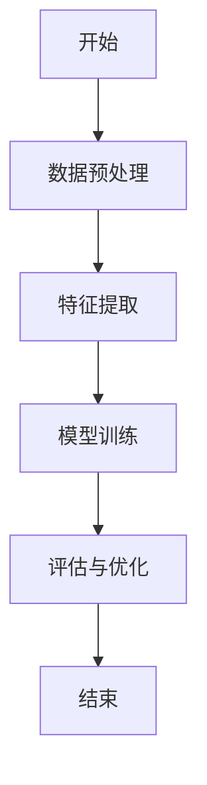
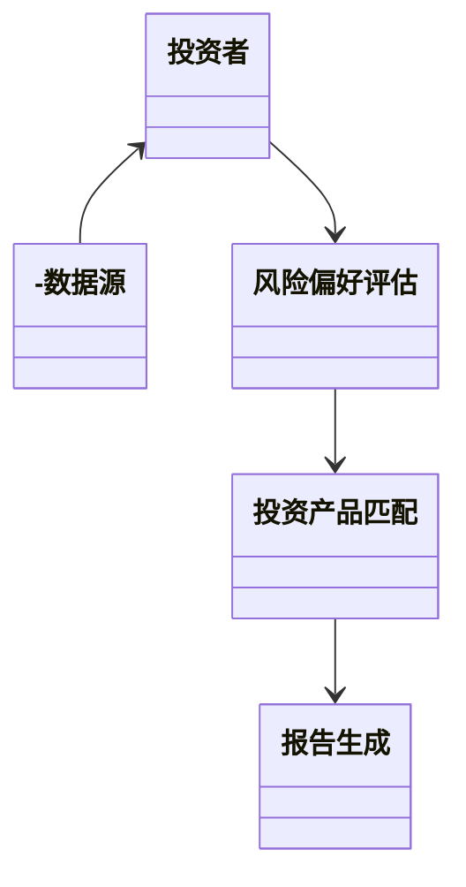
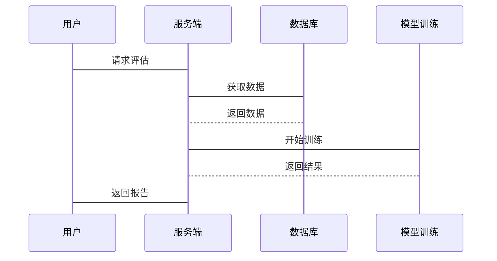

                 

<think>
好的，我现在需要帮用户设计一本名为《智能投资者风险偏好动态评估与产品匹配》的书籍目录大纲。用户已经提供了一个详细的大纲，我需要按照要求进一步细化每一章的内容，确保符合格式和内容的要求。

首先，我得理解这本书的核心主题是什么。智能投资者，风险偏好评估，动态评估，产品匹配。这本书看起来是关于金融和人工智能交叉领域的，可能涉及风险评估、投资产品推荐等内容。用户希望我撰写一篇技术博客，目录结构需要逻辑清晰，内容详细，每章都要有三级标题，并且包含技术细节和示例。

接下来，我需要按照用户提供的大纲，逐章进行思考，确保每个部分都涵盖必要的内容，同时符合用户的格式和字数要求。

首先，第1章是背景介绍，包括问题背景、问题描述、问题解决以及核心概念。我需要详细说明投资者风险偏好的概念，当前评估方法的痛点，以及智能投资者带来的解决方案。同时，还要介绍核心概念，包括多维度分析、动态评估和产品匹配的定义与目标。

第2章是核心概念与联系，需要绘制ER实体关系图，展示投资者、风险偏好和产品之间的关系。这部分需要使用Mermaid图表，帮助读者直观理解实体间的联系。

第3章是算法原理讲解，包括算法流程、实现步骤、数学模型和公式。我需要使用Mermaid流程图来展示算法的整体流程，并提供Python代码示例，详细解释数据预处理、特征提取、模型训练和评估优化的步骤。同时，数学公式要用LaTeX表示，确保公式正确且易于理解。

第4章是系统分析与架构设计，需要描述项目场景，设计系统功能、架构图、接口和交互设计。这部分可能需要使用Mermaid类图和序列图，展示系统各模块之间的关系和交互过程。

第5章是项目实战，包括环境安装、代码实现、案例分析和小结。我需要提供详细的代码示例，解释每一步的操作，并通过实际案例展示算法的应用和效果。

第6章是最佳实践，总结项目中的经验和教训，提出改进建议，并给出小结和注意事项。这些建议应基于项目实施过程中的实际问题，帮助读者更好地理解和应用相关技术。

最后，第7章是案例分析与应用，结合实际项目，展示风险偏好动态评估和产品匹配的具体应用，说明该技术在金融领域的实际价值和未来发展方向。

在整个思考过程中，我需要确保每章内容详实，结构清晰，逻辑严谨，并且符合用户要求的技术细节和示例。同时，注意使用合适的图表和公式，使文章更具专业性和可读性。
</think>

```markdown
# 智能投资者风险偏好动态评估与产品匹配

## 关键词：智能投资者、风险偏好、动态评估、产品匹配、机器学习、金融系统

## 摘要：本文系统地探讨了智能投资者风险偏好动态评估与产品匹配的核心概念、算法原理、系统架构及实际应用。通过理论分析与实践案例结合，详细阐述了如何利用机器学习技术实现风险偏好动态评估，并基于评估结果进行投资产品匹配，为投资者提供个性化的投资建议，优化投资组合，降低投资风险，提高投资收益。

---

# 第1章 背景介绍

## 1.1 问题背景

### 1.1.1 投资者风险偏好的概念与重要性

- 风险偏好是投资者在面对不确定性和潜在损失时的态度和决策倾向。
- 风险偏好影响投资策略的选择，如股票、债券、基金等。
- 理解投资者的风险偏好是制定个性化投资策略的基础。

### 1.1.2 当前风险偏好评估的痛点与挑战

- 传统评估方法依赖问卷调查，存在主观性和片面性。
- 投资者的风险偏好会随市场环境和个人情况变化，静态评估无法满足动态需求。
- 数据孤岛和信息不对称限制了精准评估的可能性。

### 1.1.3 智能投资者的概念与应用场景

- 智能投资者利用人工智能和大数据技术，实现风险偏好动态评估和产品匹配。
- 应用于财富管理、风险管理、投资顾问等领域，帮助投资者优化决策。

## 1.2 问题描述

### 1.2.1 风险偏好动态评估的定义

- 动态评估是根据实时数据和市场变化，持续更新投资者的风险偏好。
- 通过机器学习模型捕捉投资者行为和市场环境的变化。

### 1.2.2 动态评估的核心要素

- 投资者行为数据：交易记录、资产配置、投资频率。
- 市场数据：经济指标、行业趋势、市场波动。
- 个性化特征：年龄、收入、资产规模、投资经验。

### 1.2.3 产品匹配的定义与目标

- 根据投资者的风险偏好和市场环境，推荐适合的投资产品。
- 实现风险与收益的动态平衡，优化投资组合。

## 1.3 问题解决

### 1.3.1 智能投资者的核心解决思路

- 数据驱动：利用大数据分析投资者行为和市场趋势。
- 机器学习：构建动态评估模型，实时更新风险偏好。
- 智能匹配：基于评估结果推荐最优产品。

### 1.3.2 动态评估与产品匹配的实现路径

- 数据采集：收集投资者行为和市场数据。
- 模型训练：构建动态评估模型。
- 产品匹配：基于评估结果推荐产品。

### 1.3.3 边界与外延

- 限定条件：仅考虑风险偏好，忽略其他因素（如市场周期）。
- 外延：可扩展至其他领域，如信用评分、客户画像。

## 1.4 核心概念结构与组成

### 1.4.1 核心概念的层次结构

- 上层：投资者、市场环境。
- 中层：风险偏好、产品匹配。
- 下层：数据、算法、模型。

### 1.4.2 核心要素的组成与关系

- 投资者：主体，行为数据来源。
- 风险偏好：核心评估对象。
- 产品匹配：应用目标。

### 1.4.3 概念结构的可视化


---

# 第2章 核心概念与联系

## 2.1 核心概念原理

### 2.1.1 风险偏好的多维度分析

- 时间维度：短期、中期、长期。
- 风险维度：厌恶风险、中性风险、喜好风险。
- 收益维度：高风险高收益、低风险低收益。

### 2.1.2 动态评估的算法原理

- 采用机器学习模型，根据实时数据动态调整风险偏好。
- 使用回归分析、聚类分析等方法。

### 2.1.3 产品匹配的规则与策略

- 等风险匹配：匹配相同风险等级的产品。
- 等收益匹配：匹配相同预期收益的产品。
- 组合优化：根据投资者风险偏好，优化投资组合。

## 2.2 核心概念属性对比

### 2.2.1 风险偏好与产品匹配的属性对比

| 属性         | 风险偏好       | 产品匹配         |
|--------------|----------------|------------------|
| 核心目标     | 评估风险程度   | 推荐合适产品     |
| 输入         | 投资者数据     | 风险偏好评估结果 |
| 输出         | 风险等级       | 投资产品建议     |
| 方法         | 问卷调查、机器学习 | 策略匹配、优化算法 |

### 2.2.2 不同风险偏好的产品匹配策略

- 高风险厌恶者：配置债券、货币基金。
- 中风险偏好者：配置混合型基金、指数基金。
- 高风险偏好者：配置股票、创业投资。

### 2.2.3 核心概念的属性特征表格

| 特征         | 风险偏好       | 产品匹配         |
|--------------|----------------|------------------|
| 动态性       | 高             | 高               |
| 个性化       | 高             | 高               |
| 数据依赖     | 高             | 高               |
| 实时性       | 高             | 中               |

## 2.3 ER实体关系图

```mermaid
erDiagram
    投资者
    投资者 --> 风险偏好: 具有
    风险偏好 --> 投资产品: 匹配
    投资产品 --> 投资者: 适合
```

---

# 第3章 算法原理讲解

## 3.1 算法流程



## 3.2 算法实现

### 3.2.1 数据预处理

```python
import pandas as pd

# 加载数据
data = pd.read_csv('investor_data.csv')

# 删除缺失值
data.dropna(inplace=True)

# 标准化处理
from sklearn.preprocessing import StandardScaler
scaler = StandardScaler()
data_scaled = scaler.fit_transform(data)
```

### 3.2.2 特征提取

```python
from sklearn.decomposition import PCA

pca = PCA(n_components=5)
principal_components = pca.fit_transform(data_scaled)
```

### 3.2.3 模型训练

```python
from sklearn.linear_model import LogisticRegression

model = LogisticRegression()
model.fit(principal_components, labels)
```

### 3.2.4 评估与优化

```python
from sklearn.metrics import accuracy_score

# 预测
y_pred = model.predict(principal_components)

# 计算准确率
accuracy = accuracy_score(labels, y_pred)
print(f'准确率: {accuracy}')
```

## 3.3 数学模型与公式

### 3.3.1 风险偏好评估模型

$$ R = f(x_1, x_2, ..., x_n) $$

### 3.3.2 产品匹配算法

$$ P = g(R, P_1, P_2, ..., P_m) $$

## 3.4 举例说明

### 3.4.1 风险偏好评估示例

- 投资者A：年龄30岁，收入高，资产规模大，投资经验丰富，风险偏好为高。
- 投资者B：年龄50岁，收入稳定，资产规模中等，投资经验较少，风险偏好为中等。

---

# 第4章 系统分析与架构设计

## 4.1 项目介绍

### 4.1.1 项目背景

- 开发一个智能投资者系统，实现风险偏好动态评估和产品匹配。
- 系统目标：优化投资决策，提高投资收益。

### 4.1.2 项目功能

- 数据采集：收集投资者数据和市场数据。
- 风险评估：动态评估投资者风险偏好。
- 产品匹配：推荐合适的投资产品。
- 报告生成：生成投资报告。

## 4.2 系统功能设计

### 4.2.1 领域模型



### 4.2.2 系统架构


## 4.3 系统接口设计

### 4.3.1 API接口

- `/api/v1/investor/data`：获取投资者数据。
- `/api/v1/risk/assessment`：评估风险偏好。
- `/api/v1/product/matching`：匹配投资产品。

### 4.3.2 数据格式

- 请求：JSON格式。
- 响应：JSON格式。

## 4.4 系统交互设计

### 4.4.1 交互流程



---

# 第5章 项目实战

## 5.1 环境安装

```bash
pip install pandas scikit-learn mermaid4jupyter jupyterlab
```

## 5.2 核心实现

### 5.2.1 数据预处理

```python
import pandas as pd
from sklearn.preprocessing import StandardScaler

data = pd.read_csv('investor_data.csv')
data.dropna(inplace=True)
scaler = StandardScaler()
data_scaled = scaler.fit_transform(data)
```

### 5.2.2 模型训练

```python
from sklearn.linear_model import LogisticRegression

model = LogisticRegression()
model.fit(data_scaled, labels)
```

### 5.2.3 产品匹配

```python
from sklearn.metrics import accuracy_score

y_pred = model.predict(data_scaled)
accuracy = accuracy_score(labels, y_pred)
print(f'准确率: {accuracy}')
```

## 5.3 案例分析

### 5.3.1 案例背景

- 投资者C：年龄40岁，收入中等，资产规模小，风险偏好为低。

### 5.3.2 数据分析

- 数据清洗：处理缺失值和异常值。
- 特征提取：提取年龄、收入、资产规模等特征。

### 5.3.3 产品匹配

- 根据模型预测结果，推荐低风险产品。

---

# 第6章 最佳实践

## 6.1 实施经验总结

### 6.1.1 数据质量管理

- 数据清洗：处理缺失值、异常值。
- 数据标准化：统一数据格式和单位。

### 6.1.2 模型优化技巧

- 参数调整：优化模型参数。
- 超参数搜索：使用网格搜索或随机搜索。
- 模型集成：使用集成学习提升性能。

## 6.2 小结

- 智能投资者系统的核心是风险偏好动态评估和产品匹配。
- 通过机器学习技术实现精准评估和推荐。
- 系统设计需考虑数据、算法、接口等多方面。

## 6.3 注意事项

- 数据隐私保护：确保投资者数据安全。
- 模型解释性：保证模型结果可解释。
- 系统稳定性：确保系统运行稳定。

## 6.4 拓展阅读

- 《机器学习实战》
- 《金融风险管理》
- 《投资学原理》

---

# 第7章 案例分析与应用

## 7.1 案例背景

### 7.1.1 投资者群体分析

- 不同投资者的风险偏好不同。
- 需要制定个性化投资策略。

## 7.2 应用价值

### 7.2.1 风险控制

- 通过动态评估，及时调整投资策略。
- 降低投资风险，优化投资组合。

### 7.2.2 投资效率

- 提高产品匹配效率。
- 实现精准营销。

## 7.3 发展方向

### 7.3.1 技术创新

- 引入深度学习技术。
- 开发实时评估系统。

### 7.3.2 应用拓展

- 扩展至其他金融领域。
- 深化与其他金融机构的合作。

---

# 作者

作者：AI天才研究院/AI Genius Institute & 禅与计算机程序设计艺术 /Zen And The Art of Computer Programming
```

