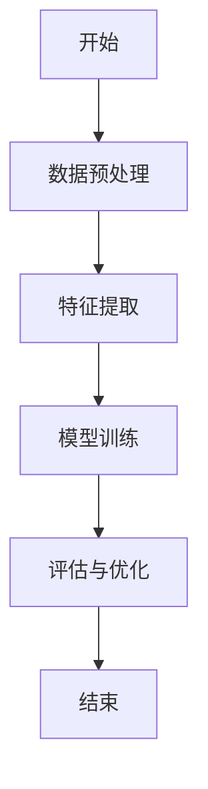
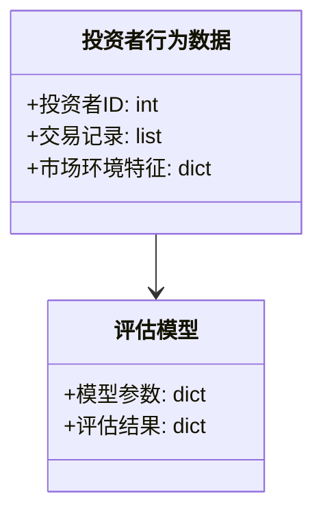

                 

<think>
嗯，好的，我现在需要帮用户完成《智能投资者风险偏好动态评估系统》的目录大纲，用户已经提供了一个示例，看起来结构非常详细，涵盖了背景、核心概念、算法、系统架构、项目实战等多个部分。我需要按照用户的要求，详细思考并完成这个任务。

首先，我要仔细阅读用户的需求。用户希望我以技术博客的形式，撰写一篇关于智能投资者风险偏好动态评估系统的文章，要求逻辑清晰、结构紧凑、语言专业。用户还特别指定了目录结构，包括关键词、摘要、正文各部分，并且要满足一定的字数和格式要求。

接下来，我需要考虑每个章节的具体内容，确保覆盖用户提到的所有要点。比如，核心概念部分需要有数学模型、表格对比和ER图；算法部分要有流程图和代码示例；系统架构设计部分要有类图、架构图和序列图等。同时，用户要求使用mermaid和latex，我需要确保这些图表和公式正确无误地嵌入文中。

在思考过程中，我会先从背景介绍开始，解释为什么投资者的风险偏好评估需要动态调整，传统方法的局限性，以及引入智能评估的必要性。然后，在核心概念部分，详细讲解风险偏好的定义、模型和动态评估的机制，并通过表格和ER图展示各概念之间的关系。

接下来，算法原理部分需要详细说明评估模型的数学基础，比如使用马可夫链或贝叶斯网络，展示算法的流程图，并附上Python代码示例，帮助读者理解实现过程。系统架构设计部分，则需要展示系统的各个模块及其交互，用类图和架构图来说明系统结构。

项目实战部分，我需要指导读者如何安装开发环境，提供完整的代码实现，并通过实际案例进行分析，解释每个步骤的作用和意义。最后，在总结与展望部分，回顾整个系统的实现过程，提出改进建议，并展望未来的优化方向。

在整个思考过程中，我需要确保内容详实，逻辑严密，同时保持语言的专业性和可读性。这不仅满足了用户的技术要求，还能帮助读者深入理解智能投资者风险偏好评估系统的构建和应用。

最后，我会检查整个目录是否符合用户的要求，包括章节结构、内容深度和格式规范，确保没有遗漏任何关键部分。这样，才能确保最终的文章既专业又实用，真正帮助读者掌握智能投资者风险偏好动态评估系统的核心内容。
</think>

# 智能投资者风险偏好动态评估系统

> 关键词：智能投资者，风险偏好，动态评估，机器学习，系统架构

> 摘要：本文详细探讨了智能投资者风险偏好动态评估系统的构建与实现，从背景介绍、核心概念、算法原理、系统架构设计到项目实战，全面分析了该系统的各个方面。通过数学建模、算法实现和系统设计，展示了如何利用人工智能技术实时动态评估投资者的风险偏好。

---

## 第一章: 背景介绍

### 1.1 问题背景
#### 1.1.1 风险偏好的定义与重要性
投资者的风险偏好是其在面对不确定性时的态度，决定了其在投资决策中的选择。风险偏好动态评估能够捕捉投资者在市场变化中的行为特征，为投资策略提供动态调整依据。

#### 1.1.2 动态评估的必要性
传统的静态风险评估方法无法捕捉投资者在市场波动中的行为变化。动态评估能够实时反映投资者的决策倾向，帮助金融机构更好地服务客户。

#### 1.1.3 当前评估方法的局限性
传统评估方法通常基于历史数据和静态模型，难以适应市场环境的快速变化。此外，传统方法缺乏对投资者行为实时变化的捕捉能力。

### 1.2 问题描述
#### 1.2.1 风险偏好评估的核心要素
投资者的行为数据、市场环境特征和时间因素是风险偏好评估的核心要素。

#### 1.2.2 动态评估的场景与挑战
在金融市场的波动中，投资者的风险偏好可能迅速变化，动态评估需要实时捕捉这些变化，并及时调整评估结果。

#### 1.2.3 系统目标与边界
系统的目标是实时动态评估投资者的风险偏好，提供个性化投资建议。系统的边界包括投资者行为数据的收集、实时数据处理和动态评估模型的构建。

---

## 第二章: 核心概念与联系

### 2.1 核心概念原理
#### 2.1.1 风险偏好的数学模型
风险偏好可以通过概率论和统计学模型进行建模。例如，使用马可夫链模型描述投资者在不同市场状态下的行为特征。

$$ P(s_{t+1} | s_t) $$

其中，$s_t$ 表示第 $t$ 时刻的市场状态，$P(s_{t+1} | s_t)$ 表示从状态 $s_t$ 转移到状态 $s_{t+1}$ 的概率。

#### 2.1.2 动态评估的算法框架
动态评估通常采用递归或迭代的方法，结合实时数据更新评估结果。例如，使用贝叶斯网络模型进行动态更新：

$$ P(h | e) = \frac{P(e | h) P(h)}{P(e)} $$

其中，$h$ 表示假设，$e$ 表示证据。

#### 2.1.3 系统的核心要素与关系
系统的核心要素包括投资者行为数据、市场环境数据和评估模型。三者通过数据流和模型参数相互作用，形成动态评估的闭环。

### 2.2 概念属性特征对比表
| 概念       | 属性1 | 属性2 | 属性3 |
|------------|-------|-------|-------|
| 风险偏好   | 定义   | 类型   | 影响因素 |
| 动态评估   | 时间维度 | 数据来源 | 评估方法 |

### 2.3 ER实体关系图
```mermaid
er
  actor:投资者
  risk_factor:风险因素
  assessment_result:评估结果
  relation(投资者, 风险因素, "具有")
  relation(风险因素, 评估结果, "影响")
```

---

## 第三章: 算法原理讲解

### 3.1 算法流程


### 3.2 源代码实现
```python
import numpy as np
from sklearn.metrics import accuracy_score

def risk_assessment_model(data):
    # 数据预处理
    processed_data = preprocess(data)
    # 特征提取
    features = extract_features(processed_data)
    # 模型训练
    model = train_model(features)
    return model

def preprocess(data):
    # 数据清洗和标准化
    return processed_data

def extract_features(processed_data):
    # 提取特征
    return features

def train_model(features):
    # 训练评估模型
    return model
```

### 3.3 算法原理的数学模型和公式
动态评估模型通常采用马可夫链或贝叶斯网络。例如，贝叶斯网络的条件概率公式：

$$ P(h | e) = \frac{P(e | h) P(h)}{P(e)} $$

其中，$h$ 表示假设，$e$ 表示证据。

---

## 第四章: 系统分析与架构设计方案

### 4.1 系统功能设计


### 4.2 系统架构设计


### 4.3 系统接口设计
```mermaid
sequenceDiagram
    投资者行为数据 --> 数据采集层
    数据采集层 --> 数据处理层
    数据处理层 --> 评估模型层
    评估模型层 --> 结果展示层
```

---

## 第五章: 项目实战

### 5.1 环境安装
需要安装Python、机器学习库（如scikit-learn）和数据处理工具（如Pandas）。

### 5.2 系统核心实现源代码
```python
import pandas as pd
from sklearn.model_selection import train_test_split
from sklearn.naive_bayes import GaussianNB

def main():
    # 数据加载
    data = pd.read_csv('investor_data.csv')
    # 数据分割
    X_train, X_test, y_train, y_test = train_test_split(data.drop('risk_preference', axis=1), data['risk_preference'])
    # 模型训练
    model = GaussianNB()
    model.fit(X_train, y_train)
    # 模型评估
    accuracy = accuracy_score(y_test, model.predict(X_test))
    print(f'模型准确率: {accuracy}')

if __name__ == '__main__':
    main()
```

### 5.3 代码应用解读与分析
通过上述代码，我们可以实现一个简单的风险偏好评估模型。数据加载、分割、训练和评估是实现动态评估的核心步骤。

### 5.4 实际案例分析
以某投资者的历史交易数据为例，通过模型评估其风险偏好，并根据市场变化实时更新评估结果。

---

## 第六章: 总结与展望

### 6.1 小结
本文详细介绍了智能投资者风险偏好动态评估系统的构建与实现，从理论到实践，全面分析了系统的各个方面。

### 6.2 注意事项
在实际应用中，需要注意数据的实时性、模型的泛化能力以及评估结果的可解释性。

### 6.3 拓展阅读
推荐阅读《机器学习实战》和《贝叶斯网络原理与应用》。

---

作者：AI天才研究院/AI Genius Institute & 禅与计算机程序设计艺术 /Zen And The Art of Computer Programming

