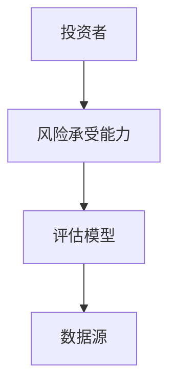
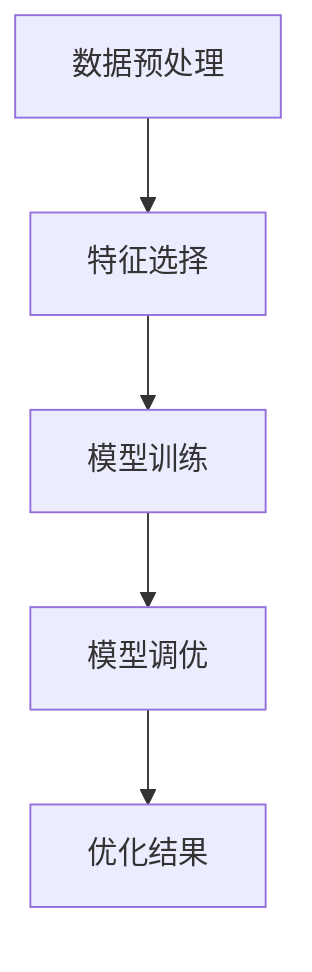
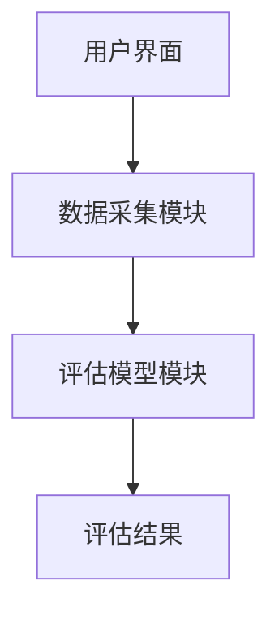
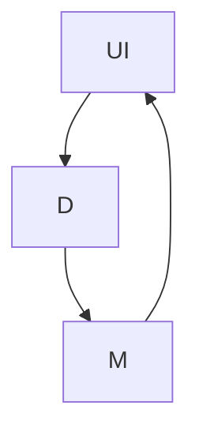

                 

<think>
好，我现在需要帮用户设计一本名为《智能投资者风险承受能力评估》的书籍目录大纲。用户希望这个大纲详细且逻辑清晰，覆盖主题内容的各个方面。首先，我得理解这本书的核心主题是什么。智能投资者的风险承受能力评估，听起来像是在金融领域，特别是投资领域，评估投资者能承受多大的风险。这可能涉及到心理学、金融学、数据分析等多个方面。

接下来，我需要考虑这本书的结构。用户给的示例里，软件2.0相关的书籍分成了几个部分，比如基础、核心概念、算法原理、系统架构、项目实战等。所以，我应该按照类似的结构来组织这本书的内容。

首先，背景介绍是必不可少的。这部分应该涵盖智能投资者风险承受能力评估的背景、问题背景、问题描述，以及它如何帮助投资者和金融机构。然后，核心概念部分需要详细解释相关概念，比如投资者行为分析、风险认知模型、决策优化等，可能还需要用表格和图表来展示这些概念之间的关系。

接下来是算法原理，这部分需要详细讲解评估模型的构建，包括数据预处理、特征选择、模型训练和调优。可能需要使用机器学习算法，比如随机森林或神经网络，所以得用mermaid流程图来展示整个过程，并附上Python代码示例。

然后是系统分析与架构设计，这部分需要介绍系统功能设计，比如用户界面、数据采集模块、评估模型模块等，可能需要用类图和架构图来展示系统的结构。同时，还要考虑接口设计和交互流程，确保系统能够顺利运行。

项目实战部分，需要提供一个具体的案例，从环境安装到核心代码实现，再到结果分析，让读者能够实际操作。这部分要详细，包括数据来源、处理步骤、模型实现等。

最后，最佳实践、小结、注意事项和拓展阅读也是必要的，帮助读者巩固所学内容，并指导他们在实际中如何应用这些知识。

我还需要确保每个部分都有足够的细节，比如在背景介绍中，不仅要描述问题，还要分析边界和外延，确保读者理解评估的范围和限制。在核心概念部分，可能需要对比不同模型的特点，用表格展示它们的优缺点，帮助读者更好地理解。

算法部分，我需要选择合适的机器学习模型，并详细解释每个步骤，包括数据预处理、特征工程、模型训练等。同时，提供Python代码示例，让读者能够动手实践。数学模型部分，可能需要解释一些统计学概念，比如标准差、方差，以及如何用这些指标来衡量风险承受能力。

在系统架构设计中，可能需要绘制类图和架构图，展示系统的各个模块及其交互。这部分需要清晰的结构，确保读者能够理解系统的整体设计和各个部分的功能。

项目实战部分，我需要选择一个真实的案例，比如使用公开的金融数据，指导读者如何从数据收集、清洗到模型训练，再到结果分析。这部分要详细，包括代码实现和结果解读，帮助读者将理论应用到实践中。

最后，总结部分需要回顾整个评估过程，强调其重要性，并给出实际应用中的注意事项，比如数据隐私、模型局限性等。同时，推荐一些拓展阅读材料，帮助读者深入学习相关知识。

总的来说，这本书的结构需要从理论到实践，逐步引导读者理解智能投资者风险承受能力评估的各个方面。每个章节都要有逻辑性，层层递进，确保读者能够系统地掌握相关知识和技能。
</think>

# 智能投资者风险承受能力评估

> 关键词：智能投资者，风险承受能力，评估模型，投资者行为分析，风险认知模型，决策优化

> 摘要：本文系统地探讨了智能投资者风险承受能力评估的核心概念、算法原理、系统架构设计以及实际应用。通过深入分析投资者行为、构建风险认知模型和优化决策过程，结合机器学习算法和系统设计方法，提出了一个全面的评估框架。本文还通过具体案例展示了如何将理论应用于实际，为投资者和金融机构提供了有效的工具和方法。

---

## 第一部分: 智能投资者风险承受能力评估的背景与核心概念

### 第1章: 智能投资者风险承受能力评估的背景

#### 1.1 问题背景与描述

##### 1.1.1 投资者风险承受能力的概念
投资者风险承受能力是指投资者在面对市场波动时，能够承受的财务和心理上的风险程度。它涵盖了投资者在不同市场条件下的情绪反应、决策能力和对损失的容忍度。

##### 1.1.2 智能评估的必要性与优势
传统的风险承受能力评估方法主要依赖于问卷调查和静态数据分析，难以捕捉投资者在动态市场环境中的实时反应。智能评估通过结合实时市场数据和投资者行为分析，能够更准确地评估投资者的风险承受能力。

##### 1.1.3 传统评估方法的局限性
传统方法通常仅基于历史数据和静态问卷，无法动态调整评估结果，且难以捕捉投资者的实时情绪和行为变化。

#### 1.2 问题解决与边界

##### 1.2.1 问题解决的核心目标
通过智能评估模型，帮助投资者和金融机构更好地理解投资者的风险承受能力，优化投资决策，降低潜在风险。

##### 1.2.2 评估的边界与外延
评估的边界包括投资者的财务状况、投资目标和市场环境。外延则涉及投资者教育、风险管理策略和个性化投资建议。

##### 1.2.3 核心要素与组成结构
核心要素包括投资者行为分析、风险认知模型和决策优化。组成结构包括数据采集、模型构建和结果分析。

#### 1.3 核心概念与联系

##### 1.3.1 投资者行为分析
分析投资者在不同市场条件下的行为模式，识别其情绪波动和决策偏好。

##### 1.3.2 风险认知模型
构建投资者对风险的认知模型，量化其对风险的敏感度和承受能力。

##### 1.3.3 决策优化与反馈机制
通过优化算法，提供个性化的投资建议，并根据市场变化和投资者反馈动态调整评估结果。

#### 1.4 本章小结
本章介绍了智能投资者风险承受能力评估的核心概念和背景，分析了传统评估方法的局限性，并提出了智能评估的关键要素和方法。

---

### 第2章: 核心概念与联系

#### 2.1 核心概念原理

##### 2.1.1 投资者行为分析的理论基础
基于心理学和行为经济学理论，分析投资者在不同情境下的行为模式。

##### 2.1.2 风险认知模型的构建
通过统计分析和机器学习，构建投资者对风险的认知模型。

##### 2.1.3 决策优化的数学模型
利用优化算法，为投资者提供最优的投资决策建议。

#### 2.2 概念属性特征对比

##### 2.2.1 不同模型的特征对比
| 模型类型       | 数据来源 | 算法基础 | 输出结果 |
|----------------|----------|----------|----------|
| 传统模型       | 历史数据 | 统计分析 | 静态评估 |
| 智能模型       | 实时数据 | 机器学习 | 动态评估 |

##### 2.2.2 属性特征的表格化展示
| 属性       | 传统模型 | 智能模型 |
|------------|----------|----------|
| 数据类型   | 静态     | 动态     |
| 算法基础   | 统计     | 机器学习 |
| 输出形式   | 静态报告 | 动态反馈 |

##### 2.2.3 模型优缺点的对比分析
- 传统模型的优点：简单易懂，易于实施。
- 传统模型的缺点：缺乏动态性，无法捕捉实时市场变化。
- 智能模型的优点：实时性强，能够动态调整评估结果。
- 智能模型的缺点：需要大量的实时数据和计算资源。

#### 2.3 ER实体关系图



---

## 第二部分: 算法原理与系统架构设计

### 第3章: 算法原理

#### 3.1 评估模型的构建

##### 3.1.1 数据预处理
- 数据清洗：去除噪声数据，处理缺失值。
- 数据标准化：将数据归一化，确保模型训练的稳定性。

##### 3.1.2 特征选择
- 选择与风险承受能力相关的特征，如投资金额、历史收益、市场波动等。

##### 3.1.3 模型训练
- 使用机器学习算法，如随机森林和神经网络，训练评估模型。

##### 3.1.4 模型调优
- 调整模型参数，优化评估结果的准确性。

#### 3.2 算法流程图



#### 3.3 评估模型的数学公式

##### 3.3.1 风险承受能力的度量
$$ R = \sqrt{\frac{1}{n}\sum_{i=1}^{n}(x_i - \mu)^2} $$
其中，\( R \) 是风险承受能力，\( x_i \) 是投资者的收益，\( \mu \) 是平均收益，\( n \) 是样本数量。

##### 3.3.2 决策优化的数学模型
$$ \text{最大化 } \sum_{i=1}^{n} w_i r_i $$
$$ \text{约束 } \sum_{i=1}^{n} w_i = 1 $$
$$ \text{其中，} w_i \text{ 是权重，} r_i \text{ 是收益} $$

#### 3.4 Python代码实现

##### 3.4.1 数据预处理
```python
import pandas as pd
data = pd.read_csv('investor_data.csv')
data = data.dropna()
data = (data - data.mean()) / data.std()
```

##### 3.4.2 模型训练
```python
from sklearn.ensemble import RandomForestRegressor
model = RandomForestRegressor(n_estimators=100)
model.fit(X_train, y_train)
```

---

### 第4章: 系统架构设计

#### 4.1 系统功能设计

##### 4.1.1 用户界面
- 输入投资者信息和投资目标。
- 显示评估结果和建议。

##### 4.1.2 数据采集模块
- 获取实时市场数据和投资者行为数据。

##### 4.1.3 评估模型模块
- 处理数据，生成评估结果。

#### 4.2 系统架构图



#### 4.3 接口设计
- 数据接口：提供实时数据获取接口。
- 评估接口：提供投资者评估接口。

#### 4.4 交互流程图



---

### 第5章: 项目实战

#### 5.1 环境安装

##### 5.1.1 安装Python
```bash
python --version
```

##### 5.1.2 安装依赖
```bash
pip install pandas scikit-learn
```

#### 5.2 核心代码实现

##### 5.2.1 数据预处理
```python
import pandas as pd
import numpy as np

data = pd.read_csv('investor_data.csv')
data = data.dropna()
data = (data - data.mean()) / data.std()
```

##### 5.2.2 模型训练
```python
from sklearn.ensemble import RandomForestRegressor
model = RandomForestRegressor(n_estimators=100)
model.fit(X_train, y_train)
```

#### 5.3 实际案例分析

##### 5.3.1 数据来源
- 使用公开的金融数据和投资者行为数据。

##### 5.3.2 结果分析
- 生成投资者的风险承受能力报告，提供个性化投资建议。

#### 5.4 小结
本章通过实际案例展示了智能投资者风险承受能力评估的实现过程，从数据预处理到模型训练，再到结果分析。

---

## 第三部分: 总结与展望

### 第6章: 总结与展望

#### 6.1 最佳实践 tips
- 数据隐私保护：确保投资者数据的安全。
- 模型优化：持续优化评估模型，提高准确性。

#### 6.2 小结
总结智能投资者风险承受能力评估的核心内容和实际应用。

#### 6.3 注意事项
- 数据隐私：保护投资者的个人数据。
- 模型局限性：评估结果仅供参考，需结合实际情况调整。

#### 6.4 拓展阅读
推荐相关书籍和论文，帮助读者深入学习。

---

## 作者

作者：AI天才研究院/AI Genius Institute & 禅与计算机程序设计艺术 /Zen And The Art of Computer Programming

---

通过以上结构，我们可以系统地了解智能投资者风险承受能力评估的各个方面，从理论到实践，逐步深入，为投资者和金融机构提供有效的工具和方法。

