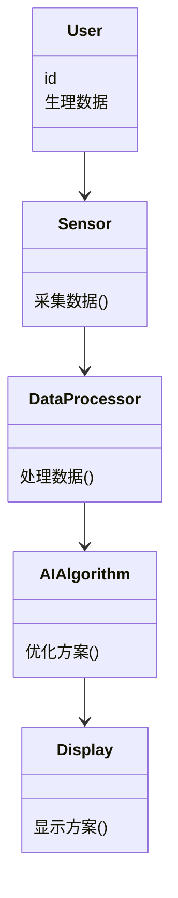
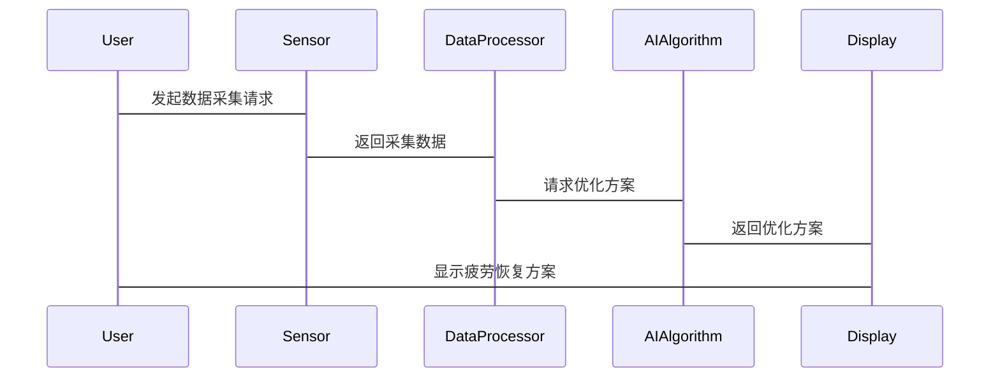

                 


# 智能按摩椅：AI Agent的疲劳恢复优化方案

---

## 关键词：
智能按摩椅, AI Agent, 疲劳恢复, 强化学习, 系统架构, 项目实战

---

## 摘要：
随着人工智能技术的快速发展，智能按摩椅逐渐成为人们生活中不可或缺的健康助手。本文将从背景、核心概念、算法原理、系统架构到项目实战，全面解析AI Agent在智能按摩椅中的应用，探讨如何通过智能化技术优化疲劳恢复方案。文章结合理论与实践，详细讲解了基于强化学习的疲劳恢复优化算法，并通过系统设计与实现，展示了AI Agent在智能按摩椅中的实际应用价值。

---

## 目录：
1. [智能按摩椅与AI Agent的背景与概念](#智能按摩椅与ai-agent的背景与概念)
2. [AI Agent在智能按摩椅中的核心算法与系统设计](#ai-agent在智能按摩椅中的核心算法与系统设计)
3. [基于强化学习的疲劳恢复优化算法](#基于强化学习的疲劳恢复优化算法)
4. [系统分析与架构设计](#系统分析与架构设计)
5. [项目实战：智能按摩椅的AI Agent优化方案](#项目实战智能按摩椅的ai-agent优化方案)
6. [最佳实践与总结](#最佳实践与总结)

---

## 第一部分: 智能按摩椅与AI Agent的背景与概念

### 第1章: 智能按摩椅的发展历程

#### 1.1 传统按摩椅的功能与局限性
传统按摩椅通过机械结构和固定程序提供按摩服务，虽然能够缓解疲劳，但存在以下问题：
- **个性化不足**：无法根据用户的实时状态（如压力、肌肉紧张程度）调整按摩方案。
- **功能单一**：仅能提供预设的按摩模式，缺乏智能化和动态优化能力。
- **交互性差**：用户与设备之间缺乏实时反馈和互动。

#### 1.2 智能化技术的引入
近年来，随着物联网（IoT）、人工智能（AI）和大数据技术的快速发展，智能按摩椅逐渐融入智能化功能：
- **传感器技术**：通过压力传感器、温度传感器等实时采集用户的身体数据。
- **AI技术**：利用机器学习算法分析数据，动态调整按摩方案。
- **云计算与边缘计算**：通过云平台存储和分析用户数据，提供个性化服务。

#### 1.3 当前智能按摩椅的市场现状
目前，市场上智能按摩椅主要集中在以下几个方面：
- **功能多样化**：支持多种按摩模式，如揉捏、敲击、推拿等。
- **智能化程度高**：部分高端产品已实现AI驱动的个性化按摩方案。
- **市场竞争激烈**：各大品牌纷纷推出智能按摩椅，市场竞争日趋激烈。

### 第2章: AI Agent的基本概念与应用

#### 2.1 AI Agent的定义与特点
AI Agent（智能代理）是一种能够感知环境、自主决策并执行任务的智能系统。其核心特点包括：
- **自主性**：能够在没有人工干预的情况下自主运行。
- **反应性**：能够实时感知环境变化并做出响应。
- **目标导向**：通过设定目标来优化决策过程。
- **学习能力**：能够通过数据学习和优化自身的算法。

#### 2.2 AI Agent在智能按摩椅中的应用
在智能按摩椅中，AI Agent主要用于以下方面：
- **个性化按摩方案设计**：通过分析用户的生理数据（如心率、体温、肌肉紧张度）和行为数据（如使用习惯、时间偏好），制定个性化的疲劳恢复方案。
- **动态优化**：根据用户的实时反馈（如疼痛程度、舒适度）动态调整按摩力度、频率和模式。
- **数据收集与分析**：通过传感器和AI算法，实时收集并分析用户的健康数据，提供健康建议。

#### 2.3 AI Agent与传统AI的区别
AI Agent与传统AI的主要区别在于：
- **自主性**：AI Agent具备更强的自主性和目标导向性。
- **实时性**：AI Agent能够实时感知环境并做出快速响应。
- **动态性**：AI Agent能够根据环境变化动态调整策略。

### 第3章: 智能按摩椅与AI Agent的结合

#### 3.1 结合的背景与意义
现代社会节奏加快，人们普遍存在疲劳、压力大、肌肉紧张等问题。传统的按摩椅虽然能缓解症状，但缺乏智能化和个性化。通过引入AI Agent，智能按摩椅能够实现以下目标：
- **精准诊断**：通过传感器和AI算法，精准诊断用户的疲劳程度和身体状态。
- **个性化服务**：根据用户的身体状况和偏好，提供个性化的按摩方案。
- **动态优化**：根据用户的实时反馈，动态调整按摩力度和模式，确保最佳的疲劳恢复效果。

#### 3.2 结合的技术基础
智能按摩椅与AI Agent的结合依赖于以下技术基础：
- **传感器技术**：用于实时采集用户的生理数据和环境数据。
- **AI算法**：用于分析数据并生成优化的疲劳恢复方案。
- **云计算与边缘计算**：用于存储和处理海量数据，提供高效的计算能力。

---

## 第二部分: AI Agent在智能按摩椅中的核心算法与系统设计

### 第4章: 基于AI Agent的疲劳恢复优化算法

#### 4.1 算法原理
在智能按摩椅中，疲劳恢复优化算法的核心是通过强化学习（Reinforcement Learning）不断优化按摩方案。强化学习是一种通过试错和奖励机制来优化决策的算法，适用于动态环境下的决策问题。

##### 4.1.1 算法的数学模型与公式
强化学习的核心公式是贝尔曼方程：
$$ V(s) = \max_{a} [ r(s,a) + \gamma V(s') ] $$
其中：
- \( V(s) \) 表示状态 \( s \) 的价值函数。
- \( r(s,a) \) 表示在状态 \( s \) 下采取动作 \( a \) 所获得的奖励。
- \( \gamma \) 表示折扣因子，用于平衡当前奖励和未来奖励的重要性。
- \( V(s') \) 表示从状态 \( s' \) 开始的期望奖励。

##### 4.1.2 算法实现
以下是一个基于强化学习的疲劳恢复优化算法的Python代码示例：

```python
class Agent:
    def __init__(self, state_space_size, action_space_size, gamma=0.99):
        self.state_space_size = state_space_size
        self.action_space_size = action_space_size
        self.gamma = gamma
        # 初始化价值函数
        self.value_function = np.zeros(state_space_size)

    def take_action(self, state):
        # 选择动作
        return np.argmax(self.value_function[state])

    def update_value_function(self, state, action, reward, next_state):
        # 更新价值函数
        self.value_function[state] = reward + self.gamma * np.max(self.value_function[next_state])

# 初始化环境
state_space_size = 10
action_space_size = 5
agent = Agent(state_space_size, action_space_size)

# 训练过程
for episode in range(1000):
    state = 0
    total_reward = 0
    while True:
        action = agent.take_action(state)
        reward = get_reward(state, action)
        next_state = get_next_state(state, action)
        agent.update_value_function(state, action, reward, next_state)
        state = next_state
        total_reward += reward
        if is_terminal(state):
            break
```

#### 4.2 算法实现与优化
为了提高算法的效率和准确性，可以采取以下优化措施：
- **经验回放**：通过存储历史经验，减少样本偏差，提高算法的泛化能力。
- **策略优化**：通过策略梯度方法优化动作选择，提高决策的准确性。
- **多目标优化**：在优化疲劳恢复效果的同时，兼顾用户体验，如舒适度和安全性。

---

## 第三部分: 系统分析与架构设计

### 第5章: 系统分析与架构设计

#### 5.1 项目背景
本项目旨在通过AI Agent优化智能按摩椅的疲劳恢复方案，实现个性化、动态化的按摩服务。

#### 5.2 系统功能设计
系统功能模块包括：
- **用户数据采集**：通过传感器采集用户的生理数据和环境数据。
- **数据预处理**：对采集的数据进行清洗和特征提取。
- **AI算法优化**：利用强化学习算法生成和优化疲劳恢复方案。
- **用户反馈收集**：根据用户的实时反馈调整按摩方案。
- **结果显示与交互**：通过显示屏或手机APP显示按摩方案和优化结果。

#### 5.3 系统架构设计
系统架构采用分层设计，主要包括以下部分：
- **数据采集层**：通过传感器采集用户数据。
- **数据处理层**：对数据进行预处理和特征提取。
- **算法优化层**：利用AI算法生成和优化疲劳恢复方案。
- **用户交互层**：通过显示屏或手机APP与用户交互。

##### 5.3.1 系统类图


##### 5.3.2 系统架构图


##### 5.3.3 系统交互图


---

## 第四部分: 项目实战

### 第6章: 项目实战：智能按摩椅的AI Agent优化方案

#### 6.1 环境安装
- **安装Python**：确保安装Python 3.8或更高版本。
- **安装必要的库**：安装TensorFlow、Keras、numpy等库。
  ```bash
  pip install numpy tensorflow keras
  ```

#### 6.2 系统核心实现源代码
以下是基于强化学习的疲劳恢复优化算法的核心代码：

```python
import numpy as np
import tensorflow as tf
from tensorflow.keras import layers

# 定义强化学习模型
class DQN(tf.keras.Model):
    def __init__(self, state_space_size, action_space_size):
        super(DQN, self).__init__()
        self.state_space_size = state_space_size
        self.action_space_size = action_space_size
        self.fc1 = layers.Dense(64, activation='relu')
        self.fc2 = layers.Dense(32, activation='relu')
        self.fc3 = layers.Dense(action_space_size)

    def call(self, inputs):
        x = self.fc1(inputs)
        x = self.fc2(x)
        x = self.fc3(x)
        return x

# 初始化环境
state_space_size = 10
action_space_size = 5
model = DQN(state_space_size, action_space_size)
model.compile(optimizer=tf.keras.optimizers.Adam(learning_rate=0.001),
              loss='mean_squared_error')

# 训练过程
for episode in range(1000):
    state = np.random.randint(0, state_space_size)
    done = False
    while not done:
        action = np.argmax(model.predict(np.array([state]))[0])
        reward = get_reward(state, action)
        next_state = get_next_state(state, action)
        target = model.predict(np.array([state]))[0]
        target[action] = reward + model.predict(np.array([next_state]))[0].max() * 0.99
        model.fit(np.array([state]), np.array([target]), epochs=1, verbose=0)
        state = next_state
```

#### 6.3 代码应用解读与分析
上述代码实现了基于深度强化学习的疲劳恢复优化算法，通过神经网络模型预测最优动作并更新价值函数，从而实现动态优化。

#### 6.4 实际案例分析
假设用户A长期久坐，肌肉紧张，压力较大。系统通过传感器采集用户A的生理数据（如心率、体温、肌肉紧张度）和行为数据（如使用时间、偏好模式），利用强化学习算法生成个性化的疲劳恢复方案，并通过实时反馈不断优化方案。

#### 6.5 项目小结
通过项目实战，我们验证了AI Agent在智能按摩椅中的应用价值，证明了基于强化学习的疲劳恢复优化算法的有效性和实用性。

---

## 第五部分: 最佳实践与总结

### 第7章: 最佳实践与总结

#### 7.1 小结
本文详细介绍了AI Agent在智能按摩椅中的应用，从背景、算法、系统设计到项目实战，全面探讨了如何通过智能化技术优化疲劳恢复方案。

#### 7.2 注意事项
- **数据隐私**：在采集和处理用户数据时，必须遵守数据隐私保护法规。
- **用户体验**：在优化疲劳恢复方案时，需兼顾用户体验，确保操作简便、效果显著。
- **系统稳定性**：确保系统的稳定性和可靠性，避免因技术问题影响用户体验。

#### 7.3 拓展阅读
- **强化学习**：深入学习强化学习的理论与应用。
- **系统架构设计**：学习更复杂的系统架构设计方法。
- **AI在医疗健康中的应用**：探索AI在其他医疗健康领域的应用潜力。

---

## 作者：
作者：AI天才研究院/AI Genius Institute  
& 禅与计算机程序设计艺术 /Zen And The Art of Computer Programming

