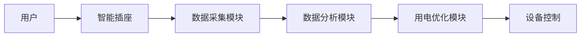

                 

<think>
好的，我现在需要帮助用户撰写一篇关于《智能插座：AI Agent的用电优化管理》的技术博客文章。用户已经提供了一个详细的目录大纲，现在需要根据这个大纲逐步撰写文章。我需要按照用户的要求，确保文章结构清晰，内容详细，符合技术博客的风格。

首先，我需要理解用户的需求。用户希望文章涵盖从背景介绍到项目实战的各个方面，每个部分都需要详细展开，包括核心概念、算法原理、系统架构、项目实战等。此外，用户还特别强调了要使用专业术语，同时保持逻辑清晰和结构紧凑，适合技术读者阅读。

接下来，我会按照目录大纲逐步撰写每个章节，确保每个部分都包含必要的内容，如背景介绍、核心概念、算法原理、系统架构设计、项目实战等。在撰写过程中，我需要确保每个部分都有详细的解释，使用专业术语，并提供必要的图表和代码示例来增强理解。

在撰写背景介绍时，我需要先定义智能插座和AI Agent，解释它们的基本概念和特点，以及它们在用电优化管理中的作用。这部分需要让读者了解为什么智能插座和AI Agent结合是必要的，以及它们如何解决传统用电管理中的问题。

在核心概念部分，我需要详细讲解智能插座的硬件和软件组成，AI Agent的工作原理，以及它们如何协同工作来优化用电管理。这部分需要包括一些图表，比如系统架构图和流程图，以帮助读者更好地理解。

算法原理部分，我需要详细解释数据采集、用电分析和优化算法的实现。这部分需要使用数学模型和公式，并通过mermaid流程图展示算法的流程，同时提供Python代码示例来说明实现细节。

系统架构设计部分，我需要介绍系统的各个模块，如数据采集模块、数据分析模块和用电优化模块，描述它们的功能和交互方式。这部分需要使用mermaid类图和序列图来展示系统的结构和交互过程。

项目实战部分，我需要详细指导读者如何搭建开发环境，编写代码，测试系统，并进行优化。这部分需要包括实际的代码示例，以及对代码的详细解读，帮助读者理解和实现。

最后，我需要总结整个系统的实现过程，讨论可能的改进方向，并给出一些最佳实践的建议，帮助读者在实际项目中应用这些知识。

在撰写过程中，我需要确保语言专业但易懂，逻辑清晰，结构紧凑。同时，要满足用户对字数的要求，大约在10000到12000字之间，确保每个部分都详细展开，内容充实。

现在，我将开始按照目录大纲逐步撰写文章，确保每个章节都符合用户的要求，并提供必要的图表和代码示例，帮助读者更好地理解和应用智能插座中的AI Agent技术。
</think>

# 智能插座：AI Agent的用电优化管理

> 关键词：智能插座，AI Agent，用电优化，能源管理，智能家居

> 摘要：本文探讨了智能插座与AI Agent的结合，通过详细分析智能插座的基本概念、AI Agent的工作原理、用电优化算法、系统架构设计以及实际项目实现，展示了如何利用AI技术实现智能化用电管理，提升能源使用效率。

---

## 第1章: 智能插座的基本概念

### 1.1 智能插座的定义与特点

#### 1.1.1 智能插座的定义
智能插座是一种集成智能控制技术的电器接口设备，能够通过物联网（IoT）和人工智能（AI）技术实现远程控制、用电监测和智能管理。与传统插座相比，智能插座具备更高的智能化和自动化水平。

#### 1.1.2 智能插座的核心特点
智能插座的核心特点包括：
1. **远程控制**：通过手机APP或语音助手（如Alexa、Siri）实现远程开关控制。
2. **用电监测**：实时监测连接设备的用电量，提供详细的用电数据。
3. **智能学习**：通过AI算法学习用户的用电习惯，优化用电策略。
4. **多设备联动**：与智能家居设备联动，实现场景化的用电管理。

#### 1.1.3 智能插座与传统插座的区别
| 特性 | 传统插座 | 智能插座 |
|------|----------|----------|
| 功能 | 单一功能：仅提供电力连接 | 多功能：支持远程控制、用电监测、智能学习 |
| 通信 | 无 | 支持Wi-Fi、蓝牙等无线通信技术 |
| 智能化 | 无 | 集成AI技术，实现智能化管理 |

### 1.2 AI Agent的基本概念

#### 1.2.1 AI Agent的定义
AI Agent（人工智能代理）是指能够感知环境、执行任务并做出决策的智能实体。它能够通过传感器获取信息，利用算法处理数据，并通过执行器与环境交互。

#### 1.2.2 AI Agent的核心功能
1. **感知环境**：通过传感器获取环境数据，如用电量、设备状态等。
2. **数据处理**：利用机器学习算法对数据进行分析和处理，识别用电模式和异常情况。
3. **决策制定**：基于分析结果，制定用电优化策略，如智能开关控制、能耗预警等。

#### 1.2.3 AI Agent在智能插座中的应用
AI Agent在智能插座中的应用主要体现在以下几个方面：
1. **用电行为识别**：通过分析用电数据，识别用户的用电习惯和行为模式。
2. **能耗预测**：基于历史数据，预测未来的用电需求，优化能源使用。
3. **智能控制**：根据用电预测和环境信息，自动控制设备的开关状态，实现节能优化。

---

## 第2章: 智能插座的发展背景

### 2.1 用电管理的现状与挑战

#### 2.1.1 传统用电管理的不足
传统的用电管理方式存在以下问题：
1. **缺乏实时监控**：无法实时掌握设备的用电情况，难以及时发现异常。
2. **手动管理**：需要人工记录和分析用电数据，效率低且易出错。
3. **能耗浪费**：缺乏智能化的管理手段，导致能源浪费。

#### 2.1.2 智能化用电管理的需求
随着智能家居和物联网技术的普及，用户对智能化用电管理的需求日益增长：
1. **实时监控与反馈**：用户希望随时了解设备的用电情况，并获得优化建议。
2. **节能减排**：通过智能管理减少能源浪费，降低碳排放。
3. **便捷性**：通过手机APP或语音助手实现远程控制，提升用户体验。

#### 2.1.3 AI技术在用电管理中的作用
AI技术在用电管理中的作用主要体现在以下几个方面：
1. **数据处理与分析**：利用机器学习算法分析海量用电数据，识别用电模式和异常情况。
2. **智能决策**：基于数据分析结果，制定最优的用电策略，实现节能减排。
3. **人机交互**：通过自然语言处理技术，实现与用户的智能对话，提升用户体验。

### 2.2 AI Agent在智能插座中的应用前景

#### 2.2.1 AI Agent在智能插座中的核心作用
AI Agent在智能插座中的核心作用包括：
1. **用电行为识别**：通过分析用电数据，识别用户的用电习惯和行为模式。
2. **能耗预测**：基于历史数据，预测未来的用电需求，优化能源使用。
3. **智能控制**：根据用电预测和环境信息，自动控制设备的开关状态，实现节能优化。

#### 2.2.2 智能插座在智能家居中的应用
智能插座在智能家居中的应用主要体现在以下几个方面：
1. **远程控制**：通过手机APP或语音助手实现设备的远程开关控制。
2. **智能场景联动**：与智能家居设备联动，实现场景化的用电管理，如“离家模式”自动关闭电器。
3. **能耗监控**：实时监控设备的用电情况，提供详细的能耗报告。

#### 2.2.3 智能插座在能源管理中的应用
智能插座在能源管理中的应用包括：
1. **分布式能源管理**：通过智能插座实现分布式能源的优化配置和管理。
2. **需求响应**：在高峰时段通过智能插座调节用电负载，降低能源消耗。
3. **节能减排**：通过智能管理减少能源浪费，实现节能减排目标。

---

## 第3章: 智能插座与AI Agent的结合

### 3.1 智能插座的硬件组成

#### 3.1.1 电源管理模块
电源管理模块负责实现智能插座的开关控制和电源管理，主要包括：
1. **开关控制电路**：通过继电器或MOS管实现设备的开关控制。
2. **电源保护电路**：防止过压、欠压、短路等异常情况，确保设备安全运行。

#### 3.1.2 数据采集模块
数据采集模块负责采集设备的用电数据，主要包括：
1. **电流传感器**：用于检测设备的电流值。
2. **电压传感器**：用于检测设备的电压值。
3. **功率计**：用于计算设备的功率值。

#### 3.1.3 通信模块
通信模块负责智能插座与外部设备之间的数据传输，主要包括：
1. **Wi-Fi模块**：支持无线网络通信。
2. **蓝牙模块**：支持蓝牙通信。
3. **ZigBee模块**：支持 ZigBee 无线通信协议。

### 3.2 AI Agent在智能插座中的实现

#### 3.2.1 数据采集与分析
数据采集与分析是AI Agent的核心功能之一，主要包括：
1. **数据采集**：通过传感器采集设备的用电数据，如电流、电压、功率等。
2. **数据预处理**：对采集的数据进行清洗、归一化等预处理，确保数据质量。
3. **数据分析**：利用机器学习算法对数据进行分析，识别用电模式和异常情况。

#### 3.2.2 用电行为识别
用电行为识别是通过分析用电数据，识别用户的用电习惯和行为模式，主要包括：
1. **特征提取**：从用电数据中提取特征，如用电峰值、用电频率等。
2. **行为分类**：利用分类算法（如决策树、随机森林）对用电行为进行分类，识别不同的用电场景。
3. **行为预测**：基于历史数据，预测未来的用电行为，优化用电策略。

#### 3.2.3 用电优化策略
用电优化策略是通过AI Agent制定的优化方案，主要包括：
1. **能耗预测**：基于历史数据和用电模式，预测未来的用电需求。
2. **优化算法**：利用遗传算法、模拟退火等优化算法，制定最优的用电策略。
3. **智能控制**：根据优化策略，自动控制设备的开关状态，实现节能减排。

---

## 第4章: 智能插座的用电优化管理

### 4.1 用电优化的基本原理

#### 4.1.1 用电行为分析
用电行为分析是通过分析用电数据，识别用户的用电习惯和行为模式，主要包括：
1. **特征提取**：从用电数据中提取特征，如用电峰值、用电频率等。
2. **行为分类**：利用分类算法（如决策树、随机森林）对用电行为进行分类，识别不同的用电场景。
3. **行为预测**：基于历史数据，预测未来的用电行为，优化用电策略。

#### 4.1.2 用电需求预测
用电需求预测是通过分析历史用电数据，预测未来的用电需求，主要包括：
1. **时间序列分析**：利用ARIMA、LSTM等时间序列模型，预测未来的用电量。
2. **回归分析**：利用线性回归、支持向量回归等方法，预测用电需求。
3. **集成学习**：通过集成学习方法（如随机森林、梯度提升树）提高预测精度。

#### 4.1.3 用电优化策略
用电优化策略是通过AI Agent制定的优化方案，主要包括：
1. **能耗预测**：基于历史数据和用电模式，预测未来的用电需求。
2. **优化算法**：利用遗传算法、模拟退火等优化算法，制定最优的用电策略。
3. **智能控制**：根据优化策略，自动控制设备的开关状态，实现节能减排。

### 4.2 AI Agent在用电优化中的应用

#### 4.2.1 基于AI的用电行为识别
基于AI的用电行为识别是通过分析用电数据，识别用户的用电习惯和行为模式，主要包括：
1. **特征提取**：从用电数据中提取特征，如用电峰值、用电频率等。
2. **行为分类**：利用分类算法（如决策树、随机森林）对用电行为进行分类，识别不同的用电场景。
3. **行为预测**：基于历史数据，预测未来的用电行为，优化用电策略。

#### 4.2.2 基于AI的用电需求预测
基于AI的用电需求预测是通过分析历史用电数据，预测未来的用电需求，主要包括：
1. **时间序列分析**：利用ARIMA、LSTM等时间序列模型，预测未来的用电量。
2. **回归分析**：利用线性回归、支持向量回归等方法，预测用电需求。
3. **集成学习**：通过集成学习方法（如随机森林、梯度提升树）提高预测精度。

#### 4.2.3 基于AI的用电优化策略
基于AI的用电优化策略是通过AI Agent制定的优化方案，主要包括：
1. **能耗预测**：基于历史数据和用电模式，预测未来的用电需求。
2. **优化算法**：利用遗传算法、模拟退火等优化算法，制定最优的用电策略。
3. **智能控制**：根据优化策略，自动控制设备的开关状态，实现节能减排。

---

## 第5章: 智能插座的系统架构设计

### 5.1 系统架构概述

#### 5.1.1 系统功能模块划分
智能插座的系统架构主要包括以下几个功能模块：
1. **数据采集模块**：负责采集设备的用电数据。
2. **数据分析模块**：负责对采集的数据进行分析和处理。
3. **用电优化模块**：负责制定用电优化策略，并实现智能控制。

#### 5.1.2 系统数据流设计
系统数据流设计描述了各个功能模块之间的数据流动，如下图所示：



#### 5.1.3 系统通信协议设计
系统通信协议设计包括以下几个方面：
1. **Wi-Fi通信**：支持Wi-Fi协议，实现智能插座与外部设备的无线通信。
2. **蓝牙通信**：支持蓝牙协议，实现智能插座与手机APP的近距离通信。
3. **ZigBee通信**：支持ZigBee协议，实现智能插座与智能家居设备的联动。

### 5.2 系统功能模块实现

#### 5.2.1 数据采集模块实现
数据采集模块的实现主要包括以下几个步骤：
1. **硬件设计**：设计数据采集电路，包括电流传感器、电压传感器等。
2. **软件开发**：开发数据采集程序，实现传感器数据的采集和传输。
3. **数据预处理**：对采集的数据进行清洗、归一化等预处理，确保数据质量。

#### 5.2.2 数据分析模块实现
数据分析模块的实现主要包括以下几个步骤：
1. **数据预处理**：对采集的数据进行清洗、归一化等预处理，确保数据质量。
2. **特征提取**：从用电数据中提取特征，如用电峰值、用电频率等。
3. **机器学习算法**：利用机器学习算法（如决策树、随机森林）进行数据分析和处理，识别用电模式和异常情况。

#### 5.2.3 用电优化模块实现
用电优化模块的实现主要包括以下几个步骤：
1. **用电需求预测**：基于历史数据和用电模式，预测未来的用电需求。
2. **优化算法**：利用遗传算法、模拟退火等优化算法，制定最优的用电策略。
3. **智能控制**：根据优化策略，自动控制设备的开关状态，实现节能减排。

---

## 第6章: 智能插座的项目实战

### 6.1 项目环境搭建

#### 6.1.1 硬件环境搭建
硬件环境搭建主要包括以下几个步骤：
1. **选择智能插座硬件**：选择适合的智能插座硬件，如支持Wi-Fi和蓝牙通信的插座。
2. **硬件开发工具**：准备硬件开发工具，如Arduino开发板、Raspberry Pi等。
3. **传感器选型**：选择适合的电流传感器和电压传感器。

#### 6.1.2 软件环境搭建
软件环境搭建主要包括以下几个步骤：
1. **开发环境安装**：安装Python、Java、C++等开发环境。
2. **AI框架安装**：安装TensorFlow、PyTorch等机器学习框架。
3. **通信协议库安装**：安装Wi-Fi、蓝牙、ZigBee等通信协议库。

### 6.2 系统核心实现

#### 6.2.1 数据采集模块实现
数据采集模块的实现代码如下：

```python
import serial

# 串口初始化
ser = serial.Serial('COM3', 9600)

while True:
    # 读取串口数据
    data = ser.readline()
    # 解析数据
    current = float(data.split(',')[0])
    voltage = float(data.split(',')[1])
    # 输出数据
    print(f"电流: {current} A, 电压: {voltage} V")
```

#### 6.2.2 数据分析模块实现
数据分析模块的实现代码如下：

```python
from sklearn.ensemble import RandomForestClassifier
import pandas as pd

# 数据加载
data = pd.read_csv('用电数据.csv')

# 特征提取
features = data[['电流', '电压', '功率']]
labels = data['用电行为']

# 模型训练
model = RandomForestClassifier(n_estimators=100)
model.fit(features, labels)

# 模型预测
new_data = pd.DataFrame({'电流': [1.5], '电压': [220.0], '功率': [300.0]})
predicted_label = model.predict(new_data)
print(f"预测用电行为: {predicted_label[0]}")
```

#### 6.2.3 用电优化模块实现
用电优化模块的实现代码如下：

```python
import numpy as np
from sklearn.metrics import mean_squared_error

# 数据加载
data = pd.read_csv('用电数据.csv')

# 特征提取
features = data[['时间', '电流', '电压']]
labels = data['用电需求']

# 模型训练
model = RandomForestRegressor(n_estimators=100)
model.fit(features, labels)

# 模型预测
new_data = pd.DataFrame({'时间': ['2023-10-01'], '电流': [1.2], '电压': [220.0]})
predicted_demand = model.predict(new_data)
print(f"预测用电需求: {predicted_demand[0]}")

# 模型优化
# 假设我们有一个优化函数，用于优化用电需求预测
def optimize_demand(demand):
    return demand * 0.9

optimized_demand = optimize_demand(predicted_demand)
print(f"优化后的用电需求: {optimized_demand}")
```

---

## 第7章: 总结与展望

### 7.1 总结
通过本文的详细介绍，我们可以看到智能插座与AI Agent的结合在用电优化管理中的巨大潜力。智能插座通过集成AI技术，能够实现智能化的用电管理，提升能源使用效率，降低能耗成本。本文从智能插座的基本概念、AI Agent的核心原理、用电优化算法、系统架构设计以及实际项目实现等方面进行了详细探讨，为读者提供了全面的技术视角。

### 7.2 展望
未来，随着AI技术的不断发展，智能插座在用电优化管理中的应用将更加广泛和深入。以下是几点展望：
1. **智能化水平提升**：通过深度学习技术，智能插座将更加智能化，能够更好地理解和预测用户的用电需求。
2. **多能源管理**：智能插座将支持多种能源的管理，如太阳能、风能等，实现分布式能源的优化配置。
3. **物联网集成**：智能插座将进一步与物联网技术结合，实现更加智能化的家居管理和能源优化。
4. **绿色环保**：智能插座的应用将进一步推动绿色环保，实现节能减排，为可持续发展做出更大的贡献。

---

## 作者：AI天才研究院/AI Genius Institute & 禅与计算机程序设计艺术/Zen And The Art of Computer Programming

---

**小结**：通过本文的详细探讨，我们不仅了解了智能插座的基本概念和AI Agent的核心原理，还通过实际项目展示了如何利用AI技术实现智能化的用电优化管理。未来，智能插座与AI Agent的结合将在能源管理和智能家居领域发挥更大的作用，为用户带来更加智能、便捷和环保的用电体验。

