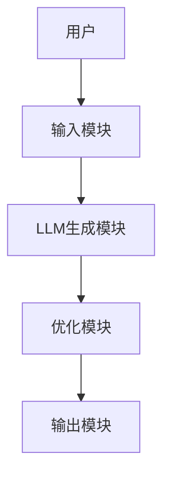
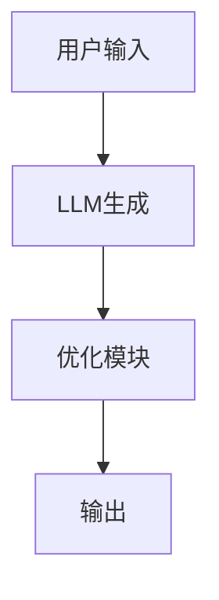

                 

<think>
好的，我现在需要根据用户的要求，逐步思考如何撰写《智能新闻写作 AI Agent：LLM 辅助新闻报道生成》这篇技术博客文章。首先，我会仔细阅读用户提供的详细要求，确保理解每一个细节。

首先，用户希望文章结构清晰，分为背景介绍、核心概念、算法原理、系统架构、项目实战等多个部分，并且每一部分都要详细展开。文章需要使用专业且易懂的技术语言，保持逻辑性和条理性。同时，用户还要求使用Mermaid语法来绘制流程图、系统架构图等，以及嵌入数学公式和代码示例。

接下来，我需要考虑每一章的内容安排。第一部分应该是背景与概念，介绍智能新闻写作的背景、问题、目标以及解决思路。这部分需要详细分析传统新闻写作的痛点，以及LLM技术带来的变革。然后，第二部分将深入探讨大语言模型的原理与应用，包括LLM的基本原理、在新闻写作中的具体应用，以及与传统写作的对比。第三部分则聚焦于智能新闻写作的流程与优化，分析传统流程的痛点，介绍AI辅助的流程优化，并讨论关键优化点。

接下来是系统架构与实现部分，需要详细讲解系统的模块划分、技术选型、接口设计以及实现细节。这部分可能需要使用系统架构图和流程图来辅助说明。然后是项目实战，从环境搭建到代码实现，再到案例分析，帮助读者一步步掌握如何开发智能新闻写作系统。接下来，讨论实际应用中的挑战与解决方案，分析技术的局限性，并提出改进建议。最后，总结全书内容，并展望未来的趋势。

在写作过程中，我需要确保每一章都有明确的主题，并且各章之间逻辑连贯。同时，每一部分的细节要丰富具体，包含必要的图表、代码示例和数学公式。例如，在算法原理部分，需要用Mermaid绘制流程图，并给出相应的Python代码和数学模型，解释其工作原理。

此外，我还需要注意文章的格式要求，使用markdown格式，正确嵌入数学公式和图表。文章末尾要加上作者信息，确保内容完整。

在思考过程中，我可能会遇到一些问题，比如如何选择合适的代码示例，如何用Mermaid清晰地表达系统架构，或者如何将复杂的算法原理简化为易懂的例子。对于这些问题，我需要仔细研究，确保每一部分都能准确传达信息，同时保持文章的流畅性和专业性。

总结一下，我的思考过程是：理解用户需求，确定文章结构，细化每一章的内容，确保涵盖所有要求，同时保持逻辑性和专业性。接下来，我将按照这个思路，逐步撰写文章的各个部分。
</think>

# 智能新闻写作 AI Agent：LLM 辅助新闻报道生成

## 关键词：
- 大语言模型（LLM）
- 智能新闻写作
- 人机协作
- 生成式AI
- 新闻报道生成

## 摘要：
随着人工智能技术的快速发展，大语言模型（LLM）在新闻写作领域的应用日益广泛。本文深入探讨了LLM辅助新闻报道生成的技术背景、核心原理、系统架构以及实际应用。通过分析传统新闻写作的痛点，本文提出了利用LLM优化新闻写作流程的方法，并详细讲解了基于LLM的智能新闻写作系统的实现过程。最后，本文总结了当前技术的局限性，并展望了未来的发展方向，为新闻行业的人工智能应用提供了有价值的参考。

---

# 第一部分: 智能新闻写作的背景与概念

## 第1章: 智能新闻写作的背景与问题描述

### 1.1 智能新闻写作的背景

#### 1.1.1 传统新闻写作的痛点
- 传统新闻写作依赖人工，效率低下。
- 内容质量受个人能力限制，难以保证一致性。
- 新闻报道的时效性要求高，人工难以快速响应。

#### 1.1.2 人工智能技术的发展与应用
- 自然语言处理技术的突破，推动了生成式AI的发展。
- LLM（大语言模型）的出现，为新闻写作提供了新的可能性。

#### 1.1.3 LLM在新闻写作中的潜力
- 通过LLM快速生成新闻草稿，提高写作效率。
- 基于大量数据，提供多样化的内容建议。
- 实现人机协作，优化新闻报道的质量。

### 1.2 问题描述与目标

#### 1.2.1 新闻写作中的效率问题
- 人工写作耗时长，难以满足高频率的新闻报道需求。
- 编辑和校对工作耗时，影响整体效率。

#### 1.2.2 内容质量的提升需求
- 传统写作容易受主观因素影响，内容可能存在偏差。
- 需要更客观、全面的新闻报道，提升读者体验。

#### 1.2.3 LLM辅助新闻写作的目标设定
- 提高新闻写作的效率，缩短报道周期。
- 优化内容质量，提升报道的准确性和客观性。
- 实现人机协作，充分发挥AI的优势。

### 1.3 解决思路与技术路线

#### 1.3.1 利用LLM生成新闻草稿
- 通过LLM快速生成新闻报道的初稿。
- 提供多种写作思路，供编辑选择。

#### 1.3.2 结合领域知识优化内容
- 利用领域知识库优化报道内容。
- 提供相关数据支持，增强报道的准确性。

#### 1.3.3 人机协作的写作模式
- AI生成初稿，人类编辑进行优化和调整。
- 通过反馈机制，提升模型的生成能力。

### 1.4 边界与外延

#### 1.4.1 智能新闻写作的适用范围
- 适用于时效性要求高的新闻报道。
- 适合数据量大、内容相对固定的领域。

#### 1.4.2 与传统写作的区别
- 内容生成方式不同：传统写作依赖人工，智能写作依赖AI生成。
- 内容优化方式不同：传统写作依赖编辑，智能写作依赖反馈机制优化。

#### 1.4.3 技术的局限性与未来扩展方向
- 当前LLM在复杂场景下的生成能力有限。
- 数据隐私和伦理问题需要进一步探讨。

### 1.5 本章小结
本章通过分析传统新闻写作的痛点，探讨了LLM在新闻写作中的潜力，并提出了利用LLM优化新闻写作流程的目标和解决思路。

---

## 第2章: 大语言模型的基本原理与应用

### 2.1 大语言模型的定义与特点

#### 2.1.1 LLM的定义
- 大语言模型是一种基于深度学习的生成模型，能够理解和生成人类语言。
- 典型模型包括GPT系列、BERT等。

#### 2.1.2 LLM的特点
- 大规模数据训练：模型参数量巨大，能够捕捉语言的复杂模式。
- 生成能力强大：能够生成连贯且自然的语言文本。
- 可定制化：通过微调模型，可以适应特定领域的任务需求。

### 2.2 LLM在新闻写作中的应用

#### 2.2.1 文本生成的基本原理
- 基于概率模型生成文本，通过上下文预测下一个词。
- 利用注意力机制捕捉文本中的关键信息。

#### 2.2.2 语言模型的可定制性
- 通过微调模型，使其适应新闻领域的语言风格。
- 根据具体需求，生成特定类型的新闻报道。

#### 2.2.3 LLM生成新闻的流程
1. 输入新闻主题和关键词。
2. 模型根据输入生成新闻草稿。
3. 人类编辑对草稿进行优化和调整。

### 2.3 LLM与传统新闻写作的对比

#### 2.3.1 效率的提升
- LLM可以在短时间内生成大量文本，显著提高写作效率。
- 传统写作依赖人工，效率较低。

#### 2.3.2 内容的创新性
- LLM能够提供多样化的写作思路，激发创意。
- 传统写作受个人经验限制，创新性有限。

#### 2.3.3 人机协作的优势
- 结合AI生成初稿和人工优化，提升内容质量和效率。
- AI能够提供数据支持，增强报道的深度和广度。

### 2.4 本章小结
本章介绍了大语言模型的基本原理和特点，并探讨了其在新闻写作中的应用，分析了与传统写作的区别和优势。

---

## 第3章: 智能新闻写作的流程与优化

### 3.1 传统新闻写作流程

#### 3.1.1 选题与素材收集
- 确定新闻主题，收集相关素材和数据。
- 需要大量时间和精力进行调研。

#### 3.1.2 文本撰写
- 根据收集的素材，进行文本撰写。
- 内容质量和连贯性依赖个人能力。

#### 3.1.3 内容优化与校对
- 由编辑对文本进行优化和校对。
- 需要反复修改，耗时较长。

### 3.2 AI辅助的新闻写作流程

#### 3.2.1 确定新闻主题
- 输入新闻主题和关键词。
- 指定报道类型和风格。

#### 3.2.2 LLM生成草稿
- 模型根据输入生成新闻草稿。
- 提供多种生成选项供选择。

#### 3.2.3 人机协作优化
- 人类编辑对草稿进行优化和调整。
- 提供反馈，优化模型生成能力。

### 3.3 智能新闻写作的关键优化点

#### 3.3.1 内容生成的高效性
- 利用LLM快速生成初稿，缩短写作周期。

#### 3.3.2 内容质量的提升
- 通过优化算法和反馈机制，提升生成内容的准确性和客观性。

#### 3.3.3 人机协作的协同性
- 提高AI与人类编辑的协同效率，充分发挥双方优势。

### 3.4 本章小结
本章分析了传统新闻写作的流程，并提出了利用AI辅助优化的流程，探讨了关键优化点。

---

## 第4章: 智能新闻写作系统的架构与实现

### 4.1 系统架构设计

#### 4.1.1 模块划分
- 用户输入模块：接收新闻主题和关键词。
- LLM生成模块：生成新闻草稿。
- 优化与反馈模块：优化内容并提供反馈。
- 输出模块：输出最终的新闻报道。

#### 4.1.2 系统架构图


### 4.2 技术实现细节

#### 4.2.1 LLM选择与配置
- 使用开源模型（如GPT-3）或定制化模型。
- 配置模型参数，优化生成效果。

#### 4.2.2 接口设计
- API接口设计，方便与其他系统的集成。
- 提供参数配置接口，灵活调整生成内容。

#### 4.2.3 系统流程图


### 4.3 项目实战

#### 4.3.1 环境搭建
- 安装Python和相关库（如transformers、torch）。
- 配置LLM模型和API接口。

#### 4.3.2 核心代码实现
```python
from transformers import GPT2LMHeadModel, GPT2Tokenizer

# 初始化模型和分词器
model_name = 'gpt2'
tokenizer = GPT2Tokenizer.from_pretrained(model_name)
model = GPT2LMHeadModel.from_pretrained(model_name)

# 生成新闻草稿
def generate_article(topic):
    input_text = f"Write a news article about {topic}."
    inputs = tokenizer.encode(input_text, return_tensors='pt')
    outputs = model.generate(inputs, max_length=500, temperature=0.7)
    article = tokenizer.decode(outputs[0], skip_special_tokens=True)
    return article

# 优化模块示例
def optimize_article(article):
    # 简单的优化逻辑，实际可根据需求扩展
    optimized_article = article.replace("the", "The").capitalize()
    return optimized_article
```

### 4.4 本章小结
本章详细讲解了智能新闻写作系统的架构设计和实现细节，并通过代码示例展示了系统的实际应用。

---

## 第5章: 实际应用中的挑战与解决方案

### 5.1 当前技术的局限性

#### 5.1.1 内容生成的准确性问题
- LLM生成的内容可能存在事实性错误。
- 需要结合外部知识库进行验证。

#### 5.1.2 伦理与隐私问题
- 数据隐私问题，如何处理敏感信息。
- 生成内容的伦理问题，避免偏见和不实信息。

#### 5.1.3 技术的可解释性问题
- LLM的决策过程难以解释，影响信任度。
- 需要提高模型的可解释性，增强透明度。

### 5.2 解决方案与改进建议

#### 5.2.1 数据验证与事实核查
- 集成事实核查工具，验证生成内容的准确性。
- 结合领域知识库，优化生成结果。

#### 5.2.2 伦理与隐私保护
- 制定数据使用规范，确保隐私保护。
- 建立内容审核机制，避免伦理问题。

#### 5.2.3 提高模型的可解释性
- 开发可解释的生成模型，增强透明度。
- 提供生成过程的可视化，帮助用户理解。

### 5.3 本章小结
本章分析了当前技术的局限性，并提出了相应的解决方案和改进建议，为智能新闻写作的未来发展提供了方向。

---

## 第6章: 总结与展望

### 6.1 全文总结
- 介绍了智能新闻写作的背景和问题。
- 探讨了LLM在新闻写作中的应用和优势。
- 详细讲解了系统的架构和实现。

### 6.2 未来展望
- 技术的进一步发展：更大规模的模型和更高效的生成算法。
- 应用领域的扩展：从新闻延伸到其他内容生成领域。
- 人机协作的深化：优化协作流程，提升内容质量。

### 6.3 结语
智能新闻写作作为人工智能技术的重要应用，将为新闻行业带来深远的影响。随着技术的不断进步，人机协作将成为新闻写作的主要模式，推动新闻行业进入新的发展阶段。

---

## 作者信息

作者：AI天才研究院/AI Genius Institute & 禅与计算机程序设计艺术/Zen And The Art of Computer Programming

---

**文章结束**

