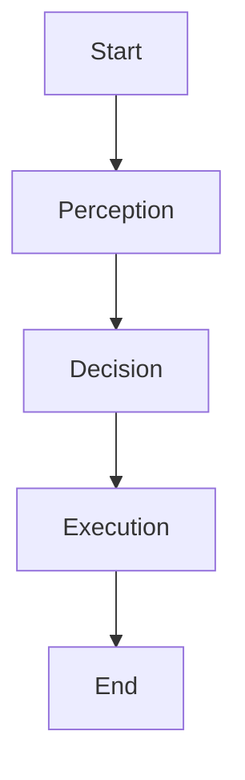
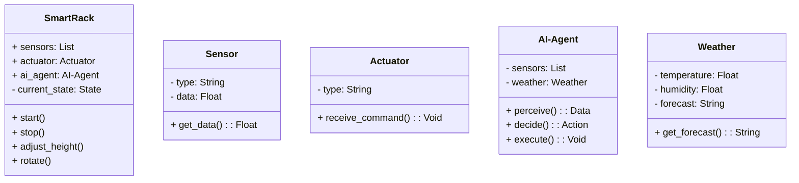
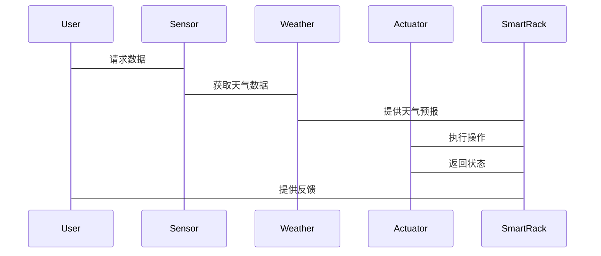

                 


# 智能晾衣架：AI Agent的衣物护理与天气适应

> **关键词**：智能晾衣架、AI Agent、物联网、天气适应、衣物护理  
> **摘要**：本文将探讨智能晾衣架如何通过AI Agent技术实现衣物护理与天气适应。从背景与概念到系统架构、算法实现，再到项目实战，我们将逐步分析智能晾衣架的核心技术与应用场景，为读者提供全面的技术解读。

---

## 第一部分: 背景与核心概念

### 第1章: 智能晾衣架的背景与问题背景

#### 1.1 问题背景与问题描述
智能晾衣架的出现源于衣物晾晒过程中存在的诸多痛点。传统晾衣架依赖人工操作，无法根据天气变化自动调整晾晒时间，导致衣物可能受潮或损坏。特别是在潮湿或多雨的地区，衣物晾晒效率低下，甚至可能引发霉菌滋生等问题。此外，用户往往需要手动监控天气情况，增加了使用成本。

智能晾衣架的目标是通过AI Agent技术，实现衣物晾晒的自动化、智能化与高效化。其应用场景包括家庭、酒店、洗衣店等，尤其适合需要高效衣物护理的场景。

#### 1.2 问题解决与边界分析
智能晾衣架的核心功能包括：
- 自动感知天气变化
- 智能决策晾晒时间
- 自动控制晾衣架的伸缩与旋转
- 提供衣物护理建议

边界与外延：
- 边界：仅限于衣物晾晒过程中的自动化控制
- 外延：不涉及衣物清洗、烘干等其他衣物处理环节

核心概念：
- AI Agent：负责感知、决策与执行
- 物联网：连接传感器与晾衣架
- 天气适应：根据天气数据优化晾晒策略

#### 1.3 核心概念与概念对比
AI Agent、物联网、天气适应的核心概念对比：

| **概念** | **定义** | **特点** | **作用** |
|----------|----------|----------|----------|
| AI Agent | 智能体，负责感知、决策与执行 | 能够自主学习与优化 | 控制晾衣架的伸缩与旋转 |
| 物联网   | 连接传感器与晾衣架的网络系统 | 实现设备间的数据通信 | 支持远程控制与数据采集 |
| 天气适应 | 根据天气数据优化晾晒策略 | 依赖天气预报API | 提供最优晾晒时间建议 |

---

## 第二部分: 核心概念与技术原理

### 第2章: AI Agent与智能晾衣架的核心原理

#### 2.1 AI Agent的基本原理
AI Agent的核心功能模块包括：
1. **感知**：通过传感器获取环境数据（如温度、湿度、光照）
2. **决策**：基于感知数据与天气预报，制定晾晒策略
3. **执行**：通过物联网设备控制晾衣架的伸缩与旋转

#### 2.2 智能晾衣架的系统架构

##### 实体关系图：用户、天气、传感器、晾衣架


##### 算法流程图


---

## 第三部分: 算法实现与数学模型

### 第3章: AI Agent的算法实现

#### 3.1 算法原理与数学模型
AI Agent的感知、决策与执行过程涉及多个算法：

1. **感知算法**：基于传感器数据的特征提取
   - 使用回归分析预测天气变化
   $$ y = \beta_0 + \beta_1x_1 + \beta_2x_2 + \ldots + \beta_nx_n $$

2. **决策算法**：基于天气数据的智能决策
   - 使用强化学习优化晾晒策略
   - 状态空间：天气状况、传感器数据
   - 动作空间：伸缩晾衣架、旋转晾衣架

3. **执行算法**：基于AI Agent的自动控制
   - 使用模糊逻辑处理复杂场景
   $$ \text{控制信号} = \text{模糊推理}(\text{输入信号}) $$

#### 3.2 系统架构设计

##### 类图


##### 序列图


---

## 第四部分: 项目实战

### 第4章: 项目实战与代码实现

#### 4.1 环境搭建
- **安装Python**：`python --version`
- **安装AI框架**：`pip install numpy scikit-learn`

#### 4.2 核心代码实现

##### 数据处理模块
```python
import numpy as np

def preprocess(data):
    # 数据预处理：归一化
    normalized_data = (data - np.min(data)) / (np.max(data) - np.min(data))
    return normalized_data
```

##### AI决策模块
```python
from sklearn import linear_model

def ai_decision(features):
    # 线性回归模型
    model = linear_model.LinearRegression()
    model.fit(features, targets)
    return model.predict(new_features)
```

##### 系统交互模块
```python
class SmartRack:
    def __init__(self):
        self.sensors = []
        self.actuator = None
        self.ai_agent = AI-Agent()

    def start(self):
        while True:
            data = self.sensors.read()
            decision = self.ai_agent.decide(data)
            self.actuator.execute(decision)
```

#### 4.3 案例分析与代码解读
通过具体案例分析，展示AI Agent如何优化晾晒时间。例如，在湿度较高的天气下，AI Agent会根据传感器数据调整晾衣架的高度与旋转角度，确保衣物快速干燥。

---

## 第五部分: 最佳实践与总结

### 第5章: 最佳实践与项目总结

#### 5.1 最佳实践
- 定期更新天气预报API
- 定期校准传感器以保证数据准确性
- 根据用户反馈优化AI算法

#### 5.2 项目小结
智能晾衣架通过AI Agent与物联网技术的结合，实现了衣物晾晒的自动化与智能化。本文详细分析了其技术原理、系统架构与实现方案，为读者提供了全面的技术解读。

#### 5.3 注意事项
- 确保系统安全性，防止网络攻击
- 定期维护设备，确保传感器与执行机构正常工作
- 处理复杂天气情况时，建议用户手动干预

#### 5.4 拓展阅读
- 探索更多AI在智能家居中的应用
- 研究更高效的天气预测算法
- 探讨AI Agent在其他领域的潜在应用

---

## 作者：AI天才研究院/AI Genius Institute & 禅与计算机程序设计艺术 /Zen And The Art of Computer Programming

