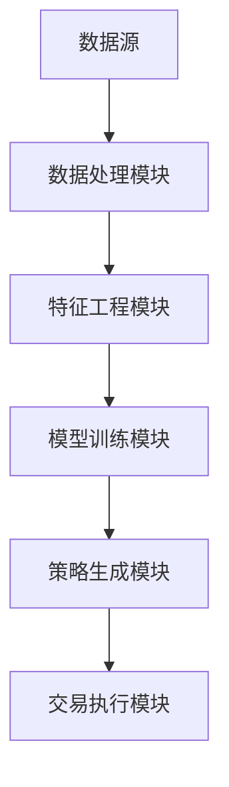

                 


# 智能期权交易策略生成器

## 关键词：智能期权、交易策略、人工智能、机器学习、量化交易

## 摘要：智能期权交易策略生成器是一种利用人工智能技术，通过分析市场数据和历史信息，自动生成和优化期权交易策略的系统。本文将详细探讨智能期权交易策略生成器的原理、系统设计、实现方法及实际应用，帮助读者了解如何利用人工智能技术提升期权交易的效率和准确性。

---

## 第一部分：智能期权交易策略生成器概述

### 第1章：期权交易基础

#### 1.1 期权的基本概念
- **1.1.1 期权的定义与分类**
  - 期权是一种金融衍生品，赋予持有者在特定时间内以特定价格买入或卖出标的资产的权利。
  - 期权分为看涨期权（Call Option）和看跌期权（Put Option）。
  
- **1.1.2 期权的买方与卖方**
  - 买方支付期权费，获得权利但无义务。
  - 卖方收取期权费，承担履行义务的风险。

- **1.1.3 期权的标的资产与执行价格**
  - 标的资产：如股票、指数或商品。
  - 执行价格：期权合约中规定的买入或卖出标的资产的价格。

#### 1.2 期权定价模型
- **1.2.1 Black-Scholes模型的介绍**
  - Black-Scholes模型是用于定价欧式期权的数学模型。
  - 公式：$$C = S_0 N(d_1) - K e^{-rT} N(d_2)$$
    - \( S_0 \)：标的资产当前价格
    - \( K \)：执行价格
    - \( r \)：无风险利率
    - \( T \)：到期时间
    - \( N(d) \)：标准正态分布的累积分布函数
    - \( d_1 = \frac{\ln(S_0/K) + (r + \sigma^2/2)T}{\sigma \sqrt{T}} \)
    - \( d_2 = d_1 - \sigma \sqrt{T} \)

- **1.2.2 二叉树模型的原理**
  - 通过构建树状模型，模拟标的资产价格的波动，计算期权的期望值。
  - 适用于美式期权的定价。

- **1.2.3 期权定价的影响因素**
  - 标的资产价格波动率、时间、无风险利率、标的资产价格、执行价格等。

#### 1.3 期权交易策略
- **1.3.1 基本的期权交易策略**
  - 单独买入看涨期权、卖出看跌期权等。

- **1.3.2 复杂的期权组合策略**
  - 例如，跨式组合（Straddle）、宽跨式组合（Strangle）等。

- **1.3.3 风险管理在期权交易中的重要性**
  - 使用Delta、Gamma、Vega等风险指标进行风险控制。

---

## 第二部分：人工智能基础

### 第2章：人工智能与机器学习概述

#### 2.1 人工智能的基本概念
- **人工智能**：模拟人类智能的技术，包括学习、推理和自我修正。

#### 2.2 机器学习的定义与分类
- **监督学习**：通过标签数据训练模型，预测新数据。
- **无监督学习**：通过聚类分析，发现数据中的隐藏结构。
- **强化学习**：通过奖励机制，学习最优策略。

#### 2.3 深度学习基础
- **神经网络**：由层状结构组成，用于学习复杂数据模式。
- **卷积神经网络（CNN）**：适用于图像处理和时间序列分析。
- **循环神经网络（RNN）**：适用于序列数据，如时间序列预测。

---

## 第三部分：智能期权交易策略生成器的原理

### 第3章：数据收集与预处理

#### 3.1 数据来源
- **市场数据**：包括标的资产的历史价格、成交量等。
- **历史价格与波动率数据**：用于模型训练。
- **市场情绪数据**：如新闻、社交媒体 sentiment 分析。

#### 3.2 数据清洗与预处理
- **数据清洗**：处理缺失值、异常值。
- **数据标准化**：将数据归一化，便于模型训练。
- **时间序列数据的处理**：考虑数据的时间依赖性。

### 第4章：特征工程

#### 4.1 特征的选择与提取
- **技术指标**：如移动平均线（MA）、相对强弱指数（RSI）。
- **市场情绪指标**：如VIX指数，反映市场波动性。

#### 4.2 数据增强
- **数据增强**：通过生成合成数据，增加训练数据的多样性。

### 第5章：模型选择与优化

#### 5.1 机器学习模型的选择
- **支持向量机（SVM）**：适用于分类任务。
- **随机森林**：适用于特征重要性分析。
- **XGBoost/LightGBM**：适用于高精度预测。

#### 5.2 神经网络模型的选择
- **LSTM网络**：适用于时间序列预测。
- **Transformer架构**：适用于长序列依赖。

#### 5.3 模型优化与调参
- **超参数优化**：使用网格搜索或随机搜索。
- **交叉验证**：评估模型的泛化能力。

---

## 第四部分：系统设计与实现

### 第6章：系统架构设计

#### 6.1 系统功能设计
- **数据接口**：获取实时市场数据。
- **特征提取模块**：生成交易信号。
- **策略生成模块**：输出交易策略。
- **风险控制模块**：监控和管理风险。

#### 6.2 系统架构图


### 第7章：算法实现

#### 7.1 LSTM网络实现
- **LSTM结构**：包括输入门、遗忘门、输出门。
- **代码示例**：
  ```python
  import keras
  from keras.layers import LSTM, Dense
  model = keras.Sequential()
  model.add(LSTM(64, input_shape=(timesteps, features)))
  model.add(Dense(1))
  model.compile(optimizer='adam', loss='mean_squared_error')
  ```

#### 7.2 策略生成模块实现
- **策略生成逻辑**：根据模型预测结果，生成买卖信号。
- **代码示例**：
  ```python
  def generate_strategy(predictions):
      strategy = []
      for pred in predictions:
          if pred > 0.5:
              strategy.append('buy')
          else:
              strategy.append('sell')
      return strategy
  ```

---

## 第五部分：项目实战

### 第8章：环境安装与配置

#### 8.1 环境配置
- **Python版本**：3.8以上。
- **库安装**：TensorFlow、Keras、Pandas、NumPy。

### 第9章：核心实现

#### 9.1 数据处理与特征工程
- **数据获取**：使用Yahoo Finance API获取股票数据。
- **特征提取**：计算技术指标和市场情绪指标。

#### 9.2 模型训练与评估
- **训练数据分割**：训练集、验证集、测试集。
- **模型评估**：使用准确率、召回率、F1分数等指标。

#### 9.3 交易策略生成与回测
- **回测策略**：在历史数据上测试策略的收益和风险。
- **风险管理**：设置止损和止盈点。

---

## 第六部分：高级主题与扩展

### 第10章：动态调整与对冲机制

#### 10.1 动态策略调整
- **实时监控市场变化**，动态调整交易策略。

#### 10.2 风险对冲
- **使用期权构建对冲组合**，降低市场风险。

### 第11章：未来趋势与挑战

#### 11.1 未来趋势
- **量子计算**：提升模型计算能力。
- **多模态数据**：结合文本、图像等多源数据。

#### 11.2 当前挑战
- **数据质量**：确保数据的准确性和完整性。
- **模型泛化能力**：提高模型在不同市场环境下的表现。

---

## 第七部分：总结与展望

### 第12章：总结

- **智能期权交易策略生成器**结合了人工智能和金融工程，为交易者提供了高效、智能的交易工具。
- **技术优势**：提高交易效率，降低人为错误，适应复杂市场环境。

### 第13章：展望

- **技术进步**：随着AI技术的发展，智能交易策略将更加精准和灵活。
- **应用扩展**：在更多金融领域应用智能策略生成器。

---

## 作者：AI天才研究院 & 禅与计算机程序设计艺术

---

以上是《智能期权交易策略生成器》的技术博客文章的大纲和详细内容，涵盖了从基础到高级的各个方面，确保读者能够系统地学习和应用智能期权交易策略生成器的知识。

