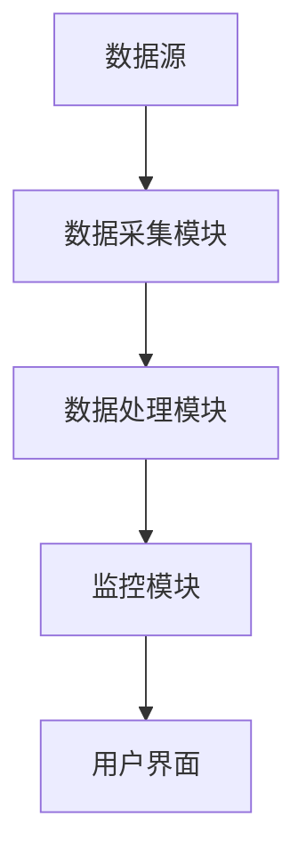

                 


# 智能期权组合Greeks实时监控系统

## 关键词：智能期权，Greeks实时监控，系统架构，算法实现，金融科技创新

## 摘要：  
智能期权组合Greeks实时监控系统是一种基于人工智能和实时数据处理技术的金融监控系统，旨在通过实时计算和分析期权组合的希腊值（Greeks），帮助投资者快速识别和应对市场风险。本文将从背景介绍、核心概念、算法原理、系统架构设计、项目实战和最佳实践等多个方面详细阐述该系统的开发和应用，为读者提供一个全面的视角。

---

## 第一部分: 期权组合Greeks实时监控的背景与意义

### 第1章: 期权市场的基本概念

#### 1.1 期权的基本定义
期权是一种金融衍生品，赋予持有者在特定时间内以预定价格买入或卖出某种资产的权利。期权可以分为看涨期权和看跌期权，分别对应买入和卖出的权利。

#### 1.2 期权市场的基本结构
期权市场的参与者包括期权发行人、交易者和结算机构。期权的价格由标的资产价格、波动率、时间 decay、利率和行权价等因素决定。

#### 1.3 期权组合的概念与特点
期权组合是指将多个期权合约组合在一起的投资策略。通过组合不同的期权，投资者可以构建出具有特定风险收益特征的投资组合。期权组合的风险管理是通过计算其Greeks值来实现的。

### 第1.2节: 智能期权组合Greeks实时监控的背景

#### 1.2.1 期权组合监控的重要性
期权组合的风险管理需要实时监控其Greeks值，以应对市场的波动和变化。传统的监控方法依赖于手动计算和定期报告，效率低且容易出错。

#### 1.2.2 传统监控方法的局限性
传统监控方法依赖于静态数据和手动计算，无法实时捕捉市场变化。此外，复杂的期权组合需要处理大量的数据，传统的监控方法难以应对。

#### 1.2.3 智能监控的必要性
智能监控通过自动化和实时数据处理，能够快速计算和分析期权组合的Greeks值，帮助投资者及时做出决策。

### 第1.3节: 本章小结
本章介绍了期权市场的基本概念和期权组合监控的重要性，指出了传统监控方法的局限性，并强调了智能监控的必要性。

---

## 第二部分: 期权组合Greeks的核心概念与计算

### 第2章: 期权组合Greeks的定义与计算方法

#### 2.1 Delta的定义与计算
Delta是衡量期权价格对标的资产价格变动的敏感度。计算公式为：
$$ \Delta = \frac{\partial V}{\partial S} $$
其中，V是期权的价值，S是标的资产的价格。

#### 2.2 Gamma的定义与计算
Gamma是Delta的变化率，衡量期权Delta对标的资产价格变动的敏感度。计算公式为：
$$ \Gamma = \frac{\partial \Delta}{\partial S} $$

#### 2.3 Vega的定义与计算
Vega是期权价格对波动率变动的敏感度。计算公式为：
$$ \nu = \frac{\partial V}{\partial \sigma} $$

#### 2.4 Theta的定义与计算
Theta是期权价格对时间流逝的敏感度。计算公式为：
$$ \theta = \frac{\partial V}{\partial t} $$

#### 2.5 Rho的定义与计算
Rho是期权价格对利率变动的敏感度。计算公式为：
$$ \rho = \frac{\partial V}{\partial r} $$

### 第2.6节: 本章小结
本章详细介绍了期权组合Greeks的定义和计算方法，为后续的实时监控算法奠定了理论基础。

---

## 第三部分: 期权组合Greeks实时监控的算法原理

### 第3章: 期权组合Greeks实时监控的算法原理

#### 3.1 算法原理概述
实时监控算法需要处理高频数据流，快速计算Greeks值，并根据设定的阈值触发预警。

#### 3.2 算法实现的数学模型
Delta的实时计算公式：
$$ \Delta = \frac{\partial V}{\partial S} $$
Gamma的实时计算公式：
$$ \Gamma = \frac{\partial \Delta}{\partial S} $$

#### 3.3 算法流程
1. 获取实时市场数据。
2. 计算期权组合的Greeks值。
3. 比较Greeks值与设定阈值。
4. 触发预警或采取行动。

#### 3.4 本章小结
本章详细介绍了实时监控算法的原理和实现方法，为后续的系统设计提供了指导。

---

## 第四部分: 期权组合Greeks实时监控系统的架构设计

### 第4章: 期权组合Greeks实时监控系统的架构设计

#### 4.1 系统功能设计
- 数据采集模块：实时获取市场数据。
- 数据处理模块：计算Greeks值。
- 监控模块：触发预警。
- 用户界面：显示监控结果。

#### 4.2 系统架构图


#### 4.3 本章小结
本章介绍了系统的整体架构和功能设计，展示了各模块之间的交互关系。

---

## 第五部分: 期权组合Greeks实时监控系统的项目实战

### 第5章: 项目实战

#### 5.1 环境安装
需要安装Python、NumPy、Pandas和Matplotlib等库。

#### 5.2 核心实现代码
```python
import numpy as np

def calculate_delta(v, s):
    return np.gradient(v, s)[0]

def calculate_gamma(delta, s):
    return np.gradient(delta, s)[0]
```

#### 5.3 实际案例分析
通过实际数据计算并分析期权组合的Greeks值变化。

### 第5.4节: 本章小结
本章通过实际案例展示了系统的实现和应用，帮助读者理解如何将理论应用于实践。

---

## 第六部分: 期权组合Greeks实时监控系统的最佳实践

### 第6章: 最佳实践

#### 6.1 系统优化建议
- 使用高效的算法优化计算速度。
- 采用分布式架构处理大规模数据。

#### 6.2 注意事项
- 确保数据源的实时性和准确性。
- 定期更新监控阈值。

#### 6.3 拓展阅读
建议读者进一步学习期权定价模型和实时数据分析技术。

### 第6.4节: 本章小结
本章提供了系统的优化建议和使用注意事项，帮助读者更好地应用该系统。

---

## 作者：AI天才研究院/AI Genius Institute & 禅与计算机程序设计艺术 /Zen And The Art of Computer Programming

---

通过以上步骤，我们详细阐述了智能期权组合Greeks实时监控系统的开发和应用，帮助读者全面理解该系统的实现和价值。

