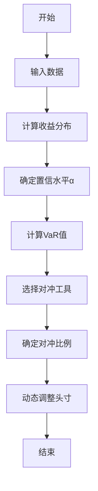
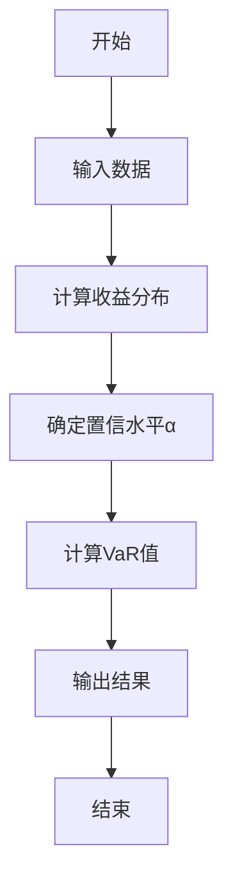
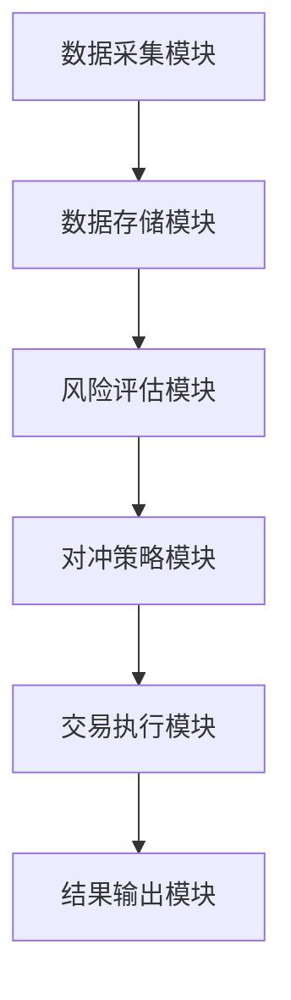

                 


---

# 智能期权组合风险敞口管理与对冲系统

> 关键词：智能期权，风险敞口管理，对冲系统，VaR，CVaR，Black-Scholes模型，机器学习

> 摘要：本文详细探讨了智能期权组合风险敞口管理与对冲系统的核心概念、算法原理、系统架构及其实现。通过介绍期权的基本概念、风险敞口管理的重要性、智能对冲的核心思想，以及具体的风险度量算法和机器学习模型的应用，本文旨在帮助读者理解如何利用智能化方法有效管理期权组合的风险，并通过实际案例分析和系统设计展示如何构建一个高效的风险对冲系统。

---

# 第1章: 智能期权组合风险敞口管理与对冲概述

## 1.1 期权的基本概念与风险管理

### 1.1.1 期权的基本定义与类型
- 期权的定义：期权是一种金融衍生品，赋予买方在特定时间内以特定价格买入或卖出标的资产的权利。
- 期权的类型：包括看涨期权、看跌期权、欧式期权和美式期权等。
- 期权的基本要素：标的资产、执行价格、到期日、权利金和行权方式。

### 1.1.2 风险敞口的定义与分类
- 风险敞口的定义：指投资者在持有某种资产或组合时所面临的潜在损失。
- 风险敞口的分类：包括市场风险、流动性风险、信用风险和操作风险等。

### 1.1.3 期权组合风险敞口管理的重要性
- 风险敞口管理的目标：通过有效配置资产和对冲策略，降低组合的整体风险。
- 期权组合风险敞口管理的意义：在复杂金融市场上保护投资组合免受重大损失。

## 1.2 智能对冲的基本原理

### 1.2.1 对冲的概念与目的
- 对冲的定义：通过建立相反头寸来抵消原有头寸的风险。
- 对冲的目的：降低组合的波动性，锁定收益或减少损失。

### 1.2.2 智能对冲的核心思想
- 智能对冲的定义：利用先进的算法和机器学习技术，实时监控和调整对冲头寸。
- 智能对冲的优势：高频交易、动态调整和自动化执行。

### 1.2.3 智能对冲与传统对冲的区别
- 传统对冲：基于静态模型和历史数据，对冲策略相对固定。
- 智能对冲：基于实时数据和动态模型，对冲策略可根据市场变化自动调整。

## 1.3 期权组合风险敞口管理的挑战

### 1.3.1 市场风险的复杂性
- 市场波动性：金融市场的波动性可能导致期权组合的风险敞口急剧扩大。
- 尾部风险：极端市场事件可能导致传统模型失效。

### 1.3.2 模型风险与数据风险
- 模型风险：使用的数学模型可能存在参数估计误差和假设偏差。
- 数据风险：数据质量和完整性对模型的准确性有直接影响。

### 1.3.3 计算能力与算法复杂度
- 高维计算：期权组合的风险计算涉及多变量优化，计算复杂度高。
- 算法选择：需要选择适合大规模数据处理的高效算法。

## 1.4 本书的核心目标与结构

### 1.4.1 本书的核心目标
- 目标：系统性地介绍智能期权组合风险敞口管理与对冲系统的理论基础、算法实现和实际应用。

### 1.4.2 本书的章节结构
- 第1章：期权组合风险敞口管理与对冲概述。
- 第2章：风险敞口管理的核心概念与联系。
- 第3章：风险敞口管理的算法原理。
- 第4章：风险敞口管理的数学模型。
- 第5章：智能期权组合风险敞口管理系统的架构设计。
- 第6章：智能期权组合风险敞口管理与对冲系统的项目实战。
- 第7章：最佳实践、小结与注意事项。

### 1.4.3 本书的读者群体
- 本书适合金融工程师、量化交易员、风险管理师以及对智能金融技术感兴趣的读者。

---

# 第2章: 风险敞口管理的核心概念与联系

## 2.1 风险敞口管理的核心概念

### 2.1.1 风险敞口的定义与度量
- 风险敞口的度量：使用VaR、CVaR等指标量化潜在损失。
- VaR（Value at Risk）：在给定置信水平下，资产组合可能遭受的最大损失。
- CVaR（Conditional Value at Risk）：VaR的条件期望，衡量尾部风险。

### 2.1.2 组合风险的定义与特征
- 组合风险：多个资产组合在一起后产生的整体风险。
- 组合风险的特征：风险分散效应、资产相关性影响、非线性风险。

### 2.1.3 对冲策略的核心要素
- 对冲策略的核心要素：选择合适的对冲工具、确定对冲比例、动态调整对冲头寸。

## 2.2 核心概念的联系与对比

### 2.2.1 风险敞口与对冲策略的关系
- 风险敞口与对冲策略的关系：对冲策略是用来降低风险敞口的手段。
- 对冲策略的选择：取决于风险敞口的类型和规模。

### 2.2.2 不同风险度量方法的对比
- VaR与CVaR的对比：VaR是分位数，CVaR是条件期望。
- 两者的特点：VaR简单易懂，但无法捕捉尾部风险；CVaR考虑尾部风险，但计算复杂。

### 2.2.3 系统性风险与非系统性风险的区分
- 系统性风险：影响整个市场的风险因素，如经济衰退。
- 非系统性风险：特定于某个资产或行业的风险因素。
- 对冲系统性风险的挑战：难以通过分散化消除。

## 2.3 实体关系图与流程图

### 2.3.1 风险敞口管理的ER实体关系图
```mermaid
erDiagram
    customer[客户]
    portfolio[投资组合]
    risk_exposure[风险敞口]
    hedging_strategy[对冲策略]
    risk_metric[风险指标]
    market_data[市场数据]
    portfolio_has_risk_exposure(portfolio) --> risk_exposure
    risk_exposure --> hedging_strategy
    hedging_strategy --> risk_metric
    market_data --> risk_exposure
```

### 2.3.2 智能对冲的流程图


---

# 第3章: 风险敞口管理的算法原理

## 3.1 风险度量算法的原理

### 3.1.1 VaR（Value at Risk）算法
- VaR算法的原理：计算在给定置信水平下，资产组合的潜在损失。
- VaR算法的优点：简单直观，易于理解和应用。
- VaR算法的缺点：无法捕捉尾部风险，对假设敏感。

### 3.1.2 CVaR（Conditional Value at Risk）算法
- CVaR算法的原理：计算VaR的条件期望，衡量尾部风险。
- CVaR算法的优点：考虑尾部风险，更符合风险厌恶者的偏好。
- CVaR算法的缺点：计算复杂，需要大量数据支持。

### 3.1.3 方差-协方差矩阵方法
- 方差-协方差矩阵方法：计算资产组合的风险敞口，考虑资产之间的相关性。
- 方法的步骤：计算各资产的方差和协方差，构建矩阵，求解组合风险。

## 3.2 算法的数学模型与公式

### 3.2.1 VaR的数学公式
$$ VaR_{\alpha}(P) = \inf\{x | P(L \leq x) \geq \alpha\} $$
其中，$P$是损失分布函数，$\alpha$是置信水平。

### 3.2.2 CVaR的数学公式
$$ CVaR_{\alpha}(P) = \frac{1}{\alpha} \int_{\alpha}^{1} x dP(x) $$
其中，$\alpha$是置信水平。

### 3.2.3 方差-协方差矩阵方法
- 方差-协方差矩阵：$\Sigma$，其中$\Sigma_{i,j}$是资产$i$和资产$j$的协方差。
- 组合方差：$w^T \Sigma w$，其中$w$是权重向量。

## 3.3 机器学习算法在风险敞口管理中的应用

### 3.3.1 线性回归模型
- 线性回归模型的应用：预测资产的收益和风险。
- 模型的优点：简单易懂，计算效率高。
- 模型的缺点：假设线性关系，可能无法捕捉复杂关系。

### 3.3.2 支持向量回归模型
- 支持向量回归模型的应用：预测非线性关系。
- 模型的优点：适用于高维数据，能够捕捉复杂模式。
- 模型的缺点：计算复杂，需要调整参数。

### 3.3.3 随机森林模型
- 随机森林模型的应用：集成学习，提高预测准确性。
- 模型的优点：鲁棒性强，能够处理缺失值和异常值。
- 模型的缺点：解释性差，难以分析具体影响因素。

## 3.4 算法流程图

### 3.4.1 VaR算法的Mermaid流程图


---

# 第4章: 风险敞口管理的数学模型

## 4.1 期权定价的Black-Scholes模型

### 4.1.1 Black-Scholes模型的定义与公式
- Black-Scholes模型用于定价欧式期权。
- 公式：$$ C = S_0 N(d_1) - K e^{-rT} N(d_2) $$
  其中，$d_1 = \frac{\ln(S_0/K) + (r + \sigma^2/2)T}{\sigma \sqrt{T}} $，$d_2 = d_1 - \sigma \sqrt{T}$。

### 4.1.2 Black-Scholes模型的假设
- 股价服从几何布朗运动。
- 无股息资产。
- 市场无摩擦，无交易成本。
- 利率和波动率恒定。

### 4.1.3 Black-Scholes模型的应用
- 计算期权的理论价格。
- 确定对冲比例和delta对冲策略。

## 4.2 组合风险的度量

### 4.2.1 方差-协方差矩阵
- 方差-协方差矩阵的计算：$$ \Sigma = \frac{1}{n-1} \sum_{i=1}^{n} (x_i - \bar{x})(y_i - \bar{y}) $$
- 矩阵的特征值分解：用于风险因子分析。

### 4.2.2 资产组合的波动性
- 资产组合的波动性：$$ \sigma_p = \sqrt{w^T \Sigma w} $$

## 4.3 数学模型的比较与选择

### 4.3.1 不同风险度量模型的比较
- VaR、CVaR、方差-协方差矩阵的优缺点对比。

### 4.3.2 算法选择的影响因素
- 数据的性质：时间序列数据的自相关性。
- 风险管理的目标：是否需要考虑尾部风险。
- 计算能力：模型的复杂性和计算效率。

---

# 第5章: 智能期权组合风险敞口管理系统的架构设计

## 5.1 系统功能设计

### 5.1.1 领域模型
- 领域模型的构建：定义核心实体和关系。
- 核心实体：期权、投资组合、风险敞口、对冲策略。

### 5.1.2 系统功能模块
- 数据采集模块：收集市场数据和组合信息。
- 风险评估模块：计算VaR、CVaR等风险指标。
- 对冲策略模块：生成和执行对冲订单。
- 性能监控模块：实时监控系统运行状态。

## 5.2 系统架构设计

### 5.2.1 系统架构图


### 5.2.2 关键模块的交互流程图


## 5.3 接口设计

### 5.3.1 API接口
- RESTful API设计：提供数据获取、风险计算、对冲建议等接口。
- 接口文档：详细描述接口的功能、输入输出格式和错误处理。

### 5.3.2 模块之间的交互
- 数据采集模块与数据存储模块的交互。
- 风险评估模块与对冲策略模块的交互。

---

# 第6章: 项目实战——智能期权组合风险敞口管理与对冲系统

## 6.1 环境安装

### 6.1.1 开发环境
- 操作系统：Linux或Windows。
- 编程语言：Python 3.8以上版本。
- 开发工具：Jupyter Notebook、PyCharm。

### 6.1.2 第三方库的安装
- 使用pip安装numpy、pandas、scipy、scikit-learn、mermaid、matplotlib等库。

## 6.2 核心代码实现

### 6.2.1 数据采集模块
```python
import pandas as pd
import requests

def get_market_data(tickers):
    url = "https://api.example.com/market-data"
    params = {"tickers": tickers}
    response = requests.get(url, params=params)
    data = response.json()
    return pd.DataFrame(data)
```

### 6.2.2 风险评估模块
```python
import numpy as np
from scipy.stats import norm

def calculate_var(data, confidence_level):
    returns = np.log(data.pct_change().dropna())
    mu = returns.mean()
    sigma = returns.std()
    var = norm.ppf(1 - confidence_level) * sigma
    return var
```

### 6.2.3 对冲策略模块
```python
import pandas as pd
import numpy as np

def generate_hedging_strategy(data, var):
    # 计算对冲比例
    hedge_ratio = data.mean() / var
    return hedge_ratio
```

### 6.2.4 交易执行模块
```python
import time
import requests

def execute_trade(hedge_ratio):
    url = "https://api.example.com/trade"
    params = {"hedge_ratio": hedge_ratio}
    response = requests.post(url, json=params)
    return response.json()
```

## 6.3 实际案例分析

### 6.3.1 案例背景
- 案例目标：管理一个包含多个期权的投资组合。
- 数据来源：某金融数据平台提供的市场数据。

### 6.3.2 案例分析步骤
1. 数据采集：获取期权的市场数据。
2. 风险评估：计算VaR和CVaR。
3. 对冲策略：生成和执行对冲订单。
4. 结果监控：实时监控系统运行状态。

### 6.3.3 案例分析结果
- 计算VaR和CVaR，评估组合风险。
- 确定对冲比例，生成交易指令。
- 执行交易，监控系统性能。

---

# 第7章: 最佳实践、小结与注意事项

## 7.1 最佳实践

### 7.1.1 数据质量管理
- 确保数据的准确性和完整性。
- 定期更新数据源，避免数据过时。

### 7.1.2 算法选择
- 根据具体情况选择合适的算法。
- 定期评估模型的准确性，进行必要的调整。

### 7.1.3 系统监控
- 实时监控系统运行状态。
- 建立完善的日志记录和错误处理机制。

## 7.2 小结

### 7.2.1 核心知识点总结
- 期权的基本概念和风险管理的重要性。
- 智能对冲的核心思想和实现方法。
- 风险度量算法的原理和应用。

### 7.2.2 项目实施的关键点
- 数据采集和预处理。
- 风险评估模块的实现。
- 对冲策略的设计和优化。

## 7.3 注意事项

### 7.3.1 模型风险
- 确保模型假设与实际市场相符。
- 定期验证模型的有效性。

### 7.3.2 计算风险
- 选择高效的算法，优化计算效率。
- 确保系统的稳定性和可靠性。

### 7.3.3 市场风险
- 密切关注市场动态，及时调整策略。
- 建立风险预警机制，防范极端事件。

---

# 作者：AI天才研究院/AI Genius Institute & 禅与计算机程序设计艺术 /Zen And The Art of Computer Programming

---

通过以上目录大纲，读者可以系统地学习智能期权组合风险敞口管理与对冲系统的相关知识，从基础概念到算法实现，再到系统设计和实际案例分析，逐步深入理解这一复杂而重要的金融技术领域。

