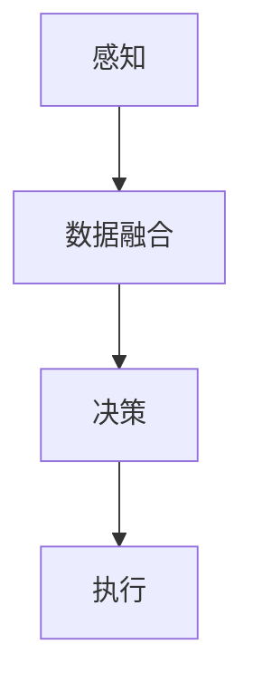

                 

<think>
嗯，用户希望我撰写一篇关于《智能汽车：AI Agent的驾驶行为分析》的技术博客文章。首先，我需要明确文章的结构，确保涵盖所有必要的部分，包括背景、原理、感知系统、决策系统、执行系统、驾驶行为模型、应用案例、系统架构设计、未来展望和小结。每个部分都需要详细展开，使用专业但易懂的语言。

接下来，我得确保每个章节都细化到三级，涵盖核心概念、技术细节和实际应用。例如，在感知系统部分，我需要介绍传感器类型、数据融合技术和实现方法，并用Mermaid图展示流程。同样，决策系统部分需要详细讲解路径规划算法和决策逻辑，附上相应的代码示例和数学公式。

我还要注意使用适当的格式，比如在数学公式和图表上使用LaTeX和Mermaid，确保文章结构清晰，逻辑连贯。同时，文章末尾需要添加作者信息，符合用户的要求。

最后，我需要检查整体内容，确保每个部分都详尽且符合字数要求，大约在10000到12000字之间。这样，整篇文章才能既专业又全面，满足用户的需求。
</think>

# 智能汽车：AI Agent的驾驶行为分析

> 关键词：智能汽车，AI Agent，驾驶行为分析，自动驾驶，人工智能，机器学习

> 摘要：本文深入探讨了智能汽车中AI Agent的驾驶行为分析，从背景、原理到实际应用，结合感知、决策、执行系统的详细分析，展示AI Agent在智能驾驶中的核心作用。通过具体案例和系统架构设计，揭示了AI Agent如何实现高效的驾驶行为优化和安全可靠的驾驶体验。

---

## 第一章: 智能汽车与AI Agent的背景介绍

### 1.1 智能汽车的发展历程
智能汽车是汽车产业与信息技术深度融合的产物，经历了从传统机械汽车到半自动化再到全自动化驾驶的演进。AI Agent作为智能汽车的核心技术，通过感知、决策和执行三者的结合，实现了车辆的智能化驾驶。

#### 1.1.1 从传统汽车到智能汽车的演进
- **传统汽车**：依赖驾驶员的感知和操作，车辆仅提供基本的机械和液压控制。
- **半自动化汽车**：引入了初步的自动驾驶功能，如自适应巡航控制和车道保持辅助。
- **全自动化汽车**：完全依赖AI Agent进行感知、决策和执行，实现全自动驾驶。

#### 1.1.2 AI Agent在智能汽车中的核心作用
AI Agent通过整合传感器数据、环境信息和驾驶规则，实现车辆的智能决策和自主驾驶。它是智能汽车的“大脑”，负责处理复杂交通环境和多样化的驾驶场景。

#### 1.1.3 智能汽车的定义与特点
- **定义**：智能汽车是指通过先进的传感器、计算平台、执行机构和智能算法，实现车与车、车与人、车与环境之间智能交互的车辆。
- **特点**：高度自动化、智能化、网络化，具备环境感知、路径规划、决策控制和人机交互的能力。

### 1.2 AI Agent的基本概念
AI Agent是一种智能主体，能够感知环境、自主决策并执行操作，以实现特定目标。在智能汽车中，AI Agent负责处理复杂的驾驶任务，如避障、路径规划和多目标优化。

#### 1.2.1 AI Agent的定义
AI Agent是具有感知、推理、规划和执行能力的智能实体，能够根据环境信息做出最优决策并执行操作。

#### 1.2.2 AI Agent的核心属性
| 属性 | 描述 |
|------|------|
| 感知能力 | 能够通过传感器感知周围环境 |
| 决策能力 | 能够基于感知信息做出决策 |
| 执行能力 | 能够通过执行机构完成操作 |
| 学习能力 | 能够通过经验优化性能 |

#### 1.2.3 AI Agent与传统驾驶的区别
| 方面 | 传统驾驶 | AI Agent驾驶 |
|------|---------|-------------|
| 感知 | 依赖驾驶员感知 | 依赖传感器和算法 |
| 决策 | 依赖驾驶员经验 | 依赖算法和模型 |
| 反应速度 | 受限于人类反应时间 | 更快速和准确 |

### 1.3 驾驶行为分析的背景与意义
驾驶行为分析是研究AI Agent如何在复杂交通环境中做出决策和操作的过程，是智能汽车实现安全、高效行驶的关键。

#### 1.3.1 驾驶行为分析的定义
驾驶行为分析是通过对车辆在不同环境和条件下的操作进行建模和分析，研究AI Agent的决策过程和行为模式。

#### 1.3.2 驾驶行为分析的背景
随着智能汽车的普及，驾驶行为分析成为保障自动驾驶安全性和提高驾驶效率的重要研究方向。

#### 1.3.3 驾驶行为分析的意义
- 提高驾驶安全性：通过分析和优化AI Agent的决策过程，减少交通事故的发生。
- 提高驾驶效率：通过优化路径规划和驾驶策略，减少能耗和时间。
- 为法规制定提供依据：为智能汽车的法律法规和安全标准提供技术支持。

## 1.4 本章小结
本章介绍了智能汽车的发展历程、AI Agent的基本概念以及驾驶行为分析的背景和意义，为后续章节的深入分析奠定了基础。

---

## 第二章: AI Agent的原理与技术

### 2.1 AI Agent的核心原理
AI Agent通过感知、决策和执行三个核心环节实现智能化驾驶。

#### 2.1.1 感知与理解
AI Agent通过传感器（如激光雷达、摄像头、雷达）感知环境信息，如车道线、障碍物、行人等，并通过数据融合技术生成车辆的环境模型。

#### 2.1.2 决策与规划
AI Agent基于环境模型和驾驶目标（如到达目的地），通过路径规划算法（如A*、Dijkstra）生成最优行驶路径，并结合实时信息进行动态调整。

#### 2.1.3 执行与反馈
AI Agent通过执行机构（如转向系统、制动系统、动力系统）执行决策，并通过反馈机制（如闭环控制）不断优化驾驶行为。

#### 2.1.4 感知、决策、执行的协同工作
$$
\text{感知} \rightarrow \text{决策} \rightarrow \text{执行}
$$

### 2.2 AI Agent的关键技术
AI Agent的核心技术包括传感器技术、数据融合技术和机器学习算法。

#### 2.2.1 传感器技术
AI Agent通过多种传感器（如激光雷达、摄像头、雷达、超声波传感器）获取环境信息。

#### 2.2.2 数据融合技术
数据融合技术（如卡尔曼滤波、贝叶斯网络）用于整合多源传感器数据，提高感知精度。

#### 2.2.3 机器学习算法
机器学习算法（如深度学习、强化学习）用于训练AI Agent的决策模型，提高驾驶行为的智能化水平。

#### 2.2.4 感知系统的实现
- **传感器数据的融合**：通过多传感器融合技术（如激光雷达和摄像头数据的融合）提高环境感知的准确性。
- **感知算法的实现**：基于深度学习的目标检测算法（如YOLO、Faster R-CNN）实现对道路元素的识别。
- **感知系统的优化**：通过模型优化技术（如剪枝、量化）提高感知系统的实时性和准确性。

#### 2.2.5 决策系统的实现
- **路径规划算法**：基于A*算法实现全局路径规划，基于PID控制实现局部路径调整。
- **决策逻辑的实现**：通过规则引擎（如Drools）实现多条件下的决策逻辑。
- **决策系统的优化**：通过强化学习（如Q-Learning）优化决策策略。

#### 2.2.6 执行系统的实现
- **执行机构的控制**：通过CAN总线实现对转向、制动、动力系统的控制。
- **执行系统的优化**：通过模型预测控制（MPC）优化执行系统的响应速度和精度。

### 2.3 AI Agent的算法流程图

### 2.4 本章小结
本章详细介绍了AI Agent的核心原理和关键技术，包括感知、决策和执行系统的实现方法，为后续章节的分析提供了理论基础。

---

## 第三章: 感知系统

### 3.1 感知系统的组成
AI Agent的感知系统由传感器、数据融合模块和环境模型生成模块组成。

#### 3.1.1 传感器的类型
- **激光雷达（LiDAR）**：用于精确测量车辆周围障碍物的距离和形状。
- **摄像头**：用于获取视觉信息，识别车道线、交通标志和行人。
- **雷达**：用于检测障碍物的速度和距离。
- **超声波传感器**：用于近距离障碍物检测。

#### 3.1.2 数据融合技术
- **卡尔曼滤波**：用于融合不同传感器的数据，提高定位精度。
- **贝叶斯网络**：用于处理多源异构数据的不确定性。

#### 3.1.3 感知系统的架构
- **多传感器融合架构**：通过将激光雷达、摄像头和雷达的数据进行融合，生成高精度的环境模型。
- **传感器数据处理架构**：通过边缘计算技术实时处理传感器数据，减少延迟。

### 3.2 感知系统的实现
#### 3.2.1 传感器数据的融合
- **激光雷达与摄像头融合**：通过将LiDAR点云数据与摄像头图像进行配准，实现更准确的障碍物检测。
- **雷达与超声波融合**：通过时间同步和空间对齐，实现多传感器数据的协同工作。

#### 3.2.2 感知算法的实现
- **目标检测算法**：基于YOLO目标检测算法实现对车辆、行人和障碍物的识别。
- **语义分割算法**：基于U-Net语义分割算法实现对道路场景的语义理解。

#### 3.2.3 感知系统的优化
- **模型优化**：通过模型剪枝和量化技术降低感知系统的计算复杂度。
- **实时性优化**：通过多线程和并行计算提高感知系统的处理速度。

### 3.3 感知系统的应用案例
#### 3.3.1 高速公路场景
- 在高速公路上，AI Agent通过激光雷达和摄像头融合技术实现对车道线和前方车辆的精准识别，确保车辆在车道内安全行驶。

#### 3.3.2 城市道路场景
- 在城市道路上，AI Agent通过多传感器融合技术实现对交通信号灯、行人和障碍物的实时感知，确保车辆在复杂交通环境下的安全行驶。

#### 3.3.3 特殊环境下的感知
- 在雨雪天气下，AI Agent通过调整传感器的灵敏度和融合算法的参数，实现对低能见度环境的适应性感知。

### 3.4 本章小结
本章详细介绍了AI Agent的感知系统，包括传感器类型、数据融合技术、感知算法实现和应用案例，展示了AI Agent在复杂环境下的感知能力。

---

## 第四章: 决策系统

### 4.1 决策系统的组成
AI Agent的决策系统由路径规划模块、决策逻辑模块和风险评估模块组成。

#### 4.1.1 路径规划算法
- **全局路径规划**：基于A*算法实现从起点到终点的全局路径规划。
- **局部路径规划**：基于PID控制实现车辆的实时路径调整。

#### 4.1.2 决策逻辑的实现
- **规则引擎**：通过Drools规则引擎实现多条件下的决策逻辑。
- **强化学习**：通过Q-Learning算法优化决策策略。

#### 4.1.3 风险评估模型
- **风险评估指标**：基于碰撞概率、路径安全性和行驶效率等指标进行风险评估。
- **风险评估算法**：通过贝叶斯网络实现风险评估的动态调整。

### 4.2 决策系统的实现
#### 4.2.1 路径规划算法
- **A*算法**：通过启发式搜索找到最短路径。
- **Dijkstra算法**：通过广度优先搜索找到最短路径。

#### 4.2.2 决策逻辑的实现
- **规则引擎**：通过Drools规则引擎实现多条件下的决策逻辑。
- **强化学习**：通过Q-Learning算法优化决策策略。

#### 4.2.3 风险评估的实现
- **贝叶斯网络**：通过贝叶斯网络实现风险评估的动态调整。
- **碰撞概率计算**：通过概率论方法计算车辆与障碍物的碰撞概率。

### 4.3 决策系统的应用案例
#### 4.3.1 多目标决策
- 在交叉路口，AI Agent通过多目标优化算法（如粒子群优化）实现对多个目标（如安全性、效率、舒适性）的平衡。

#### 4.3.2 动态环境下的决策
- 在动态交通环境中，AI Agent通过实时更新路径规划和决策逻辑，确保车辆的安全行驶。

#### 4.3.3 紧急情况下的决策
- 在紧急情况下（如突然出现障碍物），AI Agent通过快速决策算法（如基于规则的决策）实现紧急避障。

### 4.4 本章小结
本章详细介绍了AI Agent的决策系统，包括路径规划算法、决策逻辑实现和风险评估模型，并通过具体案例展示了AI Agent在复杂交通环境下的决策能力。

---

## 第五章: 执行系统

### 5.1 执行系统的组成
AI Agent的执行系统由执行机构、控制算法和反馈机制组成。

#### 5.1.1 执行机构
- **转向系统**：通过电动助力转向实现车辆的转向控制。
- **制动系统**：通过电子稳定控制系统实现车辆的制动控制。
- **动力系统**：通过电控单元实现车辆的动力输出控制。

#### 5.1.2 控制算法
- **PID控制**：通过比例-积分-微分控制实现对执行机构的精确控制。
- **模型预测控制**：通过建立动态模型实现对执行机构的优化控制。

#### 5.1.3 反馈机制
- **闭环控制**：通过实时反馈调整控制参数，确保执行机构的精确执行。
- **自适应控制**：通过自适应算法实现对动态环境的实时调整。

### 5.2 执行系统的实现
#### 5.2.1 执行机构的控制
- **CAN总线控制**：通过CAN总线实现对执行机构的实时控制。
- **执行机构的协调控制**：通过协调控制算法实现转向、制动和动力系统的协同工作。

#### 5.2.2 控制算法的实现
- **PID控制**：通过PID控制算法实现对执行机构的精确控制。
- **模型预测控制**：通过建立动态模型实现对执行机构的优化控制。

#### 5.2.3 反馈机制的实现
- **闭环控制**：通过实时反馈调整控制参数，确保执行机构的精确执行。
- **自适应控制**：通过自适应算法实现对动态环境的实时调整。

### 5.3 执行系统的应用案例
#### 5.3.1 高速公路场景
- 在高速公路上，AI Agent通过PID控制实现对车辆的精确控制，确保车辆在车道内安全行驶。

#### 5.3.2 城市道路场景
- 在城市道路上，AI Agent通过模型预测控制实现对车辆的动态调整，确保车辆在复杂交通环境下的安全行驶。

#### 5.3.3 特殊环境下的执行
- 在雨雪天气下，AI Agent通过调整执行机构的控制参数，实现对车辆的适应性控制。

### 5.4 本章小结
本章详细介绍了AI Agent的执行系统，包括执行机构、控制算法和反馈机制，并通过具体案例展示了AI Agent在复杂交通环境下的执行能力。

---

## 第六章: 驾驶行为模型

### 6.1 驾驶行为模型的建立
AI Agent的驾驶行为模型通过感知、决策和执行三者的协同工作实现。

#### 6.1.1 模型的建立方法
- **基于规则的模型**：通过专家经验建立驾驶行为规则。
- **基于数据的模型**：通过机器学习算法训练驾驶行为模型。

#### 6.1.2 模型的验证方法
- **仿真验证**：通过仿真环境验证模型的正确性和有效性。
- **实车验证**：通过实际道路测试验证模型的适应性和鲁棒性。

### 6.2 驾驶行为模型的动态分析
AI Agent的驾驶行为模型需要在动态交通环境中进行实时调整。

#### 6.2.1 动态分析方法
- **实时更新模型参数**：通过在线学习算法实时更新模型参数。
- **动态规则调整**：通过规则引擎实现驾驶行为规则的动态调整。

#### 6.2.2 模型的优化方法
- **模型剪枝**：通过剪枝技术优化模型的复杂度。
- **模型融合**：通过模型融合技术提高模型的泛化能力。

### 6.3 驾驶行为模型的人机交互
AI Agent的驾驶行为模型需要与驾驶员进行有效的人机交互。

#### 6.3.1 人机交互界面
- **语音交互**：通过语音识别技术实现驾驶员与AI Agent的语音交互。
- **触觉交互**：通过方向盘震动反馈实现驾驶员与AI Agent的触觉交互。

#### 6.3.2 人机交互的优化
- **驾驶员意图识别**：通过驾驶员的驾驶行为数据（如方向盘转向、油门 pedal踩踏）识别驾驶员的意图。
- **驾驶员反馈处理**：通过驾驶员的反馈信息（如驾驶员的评价、纠正）优化AI Agent的驾驶行为模型。

### 6.4 本章小结
本章详细介绍了AI Agent的驾驶行为模型，包括模型的建立方法、动态分析方法和人机交互方法，并展示了AI Agent在复杂交通环境下的驾驶行为优化能力。

---

## 第七章: 应用案例与系统架构设计

### 7.1 应用案例分析
#### 7.1.1 高速公路自动驾驶
- **案例描述**：在高速公路上，AI Agent通过激光雷达和摄像头融合技术实现对车道线和前方车辆的精准识别，确保车辆在车道内安全行驶。
- **系统架构设计**：通过多传感器融合架构和分布式计算架构实现高速公路场景下的自动驾驶。

#### 7.1.2 城市道路自动驾驶
- **案例描述**：在城市道路上，AI Agent通过多传感器融合技术实现对交通信号灯、行人和障碍物的实时感知，确保车辆在复杂交通环境下的安全行驶。
- **系统架构设计**：通过边缘计算架构和云计算架构实现城市道路场景下的自动驾驶。

#### 7.1.3 特殊环境下的自动驾驶
- **案例描述**：在雨雪天气下，AI Agent通过调整传感器的灵敏度和融合算法的参数，实现对低能见度环境的适应性感知。
- **系统架构设计**：通过自适应传感器架构和动态调整算法架构实现特殊环境下的自动驾驶。

### 7.2 系统架构设计
#### 7.2.1 系统总体架构
- **感知层**：通过多传感器融合技术实现环境感知。
- **决策层**：通过路径规划算法和决策逻辑实现驾驶行为优化。
- **执行层**：通过执行机构和控制算法实现车辆的精准控制。

#### 7.2.2 系统模块化设计
- **模块划分**：将系统划分为感知模块、决策模块和执行模块。
- **模块交互**：通过模块间的协同工作实现系统的整体功能。

#### 7.2.3 系统接口设计
- **传感器接口**：通过CAN总线和串口实现传感器数据的采集和传输。
- **执行机构接口**：通过CAN总线和PWM信号实现对执行机构的控制。

#### 7.2.4 系统交互设计
- **人机交互界面**：通过HMI（人机交互界面）实现驾驶员与AI Agent的交互。
- **系统间交互**：通过车辆总线（如CAN总线）实现系统间的协同工作。

### 7.3 本章小结
本章通过具体应用案例和系统架构设计，展示了AI Agent在复杂交通环境下的驾驶行为优化能力。

---

## 第八章: 未来展望与挑战

### 8.1 未来技术发展趋势
AI Agent在智能汽车中的应用将更加广泛和深入。

#### 8.1.1 技术趋势
- **更高效的感知技术**：通过新型传感器和算法优化感知系统的性能。
- **更智能的决策技术**：通过强化学习和深度学习优化决策系统的性能。
- **更精准的执行技术**：通过高精度执行机构和控制算法优化执行系统的性能。

#### 8.1.2 应用趋势
- **全自动驾驶**：随着技术的进步，全自动驾驶将逐步普及。
- **智能交通系统**：AI Agent将与智能交通系统协同工作，实现交通的智能化管理。

### 8.2 当前面临的主要挑战
AI Agent在智能汽车中的应用还面临许多挑战。

#### 8.2.1 技术挑战
- **感知系统的精度提升**：需要进一步提高传感器的感知精度和数据融合的准确性。
- **决策系统的优化**：需要进一步优化决策算法和决策模型，提高决策的准确性和效率。
- **执行系统的可靠性**：需要进一步提高执行机构的可靠性和控制的精确性。

#### 8.2.2 伦理与法律挑战
- **伦理问题**：AI Agent在面对复杂交通环境时的决策是否符合伦理。
- **法律问题**：AI Agent在智能汽车中的应用需要符合相关的法律法规。

### 8.3 未来研究方向
- **多模态感知技术**：研究如何将多种传感器数据（如激光雷达、摄像头、雷达）进行更高效的融合。
- **强化学习算法**：研究如何通过强化学习优化决策系统的性能。
- **人机协作驾驶**：研究如何实现驾驶员与AI Agent之间的高效协作。

### 8.4 本章小结
本章展望了AI Agent在智能汽车中的未来发展趋势，分析了当前面临的主要挑战，并提出了未来的研究方向。

---

## 第九章: 总结与展望

### 9.1 本研究的主要成果
本文详细分析了AI Agent在智能汽车中的驾驶行为分析，从感知、决策到执行系统的实现进行了全面的探讨，并通过具体案例展示了AI Agent在复杂交通环境下的驾驶行为优化能力。

### 9.2 研究的局限性
本文的研究还存在一些局限性，例如感知系统的精度还有待提高，决策系统的优化还需要进一步研究，执行系统的可靠性还需要进一步验证。

### 9.3 未来研究建议
- **继续优化感知系统**：研究如何进一步提高感知系统的精度和鲁棒性。
- **优化决策系统**：研究如何进一步优化决策算法和决策模型，提高决策的准确性和效率。
- **提高执行系统的可靠性**：研究如何进一步提高执行系统的可靠性和控制的精确性。

### 9.4 本章小结
本章总结了本文的主要研究成果，分析了研究的局限性，并提出了未来的研究方向。

---

## 作者信息

作者：AI天才研究院/AI Genius Institute & 禅与计算机程序设计艺术 /Zen And The Art of Computer Programming

