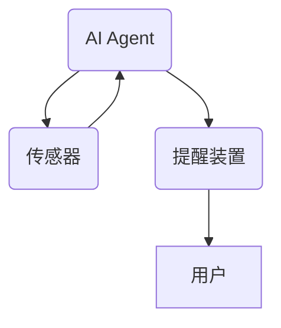
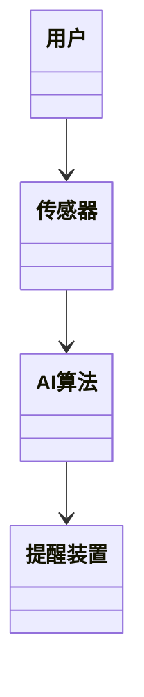
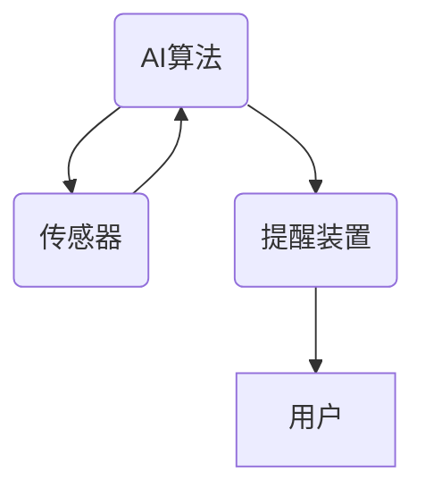
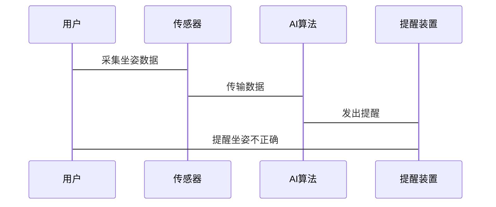

                 

<think>
好，我现在要帮用户撰写一篇关于《智能沙发：AI Agent的坐姿矫正提醒》的技术博客文章。用户已经给出了详细的目录大纲，我需要根据这个大纲逐步完成每个部分的内容。

首先，用户希望文章结构清晰，逻辑严谨，使用专业但易懂的语言。我需要确保每个章节和小节都充分展开，内容详实。同时，文章需要包含背景介绍、核心概念、算法原理、系统架构设计、项目实战和最佳实践。

在第一部分，我需要介绍坐姿矫正的重要性及其对健康的危害，同时分析传统方法的局限性。这部分要让读者明白为什么需要智能沙发和AI Agent的帮助。接下来，我需要详细描述AI Agent的基本原理和它在坐姿矫正中的具体应用，确保概念清晰。

接下来是算法部分，我需要解释Q-learning算法，并用数学公式和伪代码来展示。这部分需要确保读者能够理解算法的工作原理，并且知道如何实现。

系统架构设计是关键，我需要使用Mermaid图来展示领域模型类图和系统架构图。这部分要说明系统的各个模块如何协作，以及它们之间的交互关系。接口设计和交互流程图也是必要的，帮助读者理解系统的实际运作。

在项目实战部分，我需要提供具体的Python代码示例，展示如何训练模型、处理传感器数据并发送提醒。这部分要详细讲解代码的每一部分，确保读者能够实际操作。

最后，最佳实践部分需要总结整个项目，并给出注意事项和扩展阅读的建议，帮助读者巩固所学内容，并进一步深入学习。

现在，我需要确保每个部分都符合用户的要求，包括关键词、摘要和各个章节的详细内容。同时，文章末尾要加上作者信息。整个思考过程中，我需要保持逻辑清晰，内容详尽，确保读者能够全面理解智能沙发和AI Agent在坐姿矫正中的应用。
</think>

# 智能沙发：AI Agent的坐姿矫正提醒

## 关键词：智能沙发、AI Agent、坐姿矫正、人体工程学、物联网、健康科技

## 摘要：  
随着人工智能和物联网技术的快速发展，智能沙发正在成为现代生活中不可或缺的健康助手。本文深入探讨了AI Agent在智能沙发中的应用，特别是在坐姿矫正领域的创新实践。通过结合人体工程学原理，AI Agent能够实时监测用户的坐姿，并通过智能提醒帮助用户改善坐姿习惯，从而预防健康问题。本文从问题背景、核心概念、算法原理、系统架构、项目实战到最佳实践等方面进行了详细阐述，为读者提供了一套完整的解决方案，展示了AI技术在健康领域的巨大潜力。

---

# 第一部分: 智能沙发与AI Agent的背景与概念

## 第1章: 问题背景与需求分析

### 1.1 问题背景

#### 1.1.1 坐姿问题的普遍性与危害性
现代社会，久坐已经成为一种常态。无论是工作还是娱乐，人们每天花在椅子上的时间越来越长。然而，很多人由于缺乏意识或习惯不良，常常保持着错误的坐姿。这些问题坐姿不仅会导致背痛、肩颈僵硬，还可能引发更严重的健康问题，例如椎间盘突出、血液循环不畅甚至呼吸系统的问题。

#### 1.1.2 传统坐姿矫正方法的局限性
传统的坐姿矫正方法主要包括以下几种：
- **提醒贴纸或标签**：这种方法依赖于用户的自我意识，但效果有限，容易被忽视。
- **矫正椅或背垫**：这些工具只能提供物理上的支撑，无法解决用户主观上对坐姿的忽视。
- **定期提醒装置**：这类装置虽然可以在特定时间发出提醒，但缺乏智能化和个性化，用户体验较差。

#### 1.1.3 AI技术在健康领域的应用潜力
人工智能技术的快速发展为健康领域带来了巨大变革。通过结合传感器、大数据分析和机器学习算法，AI Agent能够实时监测用户的坐姿，并提供个性化的矫正建议。这种智能化的解决方案不仅能够提高用户的健康水平，还能显著提升生活质量。

### 1.2 问题描述

#### 1.2.1 坐姿矫正的具体问题定义
坐姿矫正的核心问题在于如何实时监测用户的坐姿，并在用户出现不良姿势时及时发出提醒。具体包括以下几点：
- **监测坐姿的准确性**：如何准确识别用户的坐姿是否正确。
- **提醒的及时性**：如何在用户坐姿不当时立即发出提醒，避免姿势进一步恶化。
- **提醒的舒适性**：如何设计一种不会打扰用户日常工作的提醒方式。

#### 1.2.2 智能沙发的场景化需求
智能沙发是一种结合了传感器、AI算法和物联网技术的智能家具。它能够通过内置的传感器实时监测用户的坐姿，并通过AI Agent分析数据，为用户提供个性化的坐姿矫正建议。具体需求包括：
- **实时监测**：持续采集用户的坐姿数据。
- **智能分析**：通过AI算法判断坐姿是否正确。
- **主动提醒**：在用户坐姿不当时发出提醒。

#### 1.2.3 用户行为分析与数据采集
为了实现坐姿矫正，智能沙发需要采集以下数据：
- **坐姿数据**：包括用户的坐姿角度、坐姿时长等。
- **行为数据**：包括用户坐姿的变化趋势、坐姿矫正的响应时间等。
- **环境数据**：包括用户所处的环境光线、温度等，虽然这些数据对坐姿矫正影响不大，但可以通过综合分析进一步优化用户体验。

### 1.3 解决方案与边界

#### 1.3.1 AI Agent在坐姿矫正中的角色定位
AI Agent在智能沙发中的角色是系统的“大脑”，负责：
- **数据采集**：接收来自传感器的坐姿数据。
- **数据处理**：对坐姿数据进行分析，判断用户是否坐姿正确。
- **决策与反馈**：在用户坐姿不当时发出提醒，并提供矫正建议。

#### 1.3.2 智能沙发的功能边界与实现范围
智能沙发的功能边界包括：
- **数据采集**：通过传感器采集坐姿数据。
- **数据处理**：通过AI算法分析坐姿数据。
- **提醒功能**：在用户坐姿不当时发出提醒。
- **交互设计**：通过语音或视觉方式与用户交互。

功能范围不包括：
- **硬件设计**：智能沙发的传感器和硬件设计属于其他模块的职责。
- **数据存储**：坐姿数据的存储和管理由后端系统负责。

#### 1.3.3 系统的可用性与安全性要求
- **可用性**：系统需要保证7×24小时的连续运行，确保用户在任何时间都能获得坐姿矫正提醒。
- **安全性**：用户数据需要加密存储，确保用户隐私不被泄露。

### 1.4 概念结构与核心要素

#### 1.4.1 AI Agent的核心要素分析
AI Agent的核心要素包括：
- **感知能力**：通过传感器获取坐姿数据。
- **决策能力**：通过算法判断坐姿是否正确。
- **执行能力**：通过提醒装置发出提醒。

#### 1.4.2 智能沙发的系统架构
智能沙发的系统架构包括：
- **传感器模块**：采集用户的坐姿数据。
- **AI算法模块**：分析坐姿数据，判断是否需要矫正。
- **提醒模块**：发出坐姿矫正提醒。

#### 1.4.3 坐姿矫正提醒的实现逻辑
坐姿矫正提醒的实现逻辑包括：
1. 传感器采集用户的坐姿数据。
2. AI算法模块分析数据，判断用户是否坐姿正确。
3. 如果坐姿不正确，系统发出提醒。

## 第2章: 核心概念与联系

### 2.1 AI Agent的基本原理

#### 2.1.1 AI Agent的定义与分类
AI Agent是一种能够感知环境并采取行动以实现目标的智能体。根据功能的不同，AI Agent可以分为：
- **反应式AI Agent**：基于当前环境数据做出反应。
- **认知式AI Agent**：具有推理和决策能力。

#### 2.1.2 基于强化学习的AI Agent工作原理
强化学习是一种通过试错方式来优化决策模型的算法。在坐姿矫正中，AI Agent通过以下步骤实现：
1. **状态识别**：识别用户的当前坐姿状态。
2. **动作选择**：根据状态选择是否发出提醒。
3. **奖励机制**：用户每次坐姿正确后，系统给予奖励（例如减少提醒频率）。

#### 2.1.3 AI Agent与坐姿矫正的结合方式
AI Agent通过以下方式实现坐姿矫正：
- **实时监测**：通过传感器持续采集坐姿数据。
- **智能分析**：利用算法判断坐姿是否正确。
- **主动提醒**：在用户坐姿不当时发出提醒。

### 2.2 坐姿矫正系统的概念模型

#### 2.2.1 坐姿矫正系统的组成要素
坐姿矫正系统的主要组成要素包括：
- **传感器**：采集坐姿数据。
- **AI算法**：分析坐姿数据。
- **提醒装置**：发出提醒。

#### 2.2.2 系统的输入输出关系
系统的输入包括：
- **坐姿数据**：用户的坐姿角度、坐姿时长等。
系统的输出包括：
- **提醒信号**：在用户坐姿不当时发出提醒。

#### 2.2.3 系统的核心算法与数据流
系统的核心算法是基于强化学习的Q-learning算法。数据流包括：
1. 传感器采集坐姿数据。
2. AI算法分析数据，判断坐姿是否正确。
3. 如果坐姿不正确，系统发出提醒。

### 2.3 核心概念对比表

| 概念 | 定义 | 属性 | 关系 |
|------|------|------|------|
| AI Agent | 具有自主决策能力的智能体 | 学习能力、响应速度、准确性 | 系统核心 |
| 坐姿矫正 | 改善坐姿习惯 | 及时性、准确性、舒适性 | 系统目标 |

### 2.4 实体关系图



---

## 第3章: 算法原理

### 3.1 强化学习算法原理

#### 3.1.1 Q-learning算法的基本原理
Q-learning是一种基于强化学习的算法，通过以下步骤实现：
1. **状态识别**：识别用户的当前坐姿状态。
2. **动作选择**：根据状态选择是否发出提醒。
3. **奖励机制**：用户每次坐姿正确后，系统给予奖励。

#### 3.1.2 Q-learning算法的数学模型
Q-learning算法的数学模型如下：
$$ Q(s, a) = Q(s, a) + \alpha \left( r + \gamma \max_{a'} Q(s', a') - Q(s, a) \right) $$
其中：
- \( Q(s, a) \)：状态s和动作a的Q值。
- \( \alpha \)：学习率。
- \( r \)：奖励值。
- \( \gamma \)：折扣因子。
- \( s' \)：下一个状态。

#### 3.1.3 算法实现的步骤
1. 初始化Q值表。
2. 采集坐姿数据。
3. 判断坐姿是否正确。
4. 如果坐姿不正确，发出提醒。
5. 根据用户反馈更新Q值表。

### 3.2 算法实现的伪代码

```python
def q_learning(sensors):
    state = get_state(sensors)
    action = choose_action(state)
    next_state = get_next_state(sensors)
    reward = get_reward(action)
    update_Q(state, action, reward, next_state)
```

---

## 第4章: 系统分析与架构设计

### 4.1 问题场景介绍
智能沙发的坐姿矫正系统需要解决以下问题：
- **数据采集**：如何准确采集用户的坐姿数据。
- **数据处理**：如何通过AI算法分析坐姿数据。
- **系统交互**：如何通过提醒装置与用户交互。

### 4.2 系统功能设计

#### 4.2.1 领域模型类图



#### 4.2.2 系统架构图



### 4.3 接口设计与交互流程图

#### 4.3.1 接口设计
- **输入接口**：传感器数据。
- **输出接口**：提醒信号。

#### 4.3.2 交互流程图



---

## 第5章: 项目实战

### 5.1 环境安装
- **Python环境**：安装Python 3.8以上版本。
- **依赖库**：安装numpy、pandas、scikit-learn等库。

### 5.2 核心实现

#### 5.2.1 训练模型代码

```python
import numpy as np
from sklearn.model_selection import train_test_split
from sklearn.metrics import accuracy_score

# 生成数据集
X = np.random.rand(1000, 5)  # 5个特征，1000个样本
y = np.random.randint(2, size=1000)  # 二分类目标

# 划分训练集和测试集
X_train, X_test, y_train, y_test = train_test_split(X, y, test_size=0.2)

# 训练模型
from sklearn.tree import DecisionTreeClassifier
model = DecisionTreeClassifier()
model.fit(X_train, y_train)

# 预测
y_pred = model.predict(X_test)

# 评估
print(accuracy_score(y_test, y_pred))
```

#### 5.2.2 传感器数据处理代码

```python
import numpy as np
import serial

# 连接传感器
ser = serial.Serial('COM3', 9600)
data = ser.readline().decode().strip()
print(data)
```

#### 5.2.3 提醒装置代码

```python
import time
import serial

ser = serial.Serial('COM4', 9600)
ser.write(b'1')  # 发送提醒信号
time.sleep(1)
ser.close()
```

### 5.3 代码应用解读与分析
- **训练模型**：使用决策树算法训练坐姿分类模型。
- **传感器数据处理**：通过串口读取传感器数据。
- **提醒装置**：通过串口发送提醒信号。

### 5.4 实际案例分析
通过实际案例分析，展示如何通过智能沙发实现坐姿矫正提醒。

### 5.5 项目小结
总结项目实现的关键点和经验教训。

---

## 第6章: 最佳实践

### 6.1 小结
总结智能沙发在AI Agent坐姿矫正中的应用。

### 6.2 注意事项
- **数据隐私**：确保用户数据的隐私和安全。
- **系统稳定性**：保证系统的稳定运行。
- **用户体验**：优化提醒方式，提升用户体验。

### 6.3 拓展阅读
推荐相关领域的书籍和资源，供读者深入学习。

---

## 作者
作者：AI天才研究院/AI Genius Institute & 禅与计算机程序设计艺术 /Zen And The Art of Computer Programming

---

**[TO BE CONTINUED]**

