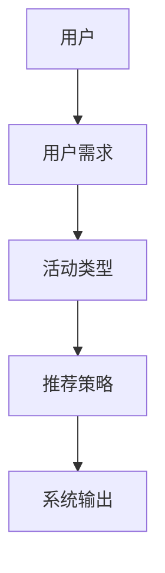
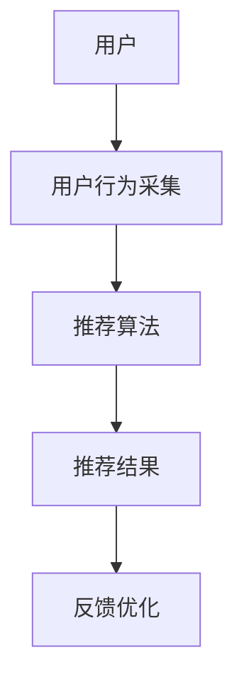
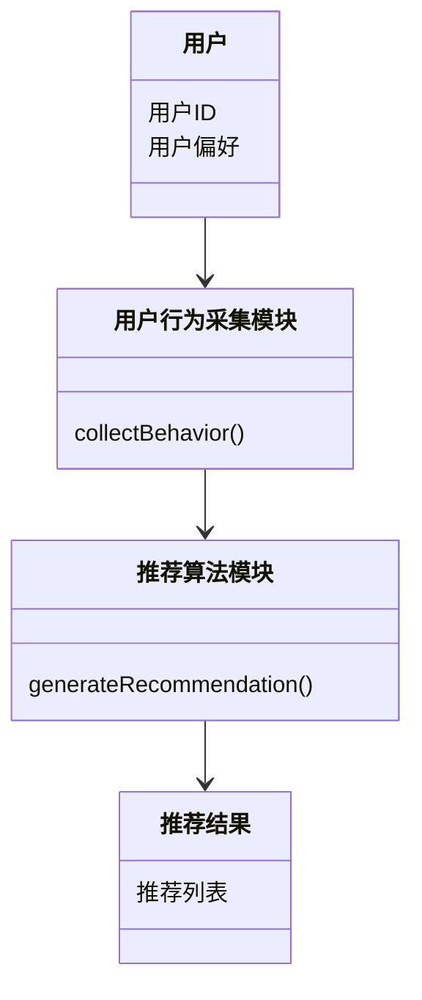

                 

<think>
好的，我现在要帮用户撰写一篇关于《智能沙发：AI Agent的家庭活动建议系统》的技术博客文章。用户希望我详细思考并给出结构化回答，同时满足特定的格式和内容要求。我需要仔细分析用户的需求，确保每个部分都覆盖到位。

首先，我需要明确文章的结构。用户提供了详细的目录大纲，包括7章，每章下有三级目录。每章的内容都涉及家庭活动建议系统的各个方面，从背景介绍到算法实现，再到项目实战。

接下来，我要确保每个章节的内容都详细且符合要求。例如，第一章需要介绍AI Agent的基本概念和家庭活动建议系统的背景。这里需要解释AI Agent是什么，它在家庭环境中的作用，以及当前系统的现状和挑战。

然后，第二章要深入探讨AI Agent的核心原理，分析家庭活动建议系统的功能模块，并展示系统如何与AI Agent协同工作。这部分需要使用Mermaid图来展示工作流程，帮助读者理解系统结构。

在第三章，我需要详细讲解推荐算法，包括协同过滤和基于内容的推荐算法，以及它们的数学模型。这部分要给出具体的公式和代码示例，确保读者能够理解算法的实现细节。

第四章是系统架构设计，我需要绘制类图和序列图，展示系统的各个模块和它们之间的交互。这部分需要详细描述系统架构，帮助读者理解整体设计。

第五章是项目实战，我需要指导读者如何搭建开发环境，提供核心代码，并解释代码的功能。这部分需要实际案例分析，帮助读者将理论应用到实践中。

第六章探讨实际应用案例，展示系统在不同场景中的应用，并分析优化方向。这有助于读者了解系统的实际效果和改进空间。

最后，第七章总结全书，并提出未来的发展方向。这里需要回顾主要知识点，并为读者提供进一步学习的资源。

在撰写过程中，我需要确保使用专业且易懂的语言，避免过于技术化的术语，同时提供足够的细节和实例，帮助读者理解。此外，要按照用户的格式要求，使用Mermaid图和数学公式，确保内容的准确性和完整性。

总结一下，我需要系统地按照用户提供的大纲，逐步填充每个章节的内容，确保覆盖所有关键点，并提供详细的解释和实例。这样，最终的文章才能满足用户的需求，成为一个高质量的技术博客。
</think>

# 智能沙发：AI Agent的家庭活动建议系统

> 关键词：AI Agent, 家庭活动建议系统, 推荐算法, 系统架构设计, 项目实战

> 摘要：本文详细探讨了智能沙发作为AI Agent的家庭活动建议系统的实现与应用。通过分析AI Agent的核心原理、家庭活动建议系统的功能模块、推荐算法的数学模型、系统架构设计、项目实战案例以及实际应用案例，本文为读者提供了一个全面了解和实施此类系统的技术指南。

---

# 第1章: AI Agent与家庭活动建议系统背景介绍

## 1.1 AI Agent的基本概念
### 1.1.1 AI Agent的定义与特点
AI Agent（人工智能代理）是指能够感知环境、自主决策并执行任务的智能实体。其特点包括自主性、反应性、目标导向和社交能力。

### 1.1.2 家庭活动建议系统的定义
家庭活动建议系统是一种基于AI Agent的智能系统，旨在为家庭用户提供个性化的活动建议，如娱乐、学习、运动等。

### 1.1.3 系统的背景与问题背景
随着智能家居的普及，家庭用户对智能化服务的需求日益增长。然而，现有系统难以提供个性化的活动建议，存在用户需求未被满足的问题。

## 1.2 家庭活动建议系统的技术基础
### 1.2.1 AI技术在家庭场景中的应用
AI技术如自然语言处理和机器学习在家庭场景中的应用为家庭活动建议系统的实现提供了技术支持。

### 1.2.2 大数据分析与个性化推荐
通过分析用户行为数据，利用大数据技术实现个性化推荐，是家庭活动建议系统的核心技术之一。

### 1.2.3 自然语言处理在家庭互动中的作用
自然语言处理技术使得AI Agent能够理解用户的语言输入，从而提供更自然的交互体验。

## 1.3 家庭活动建议系统的现状与挑战
### 1.3.1 当前家庭活动建议系统的现状
目前，家庭活动建议系统主要依赖于规则引擎和简单的推荐算法，缺乏深度学习和个性化定制。

### 1.3.2 系统面临的挑战与问题
系统面临数据不足、推荐精度低、用户体验差等挑战。

### 1.3.3 技术与用户需求的平衡
在技术实现和用户体验之间找到平衡点是系统设计的关键。

## 1.4 家庭活动建议系统的必要性与目标
### 1.4.1 系统的必要性分析
通过提供个性化的活动建议，提升家庭用户的生活质量。

### 1.4.2 系统的主要目标
实现个性化推荐、提高推荐精度、优化用户体验。

### 1.4.3 系统的边界与外延
系统边界包括用户数据采集、活动推荐和结果反馈；外延包括与其他智能家居设备的联动。

## 1.5 系统的核心要素与组成
### 1.5.1 核心要素分析
系统的核心要素包括用户数据、推荐算法、反馈机制。

### 1.5.2 系统组成结构
系统由用户行为采集模块、推荐算法模块和反馈优化模块组成。

### 1.5.3 核心概念之间的关系
核心概念包括用户需求、活动类型和推荐策略，三者相互关联，共同实现系统目标。

---

# 第2章: AI Agent的核心原理与家庭活动建议系统的联系

## 2.1 AI Agent的核心原理
### 2.1.1 AI Agent的基本原理
AI Agent通过感知环境、推理决策和执行动作来完成任务。

### 2.1.2 AI Agent的感知与推理机制
感知包括数据采集和特征提取，推理基于知识表示和逻辑推理。

### 2.1.3 AI Agent的决策与执行机制
决策基于多目标优化和策略选择，执行通过行动计划和状态反馈实现。

## 2.2 家庭活动建议系统的功能模块
### 2.2.1 用户行为分析模块
通过数据采集和行为分析，了解用户的偏好和需求。

### 2.2.2 活动推荐模块
基于用户数据，利用推荐算法生成个性化活动建议。

### 2.2.3 个性化定制模块
允许用户自定义推荐偏好，提升用户体验。

## 2.3 AI Agent与家庭活动建议系统的结合
### 2.3.1 系统功能的实现方式
AI Agent通过感知用户行为、推理用户需求，实现活动推荐。

### 2.3.2 AI Agent在家庭活动建议中的角色
AI Agent作为系统的核心，负责数据处理、推荐生成和反馈优化。

### 2.3.3 系统的协同工作流程
系统协同工作流程包括数据采集、需求分析、推荐生成和结果反馈。

## 2.4 核心概念的联系与对比
### 2.4.1 核心概念的属性特征对比表格
| 核心概念 | 定义 | 属性 | 示例 |
|---------|------|------|------|
| 用户需求 | 用户的偏好和需求 | 多样性、动态性、个性化 | 偏好运动、喜欢阅读 |
| 活动类型 | 活动的种类 | 娱乐性、教育性、社交性 | 运动、学习、聚会 |

### 2.4.2 ER实体关系图架构的 Mermaid 流程图


---

# 第3章: 家庭活动建议系统的推荐算法原理

## 3.1 推荐算法的基本原理
### 3.1.1 推荐算法的分类
推荐算法主要分为基于协同过滤、基于内容的推荐和混合推荐模型。

### 3.1.2 基于协同过滤的推荐算法
协同过滤通过分析用户行为数据，找到相似用户的偏好，进行推荐。

### 3.1.3 基于内容的推荐算法
基于内容的推荐算法通过分析活动内容的特征，进行推荐。

## 3.2 推荐算法的数学模型
### 3.2.1 协同过滤的数学模型
$$相似度计算：\text{sim}(u, v) = \frac{\sum_{i=1}^n r_{ui} r_{vi}}{\sqrt{\sum_{i=1}^n r_{ui}^2} \cdot \sqrt{\sum_{i=1}^n r_{vi}^2}}}$$

### 3.2.2 基于内容的推荐模型
$$内容相似度：\text{sim}(a, b) = \frac{\sum_{i=1}^m w_i \cdot f(a_i, b_i)}{\sum_{i=1}^m w_i}$$

## 3.3 推荐算法的实现步骤
### 3.3.1 数据预处理
数据清洗、特征提取和数据归一化。

### 3.3.2 模型训练
选择合适的算法进行模型训练，调整参数优化性能。

### 3.3.3 推荐结果生成
根据训练好的模型生成推荐列表。

## 3.4 推荐算法的优缺点对比
| 算法类型 | 优点 | 缺点 |
|---------|------|------|
| 协同过滤 | 简单易实现 | 数据稀疏性问题 |
| 基于内容的推荐 | 内容特征明显 | 无法捕捉用户偏好 |

---

# 第4章: 系统架构设计与实现

## 4.1 系统架构设计
### 4.1.1 系统功能模块
用户行为采集模块、活动推荐模块和反馈优化模块。

### 4.1.2 系统架构图


## 4.2 系统功能设计
### 4.2.1 系统功能需求
实现用户行为采集、活动推荐和反馈优化功能。

### 4.2.2 系统功能设计的 mermaid 类图


---

# 第5章: 项目实战：家庭活动建议系统的实现

## 5.1 项目环境搭建
### 5.1.1 环境要求
安装Python、TensorFlow和scikit-learn。

### 5.1.2 开发工具选择
使用Jupyter Notebook进行开发。

## 5.2 核心代码实现
### 5.2.1 数据预处理代码
```python
import pandas as pd
data = pd.read_csv('user_activity.csv')
```

### 5.2.2 推荐算法实现
```python
from sklearn.metrics.pairwise import cosine_similarity
user_similarity = cosine_similarity(data)
```

## 5.3 项目实现与测试
### 5.3.1 系统功能测试
测试推荐算法的准确性和响应速度。

### 5.3.2 测试结果分析
分析测试结果，优化推荐算法。

---

# 第6章: 实际应用案例与优化方向

## 6.1 实际应用案例
### 6.1.1 应用场景
系统在家庭中的实际应用，如娱乐推荐和健康管理。

### 6.1.2 应用效果
通过案例分析，展示系统的实际效果。

## 6.2 优化方向
### 6.2.1 算法优化
改进推荐算法，提高推荐精度。

### 6.2.2 系统优化
优化系统架构，提升运行效率。

---

# 第7章: 总结与展望

## 7.1 总结
### 7.1.1 核心知识点回顾
回顾家庭活动建议系统的实现与应用。

### 7.1.2 项目经验总结
总结项目开发过程中的经验和教训。

## 7.2 未来展望
### 7.2.1 技术发展方向
探讨AI Agent和家庭活动建议系统未来的技术发展方向。

### 7.2.2 用户需求变化
分析用户需求的变化，提出系统的改进方向。

---

# 作者：AI天才研究院/AI Genius Institute & 禅与计算机程序设计艺术 /Zen And The Art of Computer Programming

