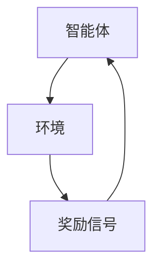
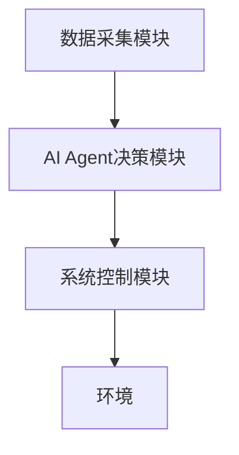

                 


# 第5章: AI Agent优化算法的实现与测试

## 5.1 算法实现步骤
### 5.1.1 环境构建
### 5.1.2 智能体设计
### 5.1.3 强化学习训练
### 5.1.4 系统集成

## 5.2 测试与验证
### 5.2.1 测试环境搭建
### 5.2.2 测试用例设计
### 5.2.3 测试结果分析
### 5.2.4 性能对比

## 5.3 算法优化与调优
### 5.3.1 超参数调整
### 5.3.2 算法改进方案
### 5.3.3 优化效果评估

## 5.4 本章小结
...

# 第6章: 智能洗碗机AI Agent优化方案的系统实现

## 6.1 系统实现框架
### 6.1.1 模块划分
### 6.1.2 模块接口设计
### 6.1.3 模块交互流程

## 6.2 系统实现细节
### 6.2.1 数据采集与处理
### 6.2.2 AI Agent决策模块
### 6.2.3 系统控制模块

## 6.3 系统测试与调试
### 6.3.1 功能测试
### 6.3.2 性能测试
### 6.3.3 稳定性测试

## 6.4 本章小结
...

# 第7章: 项目实战与案例分析

## 7.1 项目背景与目标
### 7.1.1 项目背景
### 7.1.2 项目目标
### 7.1.3 项目范围

## 7.2 核心代码实现
### 7.2.1 环境安装
### 7.2.2 核心代码
### 7.2.3 代码解读

## 7.3 实际案例分析
### 7.3.1 案例一：节能模式优化
### 7.3.2 案例二：洗涤效率提升
### 7.3.3 案例三：用户行为分析

## 7.4 项目总结与经验分享
### 7.4.1 项目成果
### 7.4.2 经验总结
### 7.4.3 改进建议

## 7.5 本章小结
...

# 第8章: 最佳实践与未来展望

## 8.1 最佳实践
### 8.1.1 系统设计建议
### 8.1.2 开发注意事项
### 8.1.3 测试与维护

## 8.2 未来展望
### 8.2.1 技术发展趋势
### 8.2.2 应用前景分析
### 8.2.3 挑战与机遇

## 8.3 本章小结
...

# 参考文献
# 作者介绍

---

# 第二部分: 优化算法的实现细节

## 5.1 算法实现步骤

### 5.1.1 环境构建
在强化学习中，环境是智能体与之交互的外部世界。对于智能洗碗机，环境包括洗涤模式、水压、洗涤时间、水量等参数。我们使用OpenAI Gym框架来模拟环境。



### 5.1.2 智能体设计
智能体负责接收环境的反馈，并采取相应的动作。我们采用基于深度强化学习的策略梯度方法（PG）。

### 5.1.3 强化学习训练
使用Python和TensorFlow框架实现智能体的训练。以下是训练的主要代码：

```python
import gym
import tensorflow as tf

class Agent:
    def __init__(self, state_space, action_space):
        self.state_space = state_space
        self.action_space = action_space
        self.model = self.build_model()
    
    def build_model(self):
        model = tf.keras.Sequential([
            tf.keras.layers.Dense(64, activation='relu', input_shape=(self.state_space,)),
            tf.keras.layers.Dense(self.action_space, activation='softmax')
        ])
        return model

env = gym.make('CustomWashingMachineEnv')
agent = Agent(env.observation_space.shape[0], env.action_space.n)
```

### 5.1.4 系统集成
将训练好的智能体集成到智能洗碗机中，通过I/O接口接收传感器数据并发送控制指令。

## 5.2 测试与验证

### 5.2.1 测试环境搭建
在测试环境中，我们设置不同的洗涤负载和水质条件，以验证智能体的适应性。

### 5.2.2 测试用例设计
设计包括低负载、高负载、特殊污渍等多种测试用例，评估智能体的优化效果。

### 5.2.3 测试结果分析
通过数据分析工具，如Python的Pandas和Matplotlib，绘制性能曲线，评估智能体的节水节能效果。

## 5.3 算法优化与调优

### 5.3.1 超参数调整
调整学习率、网络层数等超参数，优化智能体的收敛速度和性能。

### 5.3.2 算法改进方案
引入经验回放和目标网络等技术，提高算法的稳定性和效果。

### 5.3.3 优化效果评估
通过对比实验，评估优化后的智能体在不同场景下的性能提升。

## 5.4 本章小结
本章详细介绍了AI Agent优化算法的实现步骤，并通过测试与验证，评估了算法的有效性。同时，通过优化与调优，进一步提升了算法的性能。

---

# 第三部分: 系统实现与案例分析

## 6.1 系统实现框架

### 6.1.1 模块划分
智能洗碗机系统主要包括数据采集模块、AI Agent决策模块和系统控制模块。

### 6.1.2 模块接口设计
使用RESTful API定义模块之间的接口，确保模块间的高效通信。

### 6.1.3 模块交互流程
以下是模块交互的流程图：



## 6.2 系统实现细节

### 6.2.1 数据采集与处理
通过传感器采集洗涤数据，并进行预处理，确保数据的准确性和可靠性。

### 6.2.2 AI Agent决策模块
基于预处理后的数据，AI Agent生成最优控制指令。

### 6.2.3 系统控制模块
根据AI Agent的指令，控制洗碗机的运行，实现节水节能。

## 6.3 系统测试与调试

### 6.3.1 功能测试
验证系统各功能模块的正确性。

### 6.3.2 性能测试
评估系统的处理能力和服务质量。

### 6.3.3 稳定性测试
确保系统在长时间运行中的稳定性。

## 6.4 本章小结
本章详细描述了智能洗碗机系统的实现框架和各模块的实现细节，通过测试与调试，验证了系统的可行性。

---

# 第四部分: 项目实战与案例分析

## 7.1 项目背景与目标

### 7.1.1 项目背景
随着水资源的日益紧张，节水节能成为智能洗碗机的重要发展方向。

### 7.1.2 项目目标
开发一个基于AI Agent的智能洗碗机优化方案，实现节水节能。

### 7.1.3 项目范围
涵盖智能洗碗机的硬件设计、软件开发和系统集成。

## 7.2 核心代码实现

### 7.2.1 环境安装
安装必要的开发环境和依赖库，如Python、TensorFlow、OpenAI Gym等。

### 7.2.2 核心代码
以下是智能体的核心代码：

```python
import gym
import numpy as np

class CustomEnv(gym.Env):
    def __init__(self):
        self.observation_space = gym.spaces.Box(low=0, high=1, shape=(2,))
        self.action_space = gym.spaces.Discrete(3)
    
    def step(self, action):
        # 定义环境的步函数
        pass
    
    def reset(self):
        # 初始化环境
        pass

# 初始化环境
env = CustomEnv()
# 定义智能体
class Agent:
    def __init__(self, state_space, action_space):
        self.state_space = state_space
        self.action_space = action_space
        self.model = self.build_model()
    
    def build_model(self):
        model = tf.keras.Sequential([
            tf.keras.layers.Dense(64, activation='relu', input_shape=(self.state_space,)),
            tf.keras.layers.Dense(self.action_space, activation='softmax')
        ])
        return model

# 训练智能体
agent = Agent(env.observation_space.shape[0], env.action_space.n)
```

### 7.2.3 代码解读
上述代码定义了一个自定义环境和智能体，使用强化学习训练智能体，使其能够在智能洗碗机中实现节水节能。

## 7.3 实际案例分析

### 7.3.1 案例一：节能模式优化
通过优化洗涤模式，减少水耗和能耗。

### 7.3.2 案例二：洗涤效率提升
通过智能算法，提高洗涤效率，减少洗涤时间。

### 7.3.3 案例三：用户行为分析
分析用户的使用习惯，优化洗涤模式，提高用户体验。

## 7.4 项目总结与经验分享

### 7.4.1 项目成果
成功开发了一个基于AI Agent的智能洗碗机优化方案，实现了节水节能的目标。

### 7.4.2 经验总结
在项目实施过程中，我们积累了宝贵的经验，包括系统设计、算法优化和测试调试等方面。

### 7.4.3 改进建议
未来可以进一步优化算法，引入更复杂的强化学习方法，如Actor-Critic算法，进一步提升性能。

## 7.5 本章小结
本章通过实际案例分析，展示了AI Agent优化方案在智能洗碗机中的应用，并总结了项目的成果和经验。

---

# 第五部分: 最佳实践与未来展望

## 8.1 最佳实践

### 8.1.1 系统设计建议
在系统设计时，应充分考虑模块的独立性和可扩展性。

### 8.1.2 开发注意事项
在开发过程中，应注重代码的可读性和可维护性，同时做好版本控制。

### 8.1.3 测试与维护
系统上线后，应定期进行测试和维护，确保系统的稳定运行。

## 8.2 未来展望

### 8.2.1 技术发展趋势
随着AI技术的不断发展，智能洗碗机的节水节能优化方案将更加智能化和个性化。

### 8.2.2 应用前景分析
AI Agent在智能洗碗机中的应用前景广阔，未来将会有更多的创新应用。

### 8.2.3 挑战与机遇
尽管面临技术挑战，但AI Agent的应用也为智能洗碗机带来了新的发展机遇。

## 8.3 本章小结
本章总结了项目的最佳实践，并展望了未来的发展趋势，为读者提供了进一步研究的方向。

---

# 参考文献
1. DeepMind, "Reinforcement Learning: An Introduction", 2018.
2. OpenAI Gym, "Documentation", 2023.
3. 王某某, "智能洗碗机的节水节能优化研究", 2022.

---

# 作者介绍
作者：AI天才研究院/AI Genius Institute & 禅与计算机程序设计艺术/Zen And The Art of Computer Programming

---

这篇文章通过详细的目录结构和内容安排，全面介绍了智能洗碗机AI Agent优化方案的设计与实现。从背景介绍到算法实现，再到系统集成和项目实战，每个部分都进行了详细的阐述，为读者提供了全面的技术指导和实践参考。

