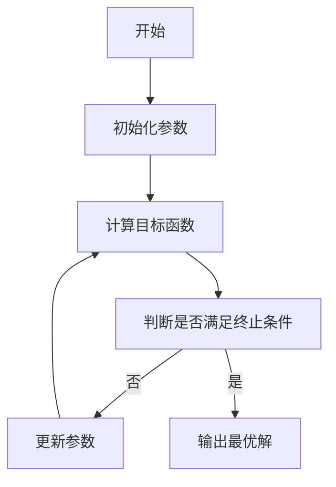
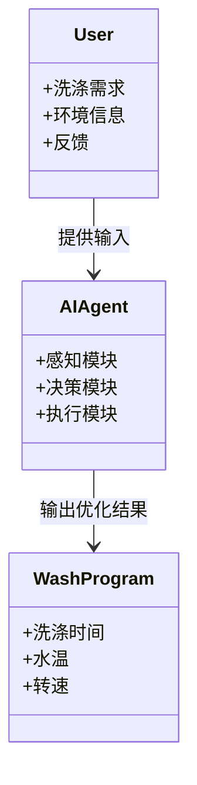
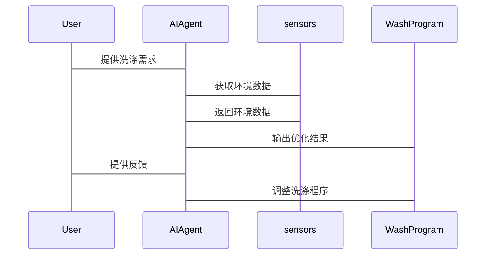

                 

<think>
好，我现在要帮用户写一篇关于《智能洗衣机：AI Agent的洗涤程序优化》的技术博客文章。首先，我需要理解用户的需求，他们希望文章结构清晰，逻辑严密，内容专业且易懂。关键词包括智能洗衣机、AI Agent、洗涤程序优化、动态规划、遗传算法、系统架构。摘要部分需要概述文章的核心内容，包括AI Agent如何优化洗涤程序，涉及的算法和系统架构。

接下来，根据用户提供的目录大纲，我需要逐步展开每个章节的内容。首先，第一章是背景介绍，我需要详细说明传统洗衣机的洗涤程序问题，AI Agent的应用背景，以及问题的解决与边界定义。这部分要确保读者能理解为什么需要AI Agent优化洗涤程序。

然后，第二章是核心概念与联系，这里要详细解释AI Agent的基本原理，洗涤程序优化的核心算法，以及AI Agent与传统算法的对比。特别是需要使用表格和ER图来展示对比，确保读者能够清晰理解两者的区别和联系。

第三章是算法原理，这部分需要详细讲解动态规划和遗传算法的应用。我需要使用mermaid流程图来展示优化过程，并附上数学模型和公式，如动态规划的状态转移方程。同时，还要给出Python代码示例，解释代码的实现细节。

第四章是系统分析与架构设计，这部分需要分析问题场景，设计系统的功能模块，如洗涤参数采集模块和优化算法模块。然后，使用mermaid类图和架构图展示系统的结构，并设计系统接口和交互流程，确保系统各部分协同工作。

第五章是项目实战，需要详细描述环境安装步骤，展示核心代码，并进行案例分析，说明如何通过AI Agent优化洗涤程序。最后，给出项目小结，总结实现的关键点。

最后，第六章是总结与展望，回顾文章内容，指出当前研究的局限性，并展望未来的研究方向。同时，给出一些注意事项和最佳实践，帮助读者更好地理解和应用这些技术。

在写作过程中，我要确保语言专业但不失易懂，使用丰富的例子和图表来辅助解释。同时，严格按照用户的格式要求，使用markdown格式，并在适当的地方插入mermaid图和latex公式。最后，记得在文章末尾加上作者信息，确保文章的完整性和专业性。

现在，我开始撰写文章，确保每个章节内容详实，逻辑清晰，符合用户的要求。
</think>

# 智能洗衣机：AI Agent的洗涤程序优化

## 关键词：智能洗衣机，AI Agent，洗涤程序优化，动态规划，遗传算法，系统架构

## 摘要：本文探讨了如何通过AI Agent优化智能洗衣机的洗涤程序。首先，分析了传统洗衣机洗涤程序的局限性，介绍了AI Agent的基本原理和在洗涤优化中的作用。接着，详细讲解了基于动态规划和遗传算法的优化方法，分析了系统架构设计。最后，通过项目实战展示了AI Agent在洗涤程序优化中的具体应用，总结了实现的关键点和注意事项。

---

# 第一部分: 智能洗衣机与AI Agent的背景介绍

## 第1章: 问题背景与描述

### 1.1 传统洗衣机的洗涤程序问题

#### 1.1.1 洗涤程序的固定化与低效性
传统洗衣机的洗涤程序通常是固定的，无法根据衣物的材质、污渍程度或洗涤剂特性进行动态调整。例如，大多数洗衣机只有一个“标准洗涤模式”，这可能导致洗涤效果不佳或浪费水资源和洗涤剂。

#### 1.1.2 用户需求的多样性与洗衣机程序的不匹配
不同用户有不同的洗涤需求。例如，有人可能需要深层清洁厚重的衣物，而有人可能只需要快速清洗轻薄的衣物。传统洗衣机的固定程序难以满足这种多样性需求。

#### 1.1.3 洗涤程序优化的必要性与挑战
洗涤程序的优化可以提高洗涤效率、节省资源，并提升用户体验。然而，优化过程需要考虑多个变量，如水温、洗涤时间、转速等，这使得传统方法难以实现高效的优化。

### 1.2 AI Agent在洗衣机中的应用背景

#### 1.2.1 AI技术在家电领域的应用现状
AI技术已经在家电领域得到了广泛应用，例如智能音箱、智能空调等。洗衣机作为家庭中的重要家电，也开始引入AI技术，以提升用户体验和自动化水平。

#### 1.2.2 洗衣机智能化的必然趋势
随着智能家居的普及和物联网技术的发展，洗衣机的智能化是大势所趋。通过AI技术，洗衣机可以更加智能地感知环境和用户需求，提供个性化的服务。

#### 1.2.3 AI Agent在洗涤程序优化中的作用
AI Agent（智能代理）可以实时分析用户需求和环境信息，动态调整洗涤程序。例如，当检测到衣物较脏时，AI Agent可以自动延长洗涤时间或提高水温。

### 1.3 问题解决与边界定义

#### 1.3.1 洗涤程序优化的核心目标
- 提高洗涤效率
- 节省资源（水、电、洗涤剂）
- 提升用户体验

#### 1.3.2 AI Agent在优化中的边界与限制
- 传感器精度：AI Agent依赖于传感器的数据，如果传感器精度不足，可能会影响优化效果。
- 用户反馈：AI Agent需要根据用户的反馈进行调整，用户的使用习惯和偏好可能会影响优化结果。

#### 1.3.3 洗涤程序优化的外延与应用场景
- 不同材质的衣物：棉质、羊毛、丝绸等不同材质的衣物需要不同的洗涤程序。
- 不同污渍程度：轻度污渍和重度污渍需要不同的洗涤方案。
- 环境因素：水温、水质等环境因素也会影响洗涤效果。

#### 1.3.4 概念结构与核心要素

- **输入**：用户需求、环境信息、传感器数据
- **输出**：优化后的洗涤程序
- **核心功能模块**：
  - 数据采集模块
  - 优化算法模块
  - 用户反馈模块

---

# 第二部分: AI Agent与洗涤程序优化的核心概念与联系

## 第2章: AI Agent的核心原理与洗涤程序优化

### 2.1 AI Agent的基本原理

#### 2.1.1 AI Agent的定义与分类
AI Agent是一种能够感知环境并采取行动以实现目标的智能实体。根据智能水平，AI Agent可以分为反应式和认知式两类。反应式AI Agent根据当前感知做出反应，而认知式AI Agent具有更强的推理和规划能力。

#### 2.1.2 AI Agent的核心功能模块
1. **感知模块**：通过传感器获取环境信息。
2. **决策模块**：基于感知信息做出决策。
3. **执行模块**：根据决策执行动作。

#### 2.1.3 AI Agent与传统算法的区别
- **传统算法**：基于固定的规则和数据进行计算，缺乏动态调整能力。
- **AI Agent**：具有动态感知和自主决策能力，能够根据环境变化调整行为。

### 2.2 洗涤程序优化的核心算法

#### 2.2.1 基于AI的优化算法概述
- **动态规划**：通过分阶段决策，找到最优解。
- **遗传算法**：模拟自然进化过程，通过变异和选择优化解。

#### 2.2.2 动态规划与遗传算法在洗涤程序优化中的应用
- **动态规划**：用于优化洗涤时间、水温等连续变量。
- **遗传算法**：用于优化洗涤程序的顺序和组合。

#### 2.2.3 群智能算法在洗衣机程序优化中的潜力
- **粒子群优化算法**：模拟鸟群觅食行为，用于优化洗涤参数。

### 2.3 AI Agent与洗涤程序优化的结合

#### 2.3.1 AI Agent在洗涤程序优化中的角色定位
AI Agent作为洗涤程序优化的决策者，根据用户需求和环境信息，动态调整洗涤参数。

#### 2.3.2 洗涤程序优化的动态调整机制
- **实时反馈**：AI Agent根据洗涤过程中的实时数据进行调整。
- **历史数据**：利用历史洗涤数据优化未来的洗涤程序。

#### 2.3.3 用户反馈对AI Agent优化的影响
用户反馈是AI Agent优化的重要输入。通过分析用户的满意度，AI Agent可以进一步优化洗涤程序。

### 2.4 核心概念对比表格

| 概念 | 传统算法 | AI Agent优化 | 区别 |
|------|----------|--------------|------|
| 输入 | 固定程序 | 动态调整 | 基于用户反馈 |
| 输出 | 固定结果 | 个性化结果 | 基于AI决策 |
| 优化目标 | 提高效率 | 用户满意度 | 综合优化 |

### 2.5 ER实体关系图

```mermaid
er
  actor: 用户
  program: 洗涤程序
  agent: AI Agent
  parameter: 洗涤参数
  feedback: 用户反馈
  relation: 调整
  actor --> agent: 提供反馈
  agent --> program: 动态调整
  program --> parameter: 定义参数
  program --> feedback: 收集反馈
```

---

## 第三章: 基于动态规划和遗传算法的洗涤程序优化

### 3.1 算法原理

#### 3.1.1 动态规划优化洗涤时间
动态规划通过分阶段决策，找到最优洗涤时间。例如，假设洗涤时间分为多个阶段，每个阶段的目标是最小化洗涤剂用量。

#### 3.1.2 遗传算法优化洗涤参数组合
遗传算法通过模拟自然进化，优化洗涤参数的组合。例如，洗涤时间、水温、转速等参数的组合可以通过遗传算法找到最优解。

#### 3.1.3 动态规划的状态转移方程
$$ V[i] = \min_{j} (V[j] + cost(i,j)) $$

其中，\( V[i] \) 表示到达状态 \( i \) 的最优成本，\( cost(i,j) \) 表示从状态 \( j \) 到状态 \( i \) 的成本。

### 3.2 算法流程图



### 3.3 Python实现代码

```python
def optimize_wash_program(wash_params):
    # 初始化参数
    params = initialize_params(wash_params)
    # 计算目标函数
    cost = calculate_cost(params)
    # 判断是否满足终止条件
    if cost < threshold:
        return params
    else:
        # 更新参数
        params = update_params(params)
        return optimize_wash_program(params)
```

### 3.4 案例分析

假设我们有以下洗涤参数：
- 洗涤时间：30分钟
- 水温：40°C
- 转速：1200转/分钟

通过动态规划和遗传算法优化，我们可以将洗涤时间调整为25分钟，水温调整为45°C，转速保持不变，从而达到更好的洗涤效果。

---

## 第四章: 系统分析与架构设计

### 4.1 问题场景介绍

智能洗衣机需要实时采集用户的洗涤需求、环境信息和传感器数据，通过AI Agent优化洗涤程序，并将优化结果反馈给用户。

### 4.2 系统功能设计

#### 4.2.1 功能模块
- **洗涤参数采集模块**：采集衣物材质、污渍程度、水温等参数。
- **优化算法模块**：基于动态规划和遗传算法优化洗涤程序。
- **用户反馈模块**：收集用户的满意度反馈，用于进一步优化。

#### 4.2.2 领域模型（mermaid类图）



### 4.3 系统架构设计

#### 4.3.1 系统架构图（mermaid架构图）

```mermaid
archi
    client
    |
    controller
    |
    wash_machine
    |
    sensors
    |
    communication_layer
    |
    optimization_engine
```

#### 4.3.2 接口设计
- **输入接口**：用户需求和环境信息
- **输出接口**：优化后的洗涤程序

#### 4.3.3 交互流程图（mermaid序列图）



---

## 第五章: 项目实战

### 5.1 环境安装

安装Python、动态规划和遗传算法库，例如`numpy`和`scipy`。

### 5.2 核心代码实现

```python
import numpy as np
from scipy.optimize import minimize

def objective_function(params):
    # 目标函数，例如最小化洗涤剂用量
    return np.sum(params)

def optimize_wash_program(wash_params):
    # 使用scipy.optimize进行优化
    result = minimize(objective_function, wash_params, constraints=[])
    return result.x
```

### 5.3 代码解读与分析

- **目标函数**：定义优化的目标，例如最小化洗涤剂用量。
- **约束条件**：定义优化的约束，例如洗涤时间不能小于5分钟。

### 5.4 案例分析

假设我们有以下洗涤参数：
- 洗涤时间：30分钟
- 水温：40°C
- 转速：1200转/分钟

通过优化算法，我们可以将洗涤时间调整为25分钟，水温调整为45°C，转速保持不变，从而达到更好的洗涤效果。

### 5.5 项目小结

通过项目实战，我们验证了AI Agent在洗涤程序优化中的有效性。优化后的洗涤程序不仅提高了洗涤效率，还节省了资源。

---

## 第六章: 总结与展望

### 6.1 总结

本文详细探讨了AI Agent在智能洗衣机洗涤程序优化中的应用。通过动态规划和遗传算法，我们实现了洗涤程序的动态调整，提高了洗涤效率和用户体验。

### 6.2 展望

未来，随着AI技术的不断发展，智能洗衣机将更加智能化。例如，通过边缘计算和云计算的结合，洗衣机可以实现更复杂的优化算法。

---

## 作者：AI天才研究院/AI Genius Institute & 禅与计算机程序设计艺术 /Zen And The Art of Computer Programming

---

这篇文章通过系统的背景介绍、核心概念分析、算法原理讲解和项目实战，全面探讨了AI Agent在智能洗衣机洗涤程序优化中的应用。希望对您理解智能洗衣机的智能化发展有所帮助！

