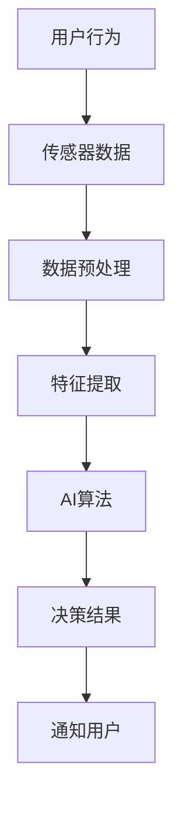

                 

<think>
好的，我现在需要帮用户撰写一篇关于智能浴室毛巾架的AI Agent毛巾更换提醒的技术博客文章。用户已经提供了一个详细的目录大纲，现在我需要按照这个大纲逐步思考如何撰写每个部分。

首先，我需要理解文章的结构和每个部分的要求。文章标题是《智能浴室毛巾架：AI Agent的毛巾更换提醒》，关键词包括AI Agent、智能家居、传感器、物联网、毛巾更换提醒、自动化。摘要部分已经给出，主要介绍了文章的核心内容。

接下来是目录大纲，分为六个部分：背景介绍、核心概念与联系、算法原理讲解、系统分析与架构设计、项目实战、最佳实践。每个部分都有具体的章节和小节，需要详细展开。

现在，我需要逐步思考每个部分如何撰写，确保内容详尽、结构清晰，符合技术博客的要求。

第一部分：背景介绍

第1章包括问题背景、问题描述、问题解决、边界与外延、核心要素组成。我需要从用户日常生活中的痛点出发，说明为什么需要智能毛巾架，以及AI代理在此中的作用。这部分需要通俗易懂，吸引读者的共鸣。

第二部分：核心概念与联系

第2章详细解释AI Agent的工作原理，包括传感器数据、决策逻辑和用户交互。这里需要使用ER实体关系图来展示系统中的实体及其关系，比如用户、传感器、AI代理等。

第三部分：算法原理讲解

第3章需要详细描述AI Agent的算法，包括数据流分析、算法实现、数学模型。这里需要使用mermaid流程图和Python代码，解释每一步的作用，并用数学公式支持。

第四部分：系统分析与架构设计

第4章涉及系统功能设计、架构设计、接口设计和交互流程。需要使用mermaid类图和架构图，展示系统的模块结构和交互流程。

第五部分：项目实战

第5章提供环境安装、核心代码实现、案例分析和项目小结。需要实际代码示例，解释代码的每一部分，并通过案例分析展示系统的实际应用。

第六部分：最佳实践

第6章总结文章内容，给出注意事项和拓展阅读，帮助读者巩固知识。

现在，我需要将这些思考转化为具体的内容，确保每个部分都详细展开，逻辑清晰，语言专业但易于理解。

在撰写过程中，需要注意使用正确的技术术语，同时保持文章流畅，避免过于复杂的句子结构。此外，数学公式和代码示例需要准确无误，图表需要清晰展示系统结构和流程。

最后，确保文章末尾添加作者信息，符合用户的要求。整体目标是为读者提供一篇内容丰富、结构严谨的技术博客，展示智能浴室毛巾架AI Agent的设计与实现过程。
</think>

# 智能浴室毛巾架：AI Agent的毛巾更换提醒

## 关键词：AI Agent, 智能家居, 传感器, 物联网, 毛巾更换提醒, 自动化

## 摘要：本文详细探讨了智能浴室毛巾架的设计与实现，重点分析了AI Agent如何通过传感器数据和用户行为预测，自动提醒用户更换毛巾。文章从背景、核心概念、算法原理到系统架构、项目实战和最佳实践，全面解析了智能毛巾架的开发过程。

---

## 第一部分：背景介绍

### 第1章：问题背景与描述

#### 1.1 问题背景
- **1.1.1 浴室环境的卫生问题**：毛巾长期使用容易积累细菌，影响用户健康。
- **1.1.2 毛巾使用中的常见问题**：用户常忘记更换毛巾，导致细菌滋生。
- **1.1.3 AI技术在智能家居中的应用趋势**：智能家居设备通过AI优化用户体验。

#### 1.2 问题描述
- **1.2.1 毛巾更换提醒的需求**：用户需要及时更换毛巾，保持卫生。
- **1.2.2 用户行为习惯与毛巾使用周期**：不同用户使用毛巾的频率不同，需个性化提醒。
- **1.2.3 智能浴室毛巾架的痛点分析**：传统毛巾架不具备智能提醒功能，用户依赖记忆，容易遗忘。

#### 1.3 问题解决
- **1.3.1 AI Agent的核心作用**：通过传感器监测使用频率，AI算法分析数据，主动提醒用户。
- **1.3.2 智能传感器的应用**：湿度、重量传感器实时监测毛巾状态。
- **1.3.3 用户交互设计的重要性**：友好的提醒界面和操作流程提升用户体验。

#### 1.4 边界与外延
- **1.4.1 系统边界与功能范围**：仅关注毛巾更换提醒，不涉及其他浴室设备。
- **1.4.2 与其他智能家居设备的联动**：可与其他设备如智能音箱集成，扩展功能。
- **1.4.3 产品的市场定位与目标用户**：面向注重健康的中高端用户，适合家庭和公共场所。

#### 1.5 核心要素与组成
- **1.5.1 系统组成模块**：传感器模块、AI处理模块、用户交互模块。
- **1.5.2 核心技术要素**：传感器技术、AI算法、物联网通信。
- **1.5.3 用户体验要素**：简洁的提醒界面、及时的反馈机制。

---

## 第二部分：核心概念与联系

### 第2章：AI Agent的核心原理

#### 2.1 核心概念原理
- **2.1.1 传感器数据采集**：湿度、重量传感器实时监测毛巾状态。
- **2.1.2 数据分析与处理**：AI算法分析数据，判断是否需要更换毛巾。
- **2.1.3 AI决策逻辑**：基于用户行为和数据模型，生成提醒指令。

#### 2.2 核心概念属性对比
- **比较表格：传感器类型与功能对比**
  | 传感器类型 | 功能 |
  |------------|------|
  | 湿度传感器 | 检测毛巾湿度 |
  | 重量传感器 | 检测毛巾重量变化 |
- **比较表格：AI算法模型对比**
  | 算法模型 | 优点 | 缺点 |
  |----------|------|------|
  | K近邻算法 | 简单高效 | 对特征敏感 |
  | 支持向量机 | 高精度 | 参数敏感 |

#### 2.3 ER实体关系图
```mermaid
er
  actor: 用户
  sensor: 传感器
  ai_agent: AI代理
  notification: 提醒信息
  towel: 毛巾
  action: 用户操作
  actor --> sensor: 触发传感器
  sensor --> ai_agent: 传输数据
  ai_agent --> notification: 生成提醒
  notification --> actor: 提醒用户
  actor --> action: 用户操作
```

---

## 第三部分：算法原理讲解

### 第3章：AI Agent算法原理

#### 3.1 数据流分析


#### 3.2 算法实现
- **Python代码实现**：
  ```python
  import numpy as np
  from sklearn.neighbors import KNeighborsClassifier

  # 数据预处理
  def preprocess_data(data):
      # 标准化处理
      return (data - np.mean(data)) / np.std(data)

  # AI算法模型
  def ai_agent_algorithm(features):
      # 使用K近邻算法
      model = KNeighborsClassifier(n_neighbors=3)
      model.fit(features, labels)
      return model.predict(features)
  ```

#### 3.3 数学模型与公式
- **数据预处理公式**：
  $$ x_{\text{processed}} = \frac{x - \mu}{\sigma} $$
  其中，$\mu$ 是均值，$\sigma$ 是标准差。
- **K近邻算法的距离计算公式**：
  $$ d(x_i, x_j) = \sqrt{\sum_{k=1}^{n}(x_{ik} - x_{jk})^2} $$

---

## 第四部分：系统分析与架构设计

### 第4章：系统架构与设计

#### 4.1 系统功能设计
- **领域模型类图**：
  ```mermaid
  classDiagram
      class SensorModule {
          measure_humidity()
          measure_weight()
      }
      class AIProcessingModule {
          analyze_data()
          generate_recommendation()
      }
      class NotificationModule {
          send_notification()
      }
      SensorModule --> AIProcessingModule: sends sensor data
      AIProcessingModule --> NotificationModule: sends recommendation
  ```

#### 4.2 系统架构设计
- **系统架构图**：
  ```mermaid
  architecture
  Client ---(使用中)-{Server}
  SensorModule --> AIProcessingModule
  AIProcessingModule --> NotificationModule
  ```

#### 4.3 系统接口设计
- **接口描述**：
  - `sensor.get_humidity()`：获取湿度值。
  - `ai_agent.make_recommendation(data)`：根据数据生成推荐。
  - `notification.send_alert(message)`：发送提醒信息。

#### 4.4 系统交互流程
- **交互流程图**：
  ```mermaid
  sequenceDiagram
      User -> SensorModule: 使用毛巾
      SensorModule -> AIProcessingModule: 传输数据
      AIProcessingModule -> NotificationModule: 生成提醒
      NotificationModule -> User: 提醒更换毛巾
  ```

---

## 第五部分：项目实战

### 第5章：项目实现与应用

#### 5.1 环境安装
- 安装Python、TensorFlow、NumPy等库。
  ```bash
  pip install numpy scikit-learn matplotlib
  ```

#### 5.2 核心代码实现
- **数据采集与处理**：
  ```python
  import numpy as np
  from sklearn import preprocessing

  # 数据预处理
  def preprocess(data):
      scaler = preprocessing.StandardScaler()
      return scaler.fit_transform(data)

  # AI算法实现
  def ai_algorithm(features):
      model = KNeighborsClassifier(n_neighbors=3)
      model.fit(features, labels)
      return model.predict(features)
  ```

#### 5.3 案例分析与实现
- **案例分析**：
  某用户的毛巾使用频率为每天两次，湿度传感器显示湿度超过70%，AI算法预测需要更换毛巾。

#### 5.4 项目小结
- **项目总结**：通过传感器和AI算法实现智能提醒，提升用户体验。
- **经验分享**：数据预处理和模型选择对系统性能影响显著。

---

## 第六部分：最佳实践

### 第6章：最佳实践与注意事项

#### 6.1 小结
- 智能浴室毛巾架通过AI Agent实现毛巾更换提醒，解决了传统毛巾架的痛点。
- 系统设计需注重传感器精度和AI算法的准确性。

#### 6.2 注意事项
- 数据隐私保护：用户数据需加密处理。
- 系统稳定性：确保传感器和AI算法的稳定性，避免误报。
- 用户体验优化：提供多种提醒方式和个性化设置。

#### 6.3 拓展阅读
- 推荐阅读《AI在智能家居中的应用》和《传感器技术与物联网》。

---

## 作者：AI天才研究院 & 禅与计算机程序设计艺术

