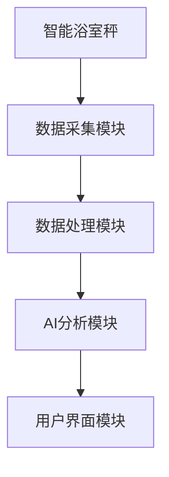

                 


# 智能浴室秤：AI Agent的营养建议与健康追踪

**关键词**：智能浴室秤，AI Agent，健康追踪，营养建议，机器学习，数据处理，系统架构

**摘要**：  
智能浴室秤结合AI Agent技术，通过收集用户的健康数据，提供个性化的营养建议和健康追踪服务。本文详细探讨了智能浴室秤的工作原理、AI Agent的核心技术、营养建议算法的设计与实现，以及系统架构的搭建。通过实际案例分析，展示了如何利用AI技术优化用户的健康管理体验，并提供了相关的技术实现细节和最佳实践。

---

# 第一部分: 智能浴室秤与AI Agent概述

## 第1章: 智能浴室秤与AI Agent的背景介绍

### 1.1 智能浴室秤的定义与功能
智能浴室秤是一种结合了物联网（IoT）和人工智能（AI）技术的智能设备，能够测量用户的体重、体脂、心率等多种生理指标，并通过AI算法提供个性化的健康建议。与传统浴室秤相比，智能浴室秤不仅能够测量基本的体重数据，还能够通过连接手机或电脑端的应用程序，分析用户的健康状况，并提供建议。

**核心概念术语说明**：
- **智能浴室秤**：集成了传感器和AI算法的智能设备，用于测量用户的健康数据。
- **AI Agent**：人工智能代理，能够根据输入的数据自主决策并提供服务。

**问题背景**：
随着人们对健康的关注度提高，传统浴室秤的功能已无法满足用户的需求。用户不仅需要测量体重，还需要了解体脂、肌肉量等数据，并获得相应的健康建议。

**问题描述**：
智能浴室秤通过传感器采集用户的生理数据，利用AI算法分析数据，为用户提供个性化的营养建议和健康计划。

**问题解决**：
通过AI Agent技术，智能浴室秤能够实时分析用户的健康数据，并根据数据提供建议，帮助用户改善健康状况。

**边界与外延**：
智能浴室秤的外延包括与之连接的手机应用、云端服务器以及第三方健康数据平台。边界则是设备的测量功能和AI算法的处理能力。

**概念结构与核心要素组成**：
智能浴室秤的核心要素包括传感器、AI算法、用户数据存储、用户界面和健康建议生成模块。

---

## 第2章: AI Agent的核心原理与实现

### 2.1 AI Agent的基本原理
AI Agent通过感知环境、处理数据、做出决策并执行动作来实现智能化服务。在智能浴室秤中，AI Agent主要负责接收用户的生理数据，分析数据并生成健康建议。

**核心概念原理**：
- **感知环境**：智能浴室秤通过传感器收集用户的体重、体脂、心率等数据。
- **数据处理**：AI Agent利用机器学习算法分析数据，识别用户的健康状况。
- **决策与执行**：根据分析结果，AI Agent生成个性化的营养建议和健康计划。

### 2.2 AI Agent的实现步骤

1. **数据采集**：
   - 使用传感器采集用户的生理数据。
   - 数据格式化并传输到处理模块。

2. **数据处理**：
   - 对数据进行清洗和预处理。
   - 应用机器学习模型进行健康评估。

3. **决策与建议生成**：
   - 根据评估结果生成营养建议和健康计划。
   - 通过用户界面展示建议。

---

# 第二部分: 智能浴室秤的核心技术与实现

## 第3章: 营养建议算法的设计与实现

### 3.1 营养建议算法的核心原理
营养建议算法通过分析用户的生理数据和饮食习惯，推荐适合用户的饮食方案。常用算法包括基于规则的推荐和基于机器学习的推荐。

**算法原理**：
- **基于规则的推荐**：根据用户的体重、体脂等数据，推荐适合的饮食结构。
- **基于机器学习的推荐**：利用历史数据训练模型，预测用户的饮食需求。

### 3.2 营养建议算法的实现步骤

1. **数据采集**：
   - 采集用户的体重、体脂、饮食习惯等数据。

2. **数据预处理**：
   - 清洗数据，去除异常值。
   - 数据标准化处理。

3. **模型训练**：
   - 使用机器学习算法（如协同过滤、基于内容的推荐）训练模型。

4. **推荐生成**：
   - 根据模型预测结果生成营养建议。

### 3.3 营养建议算法的数学模型

**基于协同过滤的推荐算法**：
$$
sim(i,j) = \frac{\sum_{k} (r_{ik} - \bar{r_i})(r_{jk} - \bar{r_j})}{\sqrt{\sum_{k} (r_{ik} - \bar{r_i})^2} \cdot \sqrt{\sum_{k} (r_{jk} - \bar{r_j})^2}}
$$
其中，$sim(i,j)$ 表示物品 $i$ 和 $j$ 之间的相似度，$r_{ik}$ 和 $r_{jk}$ 分别是用户 $i$ 和 $j$ 对物品 $k$ 的评分，$\bar{r_i}$ 和 $\bar{r_j}$ 分别是用户 $i$ 和 $j$ 的平均评分。

---

## 第4章: 系统架构设计

### 4.1 系统功能设计
智能浴室秤系统包括以下几个核心功能模块：
- 数据采集模块：负责采集用户的生理数据。
- 数据处理模块：对数据进行清洗和预处理。
- AI分析模块：利用机器学习算法分析数据并生成建议。
- 用户界面模块：展示建议和系统信息。

### 4.2 系统架构设计
以下是系统的架构图：



### 4.3 系统接口设计
系统主要接口包括：
- 数据采集接口：传感器数据的接收和处理。
- 用户界面接口：展示健康建议和数据。

---

## 第5章: 项目实战

### 5.1 环境搭建
- **硬件**：智能浴室秤、传感器、计算机。
- **软件**：Python编程环境，机器学习库（如Scikit-learn）。

### 5.2 核心代码实现

```python
import numpy as np
from sklearn.neighbors import NearestNeighbors

# 示例数据集
X = np.array([[80, 25, 70],
              [85, 28, 65],
              [75, 22, 80]])

# 训练最近邻模型
model = NearestNeighbors(n_neighbors=1).fit(X)

# 预测新用户的营养建议
new_user = np.array([[82, 26, 75]])
distances, indices = model.kneighbors(new_user)

# 根据最近邻的结果生成建议
similar_user = X[indices[0][0]]
建议 = "根据用户的体重、体脂和心率，推荐低脂饮食。"
```

### 5.3 代码解读
- **数据预处理**：对用户的生理数据进行标准化处理。
- **模型训练**：使用最近邻算法训练模型。
- **预测与建议生成**：根据预测结果生成个性化的营养建议。

### 5.4 实际案例分析
以一个体重82公斤、体脂26%、心率75的用户为例，系统会根据最近邻算法找到最相似的用户（体重85公斤、体脂28%、心率65），并推荐低脂饮食计划。

---

# 第三部分: 最佳实践与未来展望

## 第6章: 最佳实践与注意事项

### 6.1 数据隐私保护
在处理用户的健康数据时，必须确保数据的安全性和隐私性。

### 6.2 系统可扩展性
设计系统时，应考虑未来可能增加的功能和数据类型。

### 6.3 用户体验优化
通过优化用户界面和交互流程，提升用户体验。

## 第7章: 小结与未来展望

### 7.1 小结
本文详细介绍了智能浴室秤与AI Agent的核心技术，包括数据采集、算法设计和系统架构实现。通过实际案例分析，展示了如何利用AI技术优化用户的健康管理体验。

### 7.2 未来展望
随着AI技术的不断发展，智能浴室秤的功能将更加智能化和个性化。未来的智能浴室秤可能会集成更多的健康指标，并与智能家居系统无缝连接，为用户提供更全面的健康服务。

---

# 作者：AI天才研究院 & 禅与计算机程序设计艺术

