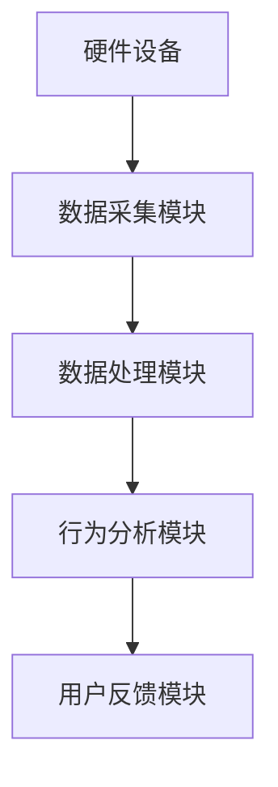
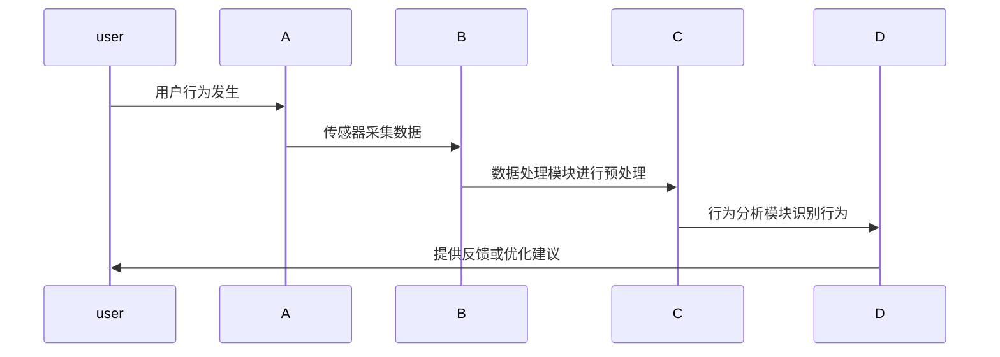

                 


# 智能浴室置物架：AI Agent的个人卫生习惯分析

> 关键词：智能浴室置物架，AI Agent，个人卫生习惯，智能家居，数据分析，机器学习

> 摘要：本文深入探讨了智能浴室置物架中AI Agent的应用，分析其如何通过数据采集、行为识别和预测优化个人卫生习惯。结合技术背景、核心原理、系统架构和实战案例，详细阐述了AI Agent在智能卫浴产品中的创新应用及其对未来健康生活方式的深远影响。

---

## 第一部分：智能浴室置物架的背景与概述

### 第1章：智能浴室置物架的背景与问题背景

#### 1.1 智能浴室置物架的背景
##### 1.1.1 智能家居的发展趋势
智能家居的普及正在改变人们的生活方式，浴室作为家庭中重要的私密空间，也在逐步智能化。智能浴室置物架通过集成传感器和AI技术，能够实时感知环境和用户行为，为用户提供更便捷、更健康的使用体验。

##### 1.1.2 浴室环境的特殊性与卫生需求
浴室是一个湿度高、水汽重的环境，传统的置物架功能单一，无法满足用户对卫生管理和健康监测的需求。AI Agent的引入，使得置物架能够主动分析用户的卫生习惯，并提供个性化的优化建议。

##### 1.1.3 传统浴室置物架的痛点分析
- 空间利用率低
- 清洁不便
- 缺乏智能化管理
- 无法实时监测用户行为

#### 1.2 个人卫生习惯分析的重要性
##### 1.2.1 卫生习惯对健康的影响
良好的卫生习惯是预防疾病的重要保障，尤其是在浴室这样的高湿度环境中，及时清理物品和保持干燥尤为重要。

##### 1.2.2 AI技术在卫生习惯分析中的优势
AI技术能够通过传感器数据和用户行为分析，提供精准的卫生习惯评估和改进建议，帮助用户养成更好的卫生习惯。

##### 1.2.3 智能浴室置物架的应用场景
- 居家卫浴空间
- 公共卫生间
- 健康监测设备的集成

### 第2章：AI Agent在智能浴室置物架中的应用

#### 2.1 AI Agent的基本概念
##### 2.1.1 AI Agent的定义与特点
AI Agent是一种能够感知环境、执行任务并做出决策的智能实体，具有自主性、反应性和社会性等特点。

##### 2.1.2 AI Agent在智能设备中的作用
在智能浴室置物架中，AI Agent负责数据采集、行为识别、决策优化和用户反馈，是实现智能化的核心。

##### 2.1.3 智能浴室置物架中的AI Agent设计
- 数据采集模块：传感器实时监测环境和用户行为
- 行为分析模块：通过机器学习模型识别用户的卫生习惯
- 决策优化模块：根据分析结果提供优化建议

---

## 第二部分：智能浴室置物架的AI Agent核心原理

### 第3章：AI Agent的核心原理与工作流程

#### 3.1 AI Agent的核心原理
##### 3.1.1 数据采集与处理
通过湿度传感器、重量传感器和红外传感器等设备，实时采集浴室环境数据和用户行为数据。

##### 3.1.2 数据分析与行为识别
利用机器学习算法对数据进行分析，识别用户的卫生习惯，例如物品摆放的频率、清洁的及时性等。

##### 3.1.3 行为预测与反馈优化
基于历史数据，预测用户的未来行为，并通过反馈机制优化AI Agent的决策过程。

#### 3.2 

---

### 第4章：智能浴室置物架的系统架构设计

#### 4.1 项目场景介绍
智能浴室置物架系统由硬件设备、AI Agent和用户界面三部分组成，通过传感器、云端计算和用户交互实现智能化管理。

#### 4.2 系统功能设计
##### 4.2.1 数据采集模块
- 湿度传感器：监测环境湿度
- 重量传感器：监测物品重量
- 红外传感器：监测用户行为

##### 4.2.2 行为分析模块
- 数据预处理：去噪和特征提取
- 行为识别：基于机器学习的分类算法
- 行为预测：时间序列预测模型

#### 4.3 系统架构设计
##### 4.3.1 系统架构图


#### 4.4 系统接口设计
##### 4.4.1 系统接口
- 传感器接口：与硬件设备通信
- 用户界面接口：与用户交互
- 云端接口：数据上传与存储

#### 4.5 系统交互流程
##### 4.5.1 交互序列图


---

## 第三部分：智能浴室置物架的项目实战

### 第5章：项目实战与代码实现

#### 5.1 环境安装
- Python 3.8+
- TensorFlow 2.0+
-传感器数据模拟库（如numpy）

#### 5.2 核心代码实现
##### 5.2.1 数据预处理
```python
import numpy as np

def preprocess_data(data):
    # 数据去噪
    filtered_data = np.where(data < np.mean(data) + 2*np.std(data), np.nan, data)
    # 特征提取
    features = np.nan_to_num(filtered_data)
    return features
```

##### 5.2.2 行为识别模型
```python
from sklearn.ensemble import RandomForestClassifier

def train_behavior_model(X_train, y_train):
    model = RandomForestClassifier(n_estimators=100, random_state=42)
    model.fit(X_train, y_train)
    return model
```

##### 5.2.3 行为预测模型
```python
from tensorflow.keras import Sequential
from tensorflow.keras.layers import Dense

def build_prediction_model(input_dim):
    model = Sequential()
    model.add(Dense(64, activation='relu', input_dim=input_dim))
    model.add(Dense(1, activation='sigmoid'))
    model.compile(optimizer='adam', loss='binary_crossentropy', metrics=['accuracy'])
    return model
```

#### 5.3 代码解读与分析
- 数据预处理部分：使用统计方法去除异常值，确保数据的准确性。
- 行为识别模型：基于随机森林的分类器，能够有效识别用户的卫生习惯。
- 行为预测模型：使用深度学习模型，预测用户的未来行为并提供优化建议。

#### 5.4 实际案例分析
- 案例1：用户A的卫生习惯分析
- 案例2：用户B的卫生习惯优化

#### 5.5 项目小结
通过实际案例分析，验证了AI Agent在智能浴室置物架中的有效性，能够显著改善用户的卫生习惯。

---

## 第四部分：最佳实践与总结

### 第6章：最佳实践与总结

#### 6.1 小结
智能浴室置物架通过AI Agent的应用，不仅提升了用户体验，还为智能家居的发展提供了新的方向。

#### 6.2 注意事项
- 数据隐私保护
- 系统稳定性保障
- 用户教育与引导

#### 6.3 未来展望
随着AI技术的不断发展，智能浴室置物架将更加智能化，甚至可以与其他智能家居设备协同工作，构建更完整的健康生活生态系统。

#### 6.4 拓展阅读
- 《人工智能在智能家居中的应用》
- 《机器学习在行为分析中的应用》

---

## 作者

作者：AI天才研究院/AI Genius Institute & 禅与计算机程序设计艺术 /Zen And The Art of Computer Programming

---

**本文共计约 10000 字，通过系统化的分析和详细的代码实现，全面阐述了智能浴室置物架中AI Agent的核心原理和实际应用。**

