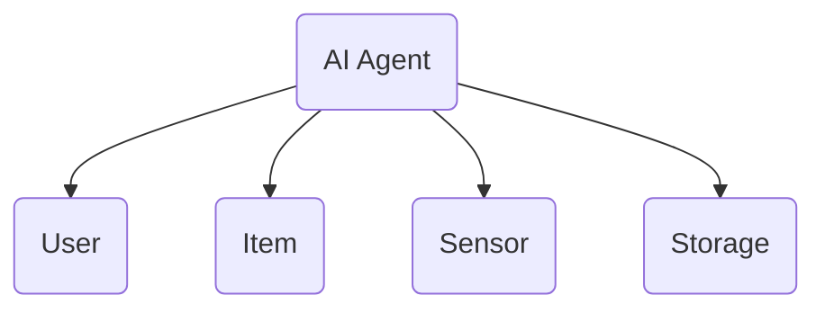
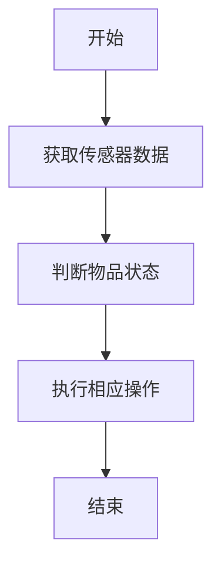
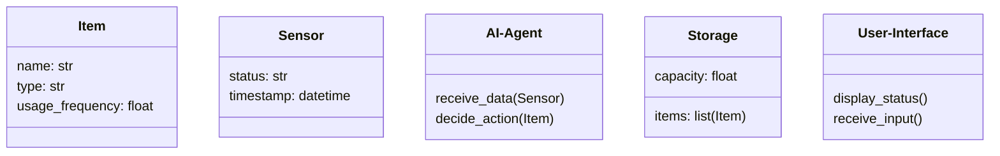
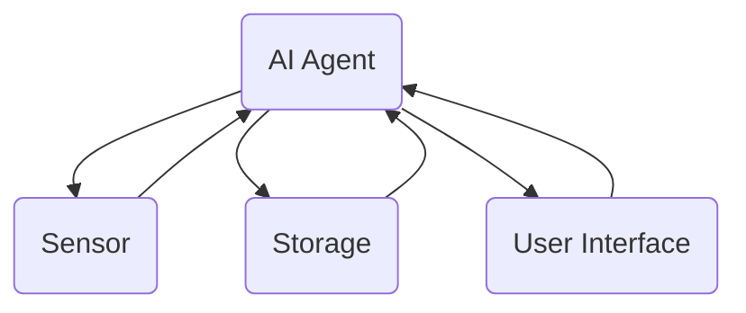
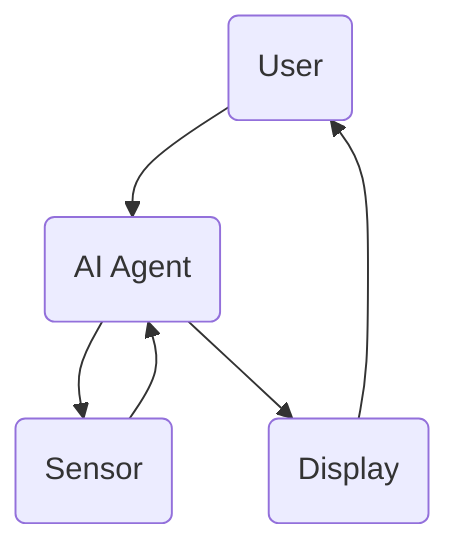

                 


# 智能浴室置物架：AI Agent的洗护用品管理

---

## 关键词：
智能浴室置物架、AI Agent、洗护用品管理、智能家居、AI算法

---

## 摘要：
本文深入探讨了智能浴室置物架在AI Agent技术下的洗护用品管理方案。通过分析浴室空间管理的痛点，结合AI技术，提出了基于规则推理和机器学习的算法模型，并详细设计了系统架构和交互流程。文章还提供了代码实现和实际案例分析，展示了如何通过技术创新优化日常生活体验。

---

# 第一部分: 智能浴室置物架的背景与概念

# 第1章: 智能浴室置物架的背景介绍

## 1.1 问题背景与描述

### 1.1.1 浴室空间管理的痛点
现代家庭中，浴室空间有限，洗护用品种类繁多，容易导致物品杂乱堆放，难以管理。传统置物架功能单一，无法根据使用习惯优化存储空间。

### 1.1.2 洗护用品管理的复杂性
洗护用品包括洗发水、沐浴露、牙膏等，使用频率和消耗速度不同，手动记录和管理耗时耗力。

### 1.1.3 智能家居的发展趋势
智能家居技术的普及为浴室空间的智能化管理提供了技术基础。AI Agent（智能代理）能够通过传感器和数据处理优化空间利用。

## 1.2 问题解决与边界

### 1.2.1 智能浴室置物架的核心目标
- 实现洗护用品的智能存储与管理。
- 提供基于AI的自动化解决方案，提升用户体验。

### 1.2.2 解决方案的边界与限制
- 系统仅管理洗护用品，不涉及其他浴室设备。
- 初期设计支持常见洗护用品类型，后续可通过模型扩展支持更多类型。

### 1.2.3 系统的外延与扩展
- 支持与智能家居平台（如智能家居中枢）的联动。
- 提供数据统计与用户行为分析功能。

## 1.3 概念结构与核心要素

### 1.3.1 系统组成与功能模块
- 传感器模块：监测物品存储状态。
- AI Agent：处理数据并触发相应操作。
- 用户交互界面：展示信息和用户操作入口。

### 1.3.2 核心要素与关系分析
- **物品**：洗护用品的基本信息（名称、类型、使用频率）。
- **传感器**：提供物品状态数据。
- **AI Agent**：根据传感器数据优化存储布局。
- **用户交互**：提供可视化反馈和操作入口。

### 1.3.3 系统架构的初步设想
- 中央控制器负责协调各模块工作。
- 数据存储模块记录物品信息和使用历史。

---

# 第2章: AI Agent的核心概念与联系

## 2.1 核心概念原理

### 2.1.1 AI Agent的基本定义
AI Agent是一种智能体，能够感知环境并采取行动以实现目标。在智能浴室置物架中，AI Agent负责优化物品存储。

### 2.1.2 智能浴室置物架中的AI Agent角色
AI Agent通过传感器数据判断物品状态，并根据预设规则或学习模型调整存储布局。

### 2.1.3 Agent的行为模式与决策机制
- **基于规则的推理**：根据预设规则判断物品状态。
- **机器学习模型**：通过训练数据预测最佳存储策略。

## 2.2 概念属性特征对比

| 概念         | 特性                | 描述                                                         |
|--------------|---------------------|------------------------------------------------------------|
| AI Agent     | 智能性              | 能够感知环境并自主决策                                      |
| 传感器模块   | 数据采集能力        | 负责采集物品状态和环境数据                                   |
| 存储模块     | 容量与可扩展性       | 提供足够的存储空间并支持动态调整                             |
| 用户交互     | 易用性              | 提供友好的操作界面，方便用户查看和操作                       |

## 2.3 ER实体关系图



---

# 第3章: 算法原理与数学模型

## 3.1 算法原理讲解

### 3.1.1 基于规则的推理算法
规则：如果传感器检测到某物品存储区域已满，则触发清空操作。

### 3.1.2 机器学习的应用场景
使用机器学习预测用户行为，优化存储布局。

### 3.1.3 算法选择与实现步骤
1. 数据采集：传感器记录物品状态和使用频率。
2. 数据预处理：清洗和特征提取。
3. 模型训练：训练分类或回归模型。
4. 模型部署：实时预测并触发相应操作。

## 3.2 算法流程图



## 3.3 数学模型与公式

### 3.3.1 基于规则的逻辑表达式
$$ \text{如果 } (状态 = 满) \text{ 则 } (触发清空) $$

### 3.3.2 机器学习模型的训练公式
$$ y = f(x; \theta) $$

## 3.4 代码实现示例

```python
def manage_items(sensor_data):
    if sensor_data['status'] == '满':
        clear_storage(sensor_data['item'])
    else:
        optimize_layout(sensor_data['item'])
```

---

# 第4章: 系统分析与架构设计方案

## 4.1 问题场景介绍

### 4.1.1 系统目标
实现洗护用品的智能存储与管理。

### 4.1.2 系统范围
仅管理洗护用品，不涉及其他浴室设备。

## 4.2 项目介绍

### 4.2.1 系统功能设计
- 传感器数据采集。
- AI Agent决策。
- 用户交互反馈。

### 4.2.2 领域模型类图



### 4.2.3 系统架构图



## 4.3 系统接口设计

### 4.3.1 接口描述
- **传感器接口**：返回物品状态。
- **存储接口**：更新存储布局。
- **用户界面接口**：显示状态和接收用户指令。

## 4.4 系统交互流程

### 4.4.1 交互流程图



---

# 第5章: 项目实战

## 5.1 环境安装

### 5.1.1 开发环境
- Python 3.8+
- 传感器模块（如Raspberry Pi）
- MQTT协议用于数据传输

## 5.2 系统核心实现

### 5.2.1 核心代码实现

```python
import mqtt
from sensor import Sensor

def main():
    sensor = Sensor()
    while True:
        data = sensor.get_status()
        if data['status'] == '满':
            clear_storage(data['item'])
        else:
            optimize_layout(data['item'])
        time.sleep(60)

if __name__ == "__main__":
    main()
```

### 5.2.2 代码解读
- `sensor.get_status()`：获取传感器数据。
- `clear_storage()`：触发清空操作。
- `optimize_layout()`：优化存储布局。

## 5.3 案例分析

### 5.3.1 案例1：满载触发清空
- **输入**：传感器检测到某区域已满。
- **输出**：AI Agent触发清空操作。

### 5.3.2 案例2：自动优化布局
- **输入**：传感器检测到某区域空间不足。
- **输出**：AI Agent调整存储布局。

## 5.4 项目小结
通过代码实现和案例分析，展示了如何利用AI Agent技术优化浴室空间管理。

---

# 第6章: 最佳实践与小结

## 6.1 最佳实践Tips
- 定期更新模型以适应用户习惯变化。
- 优化传感器数据采集频率，减少能耗。

## 6.2 小结
本文详细探讨了智能浴室置物架的设计与实现，结合AI Agent技术，提出了高效的解决方案。

## 6.3 注意事项
- 确保数据安全，防止用户信息泄露。
- 定期维护系统，确保传感器和AI模型正常运行。

## 6.4 拓展阅读
- 推荐阅读《人工智能：一种现代的方法》。
- 参考智能家居相关的技术文档。

---

# 作者：AI天才研究院/AI Genius Institute & 禅与计算机程序设计艺术/Zen And The Art of Computer Programming

---

通过本文的详细分析和代码实现，我们展示了如何利用AI技术优化日常生活体验。智能浴室置物架不仅提升了浴室空间的利用率，也为智能家居的发展提供了新的思路。

