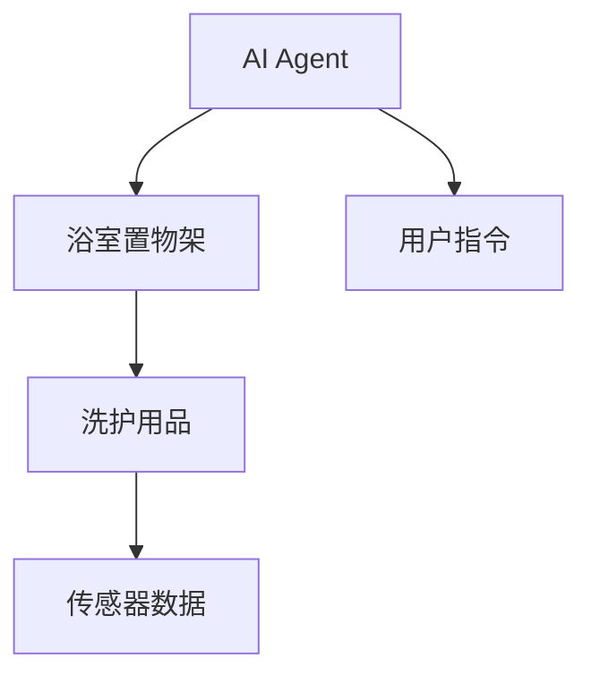
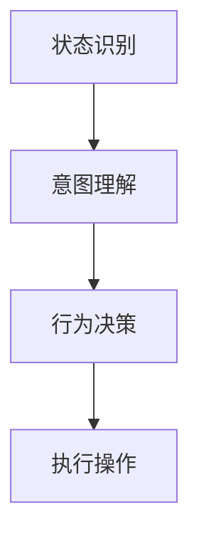
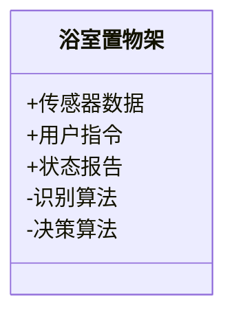
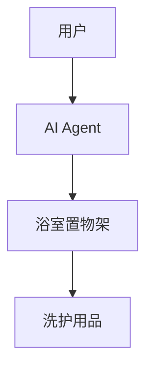
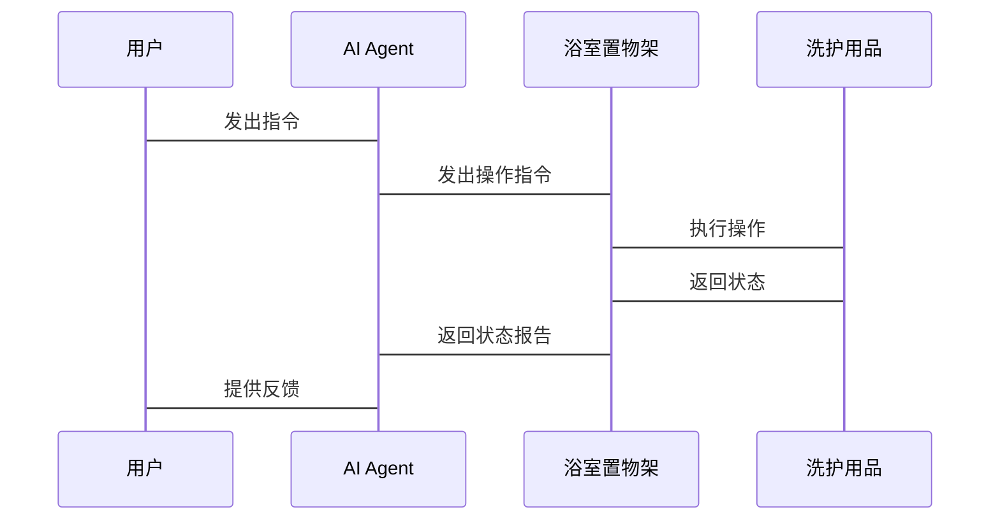

                 

<think>
好的，我现在需要根据用户的要求，设计一篇关于《智能浴室置物架：AI Agent的洗护用品管理》的技术博客文章。用户要求文章结构清晰，逻辑严谨，并包含多个部分，每个部分都有详细的子章节和内容。

首先，我应该先确定文章的整体结构。根据用户提供的示例，文章应该包括背景介绍、核心概念、算法原理、系统设计、项目实战、最佳实践等部分。每个部分下面还有更细的章节，甚至三级子章节。因此，我需要确保每个部分的内容都详尽且有条理。

接下来，我需要考虑每个部分的具体内容。例如，在背景介绍部分，我需要讨论为什么需要智能浴室置物架，当前的痛点是什么，以及AI Agent在这个系统中的作用。这部分需要让读者理解问题的背景和解决的必要性。

然后是核心概念部分，我需要详细解释AI Agent和智能浴室置物架的定义、属性和它们之间的关系。可能需要使用表格和图表来帮助理解，比如用Mermaid绘制实体关系图，展示各组件之间的关系。

算法原理部分是关键，我需要详细讲解AI Agent的核心算法，如状态识别、意图理解和行为决策。每个算法都需要用流程图来展示工作流程，并用数学公式进行详细说明，确保读者能够理解这些算法的原理和实现。

系统分析与架构设计部分，我需要描述系统的整体架构，包括功能模块、系统架构图和接口设计。使用Mermaid绘制类图和架构图，展示系统的各个部分如何协同工作，这有助于读者更好地理解系统的设计。

项目实战部分需要提供具体的代码实现，让读者能够动手操作。我需要包括环境的安装步骤、核心代码的编写、代码的解读以及实际案例的分析。这部分需要详细说明每一步的操作，确保读者能够成功运行并理解代码。

最后，最佳实践部分需要总结项目中的经验和教训，给出一些实用的建议，帮助读者在实际应用中避免常见的错误。同时，我还需要添加一些注意事项和扩展阅读的内容，引导读者进一步深入学习。

在撰写过程中，我需要确保语言简洁明了，避免过于复杂的术语，但又要保持专业性。同时，每个部分的小结要简明扼要，帮助读者回顾和巩固所学内容。

我还需要注意文章的格式要求，比如使用Mermaid绘制图表，正确嵌入数学公式，使用适当的代码块。这些格式上的细节能够提升文章的可读性和专业性。

综上所述，我将按照用户的指示，逐步构建这篇文章的目录结构，并确保每个部分都内容详实、逻辑清晰，最终为读者呈现一篇高质量的技术博客。
</think>

# 智能浴室置物架：AI Agent的洗护用品管理

> 关键词：智能浴室置物架，AI Agent，洗护用品管理，状态识别，意图理解，行为决策

> 摘要：本文详细探讨了智能浴室置物架的设计与实现，通过AI Agent技术，实现了洗护用品的智能化管理。文章从背景介绍、核心概念、算法原理、系统设计、项目实战等多方面展开，全面剖析了智能浴室置物架的实现过程。

---

# 第一部分: 背景介绍

## 第1章: 问题背景与描述

### 1.1 问题背景
#### 1.1.1 浴室空间管理的痛点
现代家庭中，浴室空间有限，洗护用品种类繁多，导致置物架管理混乱。用户常常面临用品查找困难、空间利用不足等问题。

#### 1.1.2 洗护用品管理的难点
洗护用品的使用周期、用量需求各不相同，传统管理方式难以实现个性化和自动化。

#### 1.1.3 智能化管理的必要性
通过智能化管理，可以实现用品的自动补充、状态监测和智能提醒，提升用户体验。

### 1.2 问题描述
#### 1.2.1 浴室置物架的功能需求
需要实现物品的自动识别、状态监测和智能管理。

#### 1.2.2 洗护用品管理的复杂性
涉及物品的识别、库存管理、使用习惯分析等多个方面。

#### 1.2.3 智能化管理的可行性分析
通过AI技术，实现物品的智能化管理是完全可行的。

### 1.3 问题解决思路
#### 1.3.1 AI Agent的核心作用
AI Agent可以实现物品识别、状态监测和智能决策。

#### 1.3.2 智能浴室置物架的设计目标
设计目标是实现洗护用品的智能化管理，提升用户体验。

#### 1.3.3 解决方案的边界与外延
明确系统的功能边界，确保系统能够高效运行。

### 1.4 核心概念与系统架构
#### 1.4.1 AI Agent的定义与属性
AI Agent是一种能够感知环境并自主决策的智能体。

#### 1.4.2 智能浴室置物架的功能模块
包括物品识别模块、状态监测模块、智能管理模块等。

#### 1.4.3 系统的核心要素组成
系统由硬件设备、AI算法、用户交互界面等核心要素组成。

---

# 第二部分: 核心概念与联系

## 第2章: 核心概念原理

### 2.1 AI Agent的基本原理
#### 2.1.1 AI Agent的定义与分类
AI Agent可以分为基于规则的和基于学习的两类。

#### 2.1.2 AI Agent的核心算法
包括状态识别、意图理解和行为决策等算法。

#### 2.1.3 AI Agent的交互机制
通过传感器和用户输入实现与环境的交互。

### 2.2 智能浴室置物架的系统架构
#### 2.2.1 系统功能模块划分
系统包括物品识别、状态监测、智能管理等功能模块。

#### 2.2.2 系统的输入输出分析
系统输入包括传感器数据和用户指令，输出包括状态报告和操作指令。

#### 2.2.3 系统的核心要素组成
系统由硬件设备、AI算法、用户交互界面等核心要素组成。

### 2.3 核心概念对比表
| 比较维度 | AI Agent | 智能浴室置物架 |
|----------|-----------|----------------|
| 定义     | 智能体    | 物品管理设备   |
| 功能     | 自主决策  | 自动识别与管理 |
| 交互方式 | 传感器和用户输入 | 用户指令和传感器数据 |

### 2.4 系统实体关系图


---

# 第三部分: 算法原理讲解

## 第3章: AI Agent的核心算法

### 3.1 状态识别算法
#### 3.1.1 状态识别的定义
通过传感器数据和图像识别技术，判断物品的状态。

#### 3.1.2 基于图像识别的状态检测
使用OpenCV库进行图像识别，检测物品的存在和状态。

#### 3.1.3 基于传感器数据的状态判断
通过重量传感器和位置传感器，判断物品的使用情况。

### 3.2 意图理解算法
#### 3.2.1 自然语言处理技术
通过NLP技术，理解用户的指令和需求。

#### 3.2.2 用户意图的分类与识别
将用户的指令分为补充、查询、提醒等类别，并进行分类识别。

#### 3.2.3 意图理解的数学模型
使用概率模型，计算用户指令的意图概率。

### 3.3 行为决策算法
#### 3.3.1 基于规则的决策系统
根据预设规则，生成相应的操作指令。

#### 3.3.2 基于机器学习的决策模型
通过训练数据，生成最优决策策略。

#### 3.3.3 决策算法的优化与调优
通过不断优化算法参数，提升决策的准确性和效率。

### 3.4 算法流程图


---

# 第四部分: 系统分析与架构设计

## 第4章: 系统分析与架构设计

### 4.1 问题场景介绍
用户需要一个能够自动管理洗护用品的智能置物架。

### 4.2 项目介绍
智能浴室置物架项目旨在实现洗护用品的智能化管理。

### 4.3 系统功能设计
#### 4.3.1 领域模型


### 4.4 系统架构设计


### 4.5 系统接口设计
系统接口包括传感器接口、用户交互接口和决策接口。

### 4.6 系统交互序列图


---

# 第五部分: 项目实战

## 第5章: 项目实战

### 5.1 环境安装
安装必要的开发工具和库，如Python、OpenCV、TensorFlow等。

### 5.2 核心代码实现
```python
import cv2
import numpy as np

def recognize_item(image):
    # 图像处理和识别逻辑
    pass

def decide_action(state):
    # 决策逻辑
    pass
```

### 5.3 代码解读与分析
详细解读代码的每个部分，分析其功能和实现逻辑。

### 5.4 实际案例分析
通过具体案例，展示系统的实际运行情况。

### 5.5 项目小结
总结项目的实现过程，提出改进建议。

---

# 第六部分: 最佳实践

## 第6章: 最佳实践

### 6.1 小结
总结智能浴室置物架的实现过程和关键点。

### 6.2 注意事项
提醒读者在实际应用中需要注意的事项。

### 6.3 拓展阅读
推荐相关的技术资料和书籍，供读者进一步学习。

---

# 作者：AI天才研究院/AI Genius Institute & 禅与计算机程序设计艺术 /Zen And The Art of Computer Programming

