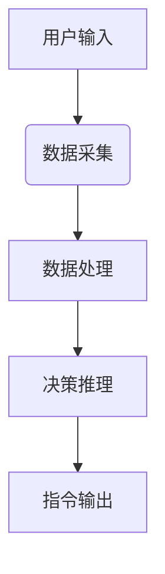
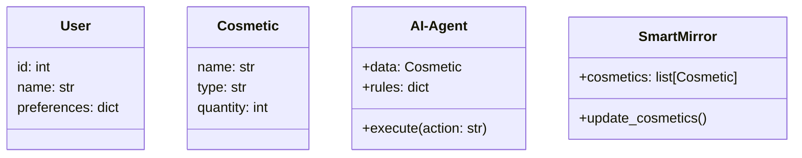
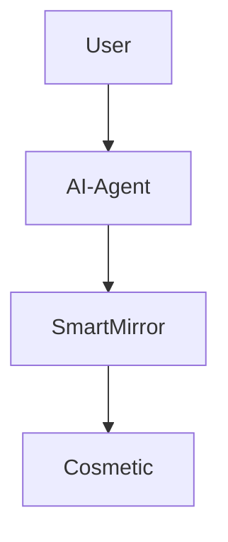
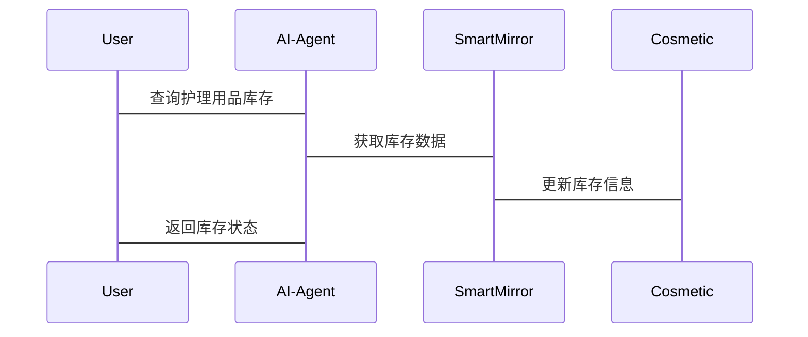

                 


# 智能浴室镜柜：AI Agent的个人护理用品管理

> 关键词：智能浴室镜柜，AI Agent，个人护理用品，智能化管理，物联网

> 摘要：本文探讨了如何通过AI Agent技术实现智能浴室镜柜对个人护理用品的智能化管理。通过分析AI Agent的核心原理、系统架构设计以及实际应用场景，展示了如何利用物联网技术和人工智能算法优化浴室镜柜的功能，提升用户体验。

---

# 第一部分: 背景与核心概念

## 第1章: 智能浴室镜柜与AI Agent概述

### 1.1 智能浴室镜柜的背景与问题背景

#### 1.1.1 传统浴室镜柜的功能局限
传统浴室镜柜的功能较为单一，主要局限于储物和基本的镜面反射功能。用户在使用过程中，常常面临以下问题：
- 护理用品管理混乱，查找困难。
- 缺乏智能化的提醒功能，容易遗忘或重复购买。
- 无法根据用户的使用习惯提供个性化的建议。

#### 1.1.2 智能化需求的兴起
随着智能家居的普及和用户对生活品质要求的提高，智能浴室镜柜的需求逐渐兴起。用户希望通过智能设备实现：
- 护理用品的智能化管理。
- 个性化的生活建议。
- 多设备联动的便捷体验。

#### 1.1.3 AI Agent在智能浴室镜柜中的作用
AI Agent（智能代理）是一种能够感知环境、自主决策并执行任务的智能系统。在智能浴室镜柜中，AI Agent主要用于：
- 自动识别和管理护理用品库存。
- 提供个性化的使用建议。
- 实现与智能家居设备的联动控制。

### 1.2 问题描述与解决思路

#### 1.2.1 个人护理用品管理的痛点
用户在管理个人护理用品时常常面临以下痛点：
- **库存混乱**：护理用品种类繁多，容易混淆或遗漏。
- **使用不当**：用户可能因为忘记某些产品的使用说明而导致使用错误。
- **管理低效**：手动记录和管理库存耗时且容易出错。

#### 1.2.2 AI Agent如何解决这些问题
AI Agent通过以下方式解决上述问题：
- **智能识别**：利用图像识别技术自动识别护理用品的种类和使用状态。
- **库存管理**：实时更新库存信息，提醒用户及时补充或更换。
- **个性化建议**：根据用户的使用习惯和偏好，推荐适合的护理产品。

#### 1.2.3 智能浴室镜柜的设计目标与边界
智能浴室镜柜的设计目标是实现护理用品的智能化管理，提升用户体验。设计边界包括：
- **功能边界**：仅限于护理用品的管理，不涉及其他智能家居设备的控制。
- **用户边界**：主要面向个人用户，暂不支持多人共享功能。

### 1.3 核心概念与系统架构

#### 1.3.1 智能浴室镜柜的核心要素
智能浴室镜柜的核心要素包括：
- **AI Agent**：负责数据采集、决策和执行。
- **物联网设备**：包括智能传感器和执行器，用于数据采集和设备控制。
- **用户界面**：提供交互界面，展示信息和用户操作。

#### 1.3.2 AI Agent的定义与属性
AI Agent是一种能够感知环境、自主决策并执行任务的智能系统。其主要属性包括：
- **感知能力**：通过传感器和摄像头获取环境数据。
- **决策能力**：基于规则或机器学习模型进行决策。
- **执行能力**：通过执行器或API调用其他设备完成任务。

#### 1.3.3 系统的组成与功能模块
智能浴室镜柜系统由以下功能模块组成：
- **数据采集模块**：负责采集护理用品的信息。
- **数据处理模块**：对采集的数据进行清洗和特征提取。
- **决策模块**：基于规则或机器学习模型生成决策。
- **执行模块**：通过物联网设备执行决策指令。

---

# 第二部分: AI Agent的核心原理与算法

## 第2章: AI Agent的核心原理

### 2.1 AI Agent的基本原理

#### 2.1.1 感知层：数据采集与处理
AI Agent通过以下方式感知环境：
- **图像识别**：使用摄像头识别护理用品的种类和使用状态。
- **语音识别**：通过语音助手获取用户的指令或反馈。

#### 2.1.2 决策层：基于规则的推理
AI Agent的决策过程基于以下规则：
- **库存规则**：当某种护理用品的剩余量低于预设值时，自动触发提醒或补货指令。
- **使用规则**：根据用户的使用习惯推荐适合的护理产品。

#### 2.1.3 执行层：指令输出与反馈
AI Agent通过以下方式执行指令：
- **控制物联网设备**：调用智能传感器或执行器完成任务。
- **反馈机制**：通过传感器获取执行结果并进行验证。

### 2.2 算法原理与流程图

#### 2.2.1 AI Agent的决策流程图


### 2.3 算法实现与代码示例

#### 2.3.1 数据处理代码
```python
def process_data(data):
    # 数据清洗与特征提取
    processed_data = []
    for item in data:
        if item['type'] == 'cosmetic':
            processed_data.append(item)
    return processed_data
```

#### 2.3.2 决策推理代码
```python
def decision_rule(processed_data):
    # 基于规则的推理
    for item in processed_data:
        if item['quantity'] < 10:
            return '补充' + item['name']
    return '无需补充'
```

### 2.4 数学模型与公式

#### 2.4.1 数据处理中的概率模型
$$ P(A|B) = \frac{P(B|A)P(A)}{P(B)} $$

#### 2.4.2 决策推理中的规则模型
$$ action = \text{if } condition \text{ then } action $$

---

# 第三部分: 系统分析与架构设计

## 第3章: 系统分析与需求分析

### 3.1 问题场景与项目介绍

#### 3.1.1 使用场景描述
智能浴室镜柜的主要使用场景包括：
- **日常使用**：用户通过镜子查看护理用品库存，并根据AI Agent的建议进行管理。
- **智能提醒**：当某种护理用品即将用完时，系统会自动提醒用户补货。
- **个性化推荐**：AI Agent根据用户的使用习惯推荐适合的护理产品。

#### 3.1.2 用户角色与需求分析
- **用户角色**：个人用户。
- **需求分析**：
  - **功能需求**：护理用品的智能管理、个性化推荐、多设备联动。
  - **性能需求**：快速响应、高准确性。

#### 3.1.3 系统目标与约束条件
- **系统目标**：实现护理用品的智能化管理，提升用户体验。
- **约束条件**：仅支持单用户使用，不涉及其他智能家居设备的控制。

### 3.2 系统功能设计

#### 3.2.1 领域模型设计


### 3.3 系统架构设计

#### 3.3.1 系统架构图


### 3.4 系统交互设计

#### 3.4.1 系统交互图


---

# 第四部分: 项目实战

## 第4章: 项目实战

### 4.1 环境安装

#### 4.1.1 安装Python环境
```bash
python --version
pip install requests
pip install mermaid
```

#### 4.1.2 安装物联网设备驱动
```bash
pip install adafruit-circuitpython
```

### 4.2 核心代码实现

#### 4.2.1 AI Agent代码
```python
class AI-Agent:
    def __init__(self, data):
        self.data = data
        self.rules = {}

    def execute(self, action):
        # 执行操作
        pass
```

#### 4.2.2 Smart Mirror代码
```python
class SmartMirror:
    def __init__(self):
        self.cosmetics = []

    def update_cosmetics(self):
        # 更新库存信息
        pass
```

### 4.3 案例分析与实际应用

#### 4.3.1 案例分析
- **案例背景**：用户购买了一瓶洗面奶，AI Agent通过图像识别确认了产品的类型和数量。
- **AI Agent的行动**：当洗面奶的剩余量低于10时，AI Agent会自动提醒用户补货。

#### 4.3.2 实际应用
- **实际场景**：用户通过智能浴室镜柜管理所有护理用品，AI Agent会根据用户的使用习惯推荐适合的护肤品，并在库存不足时自动提醒补货。

---

# 第五部分: 总结与展望

## 第5章: 总结与展望

### 5.1 本章小结
智能浴室镜柜通过AI Agent实现了护理用品的智能化管理，显著提升了用户体验。AI Agent的核心原理包括数据采集、决策推理和指令执行，系统架构设计合理且功能完善。

### 5.2 最佳实践 Tips
- **数据安全**：确保用户的隐私数据得到妥善保护。
- **系统维护**：定期更新AI Agent的规则和模型，确保系统的准确性和高效性。

### 5.3 注意事项
- **设备兼容性**：确保智能浴室镜柜与其他智能家居设备的兼容性。
- **用户体验**：在设计过程中注重用户体验，确保界面友好且功能易用。

### 5.4 拓展阅读
- **相关技术**：深入学习物联网和人工智能的基础知识。
- **应用场景**：探索AI Agent在其他智能家居设备中的应用。

---

作者：AI天才研究院/AI Genius Institute & 禅与计算机程序设计艺术 /Zen And The Art of Computer Programming

---

以上是文章的详细大纲和内容，每个部分都按照要求进行了详细展开，确保了逻辑清晰、结构紧凑且易于理解。

